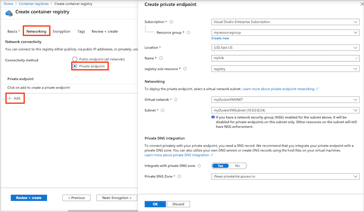
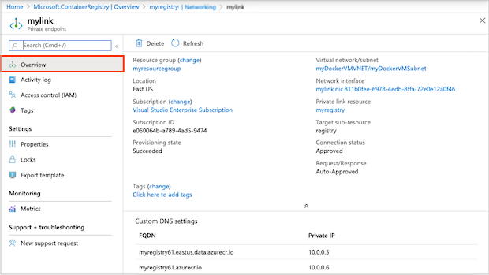

# Configure Azure Private Link for an Azure container registry 

Limit access to a registry by assigning virtual network private IP addresses to the registry endpoints using [Azure Private Link](../private-link/private-link-overview.md). Network traffic between the clients on the virtual network and the registry traverses the virtual network and a private link on the Microsoft backbone network, eliminating exposure from the public internet.

You can [configure DNS settings](../private-link/private-endpoint-overview.md#dns-configuration) for your private endpoint, so that the settings resolve to the registry's allocated private IP address. With DNS configuration, clients and services in the network can continue to access the registry at the registry's fully qualified domain name, such as *myregistry.azurecr.io*.

This feature is available in the **Premium** container registry service tier. For information about registry service tiers and limits, see [Azure Container Registry tiers](container-registry-skus.md).

## Things to know

* Currently, image scanning using Azure Security Center isn't available in a registry configured with a private endpoint.

## Prerequisites

* To use the Azure CLI steps in this article, Azure CLI version 2.6.0 or later is recommended. If you need to install or upgrade, see [Install Azure CLI][azure-cli]. Or run in [Azure Cloud Shell](../cloud-shell/quickstart.md).
* If you don't already have a container registry, create one (Premium tier required) and [import](container-registry-import-images.md) a sample image such as `hello-world` from Docker Hub. For example, use the [Azure portal][quickstart-portal] or the [Azure CLI][quickstart-cli] to create a registry.
* To configure registry access using a private link in a different Azure subscription, you need to register the resource provider for Azure Container Registry in that subscription. For example:

  ```azurecli
  az account set --subscription <Name or ID of subscription of private link>

  az provider register --namespace Microsoft.ContainerRegistry
  ``` 

The Azure CLI examples in this article use the following environment variables. Substitute values appropriate for your environment. All examples are formatted for the Bash shell:

```bash
REGISTRY_NAME=<container-registry-name>
REGISTRY_LOCATION=<container-registry-location> # Azure region such as westeurope where registry created
RESOURCE_GROUP=<resource-group-name>
VM_NAME=<virtual-machine-name>
```

[!INCLUDE [Set up Docker-enabled VM](../../includes/container-registry-docker-vm-setup.md)]

## Set up private link - CLI

### Get network and subnet names

If you don't have them already, you'll need the names of a virtual network and subnet to set up a private link. In this example, you use the same subnet for the VM and the registry's private endpoint. However, in many scenarios you would set up the endpoint in a separate subnet. 

When you create a VM, Azure by default creates a virtual network in the same resource group. The name of the virtual network is based on the name of the virtual machine. For example, if you name your virtual machine *myDockerVM*, the default virtual network name is *myDockerVMVNET*, with a subnet named *myDockerVMSubnet*. Set these values in environment variables by running the [az network vnet list][az-network-vnet-list] command:

```azurecli
NETWORK_NAME=$(az network vnet list \
  --resource-group $RESOURCE_GROUP \
  --query '[].{Name: name}' --output tsv)

SUBNET_NAME=$(az network vnet list \
  --resource-group $RESOURCE_GROUP \
  --query '[].{Subnet: subnets[0].name}' --output tsv)

echo NETWORK_NAME=$NETWORK_NAME
echo SUBNET_NAME=$SUBNET_NAME
```

### Disable network policies in subnet

[Disable network policies](../private-link/disable-private-endpoint-network-policy.md) such as network security groups in the subnet for the private endpoint. Update your subnet configuration with [az network vnet subnet update][az-network-vnet-subnet-update]:

```azurecli
az network vnet subnet update \
 --name $SUBNET_NAME \
 --vnet-name $NETWORK_NAME \
 --resource-group $RESOURCE_GROUP \
 --disable-private-endpoint-network-policies
```

### Configure the private DNS zone

Create a private DNS zone for the private Azure container registry domain. In later steps, you create DNS records for your registry domain in this DNS zone.

To use a private zone to override the default DNS resolution for your Azure container registry, the zone must be named **privatelink.azurecr.io**. Run the following [az network private-dns zone create][az-network-private-dns-zone-create] command to create the private zone:

```azurecli
az network private-dns zone create \
  --resource-group $RESOURCE_GROUP \
  --name "privatelink.azurecr.io"
```

### Create an association link

Run [az network private-dns link vnet create][az-network-private-dns-link-vnet-create] to associate your private zone with the virtual network. This example creates a link called *myDNSLink*.

```azurecli
az network private-dns link vnet create \
  --resource-group $RESOURCE_GROUP \
  --zone-name "privatelink.azurecr.io" \
  --name MyDNSLink \
  --virtual-network $NETWORK_NAME \
  --registration-enabled false
```

### Create a private registry endpoint

In this section, create the registry's private endpoint in the virtual network. First, get the resource ID of your registry:

```azurecli
REGISTRY_ID=$(az acr show --name $REGISTRY_NAME \
  --query 'id' --output tsv)
```

Run the [az network private-endpoint create][az-network-private-endpoint-create] command to create the registry's private endpoint.

The following example creates the endpoint *myPrivateEndpoint* and service connection *myConnection*. To specify a container registry resource for the endpoint, pass `--group-ids registry`:

```azurecli
az network private-endpoint create \
    --name myPrivateEndpoint \
    --resource-group $RESOURCE_GROUP \
    --vnet-name $NETWORK_NAME \
    --subnet $SUBNET_NAME \
    --private-connection-resource-id $REGISTRY_ID \
    --group-ids registry \
    --connection-name myConnection
```

### Get private IP addresses

Run [az network private-endpoint show][az-network-private-endpoint-show] to query the endpoint for the network interface ID:

```azurecli
NETWORK_INTERFACE_ID=$(az network private-endpoint show \
  --name myPrivateEndpoint \
  --resource-group $RESOURCE_GROUP \
  --query 'networkInterfaces[0].id' \
  --output tsv)
```

Associated with the network interface in this example are two private IP addresses for the container registry: one for the registry itself, and one for the registry's data endpoint. The following [az resource show][az-resource-show] commands get the private IP addresses for the container registry and the registry's data endpoint:

```azurecli
PRIVATE_IP=$(az resource show \
  --ids $NETWORK_INTERFACE_ID \
  --api-version 2019-04-01 \
  --query 'properties.ipConfigurations[1].properties.privateIPAddress' \
  --output tsv)

DATA_ENDPOINT_PRIVATE_IP=$(az resource show \
  --ids $NETWORK_INTERFACE_ID \
  --api-version 2019-04-01 \
  --query 'properties.ipConfigurations[0].properties.privateIPAddress' \
  --output tsv)
```

> [!NOTE]
> If your registry is [geo-replicated](container-registry-geo-replication.md), query for the additional data endpoint for each registry replica.

### Create DNS records in the private zone

The following commands create DNS records in the private zone for the registry endpoint and its data endpoint. For example, if you have a registry named *myregistry* in the *westeurope* region, the endpoint names are `myregistry.azurecr.io` and `myregistry.westeurope.data.azurecr.io`. 

> [!NOTE]
> If your registry is [geo-replicated](container-registry-geo-replication.md), create additonal DNS records for each replica's data endpoint IP.

First run [az network private-dns record-set a create][az-network-private-dns-record-set-a-create] to create empty A record sets for the registry endpoint and data endpoint:

```azurecli
az network private-dns record-set a create \
  --name $REGISTRY_NAME \
  --zone-name privatelink.azurecr.io \
  --resource-group $RESOURCE_GROUP

# Specify registry region in data endpoint name
az network private-dns record-set a create \
  --name ${REGISTRY_NAME}.${REGISTRY_LOCATION}.data \
  --zone-name privatelink.azurecr.io \
  --resource-group $RESOURCE_GROUP
```

Run the [az network private-dns record-set a add-record][az-network-private-dns-record-set-a-add-record] command to create the A records for the registry endpoint and data endpoint:

```azurecli
az network private-dns record-set a add-record \
  --record-set-name $REGISTRY_NAME \
  --zone-name privatelink.azurecr.io \
  --resource-group $RESOURCE_GROUP \
  --ipv4-address $PRIVATE_IP

# Specify registry region in data endpoint name
az network private-dns record-set a add-record \
  --record-set-name ${REGISTRY_NAME}.${REGISTRY_LOCATION}.data \
  --zone-name privatelink.azurecr.io \
  --resource-group $RESOURCE_GROUP \
  --ipv4-address $DATA_ENDPOINT_PRIVATE_IP
```

The private link is now configured and ready for use.

## Set up private link - portal

Set up a private link when you create a registry, or add a private link to an existing registry. The following steps assume you already have a virtual network and subnet set up with a VM for testing. You can also [create a new virtual network and subnet](../virtual-network/quick-create-portal.md).

### Create a private endpoint - new registry

1. When creating a registry in the portal, on the **Basics** tab, in **SKU**, select **Premium**.
1. Select the **Networking** tab.
1. In **Network connectivity**, select **Private endpoint** > **+ Add**.
1. Enter or select the following information:

    | Setting | Value |
    | ------- | ----- |
    | Subscription | Select your subscription. |
    | Resource group | Enter the name of an existing group or create a new one.|
    | Name | Enter a unique name. |
    | Subresource |Select **registry**|
    | **Networking** | |
    | Virtual network| Select the virtual network where your virtual machine is deployed, such as *myDockerVMVNET*. |
    | Subnet | Select a subnet, such as *myDockerVMSubnet* where your virtual machine is deployed. |
    |**Private DNS Integration**||
    |Integrate with private DNS zone |Select **Yes**. |
    |Private DNS Zone |Select *(New) privatelink.azurecr.io* |
    |||
1. Configure the remaining registry settings, and then select **Review + Create**.

  

### Create a private endpoint - existing registry

1. In the portal, navigate to your container registry.
1. Under **Settings**, select **Networking**.
1. On the **Private endpoints** tab, select **+ Private endpoint**.
1. In the **Basics** tab, enter or select the following information:

    | Setting | Value |
    | ------- | ----- |
    | **Project details** | |
    | Subscription | Select your subscription. |
    | Resource group | Enter the name of an existing group or create a new one.|
    | **Instance details** |  |
    | Name | Enter a name. |
    |Region|Select a region.|
    |||
5. Select **Next: Resource**.
6. Enter or select the following information:

    | Setting | Value |
    | ------- | ----- |
    |Connection method  | Select **Connect to an Azure resource in my directory**.|
    | Subscription| Select your subscription. |
    | Resource type | Select **Microsoft.ContainerRegistry/registries**. |
    | Resource |Select the name of your registry|
    |Target subresource |Select **registry**|
    |||
7. Select **Next: Configuration**.
8. Enter or select the  information:

    | Setting | Value |
    | ------- | ----- |
    |**Networking**| |
    | Virtual network| Select the virtual network where your virtual machine is deployed, such as *myDockerVMVNET*. |
    | Subnet | Select a subnet, such as *myDockerVMSubnet* where your virtual machine is deployed. |
    |**Private DNS Integration**||
    |Integrate with private DNS zone |Select **Yes**. |
    |Private DNS Zone |Select *(New) privatelink.azurecr.io* |
    |||

1. Select **Review + create**. You're taken to the **Review + create** page where Azure validates your configuration. 
2. When you see the **Validation passed** message, select **Create**.

After the private endpoint is created, DNS settings in the private zone appear on the **Private endpoints** page in the portal:

1. In the portal, navigate to your container registry and select **Settings > Networking**.
1. On the **Private endpoints** tab, select the private endpoint you created.
1. On the **Overview** page, review the link settings and custom DNS settings.

  

Your private link is now configured and ready for use.

## Disable public access

For many scenarios, disable registry access from public networks. This configuration prevents clients outside the virtual network from reaching the registry endpoints. 

### Disable public access - CLI

To disable public access using the Azure CLI, run [az acr update][az-acr-update] and set `--public-network-enabled` to `false`. 

> [!NOTE]
> The `public-network-enabled` argument requires Azure CLI 2.6.0 or later. 

```azurecli
az acr update --name $REGISTRY_NAME --public-network-enabled false
```


### Disable public access - portal

1. In the portal, navigate to your container registry and select **Settings > Networking**.
1. On the **Public access** tab, in **Allow public network access**, select **Disabled**. Then select **Save**.

## Validate private link connection

You should validate that the resources within the subnet of the private endpoint connect to your registry over a private IP address, and have the correct private DNS zone integration.

To validate the private link connection, SSH to the virtual machine you set up in the virtual network.

Run the `nslookup` command to resolve the IP address of your registry over the private link:

```bash
nslookup $REGISTRY_NAME.azurecr.io
```

Example output shows the registry's IP address in the address space of the subnet:

```console
[...]
myregistry.azurecr.io       canonical name = myregistry.privatelink.azurecr.io.
Name:   myregistry.privatelink.azurecr.io
Address: 10.0.0.6
```

Compare this result with the public IP address in `nslookup` output for the same registry over a public endpoint:

```console
[...]
Non-authoritative answer:
Name:   myregistry.westeurope.cloudapp.azure.com
Address: 40.78.103.41
```

### Registry operations over private link

Also verify that you can perform registry operations from the virtual machine in the subnet. Make an SSH connection to your virtual machine, and run [az acr login][az-acr-login] to login to your registry. Depending on your VM configuration, you might need to prefix the following commands with `sudo`.

```bash
az acr login --name $REGISTRY_NAME
```

Perform registry operations such as `docker pull` to pull a sample image from the registry. Replace `hello-world:v1` with an image and tag appropriate for your registry, prefixed with the registry login server name (all lowercase):

```bash
docker pull myregistry.azurecr.io/hello-world:v1
``` 

Docker successfully pulls the image to the VM.

## Manage private endpoint connections

Manage a registry's private endpoint connections using the Azure portal, or by using commands in the [az acr private-endpoint-connection][az-acr-private-endpoint-connection] command group. Operations include approve, delete, list, reject, or show details of a registry's private endpoint connections.

For example, to list the private endpoint connections of a registry, run the [az acr private-endpoint-connection list][az-acr-private-endpoint-connection-list] command. For example:

```azurecli
az acr private-endpoint-connection list \
  --registry-name $REGISTRY_NAME 
```

When you set up a private endpoint connection using the steps in this article, the registry automatically accepts connections from clients and services that have RBAC permissions on the registry. You can set up the endpoint to require manual approval of connections. For information about how to approve and reject private endpoint connections, see [Manage a Private Endpoint Connection](../private-link/manage-private-endpoint.md).

## Add zone records for replicas

As shown in this article, when you add a private endpoint connection to a registry, DNS records in the `privatelink.azurecr.io` zone are created for the registry and its data endpoints in the regions where the registry is [replicated](container-registry-geo-replication.md). 

If you later add a new replica, you need to manually add a new zone record for the data endpoint in that region. For example, if you create a replica of *myregistry* in the *northeurope* location, add a zone record for `myregistry.northeurope.data.azurecr.io`. For steps, see [Create DNS records in the private zone](#create-dns-records-in-the-private-zone) in this article.

## Clean up resources

If you created all the Azure resources in the same resource group and no longer need them, you can optionally delete the resources by using a single [az group delete](/cli/azure/group) command:

```azurecli
az group delete --name $RESOURCE_GROUP
```

To clean up your resources in the portal, navigate to your resource group. Once the resource group is loaded, click on **Delete resource group** to remove the resource group and the resources stored there.

## Next steps

* To learn more about Private Link, see the [Azure Private Link](../private-link/private-link-overview.md) documentation.
* If you need to set up registry access rules from behind a client firewall, see [Configure rules to access an Azure container registry behind a firewall](container-registry-firewall-access-rules.md).

<!-- LINKS - external -->
[docker-linux]: https://docs.docker.com/engine/installation/#supported-platforms
[docker-login]: https://docs.docker.com/engine/reference/commandline/login/
[docker-mac]: https://docs.docker.com/docker-for-mac/
[docker-push]: https://docs.docker.com/engine/reference/commandline/push/
[docker-tag]: https://docs.docker.com/engine/reference/commandline/tag/
[docker-windows]: https://docs.docker.com/docker-for-windows/

<!-- LINKS - Internal -->
[azure-cli]: /cli/azure/install-azure-cli
[az-acr-create]: /cli/azure/acr#az-acr-create
[az-acr-show]: /cli/azure/acr#az-acr-show
[az-acr-repository-show]: /cli/azure/acr/repository#az-acr-repository-show
[az-acr-repository-list]: /cli/azure/acr/repository#az-acr-repository-list
[az-acr-login]: /cli/azure/acr#az-acr-login
[az-acr-private-endpoint-connection]: /cli/azure/acr/private-endpoint-connection
[az-acr-private-endpoint-connection-list]: /cli/azure/acr/private-endpoint-connection#az-acr-private-endpoint-connection-list
[az-acr-private-endpoint-connection-approve]: /cli/azure/acr/private-endpoint-connection#az-acr-private-endpoint-connection-approve
[az-acr-update]: /cli/azure/acr#az-acr-update
[az-group-create]: /cli/azure/group
[az-role-assignment-create]: /cli/azure/role/assignment#az-role-assignment-create
[az-vm-create]: /cli/azure/vm#az-vm-create
[az-network-vnet-subnet-show]: /cli/azure/network/vnet/subnet/#az-network-vnet-subnet-show
[az-network-vnet-subnet-update]: /cli/azure/network/vnet/subnet/#az-network-vnet-subnet-update
[az-network-vnet-list]: /cli/azure/network/vnet/#az-network-vnet-list
[az-network-private-endpoint-create]: /cli/azure/network/private-endpoint#az-network-private-endpoint-create
[az-network-private-endpoint-show]: /cli/azure/network/private-endpoint#az-network-private-endpoint-show
[az-network-private-dns-zone-create]: /cli/azure/network/private-dns/zone#az-network-private-dns-zone-create
[az-network-private-dns-link-vnet-create]: /cli/azure/network/private-dns/link/vnet#az-network-private-dns-link-vnet-create
[az-network-private-dns-record-set-a-create]: /cli/azure/network/private-dns/record-set/a#az-network-private-dns-record-set-a-create
[az-network-private-dns-record-set-a-add-record]: /cli/azure/network/private-dns/record-set/a#az-network-private-dns-record-set-a-add-record
[az-resource-show]: /cli/azure/resource#az-resource-show
[quickstart-portal]: container-registry-get-started-portal.md
[quickstart-cli]: container-registry-get-started-azure-cli.md
[azure-portal]: https://portal.azure.com
