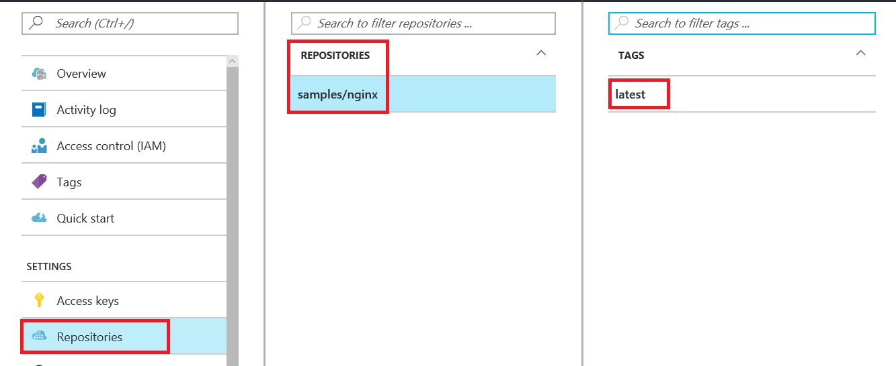

# View container registry repositories in the Azure portal

Azure Container Registry allows you to store Docker container images in repositories. By storing images in repositories, you can store groups of images (or versions of images) in isolated environments. You can specify these repositories when you push images to your registry, and view their contents in the Azure portal.

## Prerequisites

* **Container registry**: Create a container registry in your Azure subscription. For example, use the [Azure portal](container-registry-get-started-portal.md) or the [Azure CLI](container-registry-get-started-azure-cli.md).
* **Docker CLI**: Install [Docker][docker-install] on your local machine, which provides you with the Docker command-line interface.
* **Container image**: Push an image to your container registry. For guidance on how to push and pull images, see [Push and pull an image](container-registry-get-started-docker-cli.md).

## View repositories in Azure portal

You can see a list of the repositories hosting your images, as well as the image tags, in the Azure portal.

If you followed the steps in [Push and pull an image](container-registry-get-started-docker-cli.md) (and didn't subsequently delete the image), you should have an Nginx image in your container registry. The instructions in that article specified that you tag the image with a namespace, the "samples" in `/samples/nginx`. As a refresher, the [docker push][docker-push] command specified in that article was:

```Bash
docker push myregistry.azurecr.io/samples/nginx
```

 Because Azure Container Registry supports such multilevel repository namespaces, you can scope collections of images related to a specific app, or a collection of apps, to different development or operational teams. To read more about repositories in container registries, see [Private Docker container registries in Azure](container-registry-intro.md).

To view a repository:

1. Sign in to the [Azure portal][portal]
1. Select the **Azure Container Registry** to which you pushed the Nginx image
1. Select **Repositories** to see a list of the repositories that contain the images in the registry
1. Select a repository to see the image tags within that repository

For example, if you pushed the Nginx image as instructed in [Push and pull an image](container-registry-get-started-docker-cli.md), you should see something similar to:



## Next steps

Now that you know the basics of viewing and working with repositories in the portal, try using Azure Container Registry with an [Azure Kubernetes Service (AKS)](../aks/tutorial-kubernetes-prepare-app.md) cluster.

<!-- LINKS - External -->
[docker-install]: https://docs.docker.com/engine/installation/
[docker-push]: https://docs.docker.com/engine/reference/commandline/push/
[portal]: https://portal.azure.com
