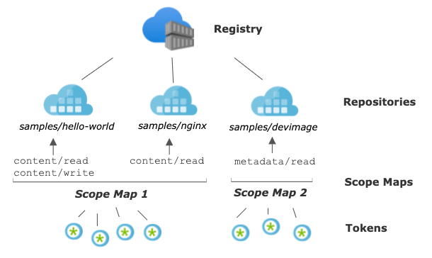

# Create a token with repository-scoped permissions

This article describes how to create tokens and scope maps to manage access to specific repositories in your container registry. By creating tokens, a registry owner can provide users or services with scoped, time-limited access to repositories to pull or push images or perform other actions. A token provides more fine-grained permissions than other registry [authentication options](container-registry-authentication.md), which scope permissions to an entire registry.

Scenarios for creating a token include:

* Allow IoT devices with individual tokens to pull an image from a repository
* Provide an external organization with permissions to a specific repository 
* Limit repository access to different user groups in your organization. For example, provide write and read access to developers who build images that target specific repositories, and read access to teams that deploy from those repositories.

This feature is available in all the service tiers. For information about registry service tiers and limits, see [Azure Container Registry service tiers](container-registry-skus.md)

## Limitations

* You can't currently assign repository-scoped permissions to an Azure Active Directory identity, such as a service principal or managed identity.

## Concepts

To configure repository-scoped permissions, you create a *token* with an associated *scope map*.

* A **token** along with a generated password lets the user authenticate with the registry. You can set an expiration date for a token password, or disable a token at any time.

  After authenticating with a token, the user or service can perform one or more *actions* scoped to one or more repositories.

  |Action  |Description  | Example |
  |---------|---------|--------|
  |`content/delete`    | Remove data from the repository  | Delete a repository or a manifest |
  |`content/read`     |  Read data from the repository |  Pull an artifact |
  |`content/write`     |  Write data to the repository     | Use with `content/read` to push an artifact |
  |`metadata/read`    | Read metadata from the repository   | List tags or manifests |
  |`metadata/write`     |  Write metadata to the repository  | Enable or disable read, write, or delete operations |

* A **scope map** groups the repository permissions you apply to a token, and can reapply to other tokens. Every token is associated with a single scope map.

   With a scope map:

  * Configure multiple tokens with identical permissions to a set of repositories
  * Update token permissions when you add or remove repository actions in the scope map, or apply a different scope map

  Azure Container Registry also provides several system-defined scope maps you can apply when creating tokens. The permissions of system-defined scope maps apply to all repositories in your registry.The individual *actions* corresponds to the limit of [Repositories per scope map.](container-registry-skus.md)

The following image shows the relationship between tokens and scope maps.



## Prerequisites

* **Azure CLI** - Azure CLI command examples in this article require Azure CLI version 2.17.0 or later. Run `az --version` to find the version. If you need to install or upgrade, see [Install Azure CLI](/cli/azure/install-azure-cli).
* **Docker** - To authenticate with the registry to pull or push images, you need a local Docker installation. Docker provides installation instructions for [macOS](https://docs.docker.com/docker-for-mac/), [Windows](https://docs.docker.com/docker-for-windows/), and [Linux](https://docs.docker.com/engine/installation/#supported-platforms) systems.
* **Container registry** - If you don't have one, create a container registry in your Azure subscription. For example, use the [Azure portal](container-registry-get-started-portal.md) or the [Azure CLI](container-registry-get-started-azure-cli.md).

## Create token - CLI

### Create token and specify repositories

Create a token using the [az acr token create][az-acr-token-create] command. When creating a token, you can specify one or more repositories and associated actions on each repository. The repositories don't need to be in the registry yet. To create a token by specifying an existing scope map, see the [next section](#create-token-and-specify-scope-map).

The following example creates a token in the registry *myregistry* with the following permissions on the `samples/hello-world` repo: `content/write` and `content/read`. By default, the command sets the default token status to `enabled`, but you can update the status to `disabled` at any time.

```azurecli
az acr token create --name MyToken --registry myregistry \
  --repository samples/hello-world \
  content/write content/read \
  --output json
```

The output shows details about the token. By default, two passwords are generated that don't expire, but you can optionally set an expiration date. It's recommended to save the passwords in a safe place to use later for authentication. The passwords can't be retrieved again, but new ones can be generated.

```console
{
  "creationDate": "2020-01-18T00:15:34.066221+00:00",
  "credentials": {
    "certificates": [],
    "passwords": [
      {
        "creationTime": "2020-01-18T00:15:52.837651+00:00",
        "expiry": null,
        "name": "password1",
        "value": "uH54BxxxxK7KOxxxxRbr26dAs8JXxxxx"
      },
      {
        "creationTime": "2020-01-18T00:15:52.837651+00:00",
        "expiry": null,
        "name": "password2",
        "value": "kPX6Or/xxxxLXpqowxxxxkA0idwLtmxxxx"
      }
    ],
    "username": "MyToken"
  },
  "id": "/subscriptions/xxxxxxxx-adbd-4cb4-c864-xxxxxxxxxxxx/resourceGroups/myresourcegroup/providers/Microsoft.ContainerRegistry/registries/myregistry/tokens/MyToken",
  "name": "MyToken",
  "objectId": null,
  "provisioningState": "Succeeded",
  "resourceGroup": "myresourcegroup",
  "scopeMapId": "/subscriptions/xxxxxxxx-adbd-4cb4-c864-xxxxxxxxxxxx/resourceGroups/myresourcegroup/providers/Microsoft.ContainerRegistry/registries/myregistry/scopeMaps/MyToken-scope-map",
  "status": "enabled",
  "type": "Microsoft.ContainerRegistry/registries/tokens"
```

> [!NOTE]
> To regenerate token passwords and expiration periods, see [Regenerate token passwords](#regenerate-token-passwords) later in this article.

The output includes details about the scope map the command created. You can use the scope map, here named `MyToken-scope-map`, to apply the same repository actions to other tokens. Or, update the scope map later to change the permissions of the associated tokens.

### Create token and specify scope map

An alternative way to create a token is to specify an existing scope map. If you don't already have a scope map, first create one by specifying repositories and associated actions. Then, specify the scope map when creating a token. 

To create a scope map, use the [az acr scope-map create][az-acr-scope-map-create] command. The following command creates a scope map with the same permissions on the `samples/hello-world` repository used previously. 

```azurecli
az acr scope-map create --name MyScopeMap --registry myregistry \
  --repository samples/hello-world \
  content/write content/read \
  --description "Sample scope map"
```

Run [az acr token create][az-acr-token-create] to create a token, specifying the *MyScopeMap* scope map. As in the previous example, the command sets the default token status to `enabled`.

```azurecli
az acr token create --name MyToken \
  --registry myregistry \
  --scope-map MyScopeMap
```

The output shows details about the token. By default, two passwords are generated. It's recommended to save the passwords in a safe place to use later for authentication. The passwords can't be retrieved again, but new ones can be generated.

> [!NOTE]
> To regenerate token passwords and expiration periods, see [Regenerate token passwords](#regenerate-token-passwords) later in this article.

## Create token - portal

You can use the Azure portal to create tokens and scope maps. As with the `az acr token create` CLI command, you can apply an existing scope map, or create a scope map when you create a token by specifying one or more repositories and associated actions. The repositories don't need to be in the registry yet. 

The following example creates a token, and creates a scope map with the following permissions on the `samples/hello-world` repository: `content/write` and `content/read`.

1. In the portal, navigate to your container registry.
1. Under **Repository permissions**, select **Tokens > +Add**.

      :::image type="content" source="media/container-registry-repository-scoped-permissions/portal-token-add.png" alt-text="Create token in portal":::
1. Enter a token name.
1. Under **Scope map**, select **Create new**.
1. Configure the scope map:
    1. Enter a name and description for the scope map. 
    1. Under **Repositories**, enter `samples/hello-world`, and under **Permissions**, select  `content/read` and `content/write`. Then select **+Add**.  

        :::image type="content" source="media/container-registry-repository-scoped-permissions/portal-scope-map-add.png" alt-text="Create scope map in portal":::

    1. After adding repositories and permissions, select **Add** to add the scope map.
1. Accept the default token **Status** of **Enabled** and then select **Create**.

After the token is validated and created, token details appear in the **Tokens** screen.

### Add token password

To use a token created in the portal, you must generate a password. You can generate one or two passwords, and set an expiration date for each one. New passwords created for tokens are available immediately. Regenerating new passwords for tokens will take 60 seconds to replicate and be available.

1. In the portal, navigate to your container registry.
1. Under **Repository permissions**, select **Tokens**, and select a token.
1. In the token details, select **password1** or **password2**, and select the Generate icon.
1. In the password screen, optionally set an expiration date for the password, and select **Generate**. It's recommended to set an expiration date.
1. After generating a password, copy and save it to a safe location. You can't retrieve a generated password after closing the screen, but you can generate a new one.

    :::image type="content" source="media/container-registry-repository-scoped-permissions/portal-token-password.png" alt-text="Create token password in portal":::

## Authenticate with token

When a user or service uses a token to authenticate with the target registry, it provides the token name as a user name and one of its generated passwords. 

The authentication method depends on the configured action or actions associated with the token.

|Action  |How to authenticate  |
  |---------|---------|
  |`content/delete`    | `az acr repository delete` in Azure CLI<br/><br/>Example: `az acr repository delete --name myregistry --repository myrepo --username MyToken --password xxxxxxxxxx`|
  |`content/read`     |  `docker login`<br/><br/>`az acr login` in Azure CLI<br/><br/>Example: `az acr login --name myregistry --username MyToken --password xxxxxxxxxx`  |
  |`content/write`     |  `docker login`<br/><br/>`az acr login` in Azure CLI     |
  |`metadata/read`    | `az acr repository show`<br/><br/>`az acr repository show-tags`<br/><br/>`az acr manifest list-metadata` in Azure CLI   |
  |`metadata/write`     |  `az acr repository untag`<br/><br/>`az acr repository update` in Azure CLI |

## Examples: Use token

The following examples use the token created earlier in this article to perform common operations on a repository: push and pull images, delete images, and list repository tags. The token was set up initially with push permissions (`content/write` and `content/read` actions) on the `samples/hello-world` repository.

### Pull and tag test images

For the following examples, pull public `hello-world` and `nginx` images from Microsoft Container Registry, and tag them for your registry and repository.

```bash
docker pull mcr.microsoft.com/hello-world
docker pull mcr.microsoft.com/oss/nginx/nginx:1.15.5-alpine
docker tag mcr.microsoft.com/hello-world myregistry.azurecr.io/samples/hello-world:v1
docker tag mcr.microsoft.com/oss/nginx/nginx:1.15.5-alpine myregistry.azurecr.io/samples/nginx:v1
```

### Authenticate using token

Run `docker login` or `az acr login` to authenticate with the registry to push or pull images. Provide the token name as the user name, and provide one of its passwords. The token must have the `Enabled` status.

The following example is formatted for the bash shell, and provides the values using environment variables.

```bash
TOKEN_NAME=MyToken
TOKEN_PWD=<token password>

echo $TOKEN_PWD | docker login --username $TOKEN_NAME --password-stdin myregistry.azurecr.io
```

Output should show successful authentication:

```console
Login Succeeded
```

### Push images to registry

After successful login, attempt to push the tagged images to the registry. Because the token has permissions to push images to the `samples/hello-world` repository, the following push succeeds:

```bash
docker push myregistry.azurecr.io/samples/hello-world:v1
```

The token doesn't have permissions to the `samples/nginx` repo, so the following push attempt fails with an error similar to `requested access to the resource is denied`:

```bash
docker push myregistry.azurecr.io/samples/nginx:v1
```

### Update token permissions

To update the permissions of a token, update the permissions in the associated scope map. The updated scope map is applied immediately to all associated tokens. 

For example, update `MyToken-scope-map` with `content/write` and `content/read` actions on the `samples/ngnx` repository, and remove the `content/write` action on the `samples/hello-world` repository.  

To use the Azure CLI, run [az acr scope-map update][az-acr-scope-map-update] to update the scope map:

```azurecli
az acr scope-map update \
  --name MyScopeMap \
  --registry myregistry \
  --add-repository samples/nginx content/write content/read \
  --remove-repository samples/hello-world content/write 
```

In the Azure portal:

1. Navigate to your container registry.
1. Under **Repository permissions**, select **Scope maps**, and select the scope map to update.
1. Under **Repositories**, enter `samples/nginx`, and under **Permissions**, select `content/read` and `content/write`. Then select **+Add**.
1. Under **Repositories**, select `samples/hello-world` and under **Permissions**, deselect `content/write`. Then select **Save**.

After updating the scope map, the following push succeeds:

```bash
docker push myregistry.azurecr.io/samples/nginx:v1
```

Because the scope map only has the `content/read` permission on the `samples/hello-world` repository, a push attempt to the `samples/hello-world` repo now fails:
 
```bash
docker push myregistry.azurecr.io/samples/hello-world:v1
```

Pulling images from both repos succeeds, because the scope map provides `content/read` permissions on both repositories:

```bash
docker pull myregistry.azurecr.io/samples/nginx:v1
docker pull myregistry.azurecr.io/samples/hello-world:v1
```
### Delete images

Update the scope map by adding the `content/delete` action to the `nginx` repository. This action allows deletion of images in the repository, or deletion of the entire repository.

For brevity, we show only the [az acr scope-map update][az-acr-scope-map-update] command to update the scope map:

```azurecli
az acr scope-map update \
  --name MyScopeMap \
  --registry myregistry \
  --add-repository samples/nginx content/delete
``` 

To update the scope map using the portal, see the [previous section](#update-token-permissions).

Use the following [az acr repository delete][az-acr-repository-delete] command to delete the `samples/nginx` repository. To delete images or repositories, pass the token's name and password to the command. The following example uses the environment variables created earlier in the article:

```azurecli
az acr repository delete \
  --name myregistry --repository samples/nginx \
  --username $TOKEN_NAME --password $TOKEN_PWD
```

### Show repo tags 

Update the scope map by adding the `metadata/read` action to the `hello-world` repository. This action allows reading manifest and tag data in the repository.

For brevity, we show only the [az acr scope-map update][az-acr-scope-map-update] command to update the scope map:

```azurecli
az acr scope-map update \
  --name MyScopeMap \
  --registry myregistry \
  --add-repository samples/hello-world metadata/read 
```  

To update the scope map using the portal, see the [previous section](#update-token-permissions).

To read metadata in the `samples/hello-world` repository, run the [az acr manifest list-metadata][az-acr-manifest-list-metadata] or [az acr repository show-tags][az-acr-repository-show-tags] command. 

To read metadata, pass the token's name and password to either command. The following example uses the environment variables created earlier in the article:

```azurecli
az acr repository show-tags \
  --name myregistry --repository samples/hello-world \
  --username $TOKEN_NAME --password $TOKEN_PWD
```

Sample output:

```console
[
  "v1"
]
```

## Manage tokens and scope maps

### List scope maps

Use the [az acr scope-map list][az-acr-scope-map-list] command, or the **Scope maps** screen in the portal, to list all the scope maps configured in a registry. For example:

```azurecli
az acr scope-map list \
  --registry myregistry --output table
```

The output consists of the three system-defined scope maps and other scope maps generated by you. Tokens can be configured with any of these scope maps.

```
NAME                 TYPE           CREATION DATE         DESCRIPTION
-------------------  -------------  --------------------  ------------------------------------------------------------
_repositories_admin  SystemDefined  2020-01-20T09:44:24Z  Can perform all read, write and delete operations on the ...
_repositories_pull   SystemDefined  2020-01-20T09:44:24Z  Can pull any repository of the registry
_repositories_push   SystemDefined  2020-01-20T09:44:24Z  Can push to any repository of the registry
MyScopeMap           UserDefined    2019-11-15T21:17:34Z  Sample scope map
```

### Show token details

To view the details of a token, such as its status and password expiration dates, run the [az acr token show][az-acr-token-show] command, or select the token in the **Tokens** screen in the portal. For example:

```azurecli
az acr scope-map show \
  --name MyScopeMap --registry myregistry
```

Use the [az acr token list][az-acr-token-list] command, or the **Tokens** screen in the portal, to list all the tokens configured in a registry. For example:

```azurecli
az acr token list --registry myregistry --output table
```

### Regenerate token passwords

If you didn't generate a token password, or you want to generate new passwords, run the [az acr token credential generate][az-acr-token-credential-generate] command. Regenerating new passwords for tokens will take 60 seconds to replicate and be available. 

The following example generates a new value for password1 for the *MyToken* token, with an expiration period of 30 days. It stores the password in the environment variable `TOKEN_PWD`. This example is formatted for the bash shell.

```azurecli
TOKEN_PWD=$(az acr token credential generate \
  --name MyToken --registry myregistry --expiration-in-days 30 \
  --password1 --query 'passwords[0].value' --output tsv)
```

To use the Azure portal to generate a token password, see the steps in [Create token - portal](#create-token---portal) earlier in this article.

### Update token with new scope map

If you want to update a token with a different scope map, run [az acr token update][az-acr-token-update] and specify the new scope map. For example:

```azurecli
az acr token update --name MyToken --registry myregistry \
  --scope-map MyNewScopeMap
```

In the portal, on the **Tokens** screen, select the token, and under **Scope map**, select a different scope map.

> [!TIP]
> After updating a token with a new scope map, you might want to generate new token passwords. Use the [az acr token credential generate][az-acr-token-credential-generate] command or regenerate a token password in the Azure portal.

## Disable or delete token

You might need to temporarily disable use of the token credentials for a user or service.

Using the Azure CLI, run the [az acr token update][az-acr-token-update] command to set the `status` to `disabled`:

```azurecli
az acr token update --name MyToken --registry myregistry \
  --status disabled
```

In the portal, select the token in the **Tokens** screen, and select **Disabled** under **Status**.

To delete a token to permanently invalidate access by anyone using its credentials, run the [az acr token delete][az-acr-token-delete] command.

```azurecli
az acr token delete --name MyToken --registry myregistry
```

In the portal, select the token in the **Tokens** screen, and select **Discard**.

## Next steps

* To manage scope maps and tokens, use additional commands in the [az acr scope-map][az-acr-scope-map] and [az acr token][az-acr-token] command groups.
* See the [authentication overview](container-registry-authentication.md) for other options to authenticate with an Azure container registry, including using an Azure Active Directory identity, a service principal, or an admin account.
* Learn about [connected registries](intro-connected-registry.md) and using tokens for [access](overview-connected-registry-access.md).

<!-- LINKS - External -->


<!-- LINKS - Internal -->
[az-acr-login]: /cli/azure/acr#az_acr_login
[az-acr-manifest-list-metadata]: /cli/azure/acr/manifest#az-acr-manifest-list-metadata
[az-acr-repository]: /cli/azure/acr/repository/
[az-acr-repository-show-tags]: /cli/azure/acr/repository/#az_acr_repository_show_tags
[az-acr-repository-delete]: /cli/azure/acr/repository/#az_acr_repository_delete
[az-acr-scope-map]: /cli/azure/acr/scope-map/
[az-acr-scope-map-create]: /cli/azure/acr/scope-map/#az_acr_scope_map_create
[az-acr-scope-map-list]: /cli/azure/acr/scope-map/#az_acr_scope_map_show
[az-acr-scope-map-show]: /cli/azure/acr/scope-map/#az_acr_scope_map_list
[az-acr-scope-map-update]: /cli/azure/acr/scope-map/#az_acr_scope_map_update
[az-acr-scope-map-list]: /cli/azure/acr/scope-map/#az_acr_scope_map_list
[az-acr-token]: /cli/azure/acr/token/
[az-acr-token-show]: /cli/azure/acr/token/#az_acr_token_show
[az-acr-token-list]: /cli/azure/acr/token/#az_acr_token_list
[az-acr-token-delete]: /cli/azure/acr/token/#az_acr_token_delete
[az-acr-token-create]: /cli/azure/acr/token/#az_acr_token_create
[az-acr-token-update]: /cli/azure/acr/token/#az_acr_token_update
[az-acr-token-credential-generate]: /cli/azure/acr/token/credential/#az_acr_token_credential_generate
