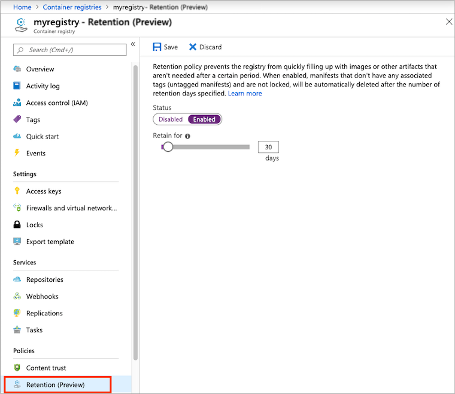

# Set a retention policy for artifacts in Azure Container Registry

Azure Container Registry gives you the option to set a *retention policy* for images or other artifacts in each registry. When a retention policy is enabled, specific artifact types in the registry are automatically deleted after a number of days you set. This feature prevents the registry from filling up with artifacts that aren't needed and helps you save on storage costs. 

You can use the Azure Cloud Shell or a local installation of the Azure CLI to run the command examples in this article. If you'd like to use it locally, version 2.0.73 or later is required. Run `az --version` to find the version. If you need to install or upgrade, see [Install Azure CLI][azure-cli].

> [!IMPORTANT]
> This feature is currently in preview, and some [limitations apply](#preview-limitations). Previews are made available to you on the condition that you agree to the [supplemental terms of use][terms-of-use]. Some aspects of this feature may change prior to general availability (GA).

> [!WARNING]
> Set a retention policy with care--deleted image data is UNRECOVERABLE. If you have systems that pull images by manifest digest (as opposed to image name), you should not set a retention policy for untagged manifests. Deleting untagged images will prevent those systems from pulling the images from your registry. Instead of pulling by manifest, consider adopting a *unique tagging* scheme, a [recommended best practice](container-registry-image-tag-version.md).

If you want to delete single image tags or manifests using Azure CLI commands, see [Delete container images in Azure Container Registry](container-registry-delete.md).

## Preview limitations

* Only a **Premium** container registry can be configured with a retention policy. For information about registry service tiers, see [Azure Container Registry SKUs](container-registry-skus.md).
* Currently, you can only set a retention policy for image manifests that don't have any associated tags (*untagged manifests*). For background on container images and manifests, see [About registries, repositories, and images](container-registry-concepts.md).

## Set a retention policy for untagged manifests - CLI

The following example shows you how to use the Azure CLI to set a retention policy for untagged manifests in a registry.

### Enable a retention policy

By default, no retention policy is set in a container registry. To set or update a retention policy, run the [az acr config retention update][az-acr-config-retention-update] command in the Azure CLI. You can specify a number of days between 0 and 365 to retain the untagged manifests. If you enable a retention policy without specifying a number of days, the command sets a default of 7 days. After the retention period, all untagged manifests in the registry are automatically deleted.

The retention policy doesn't apply to any untagged manifest that has the `delete-enabled` attribute set to `false`. For information about locked images and manifests, see [Lock a container image in an Azure container registry](container-registry-image-lock.md).

The following example sets a retention policy of 30 days for untagged manifests in the registry *myregistry*:

```azurecli
az acr config retention update --name myregistry --status enabled --days 30
```

The following example sets a policy to delete any manifest in the registry as soon as it's untagged. Create this policy by setting a retention period of 0 days:

```azurecli
az acr config retention update --name myregistry --status enabled --days 0
```

### Disable a retention policy

To see the retention policy set in a registry, run the [az acr config retention show][az-acr-config-retention-show] command:

```azurecli
az acr config retention show --name myregistry
```

To disable a retention policy in a registry, run the [az acr config retention update][az-acr-config-retention-update] command and set `--Status disabled`:

```azurecli
az acr config retention update --name myregistry --status disabled
```

## Set a retention policy for untagged manifests - portal

You can also set a registry's retention policy in the [Azure portal](https://portal.azure.com). The following example shows you how to use the portal to set a retention policy for untagged manifests in a registry.

### Enable a retention policy

1. Navigate to your Azure container registry. Under **Policies**, select **Retention** (Preview).
1. In **Status**, select **Enabled**.
1. Select a number of days between 0 and 365 to retain the untagged manifests. Select **Save**.



### Disable a retention policy

1. Navigate to your Azure container registry. Under **Policies**, select **Retention** (Preview).
1. In **Status**, select **Disabled**. Select **Save**.

## Next steps

* Learn more about options to [delete images and repositories](container-registry-delete.md) in Azure Container Registry

* Learn how to [automatically purge](container-registry-auto-purge.md) selected images and manifests from a registry

<!-- LINKS - external -->
[terms-of-use]: https://azure.microsoft.com/support/legal/preview-supplemental-terms/


<!-- LINKS - internal -->
[azure-cli]: /cli/azure/install-azure-cli
[az-acr-config-retention-update]: /cli/azure/acr/config/retention#az-acr-config-retention-update
[az-acr-config-retention-show]: /cli/azure/acr/config/retention#az-acr-config-retention-show
