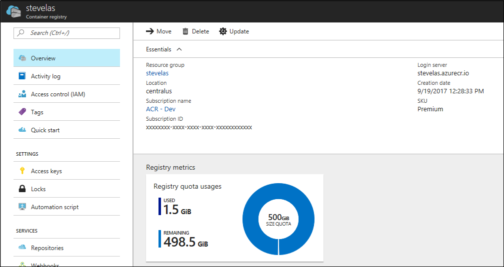

# Azure Container Registry SKUs

Azure Container Registry (ACR) is available in multiple service tiers, known as SKUs. These SKUs provide predictable pricing and several options for how you wish to use your private Docker registry in Azure. Choosing a higher-level SKU provides more performance and scale. However, all SKUs provide the same programmatic capabilities, enabling a developer to get started with Basic, and convert to Standard and Premium as registry usage increases.

## Basic
A cost-optimized entry point for developers learning about Azure Container Registry. Basic registries have the same programmatic capabilities as Standard and Premium (Azure Active Directory authentication integration, image deletion, and web hooks), however, there are size and usage constraints.

## Standard
Standard registries offer the same capabilities as Basic, with increased storage limits and image throughput. Standard registries should satisfy the needs of most production scenarios.

## Premium
Premium registries provide higher limits on constraints such as storage and concurrent operations, enabling high-volume scenarios. In addition to higher image throughput capacity, Premium adds features like [geo-replication](container-registry-geo-replication.md) for managing a single registry across multiple regions, maintaining a network-close registry to each deployment.

## Classic
The Classic registry SKU enabled the initial release of the Azure Container Registry service in Azure. Classic registries are backed by a storage account that Azure creates in your subscription, which limits the ability for ACR to provide higher-level capabilities such as increased throughput and geo-replication. Because of its limited capabilities, we plan to deprecate the Classic SKU in the future.

> [!NOTE]
> Because of the planned deprecation of the Classic registry SKU, we recommend you use Basic, Standard, or Premium for all new registries. For information about converting your existing Classic registry, see [Changing SKUs](#changing-skus).
>

## Registry SKU feature matrix

The following table details the features and limits of the Basic, Standard, and Premium service tiers.

[!INCLUDE [container-instances-limits](../../includes/container-registry-limits.md)]

## Manage registry size
The storage constraints of each SKU are intended to align with a typical scenario: Basic for getting started, Standard for the majority of production apps, and Premium for hyper-scale performance and [geo-replication](container-registry-geo-replication.md). Throughout the life of your registry, you should manage its size by periodically deleting unused content.

You can find the current usage of a registry in the container registry **Overview** in the Azure portal:

You can manage the size of your registry by deleting repositories in the Azure portal.

Under **SERVICES**, select **Repositories**, then right-click the repository you want to delete, then select **Delete**.

## Changing SKUs

You can change a registry's SKU in the Azure portal.

In the registry **Overview** in the Azure portal, select **Update**, then select a new **SKU** from the SKU drop-down.

## Changing from Classic
When you change a Classic registry to Basic, Standard, or Premium, Azure copies existing container images from the associated storage account in your subscription to a storage account managed by Azure. This process can take some time.

During conversion, `docker pull` continues to function, however, `docker push` is blocked until conversion is complete.

Once completed, the subscription storage account is no longer used by ACR.

### Why change from Classic to Basic, Standard, or Premium?

Because of the limited capabilities of Classic registries, we recommend that you change your Classic registries to Basic, Standard, or Premium tiers. These higher-level SKUs more deeply integrate the registry into the capabilities of Azure. Some of these capabilities include:

* Azure Active Directory integration for individual authentication (see [az acr login](/cli/azure/acr?view=azure-cli-latest#az_acr_login))
* Image and tag deletion support
* [Geo-replication](container-registry-geo-replication.md)
* [Webhooks](container-registry-webhook.md)

Most of all, a Classic registry depends on the storage account that Azure automatically provisioned in your Azure subscription when you created the registry. By contrast, the Basic, Standard, and Premium SKUs take advantage of *managed storage*. That is, Azure transparently manages the storage of your images for you--a separate storage account is not created in your own subscription.

Some of the benefits of managed storage provided by Basic, Standard, and Premium registries:

* Container images are [encrypted at rest](../storage/common/storage-service-encryption.md).
* Images are stored using [geo-redundant storage](../storage/common/storage-redundancy.md#geo-redundant-storage), assuring backup of your images with multi-region replication.
* Ability to [move to between SKUs](#changing-skus), enabling higher throughput when you choose a higher-level SKU. With each SKU, ACR can meet your throughput requirements as your needs increase. The underlying implementation of how ACR achieves the desired throughput is expressed as *intent* (by selecting higher SKUs), without you having to manage the details of the implementation.

## Pricing

For pricing information on each of the Azure Container Registry SKUs, see [Container Registry pricing](https://azure.microsoft.com/pricing/details/container-registry/).

## Next steps

**Azure Container Registry Roadmap**

Visit the [ACR Roadmap](https://aka.ms/acr/roadmap) on GitHub to find information about upcoming features in the service.

**Azure Container Registry UserVoice**

Submit and vote on new feature suggestions in [ACR UserVoice](https://feedback.azure.com/forums/903958-azure-container-registry).