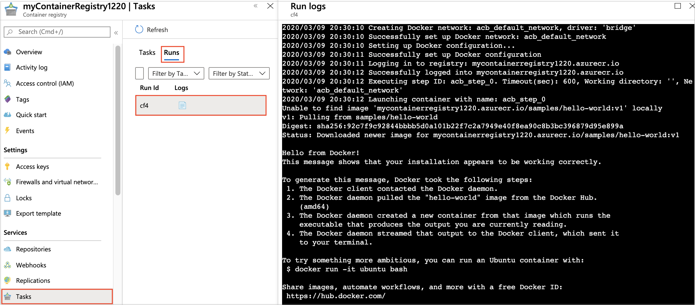

# View and manage task run logs

Each task run in [Azure Container Registry tasks](container-registry-tasks-overview.md) generates log output that you can inspect to determine whether the task steps ran successfully. 

This article explains how to view and manage task run logs.

## View streamed logs

When you trigger a task manually, log output is streamed directly to the console. For example, when you trigger a task manually by using the [az acr build](/cli/azure/acr#az-acr-build), [az acr run](/cli/azure/acr#az-acr-run), or [az acr task run](/cli/azure/acr/task#az-acr-task-run) command, you see log output streamed to the console. 

The following sample [az acr run](/cli/azure/acr#az-acr-run) command manually triggers a task that runs a container pulled from the same registry:

```azurecli
az acr run --registry mycontainerregistry1220 \
  --cmd '$Registry/samples/hello-world:v1' /dev/null
```

Streamed log:

```console
Queued a run with ID: cf4
Waiting for an agent...
2020/03/09 20:30:10 Alias support enabled for version >= 1.1.0, please see https://aka.ms/acr/tasks/task-aliases for more information.
2020/03/09 20:30:10 Creating Docker network: acb_default_network, driver: 'bridge'
2020/03/09 20:30:10 Successfully set up Docker network: acb_default_network
2020/03/09 20:30:10 Setting up Docker configuration...
2020/03/09 20:30:11 Successfully set up Docker configuration
2020/03/09 20:30:11 Logging in to registry: mycontainerregistry1220azurecr.io
2020/03/09 20:30:12 Successfully logged into mycontainerregistry1220azurecr.io
2020/03/09 20:30:12 Executing step ID: acb_step_0. Timeout(sec): 600, Working directory: '', Network: 'acb_default_network'
2020/03/09 20:30:12 Launching container with name: acb_step_0
Unable to find image 'mycontainerregistry1220azurecr.io/samples/hello-world:v1' locally
v1: Pulling from samples/hello-world
Digest: sha256:92c7f9c92844bbbb5d0a101b22f7c2a7949e40f8ea90c8b3bc396879d95e888a
Status: Downloaded newer image for mycontainerregistry1220azurecr.io/samples/hello-world:v1

Hello from Docker!
This message shows that your installation appears to be working correctly.
[...]

2020/03/09 20:30:13 Successfully executed container: acb_step_0
2020/03/09 20:30:13 Step ID: acb_step_0 marked as successful (elapsed time in seconds: 1.180081)

Run ID: cf4 was successful after 5s
```

## View stored logs 

Azure Container Registry stores run logs for all tasks. You can view stored run logs in the Azure portal. Or, use the [az acr task logs](/cli/azure/acr/task#az-acr-task-logs) command to view a selected log. By default, logs are retained for 30 days.

If a task is automatically triggered, for example by a source code update, accessing the stored logs is the *only* way to view the run logs. Automatic task triggers include source code commits or pull requests, base image updates, and timer triggers.

To view run logs in the portal:

1. Navigate to your container registry.
1. In **Services**, select **Tasks** > **Runs**.
1. Select a **Run Id** to view the run status and run logs. The log contains the same information as a streamed log, if one is generated.



To view a log using the Azure CLI, run [az acr task logs](/cli/azure/acr/task#az-acr-task-logs) and specify a run ID, a task name, or a specific image create by a build task. If a task name is specified, the command shows the log for the last created run.

The following example outputs the log for the run with ID *cf4*:

```azurecli
az acr task logs --registry mycontainerregistry1220 \
  --run-id cf4
```

## Alternative log storage

You might want to store task run logs on a local file system or use an alternative archiving solution such as Azure Storage.

For example, create a local *tasklogs* directory, and redirect the output of [az acr task logs](/cli/azure/acr/task#az-acr-task-logs) to a local file:

```azurecli
mkdir ~/tasklogs

az acr task logs --registry mycontainerregistry1220 \
  --run-id cf4 > ~/tasklogs/cf4.log
```

You can also save local log files to Azure Storage. For example, use the [Azure CLI](../storage/blobs/storage-quickstart-blobs-cli.md), the [Azure portal](../storage/blobs/storage-quickstart-blobs-portal.md), or other methods to upload files to a storage account.


## Next steps

* Learn more about [Azure Container Registry Tasks](container-registry-tasks-overview.md)

<!-- LINKS - External -->
[base-alpine]: https://hub.docker.com/_/alpine/
[base-dotnet]: https://hub.docker.com/r/microsoft/dotnet/
[base-node]: https://hub.docker.com/_/node/
[base-windows]: https://hub.docker.com/r/microsoft/nanoserver/
[sample-archive]: https://github.com/Azure-Samples/acr-build-helloworld-node/archive/master.zip
[terms-of-use]: https://azure.microsoft.com/support/legal/preview-supplemental-terms/

<!-- LINKS - Internal -->
[azure-cli]: /cli/azure/install-azure-cli
[az-acr-build]: /cli/azure/acr#az-acr-build
[az-acr-pack-build]: /cli/azure/acr/pack#az-acr-pack-build
[az-acr-task]: /cli/azure/acr/task
[az-acr-task-create]: /cli/azure/acr/task#az-acr-task-create
[az-acr-task-run]: /cli/azure/acr/task#az-acr-task-run
[az-acr-task-update]: /cli/azure/acr/task#az-acr-task-update
[az-login]: /cli/azure/reference-index#az-login
[az-login-service-principal]: /cli/azure/authenticate-azure-cli

<!-- IMAGES -->
[quick-build-01-fork]: ./media/container-registry-tutorial-quick-build/quick-build-01-fork.png
[quick-build-02-browser]: ./media/container-registry-tutorial-quick-build/quick-build-02-browser.png
