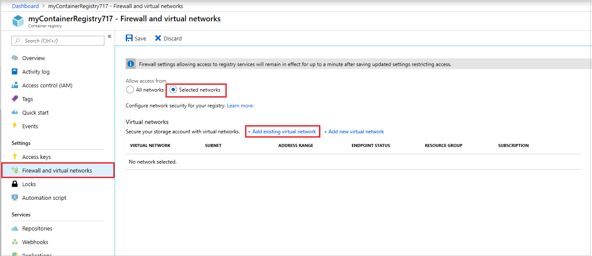

# Deploy an Azure container registry in an Azure virtual network

[Azure Virtual Network](../virtual-network/virtual-networks-overview.md) provides secure, private networking including filtering, routing, and peering for your Azure and on-premises resources. By deploying your private Azure container registry into an Azure virtual network, you can ensure that only resources in the virtual network are able to communicate with the container registry.

Azure resources in the virtual network such as an [Azure Kubernetes Service](../aks/intro-kubernetes.md) cluster or a [virtual machine]() configured as a Docker host can securely connect to the container registry to pull or push container images without crossing a network boundary.

> [!IMPORTANT]
> This feature is currently in preview, and some [limitations apply](#preview-limitations). Previews are made available to you on the condition that you agree to the [supplemental terms of use][terms-of-use]. Some aspects of this feature may change prior to general availability (GA).

## Virtual network deployment limitations

Certain limitations apply when you deploy a container registry groups to a virtual network.

* Region limitations?
* Resource group limitations?
* Limit to VNets with particular resources: AKS cluster, VM? (Not ACI)

## Prerequisites

* CLI version?
* User permissions required on network resources?
* ?


## Access a container registry in a VNet from an AKS cluster


### Create a virtual network [check for supported regions]

Before you can create a virtual network, you must create a resource group to contain the virtual network. Create a resource group with [az group create](/cli/azure/group#az_group_create). The following example creates a resource group named *myResourceGroup* in the *eastus* location:

```azurecli
az group create --name myResourceGroup --location eastus
```

Create a virtual network with [az network vnet create](/cli/azure/network/vnet#az_network_vnet_create). The following example creates a default virtual network named *myVirtualNetwork* with one subnet named *default*:

```azurecli
az network vnet create \
  --name myVirtualNetwork \
  --resource-group myResourceGroup \
  --subnet-name default
```

### Add a service endpoint for Azure Container Registry [confirm CLI]

[not certain if this is the best path to set endpoint explicitly first? Confirm service-endpoint name.]

```azurecli
az network vnet subnet update \
  --name default \
  --vnet-name myVirtualNetwork \
  --resource-group myResourceGroup \
  --service-endpoint microsoft.container-registry
```

### Create a container registry 

Create an ACR instance using the [az acr create][az-acr-create] command. The registry name must be unique within Azure, and contain 5-50 alphanumeric characters. In the following example, *myContainerRegistry717* is used. Update this to a unique value.

```azurecli
az acr create --resource-group myResourceGroup --name myContainerRegistry717 --sku Basic

```

### Configure network access for container registry

By default, an Azure container registry accepts connections from clients on any network. To limit access to a selected network, you must change the default action. In preview, you can manage default network access rules for a container registry only through the Azure portal.

1. Sign in to the Azure portal at [https://portal.azure.com](https://portal.azure.com).
1. In the portal, navigate to your registry and select **Firewall and virtual networks**
1. To deny access by default, choose to allow access from **Selected networks**. 
1. Click **Add existing virtual network**, and select the virtual network and subnet you created previously. Click **Add**.

  


### Build and push a sample image to the registry

Run a sample [task](container-registry-tasks-multi-step.md) with [az acr run][az-acr-run] to build a `hello-world` container image and push it to your container registry:

```azurecli
az acr run --registry myContainerRegistry717
 -f build-push-hello-world.yaml https://github.com/Azure-Samples/acr-tasks.git
```

To verify that the `hello-world` image is in a repository in your container registry, run the [az acr repository list][az-acr-repository-list] command:

```azurecli
az acr repository list --name myContainerRegistry717 -o tsv
```


### Configure ACR authentication

[Would it be better to create the SP automatically with AKS cluster, then delegate permissions to ACR?]

To allow an AKS cluster to interact with other Azure resources such as an Azure container registry, an Azure Active Directory service principal is used.

Create a service principal using the [az ad sp create-for-rbac][az-ad-sp-create-for-rbac] command. The `--skip-assignment` parameter limits any additional permissions from being assigned.

```azurecli
az ad sp create-for-rbac --skip-assignment
```

Make a note of the *appId* and *password* in the output. 

Now, grant the AKS service principal the correct rights to pull images from ACR.

First, get the ACR resource ID using [az acr show][az-acr-show] and store it in a variable. 

```azurecli
acrId=$(az acr show --resource-group myResourceGroup --name myContainerRegistry717 --query "id" --output tsv)
```

To grant the correct access for the AKS cluster to use images stored in ACR, create a role assignment using the [az role assignment create][az-role-assignment-create] command. Replace `<appId`> with the service principal appID gathered in a previous step.

```azurecli
az role assignment create --assignee <appId> --scope $acrId --role Reader
```

### Create AKS cluster

Now deploy an AKS cluster into the virtual network for the container registry. First get the resource ID of the subnet you created previously (named *default*) using the [az network vnet subnet show][az-network-vnet-subnet-show] command:

```azurecli
$subnetId=$(az network vnet subnet show --resource-group myResourceGroup --vnet-name myVirtualNetwork --name default --query "id" --output tsv)
``` 

Create an AKS cluster using [az aks create][az-aks-create]. The following example creates a cluster named *myAKSCluster* in the resource group named *myResourceGroup*. Provide your own `<appId>` and `<password>` from the previous step where the service principal was created. Pass the subnet ID for the virtual network using the `--vnet-subnet-id` parameter.

```azurecli
az aks create \
    --resource-group myResourceGroup \
    --name myAKSCluster \
    --node-count 1 \
    --service-principal <appId> \
    --client-secret <password> \
    --generate-ssh-keys
    --vnet-subnet-id $subnetId
```

After several minutes, the deployment completes, and returns JSON-formatted information about the AKS deployment.

### Connect to cluster using kubectl

To connect to the Kubernetes cluster from your local computer, you use [kubectl][kubectl], the Kubernetes command-line client.

If you use the Azure Cloud Shell, `kubectl` is already installed. You can also install it locally using the [az aks install-cli][az-aks-install-cli] command:

```azurecli
az aks install-cli
```

To configure `kubectl` to connect to your Kubernetes cluster, use [az aks get-credentials][az-aks-get-credentials]:

```azurecli
az aks get-credentials --resource-group myResourceGroup --name myAKSCluster
```

To verify the connection to your cluster, run the [kubectl get nodes][kubectl-get] command:

```
$ kubectl get nodes

NAME                       STATUS    ROLES     AGE       VERSION
aks-nodepool1-66427764-0   Ready     agent     9m        v1.9.9
```


### Run container on AKS cluster

As a simple example, use `kubectl run` to run a container on the AKS cluster from the `hello-world` container image you pushed to your container registry: 

```
kubectl run hello-world --image=myContainerRegistry717.azurecr.io/hello-world
```

Output is similar to the following:

```Console
$ kubectl run hello-world --image=hello-world
deployment.apps/hello-world created
```

Run the `kubectl logs` command to see the expected output of the container:

```Console
$ kubectl logs deployment.apps/hello-world

Hello from Docker!
This message shows that your installation appears to be working correctly.
...
```

### Verify that container registry isn't accessible from the internet

Although you are able to run a container on the AKS cluster from an image pulled from the private container registry, the registry can't be accessed from other networks. For example, you can't login to the registry over the internet using the `docker login` command. The following example passes the service principal `<appId>` and `<password>` credentials used by the AKS cluster.

```Console
docker login --username <appId> --password <password> mycontainerregistry717.azurecr.io
```

Output is similar to:

```Console
Error response from daemon: Get https://mycontainerregistry717.azurecr.io/v2/: unauthorized: authentication required
```
## Clean up resources

[Add this section]


## Next steps

Several virtual network resources and features were discussed in this article, though briefly. The Azure Virtual Network documentation covers these topics extensively:

* [Virtual network](../virtual-network/manage-virtual-network.md)
* [Subnet](../virtual-network/virtual-network-manage-subnet.md)
* [Service endpoints](../virtual-network/virtual-network-service-endpoints-overview.md)


<!-- IMAGES -->
[aci-vnet-01]: ./media/container-instances-vnet/aci-vnet-01.png

<!-- LINKS - External -->
[aci-helloworld]: https://hub.docker.com/r/microsoft/aci-helloworld/
[terms-of-use]: https://azure.microsoft.com/support/legal/preview-supplemental-terms/
[kubectl]: https://kubernetes.io/docs/user-guide/kubectl/
[kubectl-get]: https://kubernetes.io/docs/reference/generated/kubectl/kubectl-commands#get

<!-- LINKS - Internal -->
[az-network-vnet-create]: /cli/azure/network/vnet#az-network-vnet-create
[az-network-profile-list]: /cli/azure/network/profile#az-network-profile-list
[az-acr-create]: /cli/azure/acr#az-acr-create
[az-acr-show]: /cli/azure/acr#az-acr-show
[az-acr-repository-list]: /cli/azure/acr/repository#az-acr-repository-list
[az-acr-run]: /cli/azure/acr#az-acr-run
[az-ad-sp-create-for-rbac]: /cli/azure/ad/sp#az-ad-sp-create-for-rbac
[az-role-assignment-create]: /cli/azure/role/assignment#az-role-assignment-create
[az-aks-create]: /cli/azure/aks#az-aks-create
[az-aks-get-credentials]: /cli/azure/aks#az-aks-get-credentials
[az-aks-install-cli]: /cli/azure/aks#az-aks-install-cli
[az-network-vnet-subnet-show]: /cli/azure/network/vnet/subnet/#az-network-vnet-subnet-show