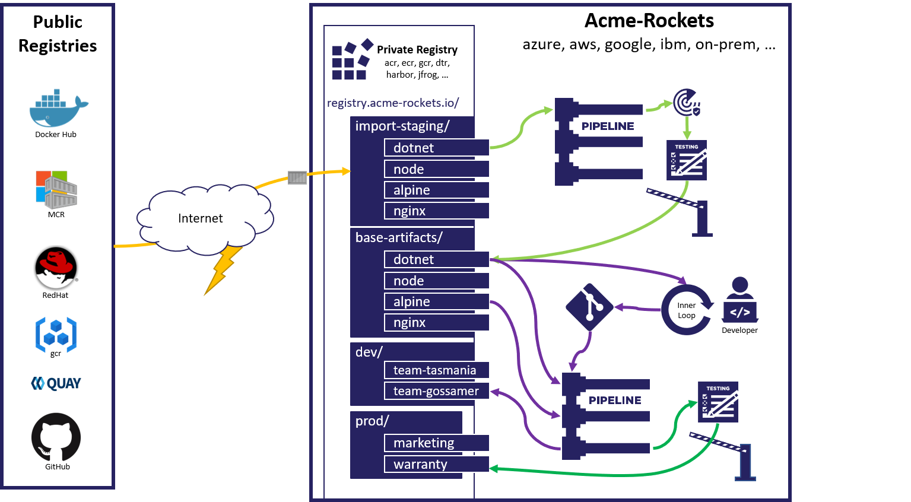
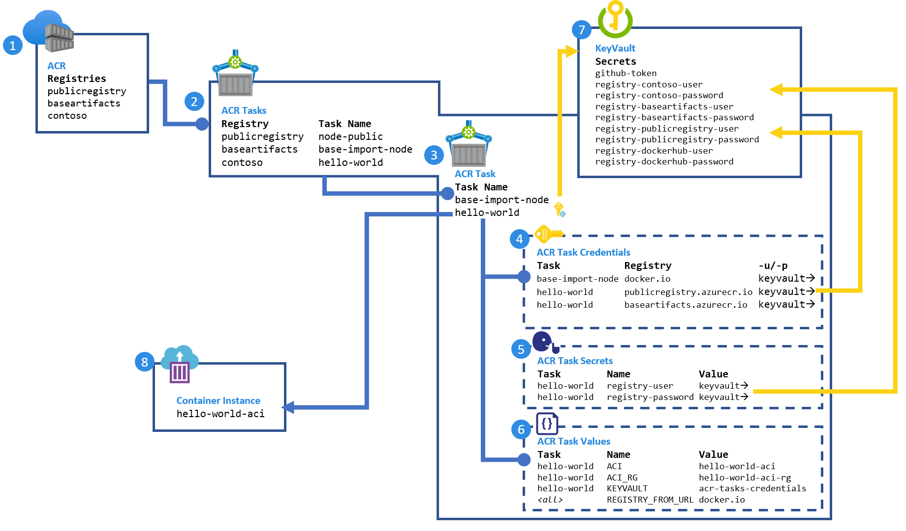

# How to consume and maintain public content with Azure Container Registry Tasks

This article provides a sample workflow in Azure Container Registry to help you manage consuming and maintaining public content:

1. Import local copies of dependent public images.
1. Validate public images through security scanning and functional testing.
1. Promote the images to private registries for internal usage.
1. Trigger base image updates for applications dependent upon public content.
1. Use [Azure Container Registry Tasks](container-registry-tasks-overview.md) to automate this workflow.

The workflow is summarized in the following image:



The gated import workflow helps manage your organization's dependencies on externally managed artifacts - for example, images sourced from public registries including [Docker Hub][docker-hub], [GCR][gcr], [Quay][quay], [GitHub Container Registry][ghcr], [Microsoft Container Registry][mcr], or even other [Azure container registries][acr]. 

For background about the risks introduced by dependencies on public content and how to use Azure Container Registry to mitigate them, see the [OCI Consuming Public Content Blog post][oci-consuming-public-content] and [Manage public content with Azure Container Registry](buffer-gate-public-content.md).

You can use the Azure Cloud Shell or a local installation of the Azure CLI to complete this walkthrough. Azure CLI version 2.10 or later is recommended. If you need to install or upgrade, see [Install Azure CLI][install-cli].

## Scenario overview



This walkthrough sets up:

1. Three **container registries**, representing:
   * A simulated [Docker Hub][docker-hub] (`publicregistry`) to support changing the base image
   * Team registry (`contoso`) to share private images
   * Company/team shared registry (`baseartifacts`) for imported public content
1. An **ACR task** in each registry. The tasks:  
   1. Build a simulated public `node` image
   1. Import and validate the `node` image to the company/team shared registry
   1. Build and deploy the `hello-world` image
1. **ACR task definitions**, including configurations for:
1. A collection of **registry credentials**, which are pointers to a key vault
1. A collection of **secrets**, available within an `acr-task.yaml`, which are pointers to a key vault
1. A collection of **configured values** used within an `acr-task.yaml`
1. An **Azure key vault** to secure all secrets
1. An **Azure container instance**, which hosts the `hello-world` build application

## Prerequisites

The following steps configure values for resources created and used in the walkthrough.

### Set environment variables

Configure variables unique to your environment. We follow best practices for placing resources with durable content in their own resource group to minimize accidental deletion. However, you can place these in a single resource group if desired.

The examples in this article are formatted for the bash shell.

```bash
# Set the three registry names, must be globally unique:
REGISTRY_PUBLIC=publicregistry
REGISTRY_BASE_ARTIFACTS=contosobaseartifacts
REGISTRY=contoso

# set the location all resources will be created in:
RESOURCE_GROUP_LOCATION=eastus

# default resource groups
REGISTRY_PUBLIC_RG=${REGISTRY_PUBLIC}-rg
REGISTRY_BASE_ARTIFACTS_RG=${REGISTRY_BASE_ARTIFACTS}-rg
REGISTRY_RG=${REGISTRY}-rg

# fully qualified registry urls
REGISTRY_DOCKERHUB_URL=docker.io
REGISTRY_PUBLIC_URL=${REGISTRY_PUBLIC}.azurecr.io
REGISTRY_BASE_ARTIFACTS_URL=${REGISTRY_BASE_ARTIFACTS}.azurecr.io
REGISTRY_URL=${REGISTRY}.azurecr.io

# Azure key vault for storing secrets, name must be globally unique
AKV=acr-task-credentials
AKV_RG=${AKV}-rg

# ACI for hosting the deployed application
ACI=hello-world-aci
ACI_RG=${ACI}-rg
```

### Git repositories and tokens

To simulate your environment, fork each of the following Git repos into repositories you can manage. 

* https://github.com/importing-public-content/base-image-node.git
* https://github.com/importing-public-content/import-baseimage-node.git
* https://github.com/importing-public-content/hello-world.git

Then, update the following variables for your forked repositories.

The `:main` appended to the end of the git URLs represents the default repository branch.

```bash
GIT_BASE_IMAGE_NODE=https://github.com/<your-fork>/base-image-node.git#main
GIT_NODE_IMPORT=https://github.com/<your-fork>/import-baseimage-node.git#main
GIT_HELLO_WORLD=https://github.com/<your-fork>/hello-world.git#main
```

You need a [GitHub access token (PAT)][git-token] for ACR Tasks to clone and establish Git webhooks. For steps to create a token with the required permissions to a private repo, see [Create a GitHub access token](container-registry-tutorial-build-task.md#create-a-github-personal-access-token). 

```bash
GIT_TOKEN=<set-git-token-here>
```

### Docker Hub credentials  
To avoid throttling and identity requests when pulling images from Docker Hub, create a [Docker Hub token][docker-hub-tokens]. Then, set the following environment variables:

```bash
REGISTRY_DOCKERHUB_USER=<yourusername>
REGISTRY_DOCKERHUB_PASSWORD=<yourtoken>
```

### Create registries

Using Azure CLI commands, create three Premium tier container registries, each in its own resource group:

```azurecli-interactive
az group create --name $REGISTRY_PUBLIC_RG --location $RESOURCE_GROUP_LOCATION
az acr create --resource-group $REGISTRY_PUBLIC_RG --name $REGISTRY_PUBLIC --sku Premium

az group create --name $REGISTRY_BASE_ARTIFACTS_RG --location $RESOURCE_GROUP_LOCATION
az acr create --resource-group $REGISTRY_BASE_ARTIFACTS_RG --name $REGISTRY_BASE_ARTIFACTS --sku Premium

az group create --name $REGISTRY_RG --location $RESOURCE_GROUP_LOCATION
az acr create --resource-group $REGISTRY_RG --name $REGISTRY --sku Premium
```

### Create key vault and set secrets

Create a key vault:

```azurecli-interactive
az group create --name $AKV_RG --location $RESOURCE_GROUP_LOCATION
az keyvault create --resource-group $AKV_RG --name $AKV
```

Set Docker Hub username and token in the key vault:

```azurecli-interactive
az keyvault secret set \
--vault-name $AKV \
--name registry-dockerhub-user \
--value $REGISTRY_DOCKERHUB_USER

az keyvault secret set \
--vault-name $AKV \
--name registry-dockerhub-password \
--value $REGISTRY_DOCKERHUB_PASSWORD
```

Set and verify a Git PAT in the key vault:

```azurecli-interactive
az keyvault secret set --vault-name $AKV --name github-token --value $GIT_TOKEN

az keyvault secret show --vault-name $AKV --name github-token --query value -o tsv
```

### Create resource group for an Azure container instance

This resource group is used in a later task when deploying the `hello-world` image.

```azurecli-interactive
az group create --name $ACI_RG --location $RESOURCE_GROUP_LOCATION
```

## Create public `node` base image

To simulate the `node` image on Docker Hub, create an [ACR task][acr-task] to build and maintain the public image. This setup allows simulating changes by the `node` image maintainers.

```azurecli-interactive
az acr task create \
  --name node-public \
  -r $REGISTRY_PUBLIC \
  -f acr-task.yaml \
  --context $GIT_BASE_IMAGE_NODE \
  --git-access-token $(az keyvault secret show \
                        --vault-name $AKV \
                        --name github-token \
                        --query value -o tsv) \
  --set REGISTRY_FROM_URL=${REGISTRY_DOCKERHUB_URL}/ \
  --assign-identity
```

To avoid Docker throttling, add [Docker Hub credentials][docker-hub-tokens] to the task. The [acr task credentials][acr-task-credentials] command may be used to pass Docker credentials to any registry, including Docker Hub.

```azurecli-interactive
az acr task credential add \
  -n node-public \
  -r $REGISTRY_PUBLIC \
  --login-server $REGISTRY_DOCKERHUB_URL \
  -u https://${AKV}.vault.azure.net/secrets/registry-dockerhub-user \
  -p https://${AKV}.vault.azure.net/secrets/registry-dockerhub-password \
  --use-identity [system]
```

Grant the task access to read values from the key vault:

```azurecli-interactive
az keyvault set-policy \
  --name $AKV \
  --resource-group $AKV_RG \
  --object-id $(az acr task show \
                  --name node-public \
                  --registry $REGISTRY_PUBLIC \
                  --query identity.principalId --output tsv) \
  --secret-permissions get
```

[Tasks can be triggered][acr-task-triggers] by Git commits, base image updates, timers, or manual runs. 

Run the task manually to generate the `node` image:

```azurecli-interactive
az acr task run -r $REGISTRY_PUBLIC -n node-public
```

List the image in the simulated public registry:

```azurecli-interactive
az acr repository show-tags -n $REGISTRY_PUBLIC --repository node
```

## Create the `hello-world` image

Based on the simulated public `node` image, build a `hello-world` image.

### Create token for pull access to simulated public registry

Create an [access token][acr-tokens] to the simulated public registry, scoped to `pull`. Then, set it in the key vault:

```azurecli-interactive
az keyvault secret set \
  --vault-name $AKV \
  --name "registry-${REGISTRY_PUBLIC}-user" \
  --value "registry-${REGISTRY_PUBLIC}-user"

az keyvault secret set \
  --vault-name $AKV \
  --name "registry-${REGISTRY_PUBLIC}-password" \
  --value $(az acr token create \
              --name "registry-${REGISTRY_PUBLIC}-user" \
              --registry $REGISTRY_PUBLIC \
              --scope-map _repositories_pull \
              -o tsv \
              --query credentials.passwords[0].value)
```

### Create token for pull access by Azure Container Instances

Create an [access token][acr-tokens] to the registry hosting the `hello-world` image, scoped to pull. Then, set it in the key vault:

```azurecli-interactive
az keyvault secret set \
  --vault-name $AKV \
  --name "registry-${REGISTRY}-user" \
  --value "registry-${REGISTRY}-user"

az keyvault secret set \
  --vault-name $AKV \
  --name "registry-${REGISTRY}-password" \
  --value $(az acr token create \
              --name "registry-${REGISTRY}-user" \
              --registry $REGISTRY \
              --repository hello-world content/read \
              -o tsv \
              --query credentials.passwords[0].value)
```

### Create task to build and maintain `hello-world` image

The following command creates a task from the definition in `acr-tasks.yaml` in the `hello-world` repo. The task steps build the `hello-world` image and then deploy it to Azure Container Instances. The resource group for Azure Container Instances was created in a previous section. By calling `az container create` in the task with only a difference in the `image:tag`, the task deploys to same instance throughout this walkthrough.

```azurecli-interactive
az acr task create \
  -n hello-world \
  -r $REGISTRY \
  -f acr-task.yaml \
  --context $GIT_HELLO_WORLD \
  --git-access-token $(az keyvault secret show \
                        --vault-name $AKV \
                        --name github-token \
                        --query value -o tsv) \
  --set REGISTRY_FROM_URL=${REGISTRY_PUBLIC_URL}/ \
  --set KEYVAULT=$AKV \
  --set ACI=$ACI \
  --set ACI_RG=$ACI_RG \
  --assign-identity
```

Add credentials to the task for the simulated public registry:

```azurecli-interactive
az acr task credential add \
  -n hello-world \
  -r $REGISTRY \
  --login-server $REGISTRY_PUBLIC_URL \
  -u https://${AKV}.vault.azure.net/secrets/registry-${REGISTRY_PUBLIC}-user \
  -p https://${AKV}.vault.azure.net/secrets/registry-${REGISTRY_PUBLIC}-password \
  --use-identity [system]
```

Grant the task access to read values from the key vault:

```azurecli-interactive
az keyvault set-policy \
  --name $AKV \
  --resource-group $AKV_RG \
  --object-id $(az acr task show \
                  --name hello-world \
                  --registry $REGISTRY \
                  --query identity.principalId --output tsv) \
  --secret-permissions get
```

Grant the task access to create and manage Azure Container Instances by granting access to the resource group:

```azurecli-interactive
az role assignment create \
  --assignee $(az acr task show \
  --name hello-world \
  --registry $REGISTRY \
  --query identity.principalId --output tsv) \
  --scope $(az group show -n $ACI_RG --query id -o tsv) \
  --role owner
```

With the task created and configured, run the task to build and deploy the `hello-world` image:

```azurecli-interactive
az acr task run -r $REGISTRY -n hello-world
```

Once created, get the IP address of the container hosting the `hello-world` image.

```azurecli-interactive
az container show \
  --resource-group $ACI_RG \
  --name ${ACI} \
  --query ipAddress.ip \
  --out tsv
```

In your browser, go to the IP address to see the running application.

## Update the base image with a "questionable" change

This section simulates a change to the base image that could cause problems in the environment.

1. Open `Dockerfile` in the forked `base-image-node` repo.
1. Change the `BACKGROUND_COLOR` to `Orange` to simulate the change.

```Dockerfile
ARG REGISTRY_NAME=
FROM ${REGISTRY_NAME}node:15-alpine
ENV NODE_VERSION 15-alpine
ENV BACKGROUND_COLOR Orange
```

Commit the change and watch for ACR Tasks to automatically start building.

Watch for the task to start executing:

```azurecli-interactive
watch -n1 az acr task list-runs -r $REGISTRY_PUBLIC -o table
```

You should eventually see STATUS `Succeeded` based on a TRIGGER of `Commit`:

```azurecli-interactive
RUN ID    TASK      PLATFORM    STATUS     TRIGGER    STARTED               DURATION
--------  --------  ----------  ---------  ---------  --------------------  ----------
ca4       hub-node  linux       Succeeded  Commit     2020-10-24T05:02:29Z  00:00:22
```

Type **Ctrl+C** to exit the watch command, then view the logs for the most recent run:

```azurecli-interactive
az acr task logs -r $REGISTRY_PUBLIC
```

Once the `node` image is completed, `watch` for ACR Tasks to automatically start building the `hello-world` image:

```azurecli-interactive
watch -n1 az acr task list-runs -r $REGISTRY -o table
```

You should eventually see STATUS `Succeeded` based on a TRIGGER of `Image Update`:

```azurecli-interactive
RUN ID    TASK         PLATFORM    STATUS     TRIGGER       STARTED               DURATION
--------  -----------  ----------  ---------  ------------  --------------------  ----------
dau       hello-world  linux       Succeeded  Image Update  2020-10-24T05:08:45Z  00:00:31
```

Type **Ctrl+C** to exit the watch command, then view the logs for the most recent run:

```azurecli-interactive
az acr task logs -r $REGISTRY
```

Once completed, get the IP address of the site hosting the updated `hello-world` image:

```azurecli-interactive
az container show \
  --resource-group $ACI_RG \
  --name ${ACI} \
  --query ipAddress.ip \
  --out tsv
```

In your browser, go to the site, which should have an orange (questionable) background.

### Checking in

At this point, you've created a `hello-world` image that is automatically built on Git commits and changes to the base `node` image. In this example, the task builds against a base image in Azure Container Registry, but any supported registry could be used.

The base image update automatically retriggers the task run when the `node` image is updated. As seen here, not all updates are wanted.

## Gated imports of public content

To prevent upstream changes from breaking critical workloads, security scanning and functional tests may be added.

In this section, you create an ACR task to:

* Build a test image
* Run a functional test script `./test.sh` against the test image
* If the image tests successfully, import the public image to the **baseimages** registry

### Add automation testing

To gate any upstream content, automated testing is implemented. In this example, a `test.sh` is provided which checks the `$BACKGROUND_COLOR`. If the test fails, an `EXIT_CODE` of `1` is returned which causes the ACR task step to fail, ending the task run. The tests can be expanded in any form of tools, including logging results. The gate is managed by a pass/fail response in the script, reproduced here:

```bash
if [ ""$(echo $BACKGROUND_COLOR | tr '[:lower:]' '[:upper:]') = 'RED' ]; then
    echo -e "\e[31mERROR: Invalid Color:\e[0m" ${BACKGROUND_COLOR}
    EXIT_CODE=1
else
  echo -e "\e[32mValidation Complete - No Known Errors\e[0m"
fi
exit ${EXIT_CODE}
```
### Task YAML 

Review the `acr-task.yaml` in the `import-baseimage-node` repo, which performs the following steps:

1. Build the test base image using the following Dockerfile:
    ```dockerfile
    ARG REGISTRY_FROM_URL=
    FROM ${REGISTRY_FROM_URL}node:15-alpine
    WORKDIR /test
    COPY ./test.sh .
    CMD ./test.sh
    ```
1. When completed, validate the image by running the container, which runs `./test.sh`
1. Only if successfully completed, run the import steps, which are gated with `when: ['validate-base-image']`

```yaml
version: v1.1.0
steps:
  - id: build-test-base-image
    # Build off the base image we'll track
    # Add a test script to do unit test validations
    # Note: the test validation image isn't saved to the registry
    # but the task logs captures log validation results
    build: >
      --build-arg REGISTRY_FROM_URL={{.Values.REGISTRY_FROM_URL}}
      -f ./Dockerfile
      -t {{.Run.Registry}}/node-import:test
      .
  - id: validate-base-image
    # only continues if node-import:test returns a non-zero code
    when: ['build-test-base-image']
    cmd: "{{.Run.Registry}}/node-import:test"
  - id: pull-base-image
    # import the public image to base-artifacts
    # Override the stable tag,
    # and create a unique tag to enable rollback
    # to a previously working image
    when: ['validate-base-image']
    cmd: >
        docker pull {{.Values.REGISTRY_FROM_URL}}node:15-alpine
  - id: retag-base-image
    when: ['pull-base-image']
    cmd: docker tag {{.Values.REGISTRY_FROM_URL}}node:15-alpine {{.Run.Registry}}/node:15-alpine
  - id: retag-base-image-unique-tag
    when: ['pull-base-image']
    cmd: docker tag {{.Values.REGISTRY_FROM_URL}}node:15-alpine {{.Run.Registry}}/node:15-alpine-{{.Run.ID}}
  - id: push-base-image
    when: ['retag-base-image', 'retag-base-image-unique-tag']
    push:
    - "{{.Run.Registry}}/node:15-alpine"
    - "{{.Run.Registry}}/node:15-alpine-{{.Run.ID}}"
```

### Create task to import and test base image

```azurecli-interactive
  az acr task create \
  --name base-import-node \
  -f acr-task.yaml \
  -r $REGISTRY_BASE_ARTIFACTS \
  --context $GIT_NODE_IMPORT \
  --git-access-token $(az keyvault secret show \
                        --vault-name $AKV \
                        --name github-token \
                        --query value -o tsv) \
  --set REGISTRY_FROM_URL=${REGISTRY_PUBLIC_URL}/ \
  --assign-identity
```

Add credentials to the task for the simulated public registry:

```azurecli-interactive
az acr task credential add \
  -n base-import-node \
  -r $REGISTRY_BASE_ARTIFACTS \
  --login-server $REGISTRY_PUBLIC_URL \
  -u https://${AKV}.vault.azure.net/secrets/registry-${REGISTRY_PUBLIC}-user \
  -p https://${AKV}.vault.azure.net/secrets/registry-${REGISTRY_PUBLIC}-password \
  --use-identity [system]
```

Grant the task access to read values from the key vault:

```azurecli-interactive
az keyvault set-policy \
  --name $AKV \
  --resource-group $AKV_RG \
  --object-id $(az acr task show \
                  --name base-import-node \
                  --registry $REGISTRY_BASE_ARTIFACTS \
                  --query identity.principalId --output tsv) \
  --secret-permissions get
```

Run the import task:

```azurecli-interactive
az acr task run -n base-import-node -r $REGISTRY_BASE_ARTIFACTS
```

> [!NOTE]
> If the task fails due to `./test.sh: Permission denied`,  ensure that the script has execution permissions, and commit back to the Git repo:
>```bash
>chmod +x ./test.sh
>```

## Update `hello-world` image to build from gated `node` image

Create an [access token][acr-tokens] to access the base-artifacts registry, scoped to `read` from the `node` repository. Then, set in the key vault:

```azurecli-interactive
az keyvault secret set \
  --vault-name $AKV \
  --name "registry-${REGISTRY_BASE_ARTIFACTS}-user" \
  --value "registry-${REGISTRY_BASE_ARTIFACTS}-user"

az keyvault secret set \
  --vault-name $AKV \
  --name "registry-${REGISTRY_BASE_ARTIFACTS}-password" \
  --value $(az acr token create \
              --name "registry-${REGISTRY_BASE_ARTIFACTS}-user" \
              --registry $REGISTRY_BASE_ARTIFACTS \
              --repository node content/read \
              -o tsv \
              --query credentials.passwords[0].value)
```

Add credentials to the **hello-world** task for the base artifacts registry:

```azurecli-interactive
az acr task credential add \
  -n hello-world \
  -r $REGISTRY \
  --login-server $REGISTRY_BASE_ARTIFACTS_URL \
  -u https://${AKV}.vault.azure.net/secrets/registry-${REGISTRY_BASE_ARTIFACTS}-user \
  -p https://${AKV}.vault.azure.net/secrets/registry-${REGISTRY_BASE_ARTIFACTS}-password \
  --use-identity [system]
```

Update the task to change the `REGISTRY_FROM_URL` to use the `BASE_ARTIFACTS` registry

```azurecli-interactive
az acr task update \
  -n hello-world \
  -r $REGISTRY \
  --set KEYVAULT=$AKV \
  --set REGISTRY_FROM_URL=${REGISTRY_BASE_ARTIFACTS_URL}/ \
  --set ACI=$ACI \
  --set ACI_RG=$ACI_RG
```

Run the **hello-world** task to change its base image dependency:

```azurecli-interactive
az acr task run -r $REGISTRY -n hello-world
```

## Update the base image with a "valid" change

1. Open the `Dockerfile` in `base-image-node` repo.
1. Change the `BACKGROUND_COLOR` to `Green` to simulate a valid change.

```Dockerfile
ARG REGISTRY_NAME=
FROM ${REGISTRY_NAME}node:15-alpine
ENV NODE_VERSION 15-alpine
ENV BACKGROUND_COLOR Green
```

Commit the change and monitor the sequence of updates:

```azurecli-interactive
watch -n1 az acr task list-runs -r $REGISTRY_PUBLIC -o table
```

Once running, type **Ctrl+C** and monitor the logs:

```azurecli-interactive
az acr task logs -r $REGISTRY_PUBLIC
```

Once complete, monitor the **base-image-import** task:

```azurecli-interactive
watch -n1 az acr task list-runs -r $REGISTRY_BASE_ARTIFACTS -o table
```

Once running, type **Ctrl+C** and monitor the logs:

```azurecli-interactive
az acr task logs -r $REGISTRY_BASE_ARTIFACTS
```

Once complete, monitor the **hello-world** task:

```azurecli-interactive
watch -n1 az acr task list-runs -r $REGISTRY -o table
```

Once running, type **Ctrl+C** and monitor the logs:

```azurecli-interactive
az acr task logs -r $REGISTRY
```

Once completed, get the IP address of the site hosting the updated `hello-world` image:

```azurecli-interactive
az container show \
  --resource-group $ACI_RG \
  --name ${ACI} \
  --query ipAddress.ip \
  --out tsv
```

In your browser, go to the site, which should have a green (valid) background.

### View the gated workflow

Perform the steps in the preceding section again, with a background color of red.

1. Open the `Dockerfile` in the `base-image-node` repo
1. Change the `BACKGROUND_COLOR` to `Red` to simulate an invalid change.

```Dockerfile
ARG REGISTRY_NAME=
FROM ${REGISTRY_NAME}node:15-alpine
ENV NODE_VERSION 15-alpine
ENV BACKGROUND_COLOR Red
```

Commit the change and monitor the sequence of updates:

```azurecli-interactive
watch -n1 az acr task list-runs -r $REGISTRY_PUBLIC -o table
```

Once running, type **Ctrl+C** and monitor the logs:

```azurecli-interactive
az acr task logs -r $REGISTRY_PUBLIC
```

Once complete, monitor the **base-image-import** task:

```azurecli-interactive
watch -n1 az acr task list-runs -r $REGISTRY_BASE_ARTIFACTS -o table
```

Once running, type **Ctrl+C** and monitor the logs:

```azurecli-interactive
az acr task logs -r $REGISTRY_BASE_ARTIFACTS
```

At this point, you should see the **base-import-node** task fail validation and stop the sequence to publish a `hello-world` update. Output is similar to:

```console
[...]
2020/10/30 03:57:39 Launching container with name: validate-base-image
Validating Image
NODE_VERSION: 15-alpine
BACKGROUND_COLOR: Red
ERROR: Invalid Color: Red
2020/10/30 03:57:40 Container failed during run: validate-base-image. No retries remaining.
failed to run step ID: validate-base-image: exit status 1
```

### Publish an update to `hello-world`

Changes to the `hello-world` image will continue using the last validated `node` image.

Any additional changes to the base `node` image that pass the gated validations will trigger base image updates to the `hello-world` image.

## Cleaning up

When no longer needed, delete the resources used in this article.

```azurecli-interactive
az group delete -n $REGISTRY_RG --no-wait -y
az group delete -n $REGISTRY_PUBLIC_RG --no-wait -y
az group delete -n $REGISTRY_BASE_ARTIFACTS_RG --no-wait -y
az group delete -n $AKV_RG --no-wait -y
az group delete -n $ACI_RG --no-wait -y
```

## Next steps

In this article. you used ACR tasks to create an automated gating workflow to introduce updated base images to your environment. See related information to manage images in Azure Container Registry.


* [Recommendations for tagging and versioning container images](container-registry-image-tag-version.md)
* [Lock a container image in an Azure container registry](container-registry-image-lock.md)

[install-cli]:                  /cli/azure/install-azure-cli
[acr]:                          https://aka.ms/acr
[acr-repo-permissions]:         ./container-registry-repository-scoped-permissions.md
[acr-task]:                     ./container-registry-tasks-overview.md
[acr-task-triggers]:            container-registry-tasks-overview.md#task-scenarios
[acr-task-credentials]:       container-registry-tasks-authentication-managed-identity.md#4-optional-add-credentials-to-the-task
[acr-tokens]:                   ./container-registry-repository-scoped-permissions.md
[aci]:                          https://aka.ms/aci
[alpine-public-image]:          https://hub.docker.com/_/alpine
[docker-hub]:                   https://hub.docker.com
[docker-hub-tokens]:            https://hub.docker.com/settings/security
[git-token]:                    https://github.com/settings/tokens
[gcr]:                          https://cloud.google.com/container-registry
[ghcr]:                         https://docs.github.com/en/free-pro-team@latest/packages/getting-started-with-github-container-registry/about-github-container-registry
[helm-charts]:                  https://helm.sh
[mcr]:                          https://aka.ms/mcr
[nginx-public-image]:           https://hub.docker.com/_/nginx
[oci-artifacts]:                ./container-registry-oci-artifacts.md
[oci-consuming-public-content]: https://opencontainers.org/posts/blog/2020-10-30-consuming-public-content/
[opa]:                          https://www.openpolicyagent.org/
[quay]:                         https://quay.io
