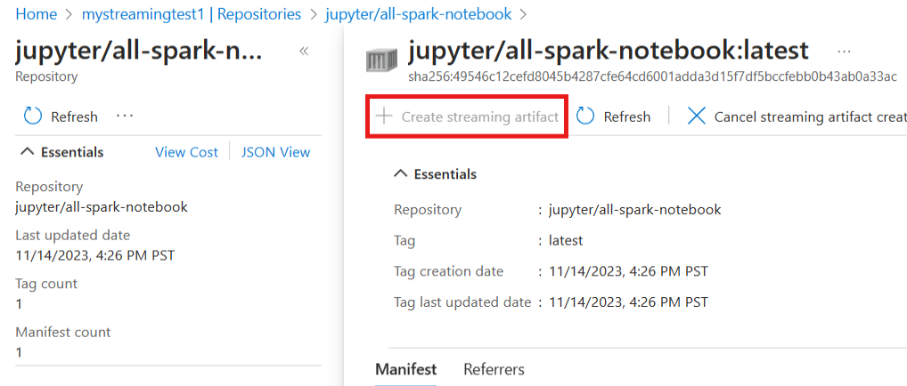
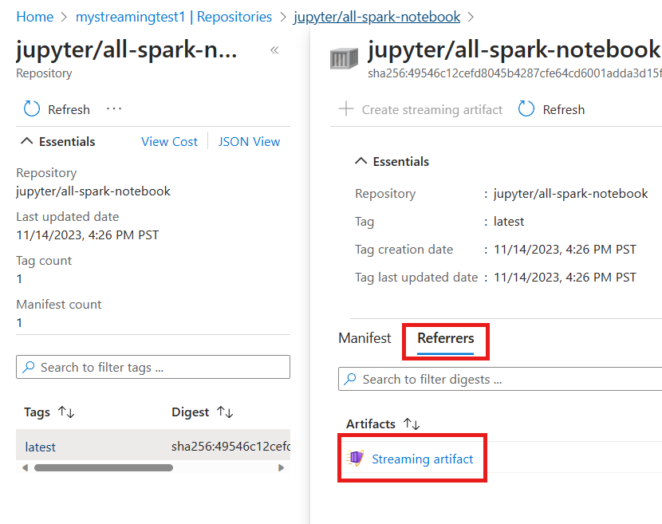
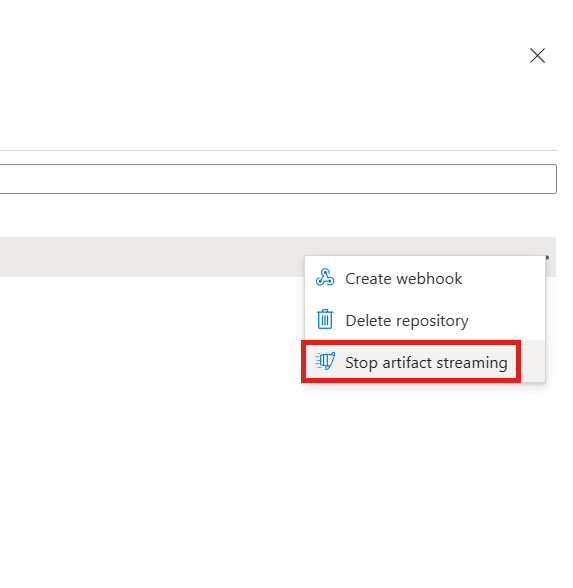
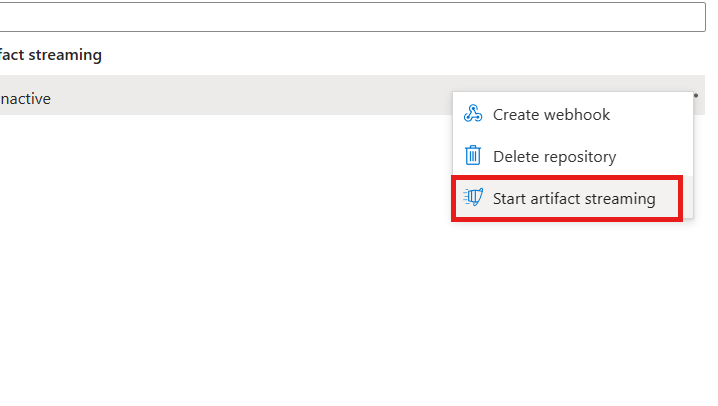

# Enable Artifact Streaming - Azure portal

Start artifact streaming with a series of Azure portal steps for pushing, importing, and generating streaming artifacts for container images in an Azure Container Registry (ACR). These steps outline the process for creating a *premium* [SKU](container-registry-skus.md) ACR, importing an image, generating a streaming artifact, and managing the artifact streaming operation. Make sure to replace the placeholders with your actual values where necessary.

This article is part three in a four-part tutorial series. In this tutorial, you learn how to:

> [!div class="checklist"]
> * Push/Import the image and generate the streaming artifact  - Azure portal.

## Prerequisites

* Sign in to the [Azure portal](https://ms.portal.azure.com/). 

## Push/Import the image and generate the streaming artifact - Azure portal

Complete the following steps to create artifact streaming in the [Azure portal](https://portal.azure.com). 

1. Navigate to your Azure Container Registry. 

1. In the side **Menu**, under the **Services**, select **Repositories**.

1. Select the latest imported image.

1. Convert the image and create artifact streaming in Azure portal.

   

1. Check the streaming artifact generated from the image in Referrers tab.     
    
   

1. You can also delete the Artifact streaming from the repository blade. 

   

1. You can also enable auto-conversion on the repository blade. Active means auto-conversion is enabled on the repository. Inactive means auto-conversion is disabled on the repository. 

   

## Next steps

> [!div class="nextstepaction"]
> [Troubleshoot Artifact Streaming](tutorial-artifact-streaming-troubleshoot.md)
