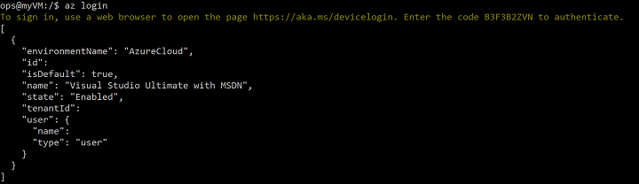
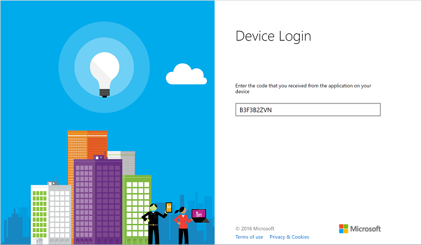
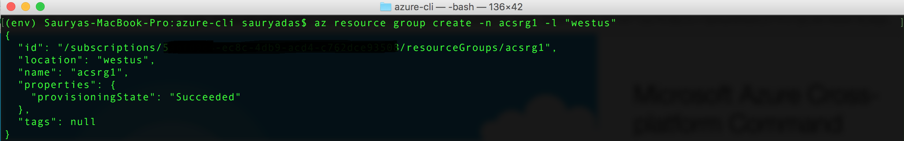
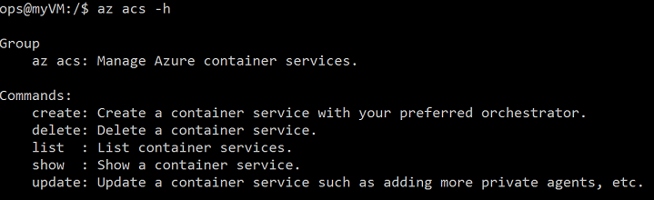
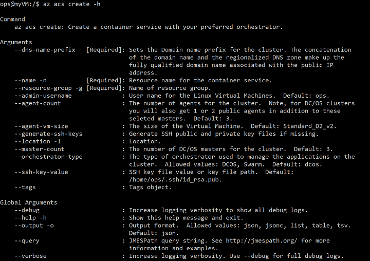
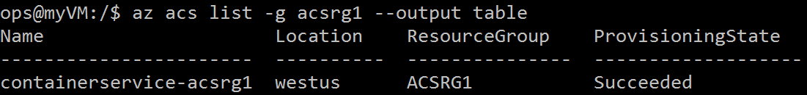
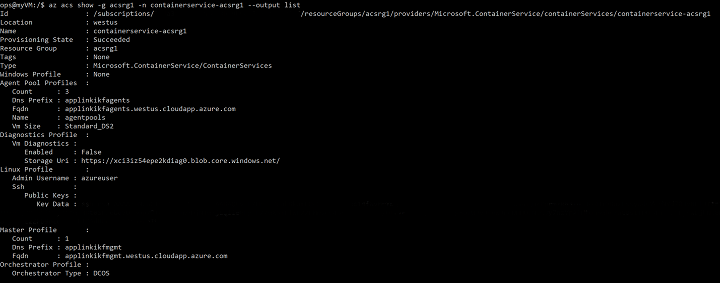
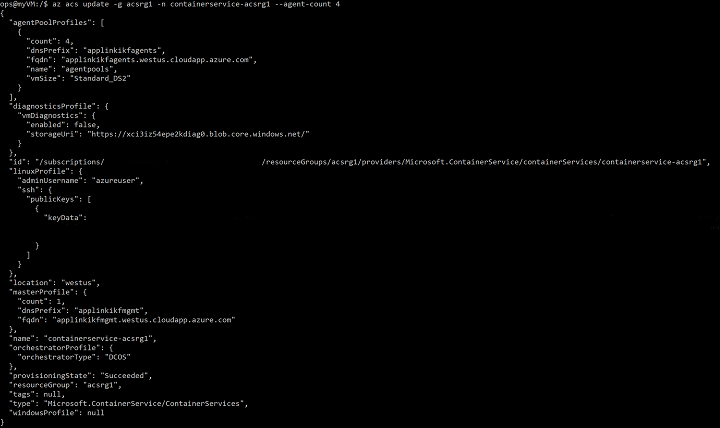

<properties
   pageTitle="Deploy an Azure Container Service cluster using Azure CLI 2.0 Preview | Microsoft Azure"
   description="Deploy an Azure Container Service cluster using Azure CLI 2.0 Preview"
   services="container-service"
   documentationCenter=""
   authors="sauryadas"
   manager="timlt"
   editor=""
   tags="acs, azure-container-service"
   keywords=""/>

<tags
   ms.service="container-service"
   ms.devlang="na"
   ms.topic="article"
   ms.tgt_pltfrm="na"
   ms.workload="na"
   ms.date="11/02/2016"
   ms.author="saudas"/>

# Using the Azure CLI 2.0 Preview to create an ACS cluster

You can install the Azure CLI 2.0 Preview using the instructions provided [here](https://github.com/Azure/azure-cli).

## Login to your account
```
az login 
```
You will need to go this [link](https://login.microsoftonline.com/common/oauth2/deviceauth) to authenticate with the device code provided in the CLI.




## Create a resource group
```
az resource group create -n acsrg1 -l "westus"
```



## List of available ACS commands
```
az acs -h
```



## Create an Azure Container Service Cluster

*ACS create usage in the CLI*
```
az acs create -h
```
The name of the container service, the resource group created in the previous step and a unique DNS name are mandatory. 
Other inputs are set to default values (please see help below) unless overwritten using their respective switches.


*Quick ACS create using defaults. If you do not have an SSH key use the second command. This second create command with the --generate-ssh-keys switch will create one for you*
```
az acs create -n acs-cluster -g acsrg1 --dns-name-prefix applink
```
```
az acs create -n acs-cluster -g acsrg1 -dns-name-prefix applink --generate-ssh-keys
```
After you type the above command, wait for about 10 minutes for the cluster to be created.


## List ACS clusters in a resource group
```
az acs list -g acsrg1 --output table
```



## Display details of a container service cluster
```
az acs show -g acsrg1 -n containerservice-acsrg1 --output list
```



## Scale the ACS cluster
*Both scaling in and scaling out are allowed. The paramater new-agent-count is the new number of agents in the ACS cluster.*
```
az acs update -g acsrg1 -n containerservice-acsrg1 --agent-count 4

```


## Delete a container service cluster
```
az acs delete -g acsrg1 -n acs-cluster 
```
*Note that this delete command does not delete all resources (network and storage) created while creating the container service. To delete all resources, it is recommended that a single ACS cluster be created per resource group and then the resource group itself be deleted when the acs cluster is no longer required to ensure that all related resources are deleted and you are not charged for them*