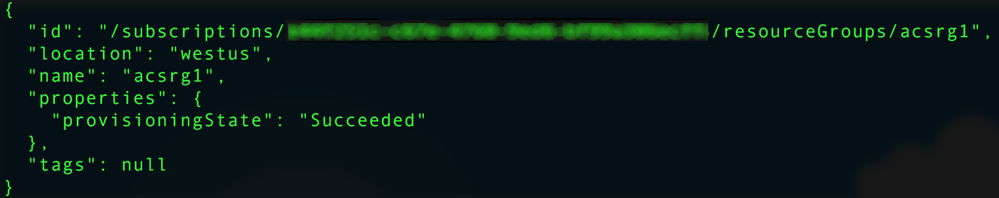
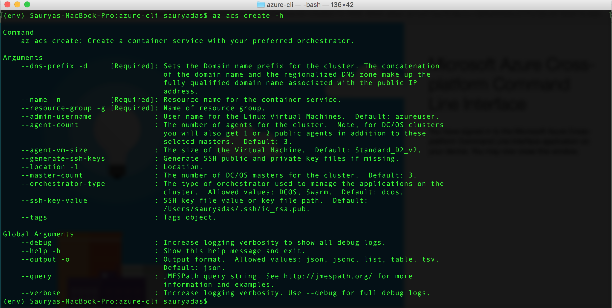
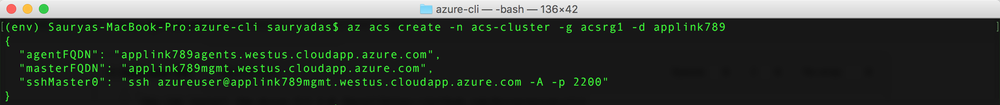
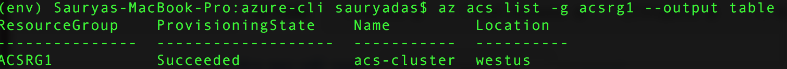
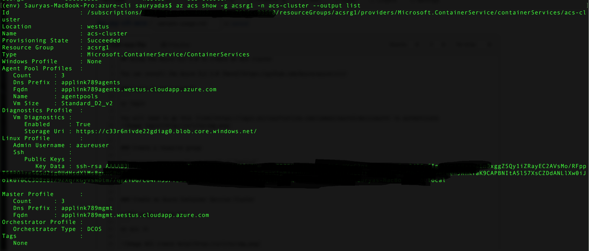
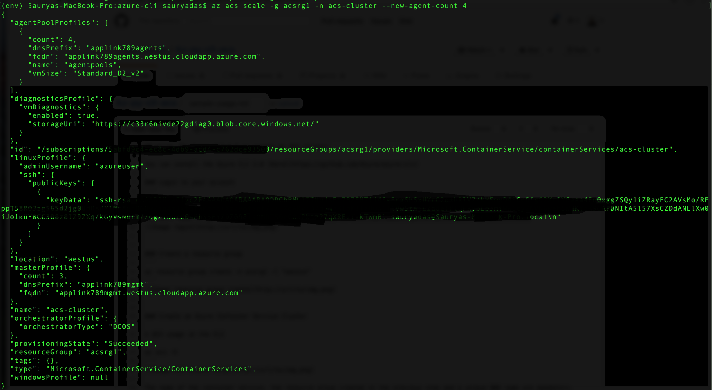

# Deploy a Docker container hosting solution using the Azure CLI 2.0

Use the `az acs` commands in the Azure CLI 2.0 to create and manage clusters in Azure Container Service. You can also deploy an Azure Container Service cluster by using the [Azure portal](container-service-deployment.md) or the Azure Container Service APIs.

For help on `az acs` commands, pass the `-h` parameter to any command. For example: `az acs create -h`.


## Prerequisites
To create an Azure Container Service cluster using the Azure CLI 2.0, you must:
* have an Azure account ([get a free trial](https://azure.microsoft.com/pricing/free-trial/))
* have installed and set up the [Azure CLI 2.0](/cli/azure/install-az-cli2)

## Get started 
### Log in to your account
```azurecli
az login 
```

Follow the prompts to log in interactively. For other methods to log in, see [Get started with Azure CLI 2.0](/cli/azure/get-started-with-az-cli2).

### Set your Azure subscription

If you have more than one Azure subscription, set the default subscription. For example:

```
az account set --subscription "f66xxxxx-xxxx-xxxx-xxx-zgxxxx33cha5"
```


### Create a resource group
We recommend that you create a resource group for every cluster. Specify an Azure region in which Azure Container Service is [available](https://azure.microsoft.com/en-us/regions/services/). For example:

```azurecli
az group create -n acsrg1 -l "westus"
```
Output is similar to the following:




## Create an Azure Container Service cluster

To create a cluster, use `az acs create`.
A name for the cluster and the name of the resource group created in the previous step are mandatory parameters. 

Other inputs are set to default values (see the following screen) unless overwritten using their respective switches. For example, the orchestrator is set by default to DC/OS. And if you don't specify one, a DNS name prefix is created based on the cluster name.




### Quick `acs create` using defaults
If you have an SSH RSA public key file `id_rsa.pub` in the default location (or created one for [OS X and Linux](../virtual-machines/linux/mac-create-ssh-keys.md) or [Windows](../virtual-machines/linux/ssh-from-windows.md)), use a command like the following:

```azurecli
az acs create -n acs-cluster -g acsrg1 -d applink789
```
If you don't have an SSH public key, use this second command. This command with the `--generate-ssh-keys` switch creates one for you.

```azurecli
az acs create -n acs-cluster -g acsrg1 -d applink789 --generate-ssh-keys
```

After you enter the command, wait for about 10 minutes for the cluster to be created. The command output includes fully qualified domain names (FQDNs) of the master and agent nodes and an SSH command to connect to the first master. Here is abbreviated output:



> [!TIP]
> The [Kubernetes walkthrough](container-service-kubernetes-walkthrough.md) shows how to use `az acs create` with default values to create a Kubernetes cluster.
>

## Manage ACS clusters

Use additional `az acs` commands to manage your cluster. Here are some examples.

### List clusters under a subscription

```azurecli
az acs list --output table
```

### List clusters in a resource group

```azurecli
az acs list -g acsrg1 --output table
```




### Display details of a container service cluster

```azurecli
az acs show -g acsrg1 -n acs-cluster --output list
```




### Scale the cluster
Both scaling in and scaling out of agent nodes are allowed. The parameter `new-agent-count` is the new number of agents in the ACS cluster.

```azurecli
az acs scale -g acsrg1 -n acs-cluster --new-agent-count 4
```



## Delete a container service cluster
```azurecli
az acs delete -g acsrg1 -n acs-cluster 
```
This command does not delete all resources (network and storage) created while creating the container service. To delete all resources easily, it is recommended you deploy each cluster in a distinct resource group. Then, delete the resource group when the cluster is no longer required.

## Next steps
Now that you have a functioning cluster, see these documents for connection and management details:

* [Connect to an Azure Container Service cluster](container-service-connect.md)
* [Work with Azure Container Service and DC/OS](container-service-mesos-marathon-rest.md)
* [Work with Azure Container Service and Docker Swarm](container-service-docker-swarm.md)
* [Work with Azure Container Service and Kubernetes](container-service-kubernetes-walkthrough.md)