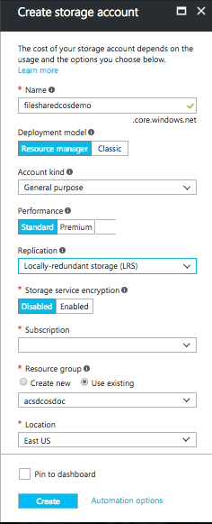
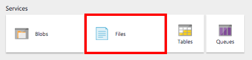
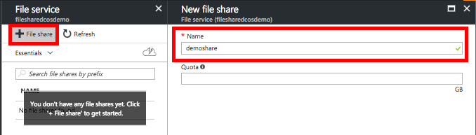

# Create and mount a file share to a DC/OS cluster
In this article, we'll explore how to create a file share on Azure and mount it on each node and master of the DCOS cluster. Thanks to that, it will be easier to share files accross your cluster such as configuration, access, logs, and more.

Before working through this example, you need a DC/OS cluster that is configured in Azure Container Service. [See Deploy an Azure Container Service cluster](https://docs.microsoft.com/en-us/azure/container-service/container-service-deployment)

## Create a file share on Microsoft Azure
### Using the portal :

1. Log in to the portal.
2. Create a storage account :
   
    

3. When it's created, find and click on **Files** in the **Services** section :
   
    

4. Click on **+ File share** and enter a name for this new share (Quota is not mandatory) :
   
      

### Using Azure-cli :

[Click here, In case you do want to install and set up the Azure CLI](https://github.com/cli/azure/install-azure-cli.md)

```
################# Change those four parameters ##############
DCOS_PERS_STORAGE_ACCOUNT_NAME=anystorageaccountname
DCOS_PERS_RESOURCE_GROUP=AnyResourceGroupName
DCOS_PERS_LOCATION=eastus
DCOS_PERS_SHARE_NAME=demoshare
#############################################################

# Create the storage account with the parameters
az storage account create -n $DCOS_PERS_STORAGE_ACCOUNT_NAME -g $DCOS_PERS_RESOURCE_GROUP -l $DCOS_PERS_LOCATION --sku Standard_LRS

# Export the connection string as an environment variable
export AZURE_STORAGE_CONNECTION_STRING=`az storage account show-connection-string -n $DCOS_PERS_STORAGE_ACCOUNT_NAME -g $DCOS_PERS_RESOURCE_GROUP -o tsv`

# Create the share
az storage share create -n $DCOS_PERS_SHARE_NAME
```

## Mount the share in your cluster

Next, we need to mount this share on every virtual machine inside your cluster using the cifs tool/protocol. 
We will do that with the following command line : ```mount -t cifs```

Here, one example for a  :
* Storage account name **'anystorageaccountname'**
* With the following account key **'P/GuWEUuoRtIVsV+faSfLhuNyZDrTzPmZDm3RyCL4XS6ghyiHYriN12gl+w5JMN2gXGtOhCzxFf2JuGqQADF1w=='** mounted on the following mount point **'/mnt/share/demoshare'**

```bash
sudo mount -t cifs //anystorageaccountname.file.core.windows.net/demoshare /mnt/share/demoshare -o vers=3.0,username=anystorageaccountname,password=P/GuWEUuoRtIVsV+faSfLhuNyZDrTzPmZDm3RyCL4XS6ghyiHYriN12gl+w5JMN2gXGtOhCzxFf2JuGqQADF1w==,dir_mode=0777,file_mode=0777
```

We will run this command on each virtual machine of our cluster (Master and Nodes). In case you have a huge number of agents, it would be good to automate this process by creating scripts

1. First, [connect to your DC/OS-based ACS cluster](https://docs.microsoft.com/en-us/azure/container-service/container-service-connect)

2. Copy your private key to the working directory (~) on master

3. Change the permissions on it with the command : ```chmod 600 yourPrivateKeyFile```

4. Import your private key using ```ssh-add yourPrivateKeyFile``` command. You may have to do ```eval ssh-agent -s``` if it doesn't work at the first time.

5. From the master, create two files, using your favorite editor such as vi, nano or vim : 
    * One with the script to execute on each vms, called : **cifsMount.sh**  
    * Another one to initiate all the ssh connections that will call the first script, called : **mountShares.sh**

    Contain of **cifsMount.sh** :
    ```bash
    # Install the cifs utils, should be already installed
    sudo apt-get update && sudo apt-get -y install cifs-utils
    # Create the local folder that will contain our share
    if [ ! -d "/mnt/share/demoshare" ]; then sudo mkdir -p "/mnt/share/demoshare" ; fi
    # Mount the share under the previous local folder created
    sudo mount -t cifs //anystorageaccountname.file.core.windows.net/demoshare /mnt/share/demoshare -o vers=3.0,username=anystorageaccountname,password=P/GuWEUuoRtIVsV+faSfLhuNyZDrTzPmZDm3RyCL4XS6ghyiHYriN12gl+w5JMN2gXGtOhCzxFf2JuGqQADF1w==,dir_mode=0777,file_mode=0777
    ```

    Contain of **mountShares.sh** :
    ```bash
    # Install jq used for the next command
    sudo apt-get install jq

    # Create the local folder that will contain our share
    if [ ! -d "/mnt/share/demoshare" ]; then sudo mkdir -p "/mnt/share/demoshare" ; fi

    # Mount the share on the current vm (master)
    sudo mount -t cifs //anystorageaccountname.file.core.windows.net/demoshare /mnt/share/demoshare -o vers=3.0,username=anystorageaccountname,password=P/GuWEUuoRtIVsV+faSfLhuNyZDrTzPmZDm3RyCL4XS6ghyiHYriN12gl+w5JMN2gXGtOhCzxFf2JuGqQADF1w==,dir_mode=0777,file_mode=0777

    # Get the ip of each node using the mesos API and store it inside a file called nodes
    curl http://leader.mesos:1050/system/health/v1/nodes | jq '.nodes[].host_ip' | sed 's/\"//g' | sed '/172/d' > nodes

    # From the previous file created, run our script to mount our share on each node
    cat nodes | while read line
    do
    ssh `whoami`@$line -o StrictHostKeyChecking=no -i yourPrivateKeyFile < ./cifsMount.sh
    done
    ```

    > [!IMPORTANT]
    > You have to change the **'mount'** command with your own settings such as the name of the storage account and the password.

6. From the folder where you created the previous scripts you should now have 3 files :

    * **cifsMount.sh**
    * **mountShares.sh**
    * **yourPrivateKeyFile**

7. Execute the **mountShares.sh** file with the following command : ```sh mountShares.sh```

You should see the result printing in the terminal. You can for sure optimize the code, that one is really straighforward and its purpose is to provide guidance.

It should be noted that this method is not recommanded for high IOPS, but it is very useful to share documents and information accross the cluster.