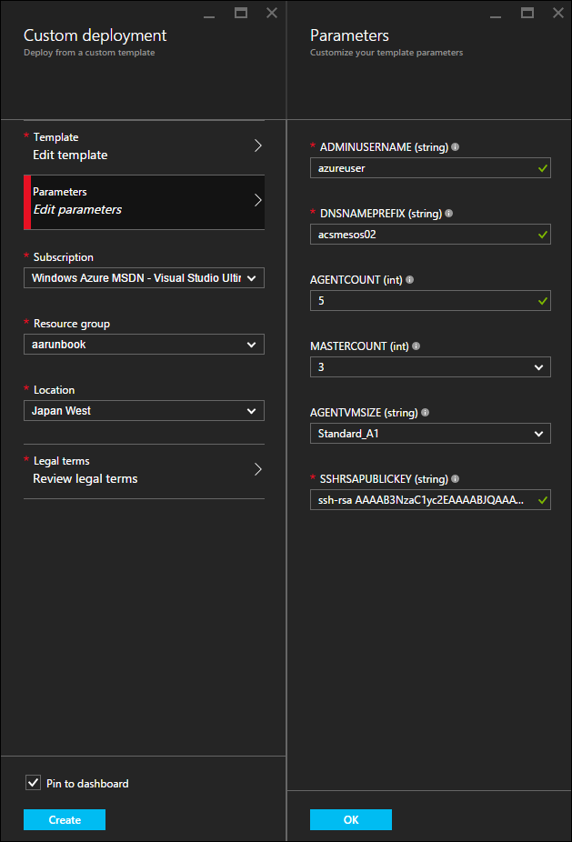
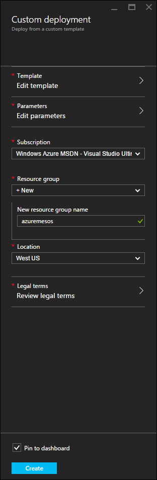
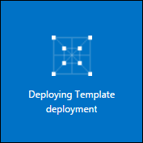
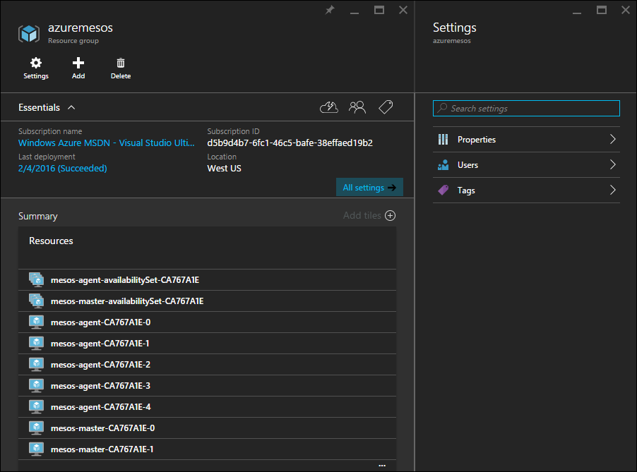

<properties
   pageTitle="Deploy an Azure Container Service cluster | Microsoft Azure"
   description="Deploy an Azure Container Service cluster using the Azure Portal, Azure CLI, or PowerShell."
   services="container-service"
   documentationCenter=""
   authors="rgardler"
   manager="timlt"
   editor=""
   tags="acs, azure-container-service"
   keywords="Docker, Containers, Micro-services, Mesos, Azure"/>
   
<tags
   ms.service="container-service"
   ms.devlang="na"
   ms.topic="get-started-article"
   ms.tgt_pltfrm="na"
   ms.workload="na"
   ms.date="02/16/2016"
   ms.author="rogardle"/>
   
# Deploy an Azure Container Service cluster

The Azure Container Service provides rapid deployment of popular open source container clustering and orchestration solutions. Using Azure Container Service, Marathon Mesos and Docker Swarm clusters can be deployed with Azure Resource Manager templates or the portal. These clusters are deployed using Azure Virtual Machine Scale Sets, and take advantage of Azure networking and storage offerings. To access Azure Container Service, you will need an Azure subscription. If you don't have one then sign up for a [free trial](http://azure.microsoft.com/pricing/free-trial/?WT.mc_id=AA4C1C935).

This documents steps through deploying and Azure Container Service cluster using the [Azure Portal](#creating-a-service-using-the-azure-portal), [Azure CLI](#creating-a-service-using-the-azure-cli), and [Azure PowerShell module](#creating-a-service-using-powershell).  
   
## Creating a service using the Azure Portal
 
Select one of the following templates to deploy a Mesos or Docker Swarm cluster. **Note** - Both of these templates are the same, with the exception of the default orchestrator selection.
 
* Mesos: [https://github.com/Azure/azure-quickstart-templates/tree/master/101-acs-mesos](https://github.com/Azure/azure-quickstart-templates/tree/master/101-acs-mesos)
* Swarm: [https://github.com/Azure/azure-quickstart-templates/tree/master/101-acs-swarm](https://github.com/Azure/azure-quickstart-templates/tree/master/101-acs-swarm)
 
Each template page has a 'deploy to Azure' button, clicking this button will launch the Azure portal with a form that looks something like this. <br /> 

  <br /> 

Complete the form using this guidance, and select OK when done. <br /> 

Field           | Description
----------------|-----------
DNSNAMEPREFIX   | This must be a world unique value. It will be used to create DNS names for each of the key parts of the service. More information below.
AGENTCOUNT      | This is the number of virtual machines that will be created in the ACS agent scale set.
AGENTVMSIZE     | Specifies the size of your agent virtual machines. Be careful to select a size that provides enough resources to host your largest containers.
ADMINUSERNAME   | This is the username that will be used for an account on each of the virtual vachines and virtual machine scale sets in the ACS cluster.
ORCHESTRATORTYPE| Select the orchestrator you would like to use in your ACS cluster.
MASTERCOUNT     | This is the number of Virtual Machines to configure as masters for your cluster. You can select 1, but this will not provide any resilience in your cluster and is only recommended for testing. The recommended number for a production cluster would be 3 or 5. 
SSHRSAPUBLICKEY	| It is required that you use SSH for authentication against the Virtual Machines. This is where you add your public key. It is very important that you are careful when pasting your key value into this box. Some editors will insert line-breaks into the content, this will break the key. Verify that your key has no line breaks and that it includes the 'ssh-rsa' prefix and the 'username@domain' postfix. It should loke something like 'ssh-rsa AAAAB3Nz...SNIPPEDCONTENT...UcyupgH azureuser@linuxvm'. If you need to create an SSH key you can find guidance for [windows](../virtual-machines/virtual-machines-linux-ssh-from-windows.md) and [Linux](../virtual-machines/virtual-machines-linux-ssh-from-linux.md) on the Azure documentation site.
  
Once you have set appropriate values for your parameters, click
OK. Next, provide a resource group name, select a region, and review
and agree to the legal terms.

> During preview, there is no charge for the Azure Container Service, only standard compute charges such as virtual machine, storage, networking etc. 
 
 
 
Finally, click "Create". You will return to your dashboard, and assuming you did not uncheck "Pin to dashboard" on the deployment blade, you will see an animated tile that looks something like this:

 
 
Now sit back and relax while the cluster is created. Once complete, you will see some blades that show the resources that make up the ACS cluster. 
 
 

## Create a service using the Azure CLI

To create an instance of the Azure Container Service using the command line, you will need an Azure subscription. If you don't have one then you can sign up for a free trial. You will also need to have installed and configured the Azure CLI.
 
Select one of the following templates to deploy a Mesos or Docker Swarm cluster. **Note** - Both of these templates are the same, with the exception of the default orchestrator selection.
 
* Mesos: [https://github.com/Azure/azure-quickstart-templates/tree/master/101-acs-mesos](https://github.com/Azure/azure-quickstart-templates/tree/master/101-acs-mesos)
* Swarm: [https://github.com/Azure/azure-quickstart-templates/tree/master/101-acs-swarm](https://github.com/Azure/azure-quickstart-templates/tree/master/101-acs-swarm)
 
Next, make sure that the Azure CLI has been connected to an Azure subscription. This can be done using the following command.

```bash
Azure account show
```
If an Azure account is not returned, use the following to log the CLI into Azure.
 
```bash
azure login -u user@domain.com
```

Next, make sure to configure the Azure CLI tools to use Azure Resource Manager.
 
```bash
azure config mode arm
```
 
If you want to create your cluster in a new Resource Group, you must first create the Resource Group. Use this command, where `GROUP_NAME` is the name of the resource group you want to create, and `REGION` is the region where you want to create the Resource Group.
 
```bash
azure group create GROUP_NAME REGION
```
 
Once you have a Resource Group you can create your cluster with this command, where:

- **RESOURCE_GROUP** is the name of the Resource Group you want to use for this service.
- **DEPLOYMENT_NAME** is the name of this deployment.
- **TEMPLATE_URI** is the location of the deployment file. **Note** - this must be the RAW file, not a pointer to the GitHub UI. To find this URL select the azuredeploy.json file in GitHub and click the RAW button:

> Note - when running this command, the shell will prompt you for deployment parameter values.
 
```bash
azure group deployment create RESOURCE_GROUP DEPLOYMENT_NAME --template-uri TEMPLATE_URI
```
 
### Provide template parameters
 
This version of the command requires the user to define parameters interactively. If you want to provide parameters as a json formatted string you can do so with the `-p` switch. For example:
 
 ```bash
azure group deployment create RESOURCE_GROUP DEPLOYMENT_NAME --template-uri TEMPLATE_URI -p '{ "param1": "value1" … }'
 ```

Alternatively you can provide a json formatted parameters file using the `-e` switch:

 ```bash
azure group deployment create RESOURCE_GROUP DEPLOYMENT_NAME --template-uri TEMPLATE_URI -e PATH/FILE.JSON'
 ```
 
An example parameters file named `azuredeploy.parameters.json` can be found with the ACS templates in GitHub.
 
## Create a service using PowerShell

An ACS cluster can also be deployed with PowerShell. This document is based on the version 1.0 and greater Azure [PowerShell module](https://azure.microsoft.com/blog/azps-1-0/). 

Select one of the following templates to deploy a Mesos or Docker Swarm cluster. **Note** - Both of these templates are the same, with the exception of the default orchestrator selection.
 
* Mesos: [https://github.com/Azure/azure-quickstart-templates/tree/master/101-acs-mesos](https://github.com/Azure/azure-quickstart-templates/tree/master/101-acs-mesos)
* Swarm: [https://github.com/Azure/azure-quickstart-templates/tree/master/101-acs-swarm](https://github.com/Azure/azure-quickstart-templates/tree/master/101-acs-swarm)

Before creating a cluster in your Azure subscription, verify that your PowerShell session has been logged into Azure. This can be completed with the `Get-AzureRMSubscription` command.

```powershell
Get-AzureRmSubscription
```

If you need to log into Azure, use the `Login-AzureRMAccount` command.

```powershell
Login-AzureRmAccount
```
 
If deploying to a new Resource Group, you must first create the Resource Group. To create a new Resource Group, use the `New-AzureRmResourceGroup` command, specifying a resource group name and destination region.

```powershell
New-AzureRmResourceGroup -Name GROUP_NAME -Location REGION
```

Once you have a Resource Group, you can create your cluster with the following command. The URI of the desired template will be specified for the `-TemplateUri` parameter. When running this command, PowerShell will prompt you for deployment parameter values.

```powershell
New-AzureRmResourceGroupDeployment -Name DEPLOYMENT_NAME -ResourceGroupName RESOURCE_GROUP_NAME -TemplateUri TEMPLATE_URI
 ```
 
### Provide template parameters
 
If you are familiar with PowerShell, you know that you can cycle through the available parameters for a cmdlet by typing a minus sign (-) and then pressing the TAB key. This same functionality also works with parameters that you define in your template. As soon as you type the template name, the cmdlet fetches the template, parses the parameters, and adds the template parameters to the command dynamically. This makes it very easy to specify the template parameter values. And, if you forget a required parameter value, PowerShell prompts you for the value.
 
Below is the full command with parameters included. You can provide your own values for the names of the resources.

```
New-AzureRmResourceGroupDeployment -ResourceGroupName RESOURCE_GROUP_NAME-TemplateURI TEMPLATE_URI -adminuser value1 -adminpassword value2 ....
```
 
## Next steps
 
Now that you have a functioning cluster, visit these documents for connection and management details.
 
- [Connect with the ACS cluster](./container-service-connect.md)
- [Working with ACS and Mesos](./container-service-mesos-marathon-rest.md)

 