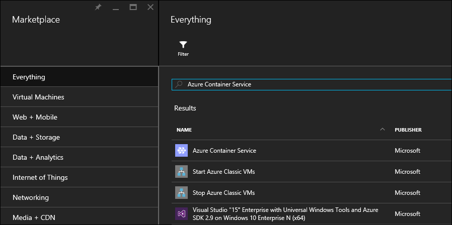
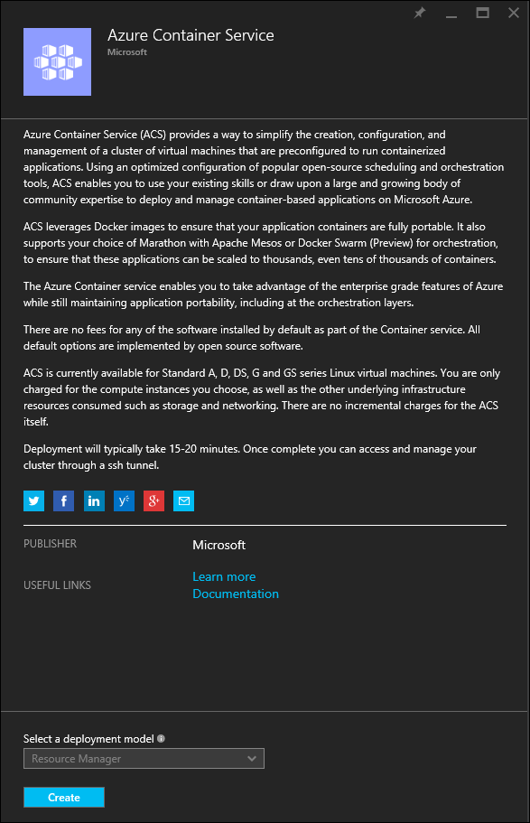
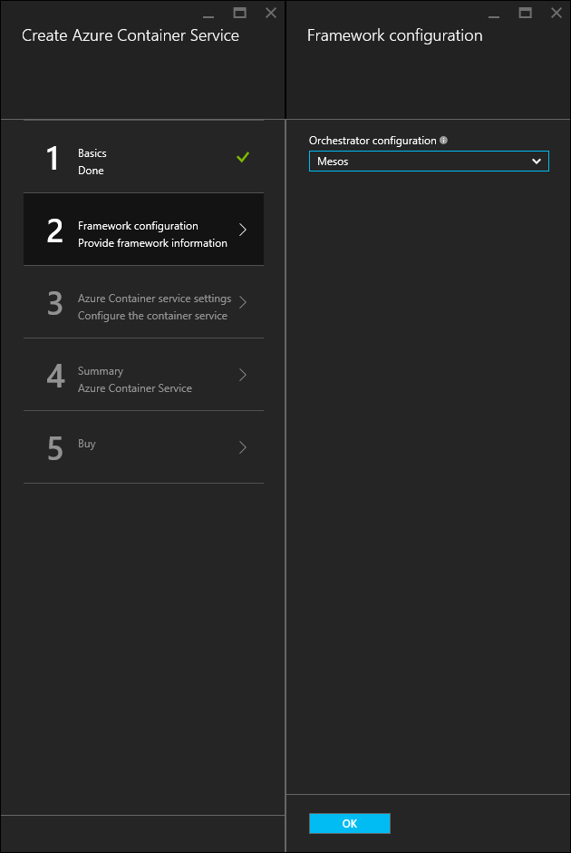
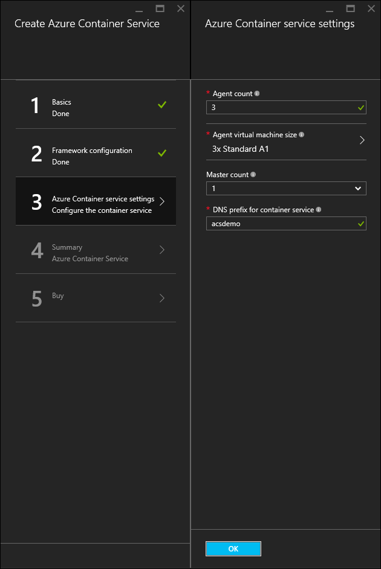
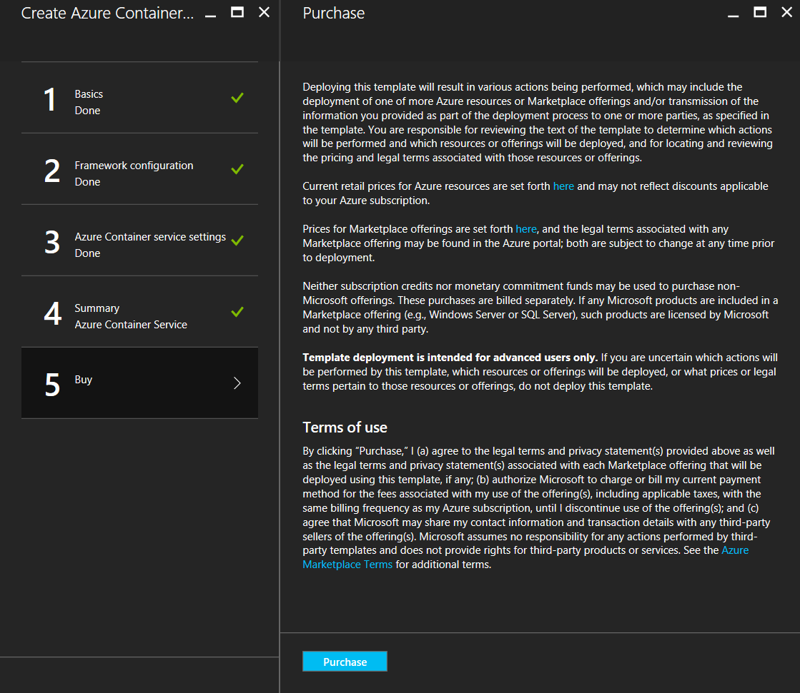

<properties
   pageTitle="Deploy an Azure Container Service cluster | Microsoft Azure"
   description="Deploy an Azure Container Service cluster by using the Azure portal, the Azure CLI, or PowerShell."
   services="container-service"
   documentationCenter=""
   authors="rgardler"
   manager="timlt"
   editor=""
   tags="acs, azure-container-service"
   keywords="Docker, Containers, Micro-services, Mesos, Azure"/>

<tags
   ms.service="container-service"
   ms.devlang="na"
   ms.topic="get-started-article"
   ms.tgt_pltfrm="na"
   ms.workload="na"
   ms.date="02/16/2016"
   ms.author="rogardle"/>

# Deploy an Azure Container Service cluster

Azure Container Service provides rapid deployment of popular open-source container clustering and orchestration solutions. By using Azure Container Service, you can deploy DC/OS and Docker Swarm clusters with Azure Resource Manager templates or the Azure portal. You deploy these clusters by using Azure Virtual Machine Scale Sets--and the clusters take advantage of Azure networking and storage offerings. To access Azure Container Service, you need an Azure subscription. If you don't have one, then you can sign up for a [free trial](http://azure.microsoft.com/pricing/free-trial/?WT.mc_id=AA4C1C935).

This document walks you through deploying an Azure Container Service cluster by using the [Azure portal](#creating-a-service-using-the-azure-portal), the [Azure command-line interface (CLI)](#creating-a-service-using-the-azure-cli), and the [Azure PowerShell module](#creating-a-service-using-powershell).  

## Create a service by using the Azure portal

Log into the Azure portal, select new, and search the Azure market place for **Azure Container Service**.

  <br /> 

Select **Azure Container Service** and click **Create**.

  <br /> 

Enter the following information:

- User Name – This is the user name that will be used for an account on each of the virtual machines and virtual machine scale sets in the Azure Container Service cluster.
- Subscription – select an Azure subscription.
- Resource Group – select an existing Resource Group, or create a new one.
- Location – select an Azure region for the Azure Container Service deployment.
- SSH public key – Add the public key that will be used for authentication against Azure Container Service Virtual Machines. It is very important that this key contains no line breaks, and that it includes the 'ssh-rsa' prefix and the 'username@domain' postfix. It should look something like the following, "**ssh-rsa AAAAB3Nz...SNIPPEDCONTENT...UcyupgH azureuser@linuxvm**" For guidance on creating SSH keys, see the [Linux]( https://azure.microsoft.com/documentation/articles/virtual-machines-linux-ssh-from-linux/) and [Windows]( https://azure.microsoft.com/documentation/articles/virtual-machines-linux-ssh-from-windows/) articles.

Click **OK** when ready to proceed.

  <br /> 

Select an Orchestration type. The options are:

- DC/OS – deploys a DC/OS cluster.
- Swarm – deploys a Docker Swarm cluster.

Click **OK** when ready to proceed.

  <br /> 

Enter the following information:

- Master count – the number of masters in the cluster.
- Agent count – For Docker Swarm this will be the initial number of agents in the agent scale set. For DC/OS, this will be the initial number of agents in a private scale set. Additionally, a public scale set is created, containing a pre-determined number of agents. The number of agents in this public scale set is determent on how many masters have been created in the cluster, 1 public agent for 1 master, and 2 public agents for 3 or 5 masters.
- Agent virtual machine size – the size of the agent virtual machines.
- DNS prefix – A world unique name that will be used to prefix key parts of the fully qualified domain names for the service. 

Click **OK** when ready to proceed.

  <br /> 

Click **OK** once service validation has completed.

  <br /> 

Click **Create** to start the deployment process.

  <br /> 

If you have elected to pin the deployment to the Azure portal, deployment status can be seen.

  <br /> 

When the deployment has completed, the Azure Container Service cluster is ready for use.

## Create a service by using the Azure CLI

To create an instance of Azure Container Service by using the command line, you need an Azure subscription. If you don't have one, then you can sign up for a [free trial](http://azure.microsoft.com/pricing/free-trial/?WT.mc_id=AA4C1C935). You also need to have installed and configured the Azure CLI.

To deploy a DC/OS or Docker Swarm cluster, select one of the following templates from GitHub. Note that both of these templates are the same, with the exception of the default orchestrator selection.

* [DC/OS template](https://github.com/Azure/azure-quickstart-templates/tree/master/101-acs-mesos)
* [Swarm template](https://github.com/Azure/azure-quickstart-templates/tree/master/101-acs-swarm)

Next, make sure that the Azure CLI has been connected to an Azure subscription. You can do this by using the following command:

```bash
azure account show
```
If an Azure account is not returned, use the following command to sign the CLI in to Azure.

```bash
azure login -u user@domain.com
```

Next, configure the Azure CLI tools to use Azure Resource Manager.

```bash
azure config mode arm
```

Create an Azure Resource Group and Container Service cluster with the following command, where:

- **RESOURCE_GROUP** is the name of the Resource Group you want to use for this service.
- **LOCATION** is the Azure region where the Resource Group and Azure Container Service deployment will be created.
- **TEMPLATE_URI** is the location of the deployment file. **Note** - this must be the RAW file, not a pointer to the GitHub UI. To find this URL select the azuredeploy.json file in GitHub and click the RAW button:

> Note - when running this command, the shell will prompt you for deployment parameter values.
 
```bash
# sample deployment

azure group create -n RESOURCE_GROUP DEPLOYMENT_NAME -l LOCATION --template-uri TEMPLATE_URI
```

### Provide template parameters

This version of the command requires you to define parameters interactively. If you want to provide parameters, such as a JSON-formatted string, you can do so by using the `-p` switch. For example:

 ```bash
 # sample deployment

azure group deployment create RESOURCE_GROUP DEPLOYMENT_NAME --template-uri TEMPLATE_URI -p '{ "param1": "value1" … }'
 ```

Alternatively, you can provide a JSON-formatted parameters file by using the `-e` switch:

 ```bash
 # sample deployment

azure group deployment create RESOURCE_GROUP DEPLOYMENT_NAME --template-uri TEMPLATE_URI -e PATH/FILE.JSON
 ```

To see an example parameters file named `azuredeploy.parameters.json`, look for it with the Azure Container Service templates in GitHub.

## Create a service by using PowerShell

You can also deploy an Azure Container Service cluster with PowerShell. This document is based on the version 1.0 [Azure PowerShell module](https://azure.microsoft.com/blog/azps-1-0/).

To deploy a DC/OS or Docker Swarm cluster, select one of the following templates. Note that both of these templates are the same, with the exception of the default orchestrator selection.

* [DC/OS template](https://github.com/Azure/azure-quickstart-templates/tree/master/101-acs-mesos)
* [Swarm template](https://github.com/Azure/azure-quickstart-templates/tree/master/101-acs-swarm)

Before creating a cluster in your Azure subscription, verify that your PowerShell session has been signed in to Azure. You can do this with the `Get-AzureRMSubscription` command:

```powershell
Get-AzureRmSubscription
```

If you need to sign in to Azure, use the `Login-AzureRMAccount` command:

```powershell
Login-AzureRmAccount
```

If you are deploying to a new resource group, you must first create the resource group. To create a new resource group, use the `New-AzureRmResourceGroup` command, specifying a resource group name and destination region:

```powershell
New-AzureRmResourceGroup -Name GROUP_NAME -Location REGION
```

After you create a resource group, you can create your cluster with the following command. The URI of the desired template will be specified for the `-TemplateUri` parameter. When you run this command, PowerShell will prompt you for deployment parameter values.

```powershell
# sample deployment

New-AzureRmResourceGroupDeployment -Name DEPLOYMENT_NAME -ResourceGroupName RESOURCE_GROUP_NAME -TemplateUri TEMPLATE_URI
 ```

### Provide template parameters

If you are familiar with PowerShell, you know that you can cycle through the available parameters for a cmdlet by typing a minus sign (-) and then pressing the TAB key. This same functionality also works with parameters that you define in your template. As soon as you type the template name, the cmdlet fetches the template, parses the parameters, and adds the template parameters to the command dynamically. This makes it very easy to specify the template parameter values. And, if you forget a required parameter value, PowerShell prompts you for the value.

Below is the full command, with parameters included. You can provide your own values for the names of the resources.

```powershell
# sample deployment

New-AzureRmResourceGroupDeployment -ResourceGroupName RESOURCE_GROUP_NAME-TemplateURI TEMPLATE_URI -adminuser value1 -adminpassword value2 ....
```

## Next steps
 
Now that you have a functioning cluster, visit these documents for connection and management details.
 
[Connect with an Azure Container Service cluster](container-service-connect.md)
[Working with Azure Container Service and DC/OS](container-service-mesos-marathon-rest.md)
[Working with Azure Container Service and Docker Swarm](container-service-docker-swarm.md)
