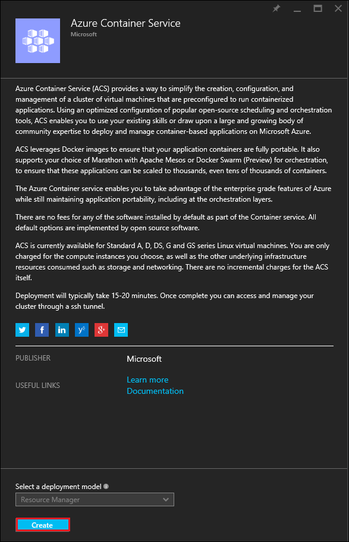
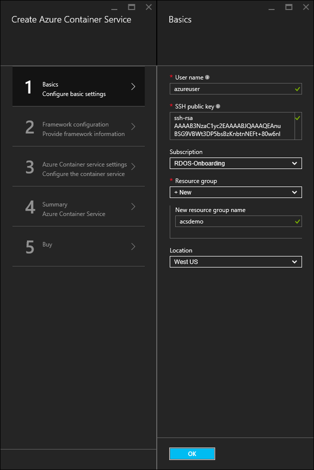
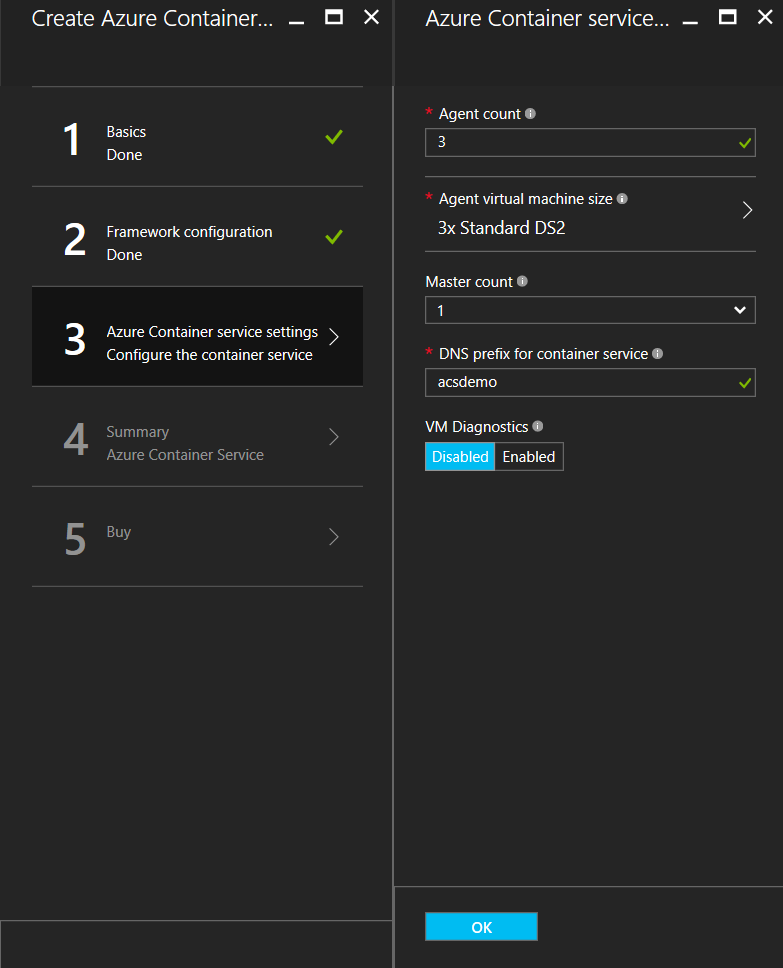
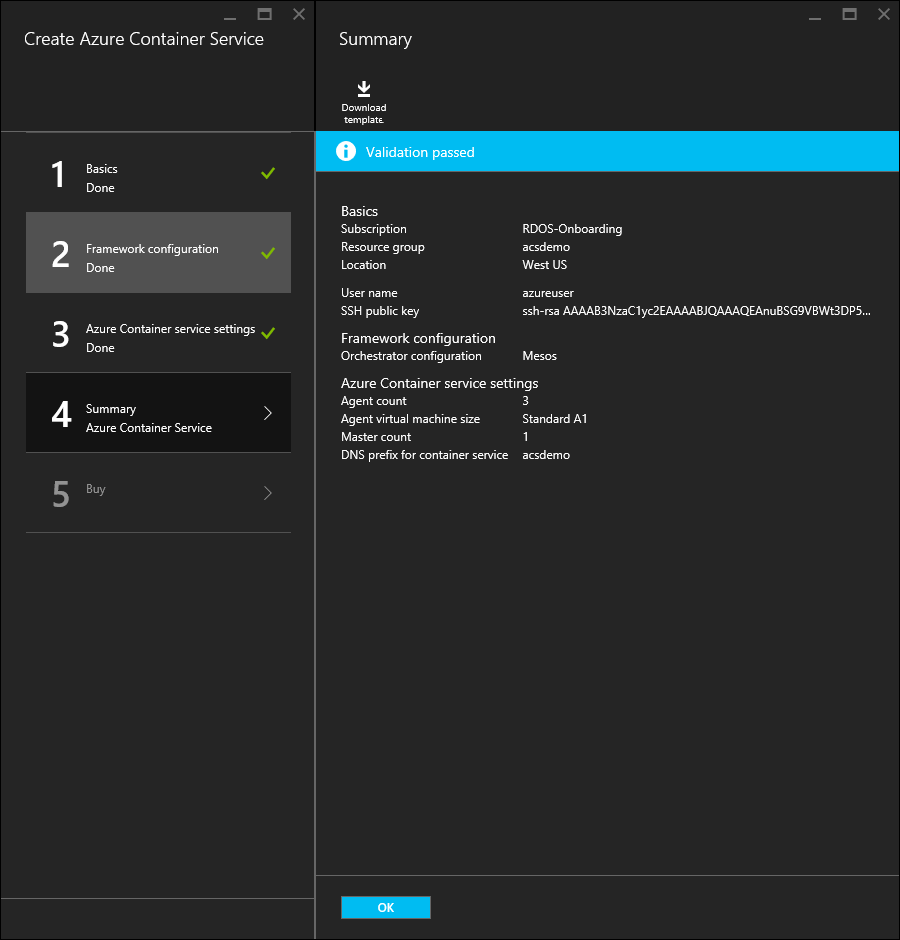

# Deploy an Azure Container Service cluster


Azure Container Service provides rapid deployment of popular open-source container clustering and orchestration solutions. This document walks you through deploying an Azure Container Service cluster by using the Azure portal or an Azure Resource Manager quickstart template. 

You can also deploy an Azure Container Service cluster by using the [Azure CLI 2.0 (Preview)](container-service-create-acs-cluster-cli.md) or the Azure Container Service APIs.


## Prerequisites

* **Azure subscription**: If you don't have one, sign up for a [free trial](http://azure.microsoft.com/pricing/free-trial/?WT.mc_id=AA4C1C935).

* **SSH RSA public key**: When deploying through the portal or one of the Azure quickstart templates, you need to provide the public key for authentication against Azure Container Service virtual machines. To create Secure Shell (SSH) RSA keys, see the [OS X and Linux](../virtual-machines/virtual-machines-linux-mac-create-ssh-keys.md) or [Windows](../virtual-machines/virtual-machines-linux-ssh-from-windows.md) guidance. 

* **Service principal client ID and secret** (Kubernetes only): For more information and guidance to create a service principal, see [About the service principal for a Kubernetes cluster](container-service-kubernetes-service-principal.md).


## Create a cluster by using the Azure portal
1. Sign in to the Azure portal, select **New**, and search the Azure Marketplace for **Azure Container Service**.

      <br />

2. Select **Azure Container Service**, and click **Create**.

      <br />

3. Enter the following information:

    * **User name**: The user name for an account on each of the virtual machines and virtual machine scale sets in the Azure Container Service cluster.
    * **Subscription**: Select an Azure subscription.
    * **Resource group**: Select an existing resource group, or create a new one. As a best practice, use a new resource group for each deployment.
    * **Location**: Select an Azure region for the Azure Container Service deployment.
    * **SSH RSA public key**: Add the public key to be used for authentication against Azure Container Service virtual machines. It is important that this key contains no line breaks, and it includes the `ssh-rsa` prefix. The `username@domain` postfix is optional. The key should look something like the following: **ssh-rsa AAAAB3Nz...<...>...UcyupgH azureuser@linuxvm**. 

4. Click **OK** when you're ready to proceed.

      <br />

5. Select an Orchestration type. The options include:

  * **DC/OS**: Deploys a DC/OS cluster.
  * **Swarm**: Deploys a Docker Swarm cluster.
  * **Kubernetes**: Deploys a Kubernetes cluster.


6. Click **OK** when you're ready to proceed.

      <br />

7. If **Kubernetes** is selected in the dropdown, you will need to enter a service principal client ID (also called the appId) and service principal client secret (password). For more information, see [About the service principal for a Kubernetes cluster](container-service-kubernetes-service-principal.md).

      <br />

7. In the **Azure Container service** settings blade, enter the following information:

    * **Master count**: The number of masters in the cluster.
    * **Agent count**: For Docker Swarm and Kubernetes, this value is the initial number of agents in the agent scale set. For DC/OS, it is the initial number of agents in a private scale set. Additionally, a public scale set is created for DC/OS, which contains a predetermined number of agents. The number of agents in this public scale set is determined by how many masters have been created in the cluster: one public agent for one master, and two public agents for three or five masters.
    * **Agent virtual machine size**: The size of the agent virtual machines.
    * **DNS prefix**: A world unique name that is used to prefix key parts of the fully qualified domain names for the service.
    * **VM diagnostics**: For some orchestrators, you can choose to enable VM diagnostics.

8. Click **OK** when you're ready to proceed.

      <br />

9. Click **OK** after service validation has finished.

      <br />

10. Review the terms. To start the deployment process, click **Purchase**.

      <br />

    If you've elected to pin the deployment to the Azure portal, you can see the deployment status.

      <br />

The deployment takes several minutes to complete. Then, the Azure Container Service cluster is ready for use.


## Create a cluster by using a quickstart template
Azure quickstart templates are available to deploy a cluster in Azure Container Service. The provided quickstart templates can be modified to include additional or advanced Azure configuration. To create an Azure Container Service cluster by using an Azure quickstart template, you need an Azure subscription. If you don't have one, then sign up for a [free trial](http://azure.microsoft.com/pricing/free-trial/?WT.mc_id=AA4C1C935). 

Follow these steps to deploy a cluster using a template and the Azure CLI 2.0 (Preview) (see [installation and setup instructions](/cli/azure/install-az-cli2.md)).

> [!NOTE] 
> If you're on a Windows system, you can use similar steps to deploy a template using Azure PowerShell. See steps later in this section. You can also deploy a template through the [portal](../azure-resource-manager/resource-group-template-deploy-portal.md) or other methods.

1. To deploy a DC/OS, Docker Swarm, or Kubernetes cluster, select one of the available quickstart templates from GitHub. A partial list follows. Note that the DC/OS and Swarm templates are the same, with the exception of the default orchestrator selection.

    * [DC/OS template](https://github.com/Azure/azure-quickstart-templates/tree/master/101-acs-dcos)
    * [Swarm template](https://github.com/Azure/azure-quickstart-templates/tree/master/101-acs-swarm)
    * [Kubernetes template](https://github.com/Azure/azure-quickstart-templates/tree/master/101-acs-kubernetes)

2. Log in to your Azure account (`az login`), and make sure that the Azure CLI is connected to your Azure subscription. You can see the default subscription by using the following command:

    ```azurecli
    az account show
    ```
    
    If you have more than one subscription and need to set a different default subscription, run `az account set --subscription` and specify the subscription ID or name.

3. As a best practice, use a new resource group for the deployment. To create a resource group, use the `az group create` command specify a resource group name and location: 

    ```azurecli
    az group create --name "RESOURCE_GROUP" --location "LOCATION"
    ```

4. Create a JSON file containing the required template parameters. Download the parameters file named `azuredeploy.parameters.json` that accompanies the Azure Container Service template `azuredeploy.json` in GitHub. Enter required parameter values for your cluster. 

    For example, to use the [DC/OS template](https://github.com/Azure/azure-quickstart-templates/tree/master/101-acs-dcos), supply parameter values for `dnsNamePrefix` and `sshRSAPublicKey`. See the descriptions in `azuredeploy.json` and options for other parameters.  
 

5. Create a Container Service cluster by passing the deployment parameters file with the following command, where:

    * **RESOURCE_GROUP** is the name of the resource group that you created in the previous step.
    * **DEPLOYMENT_NAME** (optional) is a name you give to the deployment.
    * **TEMPLATE_URI** is the location of the deployment file `azuredeploy.json`. This URI must be the Raw file, not a pointer to the GitHub UI. To find this URI, select the `azuredeploy.json` file in GitHub, and click the **Raw** button.  

    ```azurecli
    az group deployment create -g RESOURCE_GROUP -n DEPLOYMENT_NAME --template-uri TEMPLATE_URI --parameters @azuredeploy.parameters.json
    ```

    You can also provide parameters as a JSON-formatted string on the command line. Use a command similar to the following:

    ```azurecli
    az group deployment create -g RESOURCE_GROUP -n DEPLOYMENT_NAME --template-uri TEMPLATE_URI --parameters "{ \"param1\": {\"value1\"} … }"
    ```

    > [!NOTE]
    > The deployment takes several minutes to complete.
    > 

### Equivalent PowerShell commands
You can also deploy an Azure Container Service cluster template with PowerShell. This document is based on the version 1.0 [Azure PowerShell module](https://azure.microsoft.com/blog/azps-1-0/).

1. To deploy a DC/OS, Docker Swarm, or Kubernetes cluster, select one of the available quickstart templates from GitHub. A partial list follows. Note that the DC/OS and Swarm templates are the same, with the exception of the default orchestrator selection.

    * [DC/OS template](https://github.com/Azure/azure-quickstart-templates/tree/master/101-acs-dcos)
    * [Swarm template](https://github.com/Azure/azure-quickstart-templates/tree/master/101-acs-swarm)
    * [Kubernetes template](https://github.com/Azure/azure-quickstart-templates/tree/master/101-acs-kubernetes)

2. Before creating a cluster in your Azure subscription, verify that your PowerShell session has been signed in to Azure. You can do this with the `Get-AzureRMSubscription` command:

    ```powershell
    Get-AzureRmSubscription
    ```

3. If you need to sign in to Azure, use the `Login-AzureRMAccount` command:

    ```powershell
    Login-AzureRmAccount
    ```

4. As a best practice, use a new resource group for the deployment. To create a resource group, use the `New-AzureRmResourceGroup` command, and specify a resource group name and destination region:

    ```powershell
    New-AzureRmResourceGroup -Name GROUP_NAME -Location REGION
    ```

5. After you create a resource group, you can create your cluster with the following command. The URI of the desired template will be specified for the `-TemplateUri` parameter. When you run this command, PowerShell prompts you for deployment parameter values.

    ```powershell
    New-AzureRmResourceGroupDeployment -Name DEPLOYMENT_NAME -ResourceGroupName RESOURCE_GROUP_NAME -TemplateUri TEMPLATE_URI
    ```

#### Provide template parameters
If you're familiar with PowerShell, you know that you can cycle through the available parameters for a cmdlet by typing a minus sign (-) and then pressing the TAB key. This same functionality also works with parameters that you define in your template. As soon as you type the template name, the cmdlet fetches the template, parses the parameters, and adds the template parameters to the command dynamically. This makes it very easy to specify the template parameter values. And, if you forget a required parameter value, PowerShell prompts you for the value.

Below is the full command, with parameters included. You can provide your own values for the names of the resources.

```powershell
New-AzureRmResourceGroupDeployment -ResourceGroupName RESOURCE_GROUP_NAME-TemplateURI TEMPLATE_URI -adminuser value1 -adminpassword value2 ....
```

## Next steps
Now that you have a functioning cluster, see these documents for connection and management details:

* [Connect to an Azure Container Service cluster](container-service-connect.md)
* [Work with Azure Container Service and DC/OS](container-service-mesos-marathon-rest.md)
* [Work with Azure Container Service and Docker Swarm](container-service-docker-swarm.md)
* [Work with Azure Container Service and Kubernetes](container-service-kubernetes-walkthrough.md)
