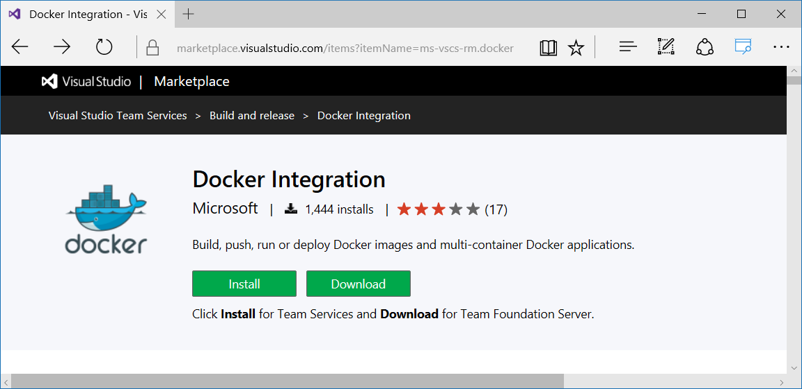
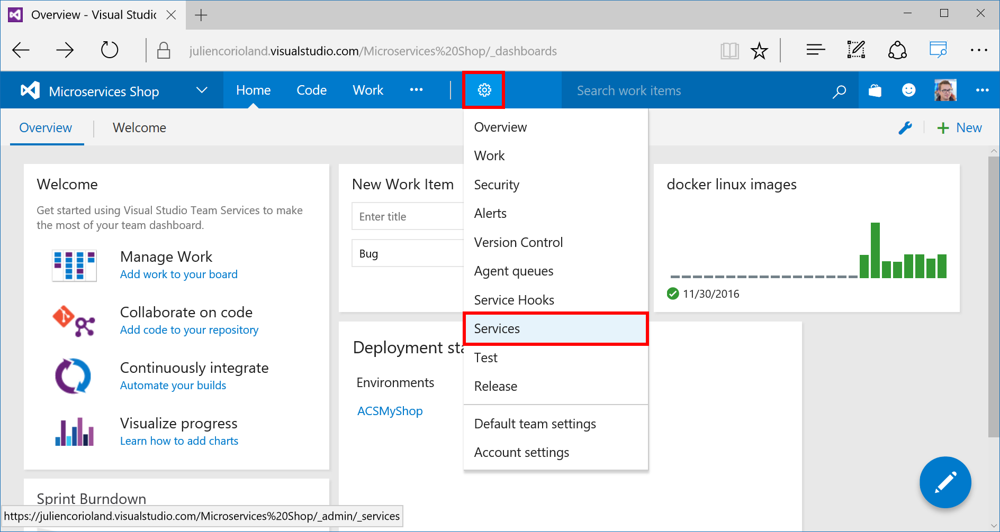
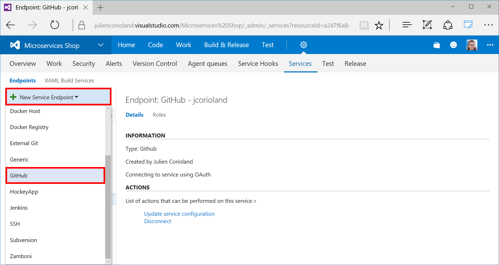
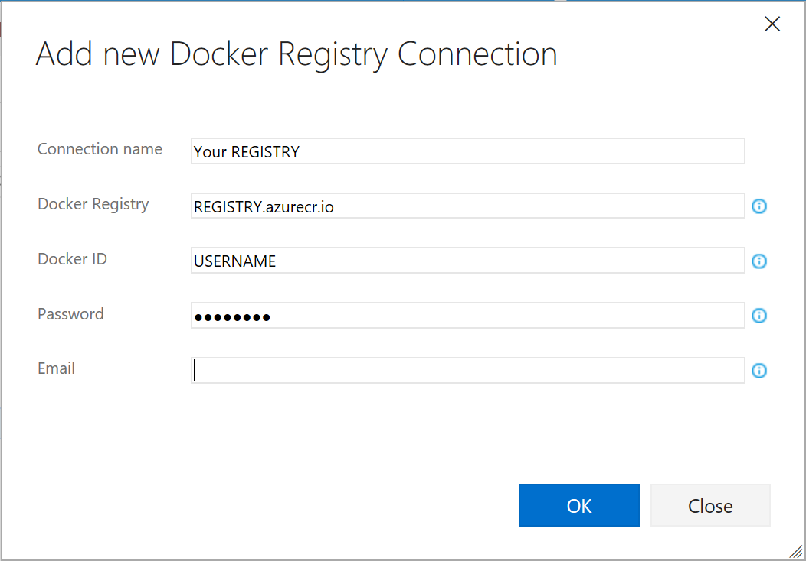
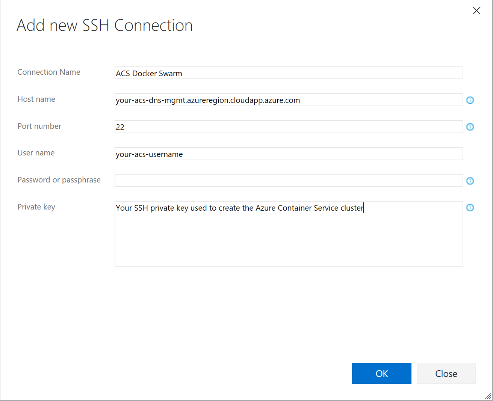

# Full CI/CD pipeline to deploy a multi-container application on Azure Container Service with Docker Swarm using Visual Studio Team Services

One of the biggest challenge when developping modern applications in the cloud is to be able to deliver these applications continuously. In this documentation you will learn how to implement a full CI/CD pipeline using Azure Container Service with Docker Swarm, an Azure Container Registry and Visual Studio Team Services Build & Release Management.

This article is based on a simple application, available on [GitHub](https://github.com/jcorioland/MyShop/tree/acs-docs), and developped with ASP.NET Core. The application is composed by 4 different services, three web APIs and one web front:

The objectives of this article are to explain how it is possible to deliver this application continuously in a Docker Swarm cluster, using Visual Studio Team Services. The figure below details this continuous delivery pipeline:

1. Code changes are committed to the source code repository (here GitHub) 
2. GitHub triggers a build in Visual Studio Team Services 
3. Visual Studio Team Services gets the latest version of the sources and build all the images that compose my application 
4. Visual Studio Team Services pushes each image in the Azure Container Registry 
5. Visual Studio Team Services triggers a new release 
6. The release runs some commands using SSH on the ACS cluster master node 
7. Docker Swarm on ACS pull the latest version of the image 
8. The new version of the application is deployed using docker-compose 

Prerequisites to the exercises in this document:

- [Create a Swarm cluster in Azure Container Service](container-service-deployment.md)
- [Connect with the Swarm cluster in Azure Container Service](container-service-connect.md)
- [Create an Azure Container Registry](https://docs.microsoft.com/en-us/azure/container-registry/container-registry-get-started-portal)
- [Have a Visual Studio Team Services account and team project created](https://www.visualstudio.com/en-us/docs/setup-admin/team-services/sign-up-for-visual-studio-team-services)
- [Fork the GitHub repository to your GitHub account](https://github.com/jcorioland/MyShop/)

You will aslo need an Ubuntu (14.04 or 16.04) machine with Docker installed. It will be used by Visual Studio Team Services during the build and release processes. 
The simple way to create this machine is to use the image available in [the Microsoft Azure Marketplace](https://azure.microsoft.com/en-us/marketplace/partners/canonicalandmsopentech/dockeronubuntuserver1404lts/). 

## Configure your Visual Studio Team Services account 

In this section, you are going to configure your Visual Studio Team Services account.

### Configure a Visual Studio Team Services Linux Build agent

To be able to create new Docker images and push these images into an Azure Container Registry from a Visual Studio Team Services build, you need to register a Linux agent. All the installation is documented on [this page](https://www.visualstudio.com/en-us/docs/build/admin/agents/v2-linux).

Another solution is to use [Docker to run the VSTS Agent](https://hub.docker.com/r/microsoft/vsts-agent).

### Install the Docker Integration from Visual Studio Team Services marketplace

Microsoft provides a VSTS extensions to work with Docker in build and release processes. This extension is available in the [VSTS Marketplace](https://marketplace.visualstudio.com/items?itemName=ms-vscs-rm.docker). Click on the **Install** button to add this extension to your VSTS account:

You will be asked to connect to your VSTS account using your credentials. 

### Connect Visual Studio Team Services and GitHub

In this part, you will create a connection between your Visual Studio Team Services project and your GitHub account. To do that, click on the Settings wheel in the toolbar, and select **Services** in the menu:

Choose to add a new endpoint on the left. In the menu that opens, click on the GitHub entry:

To authorize VSTS to work with your GitHub account, you just have to click on the Authorize button and follow the procedure in the windows that opens.

### Connect Visual Studio Team Services to Azure Container Registry and Azure Container Service

The last steps before getting into the CI/CD pipeline are two configure external connection to your Azure Container Registry and your Docker Swarm cluster. 

In the Services settings of your VSTS team project, choose to add a new endpoint of type **Docker Registry**. In the popup that opens, enter the URL and the credentials of your Azure Container Registry:

For the Docker Swarm cluster, you have to create a new endpoint of type SSH. Then use the SSH connection information of your Azure Container Service Swarm cluster:

All the configuration is done now. In the next parts, you will create the CI/CD pipeline that builds and deploys the application to the Docker Swarm cluster. 

## Create the build definition

## Create the release definition

## Wrap up and next steps