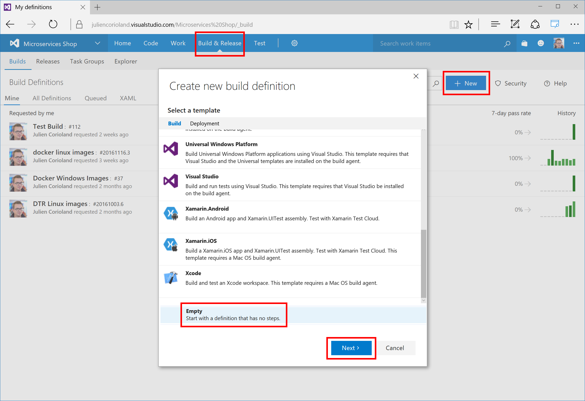
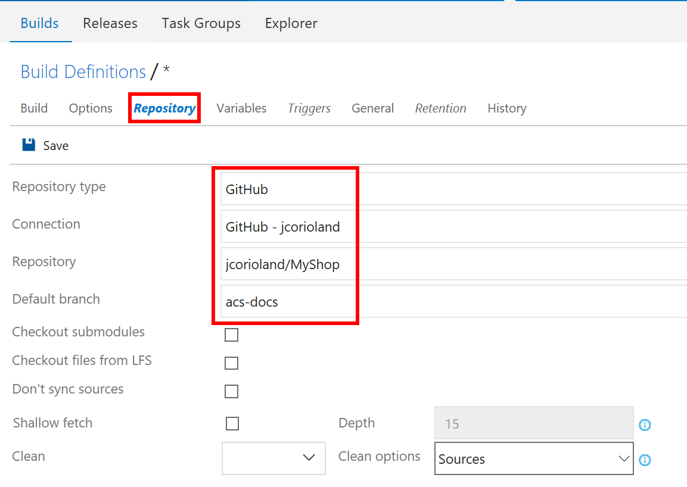
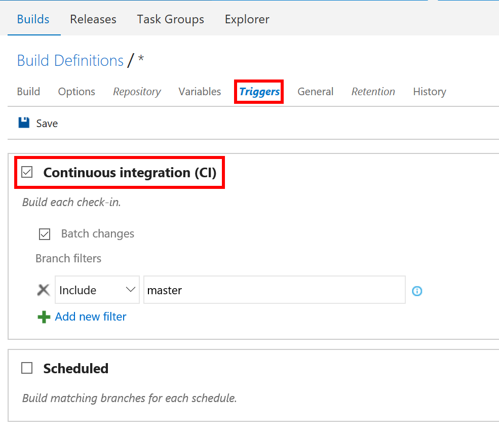
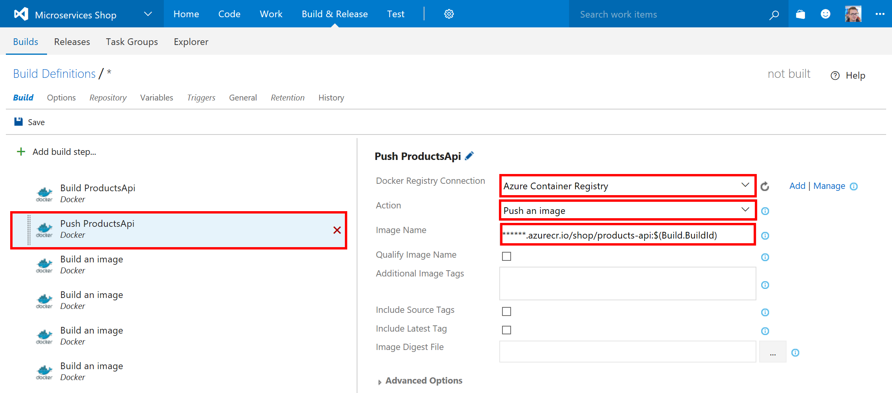
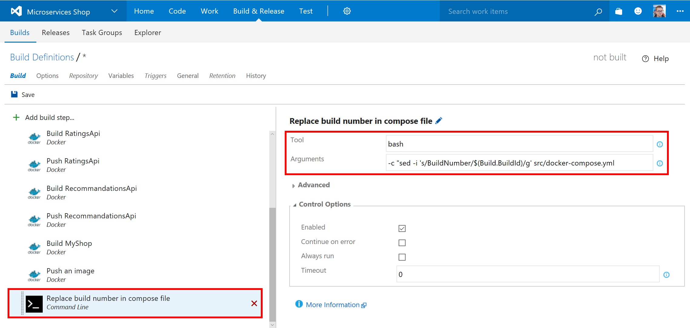
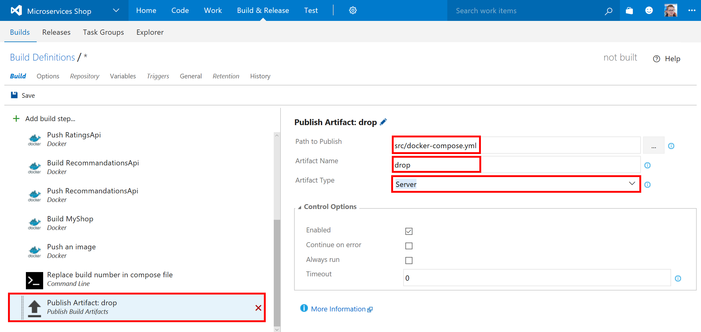
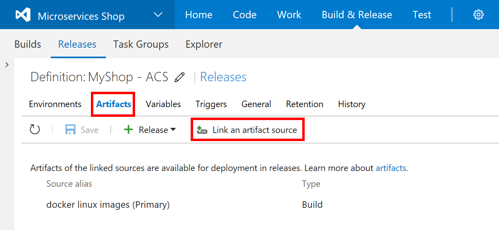
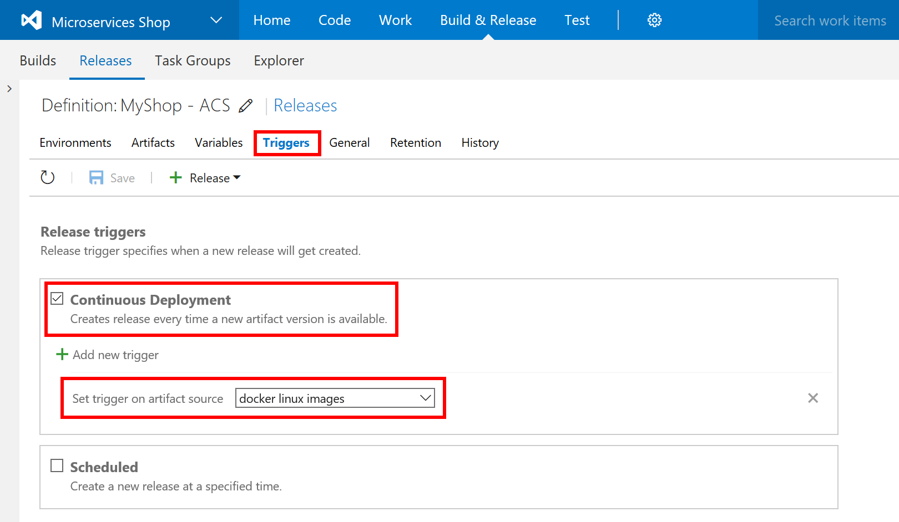
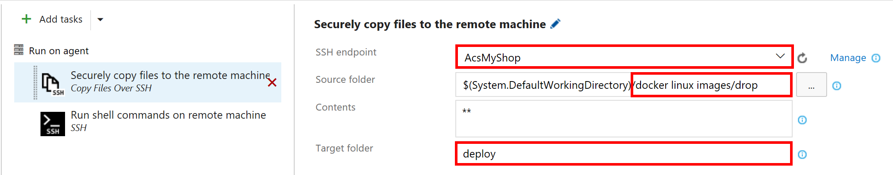
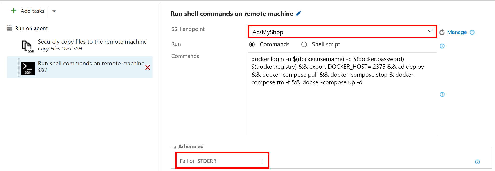

# Full CI/CD pipeline to deploy a multi-container application on Azure Container Service with Docker Swarm using Visual Studio Team Services

One of the biggest challenge when developping modern applications for the cloud is being able to deliver these applications continuously. In this article you will learn how to implement a full CI/CD pipeline using Azure Container Service with Docker Swarm, an Azure Container Registry and Visual Studio Team Services Build & Release Management.

This article is based on a simple application, available on [GitHub](https://github.com/jcorioland/MyShop/tree/acs-docs), and developped with ASP.NET Core. The application is composed by 4 different services, three web APIs and one web front:

The objectives are to details how to deliver this application continuously in a Docker Swarm cluster, using Visual Studio Team Services. The figure below details this continuous delivery pipeline:

1. Code changes are committed to the source code repository (here GitHub) 
2. GitHub triggers a build in Visual Studio Team Services 
3. Visual Studio Team Services gets the latest version of the sources and build all the images that compose my application 
4. Visual Studio Team Services pushes each image in the Azure Container Registry 
5. Visual Studio Team Services triggers a new release 
6. The release runs some commands using SSH on the ACS cluster master node 
7. Docker Swarm on ACS pull the latest version of the image 
8. The new version of the application is deployed using docker-compose 

## Prerequisites

Before starting this tutorial, you will need to:

- [Create a Swarm cluster in Azure Container Service](container-service-deployment.md)
- [Connect with the Swarm cluster in Azure Container Service](container-service-connect.md)
- [Create an Azure Container Registry](https://docs.microsoft.com/en-us/azure/container-registry/container-registry-get-started-portal)
- [Have a Visual Studio Team Services account and team project created](https://www.visualstudio.com/en-us/docs/setup-admin/team-services/sign-up-for-visual-studio-team-services)
- [Fork the GitHub repository to your GitHub account](https://github.com/jcorioland/MyShop/)

You will aslo need an Ubuntu (14.04 or 16.04) machine with Docker installed. It will be used by Visual Studio Team Services during the build and release processes. 
The simple way to create this machine is to use the image available in [the Microsoft Azure Marketplace](https://azure.microsoft.com/en-us/marketplace/partners/canonicalandmsopentech/dockeronubuntuserver1404lts/). 

## Configure your Visual Studio Team Services account 

In this section, you are going to configure your Visual Studio Team Services account.

### Configure a Visual Studio Team Services Linux Build agent

To be able to create new Docker images and push these images into an Azure Container Registry from a Visual Studio Team Services build, you need to register a Linux agent. All the installation is documented on [this page](https://www.visualstudio.com/en-us/docs/build/admin/agents/v2-linux).

Another solution is to use [Docker to run the VSTS Agent](https://hub.docker.com/r/microsoft/vsts-agent).

### Install the Docker Integration from Visual Studio Team Services marketplace

Microsoft provides a VSTS extensions to work with Docker in build and release processes. This extension is available in the [VSTS Marketplace](https://marketplace.visualstudio.com/items?itemName=ms-vscs-rm.docker). Click on the **Install** button to add this extension to your VSTS account:

You will be asked to connect to your VSTS account using your credentials. 

### Connect Visual Studio Team Services and GitHub

In this part, you will create a connection between your Visual Studio Team Services project and your GitHub account. To do that, click on the Settings wheel in the toolbar, and select **Services** in the menu:

Choose to add a new endpoint on the left. In the menu that opens, click on the GitHub entry:

To authorize VSTS to work with your GitHub account, you just have to click on the Authorize button and follow the procedure in the windows that opens.

### Connect Visual Studio Team Services to Azure Container Registry and Azure Container Service

The last steps before getting into the CI/CD pipeline are two configure external connection to your Azure Container Registry and your Docker Swarm cluster. 

In the Services settings of your VSTS team project, choose to add a new endpoint of type **Docker Registry**. In the popup that opens, enter the URL and the credentials of your Azure Container Registry:

For the Docker Swarm cluster, you have to create a new endpoint of type SSH. Then use the SSH connection information of your Azure Container Service Swarm cluster:

All the configuration is done now. In the next parts, you will create the CI/CD pipeline that builds and deploys the application to the Docker Swarm cluster. 

## Create the build definition

To create a new build definition, connect to your Visual Studio Team Services team project and click on the **Build & Release** top menu entry. In the Build definitions section, create on the **+ New** button. Choose to start from an empty template:

In the next step, configure the new build with a GitHub repository source, check the continuous integration checkbox and select the agent queue where you have registered your Linux agent. Click **Create** to create the build definition:

First, open the **Repository** tab and configure the build to use the fork of the MyShop project that you have created in the prerequisites. Make sure that you have selected the *acs-docs* branch:

Open the **Triggers** tab and check the build is configured to be triggered after each commit:

The next step is to define the build workflow. There are 5 container images to build for the *MyShop* application. Each image will be built using the Dockerfile located in the project folders:

- ProductsApi
- Proxy
- RatingsApi
- RecommandationsApi
- ShopFront

To add a new step in the build workflow, click on the **+ Add build step...** button and choose the Docker step in the list:
You need to add 10 Docker steps: two for each image, one for building the image and one for pushing the image in the Azure Container Registry.

For each image, you need to configure one step that uses the *docker build* command:

*For the build operation, you need to pick the Azure Container Registry, the "Build an image" action, the Dockerfile that defines each image, set the context to the Dockerfile root directory and define the name of the image. As you can see on the capture above, the image should start with the URI of your Azure Container Registry. You can also use a build variable to parameterize the tag of the image, here the build identifier.*

And one step that uses the *docker push* command:

*For the push operation, you need to pick the Azure Container Registry, select the "Push an image" action and give the name of the image that have been built in the previous step.*

Once you have configured the five Build+Push steps, you have to add two more step in the build workflow.

A command line task that will use a bash script to replace the *BuildNumber* occurence in the docker-compose.yml file with the current build id:

And finally, a task that drops the updates compose file as a build artefact so it can be used in the release:

 

Click the **Save** button and give a name to your build definition.

## Create the release definition

[Visual Studio Team Services allows to manage releases across environments](https://www.visualstudio.com/team-services/release-management/). It is possible to enable continuous deployment to make sure that your application is deployed on your different environments (dev, qa, pre-production, production…) in a smooth way. You can create a new environment that represents your Azure Container Service Docker Swarm cluster.

 

The first thing to configure is the artefact source. It allows to link this new release definition to the build that you have defined in the previous part. By doing this, the docker-compose.yml file will be avaialble in the release process.

 

Then, you need to configure the release trigger to make sure that a new release will be started as soon as the build complete successfuly:

 

The release workflow is simple and is composed by two steps: 

- The first one uses SCP to copy the compose file to a deploy folder on the ACS master node, using the SSH connection you have configured previously

- The second one that executes a bash command to execute docker and docker-compose commands on the master:

The command executed on the master use the Docker CLI and the Docker-Compose CLI to:

- Login to the Azure Container Registry (it uses three build variables that have been defined in the *Variables* tab)
- Define the DOCKER_HOST variable to work with the Swarm endpoint (:2375)
- Navigate to the deploy folder that has been created by the SCP step and that contains the docker-compose.yml file 
- Execute docker-compose commands that pull the new images, stop the services, remove the services and create the new containers.

As you can see on the capture above, the **Fail on STDERR** checkbox is unchecked. This is an important part that you do not want to miss! Actually, docker-compose print several diagnostic information like that containers are stopping or being deleted on the standard error output. If you let the checkbox checked, Visual Studio Team Services will consider that some errors have occurred during the release, even if all goes well.

*Note: be careful that this deployment will include some downtime as we are stopping the old services and running the new one. It is possible to avoid this by doing a blue/green deployment.*

You can save this new release definition.

## Test the CI/CD pipeline

Now that you are done with the configuration, it's time to test this new CI/CD pipeline. The easiest way to test it is to update the source code and commit the changes into your GitHub repository. A few seconds after you have pushed the code you will see a new build running in Visual Studio Team Services. Once completed successfuly, a new release will be triggered and will deploy the new version of the application on Azure Container Services.