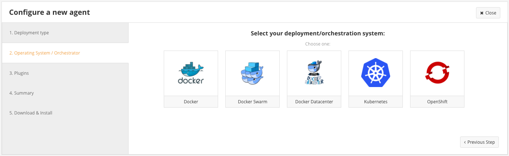

# Monitor an Azure Container Service Kubernetes cluster with CoScale

In this article, we show you how to deploy the [CoScale](https://www.coscale.com/) Agent to monitor all nodes and containers in your Azure Container Service cluster. You need an account with CoScale for this configuration. 


## CoScale SaaS / On-Premise

CoScale is a monitoring platform that gathers metrics and events from all containers within your Azure Container Services cluster. CoScale offers full-stack monitoring for Kubernetes environments, this means we provide visualisations and analytics for all layers in the stack: the OS, Kubernetes, Docker and applications running inside your containers. CoScale has built-in anomaly detection to allow operators and developers to find infrastructure and application issues fast.


You first need to [create an account](https://www.coscale.com/free-trial)


## Prerequisites
This walkthrough assumes that you have [created a Kubernetes cluster using Azure Container Service](container-service-kubernetes-walkthrough.md).

It also assumes that you have the `az` Azure cli and `kubectl` tools installed.

You can test if you have the `az` tool installed by running:

```console
$ az --version
```

If you don't have the `az` tool installed, there are instructions [here](https://github.com/azure/azure-cli#installation).

You can test if you have the `kubectl` tool installed by running:

```console
$ kubectl version
```

If you don't have `kubectl` installed, you can run:

```console
$ az acs kubernetes install-cli
```

## Installing the CoScale Agent with a DaemonSet
DaemonSets are used by Kubernetes to run a single instance of a container on each host in the cluster.
They're perfect for running monitoring agents.

Once you have logged into CoScale, you can go to the [agent page](https://app.coscale.com/)
to install CoScale agents on your cluster using a DaemonSet. The CoScale UI will provide a single command
to start monitoring for your complete cluster.



## Conclusion
That's it! Once the agents are up and running you should see data in the console in a few minutes. You can visit
the [agent page](https://app.coscale.com/) to see a summary of your cluster.
