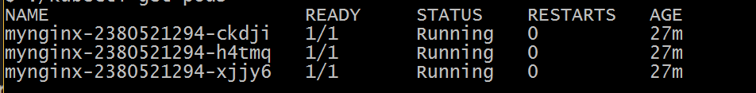
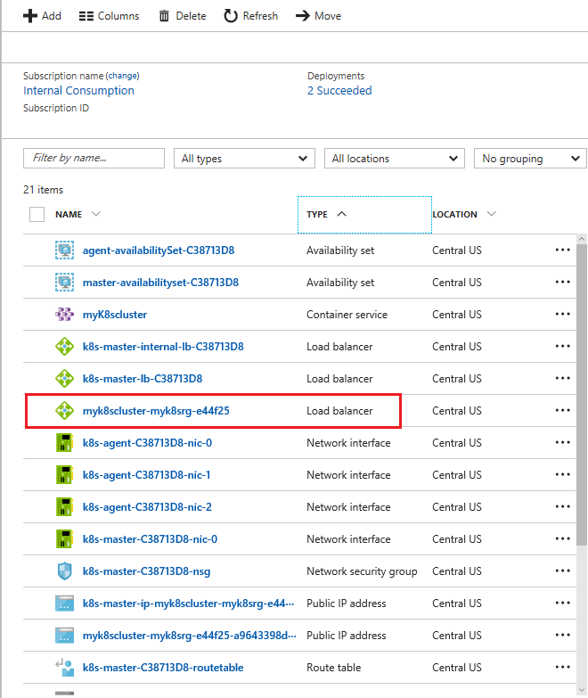
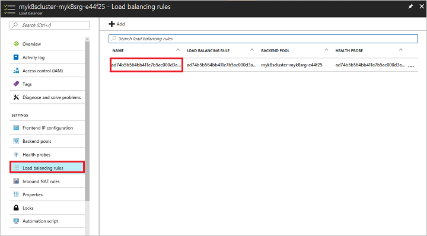
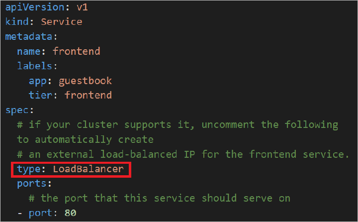
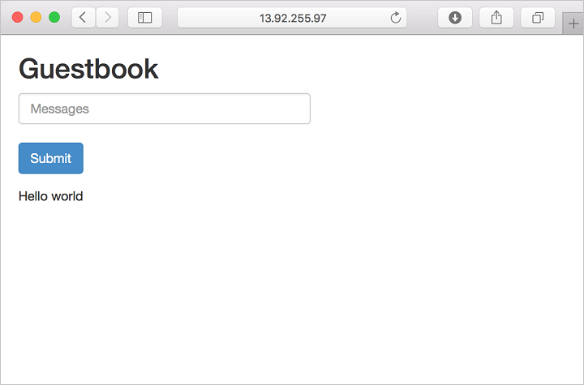

# Load balance containers in a Kubernetes cluster in Azure Container Service 
This article introduces load balancing in a Kubernetes cluster in Azure Container Service. Load balancing provides an externally accessible IP address for the service and distributes network traffic among the pods running in agent VMs.

You can set up a Kubernetes service to use [Azure Load Balancer](../load-balancer/load-balancer-overview.md) to manage external network (TCP) traffic. With additional configuration, load balancing and routing of HTTP or HTTPS traffic or more advanced scenarios are possible.

## Prerequisites
* [Deploy a Kubernetes cluster](container-service-kubernetes-walkthrough.md) in Azure Container Service
* [Connect your client](container-service-connect.md) to your cluster

## Azure load balancer

By default, a Kubernetes cluster deployed in Azure Container Service includes an Internet-facing Azure load balancer for the agent VMs. (A separate load balancer resource is configured for the master VMs.) Azure load balancer is a Layer 4 load balancer. Currently, the load balancer only supports TCP traffic in Kubernetes.

When creating a Kubernetes service, you can automatically configure the Azure load balancer to allow access to the service. To configure the load balancer, set the service `type` to `LoadBalancer`. The load balancer creates a rule to map a public IP address and port number of incoming service traffic to the private IP addresses and port numbers of the pods in agent VMs (and vice versa for response traffic). 

 Following are two examples showing how to set the Kubernetes service `type` to `LoadBalancer`. (After trying the examples, delete the deployments if you no longer need them.)

### Example: Use the `kubectl expose` command 
The [Kubernetes walkthrough](container-service-kubernetes-walkthrough.md) includes an example of how to expose a service with the `kubectl expose` command and its `--type=LoadBalancer` flag. Here are the steps :

1. Start a new container deployment. For example, the following command starts a new deployment called `mynginx`. The deployment consists of three containers based on the Docker image for the Nginx web server.

    ```console
    kubectl run mynginx --replicas=3 --image nginx
    ```
2. Verify that the containers are running. For example, if you query for the containers with `kubectl get pods`, you see output similar to the following:

    

3. To configure the load balancer to accept external traffic to the deployment, run `kubectl expose` with `--type=LoadBalancer`. The following command exposes the Nginx server on port 80:

    ```console
    kubectl expose deployments mynginx --port=80 --type=LoadBalancer
    ```

4. Type `kubectl get svc` to see the state of the services in the cluster. While the load balancer configures the rule, the `EXTERNAL-IP` of the service appears as `<pending>`. After a few minutes, the external IP address is configured: 

    

5. Verify that you can access the service at the external IP address. For example, open a web browser to the IP address shown. The browser shows the Nginx web server running in one of the containers. Or, run the `curl` or `wget` command. For example:

    ```
    curl 13.82.93.130
    ```

    You should see output similar to:

    

6. To see the configuration of the Azure load balancer, go to the [Azure portal](https://portal.azure.com).

7. Browse for the resource group for your container service cluster, and select the load balancer for the agent VMs. Its name should be the same as the container service. (Don't choose the load balancer for the master nodes, the one whose name includes **master-lb**.) 

    

8. To see the details of the load balancer configuration, click **Load balancing rules** and the name of the rule that was configured.

     

### Example: Specify `type: LoadBalancer` in the service configuration file

If you deploy a Kubernetes container app from a YAML or JSON [service configuration file](https://kubernetes.io/docs/user-guide/services/operations/#service-configuration-file), specify an external load balancer by adding the following line to the service specification:

```YAML
 "type": "LoadBalancer"
``` 


The following steps use the Kubernetes [Guestbook example](https://github.com/kubernetes/kubernetes/tree/master/examples/guestbook). This example is a multi-tier web app based on  Redis and PHP Docker images. You can specify in the service configuration file that the frontend PHP server uses the Azure load balancer.

1. Download the file `guestbook-all-in-one.yaml` from [GitHub](https://github.com/kubernetes/kubernetes/tree/master/examples/guestbook/all-in-one). 
2. Browse for the `spec` for the `frontend` service.
3. Uncomment the line `type: LoadBalancer`.

    

4. Save the file, and deploy the app by running the following command:

    ```
    kubectl create -f guestbook-all-in-one.yaml
    ```

5. Type `kubectl get svc` to see the state of the services in the cluster. While the load balancer configures the rule, the `EXTERNAL-IP` of the `frontend` service appears as `<pending>`. After a few minutes, the external IP address is configured: 

    

6. Verify that you can access the service at the external IP address. For example, you can open a web browser to the external IP address of the service.

    

    You can add guestbook entries.

7. To see the configuration of the Azure load balancer, browse for the load balancer resource for the cluster in the [Azure portal](https://portal.azure.com). See the steps in the previous example.

### Considerations

* Creation of the load balancer rule happens asynchronously, and information about the provisioned balancer is published in the service’s `status.loadBalancer` field.
* Every service is automatically assigned its own virtual IP address in the load balancer.
* If you want to reach the load balancer by a DNS name, work with your domain service provider to create a DNS name for the rule's IP address.

## HTTP or HTTPS traffic

To load balance HTTP or HTTPS traffic to container web apps and manage certificates for transport layer security (TLS), you can use the Kubernetes [Ingress](https://kubernetes.io/docs/user-guide/ingress/) resource. An Ingress is a collection of rules that allow inbound connections to reach the cluster services. For an Ingress resource to work, the Kubernetes cluster must have an [Ingress controller](https://kubernetes.io/docs/user-guide/ingress/#ingress-controllers) running.

Azure Container Service does not implement a Kubernetes Ingress controller automatically. Several controller implementations are available. Currently, the [Nginx Ingress controller](https://github.com/kubernetes/ingress/tree/master/examples/deployment/nginx) is recommended to configure Ingress rules and load balance HTTP and HTTPS traffic. 

For more information, see the [Nginx Ingress controller documentation](https://github.com/kubernetes/ingress/tree/master/controllers/nginx/README.md).

> [!IMPORTANT]
> When using the Nginx Ingress controller in Azure Container Service, you must expose the controller deployment as a service with `type: LoadBalancer`. This configures the Azure load balancer to route traffic to the controller. For more information, see the previous section.


## Next steps

* See the [Kubernetes LoadBalancer documentation](https://kubernetes.io/docs/user-guide/load-balancer/)
* Learn more about [Kubernetes Ingress and Ingress controllers](https://kubernetes.io/docs/user-guide/ingress/)
* See [Kubernetes examples](https://github.com/kubernetes/kubernetes/tree/master/examples)

