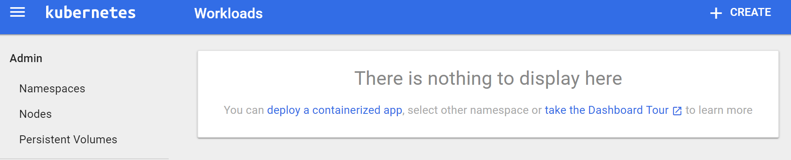
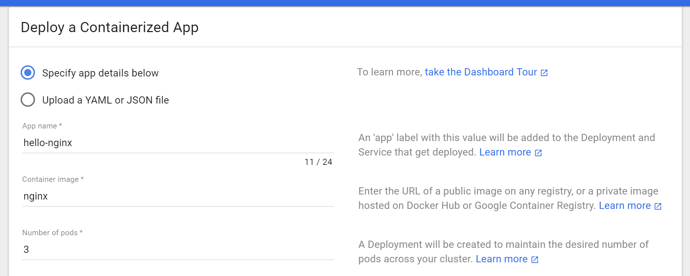
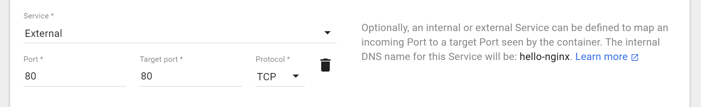
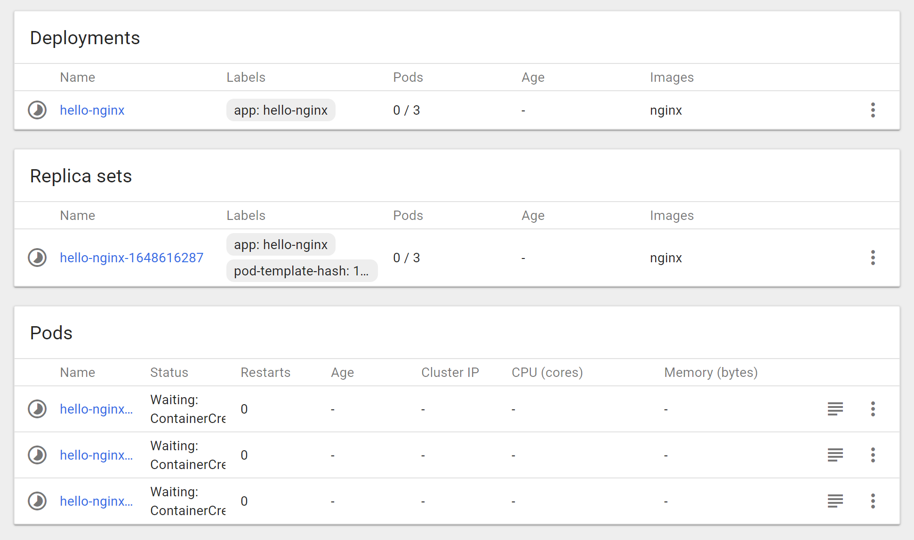
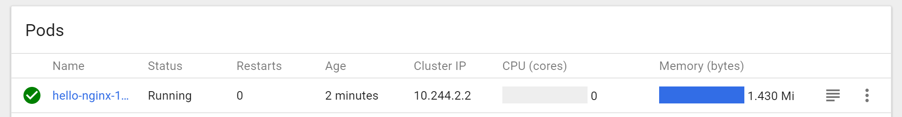
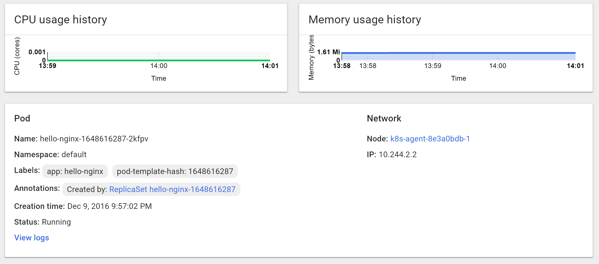
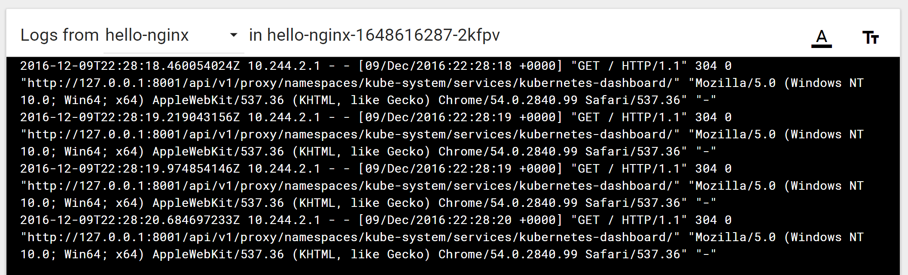

# Microsoft Azure Container Service Engine - Using the Kubernetes Web UI

## Prerequisites
This walkthrough assumes that you have [created a Kubernetes cluster using Azure Container Service](container-service-kubernetes-walkthrough.md).

> [!NOTE]
> Kubernetes support in Azure Container Service is currently in preview.
>

It also assumes that you have the azure cli and kubectl tools installed.

You can test if you have the `az` tool installed by running:

```console
$ az --version
```

If you don't have the `az` tool installed, there are instructions [here](https://github.com/azure/azure-cli#installation).

You can test if you have the `kubectl` tool installed by running:

```console
$ kubectl version
```

If you don't have `kubectl` installed, you can run:

```console
$ az acs kubernetes install-cli
```

## Overview

### Connect to the Web UI
You can launch the Kubernetes Web UI by running:

```console
$ az acs kubernetes browse
```

This should open a web browser configured to talk to a secure proxy connecting your
local machine to the Kubernetes Web UI.

### Create and expose a service
In Kubernetes Web UI, you should see a 'Create' button in the upper right window.



This should open up a dialog box where you can start creating your application.
Give it the name `hello-nginx`. Use the [`nginx` container from Docker](https://hub.docker.com/_/nginx/)
and deploy three replicas of this web service.



Moving on, create an 'External' Kubernetes Service to load balance traffic to our three
replicas.  Select 'External' and enter port 80.



Finally, press the 'Deploy' button do deploy these containers and services.


### View your Containers
After you press 'Deploy', the UI shows a view of your service as it deploys:



You can see the status of each Kubernetes object in the circle on the left-hand side of the
UI. If it is a partially full circle, then the object is still deploying. When an object is fully deployed,
it displays a green check mark:


Once everything is running, you can click on one of your Pods to see details about the running web service



In the Pod-specific view, you can see information about the containers in the Pod as well as the CPU
and Memory resources used by those containers:



If you don't see the resources, you may need to wait a few minutes for the monitoring data to propagate.

You can also click on the 'Logs' link to see the logs for your container:



### Viewing your service
In addition to running your containers, the Kubernetes UI has created an external `Service` which
provisions a load balancer to bring traffic to the containers in your cluster.

You can click on 'Services' in the left-hand navigation pane to view all services (there should
current be just one)


In that view, you should be able to see an external IP address that has been allocated to your service.
If you click on that IP address, you should see your nginx container running behind the
load balancer.


### Resizing your service
In addition to viewing your objects in the UI, you can also edit and update the Kubernetes API objects.

First, go to the `Deployment` for your service, by clicking on the 'Deployments' in the left
navigation pane.

Once you are in that view, click on the ReplicaSet, and then click on the 'Edit' button in the upper
navigation bar:


Edit the `spec.replicas` field to be '2', and press 'Update'.

This will cause the number of replicas to drop to two by deleting one of your Pods.

 

