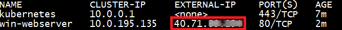
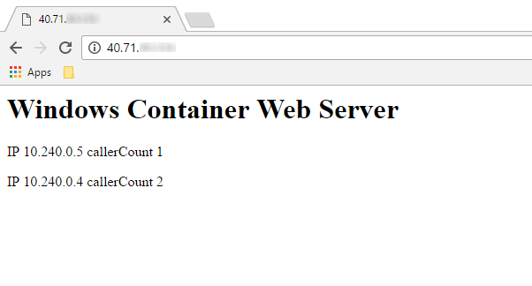
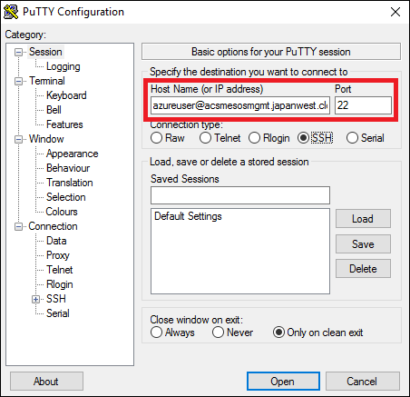
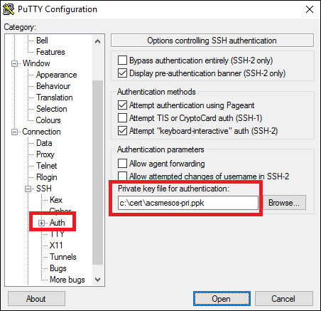

# Get started with Kubernetes and Windows containers in Container Service


This article shows how to create a Kubernetes cluster in Azure Container Service that contains Windows nodes to run Windows containers. One way to get started is to use the `az acs` Azure CLI 2.0 commands to create the Kubernetes cluster in Azure Container Service. Then, use the Kubernetes `kubectl` command-line tool to start working with container apps in the cluster. 

> [!NOTE]
> Support for Windows containers with Kubernetes in Azure Container Service is in preview. 
>


The following image shows the architecture of a Kubernetes cluster in Azure Container Service with one Linux master node and two Windows agent nodes. 


* The Linux master serves the Kubernetes REST API and is accessible by SSH on port 22 or `kubectl` on port 443. 
* The Windows agent nodes are grouped in an Azure availability set
and run your containers. The Windows nodes can be accessed through an RDP SSH tunnel via the master node. Azure load balancer rules are dynamically added to the cluster depending on exposed services.


All VMs are in the same private virtual network and are fully accessible to each other. All VMs run a kubelet, Docker, and a proxy.

For more background, see the [Azure Container Service introduction](container-service-intro) and the [Kubernetes documentation](https://kubernetes.io/docs/home/).

## Prerequisites
To create an Azure Container Service cluster using the Azure CLI 2.0, you must:
* have an Azure account ([get a free trial](https://azure.microsoft.com/pricing/free-trial/))
* have installed and logged into the [Azure CLI 2.0](/cli/azure/install-az-cli2)

You also need the following for your Kubernetes cluster. If you don't prepare these in advance, you can use `az acs create` command options to generate them automatically during cluster deployment.

* **SSH RSA public key**: If you want to create Secure Shell (SSH) RSA keys, see the [macOS and Linux](../virtual-machines/linux/mac-create-ssh-keys.md) or [Windows](../virtual-machines/linux/ssh-from-windows.md) guidance. 

* **Service principal client ID and secret**: For steps to create an Azure Active Directory service principal and additional information, see [About the service principal for a Kubernetes cluster](container-service-kubernetes-service-principal.md).


  
## Create your Kubernetes cluster

Here are Azure CLI 2.0 commands to create your cluster. 

### Create a resource group
To create your cluster, first create a resource group in a location where Azure Container Service is [available](https://azure.microsoft.com/regions/services/). The following command creates a resource group named *myKubernetesResourceGroup* in the *westus* location:

```azurecli
az group create --name=myKubernetesResourceGroup --location=westus
```

### Create a Kubernetes cluster with Windows agent nodes

Create a Kubernetes cluster in your resource group by using the `az acs create` command with `--orchestrator-type=kubernetes` and the `--windows` agent option. For command syntax, see the `az acs create` [help](/cli/azure/acs#create).

The following command creates a Container Service cluster named *myKubernetesClusterName*, with a DNS prefix for the management node named *myPrefix*, with the specified credentials to reach the Windows nodes.

The `--generate-ssh-keys` option  generates the necessary SSH public and private key files for the deployment if they don't exist in the default `~/.ssh/` directory. 

This version of the command also automatically generates the [Azure Active Directory service principal](container-service-kubernetes-service-principal.md) needed for a Kubernetes cluster in Azure. 


```azurecli
az acs create --orchestrator-type=kubernetes --resource-group myKubernetesResourceGroup --name=myKubernetesClusterName --dns-prefix=myPrefix --generate-ssh-keys --windows --admin-username myWindowsAdminName --admin-password myWindowsAdminPassword
```

After several minutes, the command completes, and you should have a working Kubernetes cluster.

> [!IMPORTANT]
> If your account doesn't have permissions to create the Azure AD service principal, the command generates an error similar to `Insufficient privileges to complete the operation.` See [About the service principal for a Kubernetes cluster](container-service-kubernetes-service-principal.md). 
> 

## Connect to the cluster with kubectl

To connect to the Kubernetes cluster from your client computer, you use [`kubectl`](https://kubernetes.io/docs/user-guide/kubectl/), the Kubernetes command-line client. 

If you don't already have `kubectl` installed locally, you can install it with:

```azurecli
sudo az acs kubernetes install-cli
```
> [!TIP]
> By default, this command installs the `kubectl` binary to `/usr/local/bin/kubectl` on a Linux or macOS system, or to `C:\Program Files (x86)\kubectl.exe` on Windows. If you don't have permissions to install in that location, the installation fails. To specify a different installation path, use the `--install-location` parameter.
>

After `kubectl` is installed, ensure that its directory in your system path, or add it to the path. 


Then, run the following command to download the master Kubernetes cluster configuration to the `~/.kube/config` file:

```azurecli
az acs kubernetes get-credentials --resource-group=$RESOURCE_GROUP --name=$CLUSTER_NAME
```


At this point, you are ready to access your cluster from your machine. Try running:

```bash
kubectl get nodes
```

Verify that you can see a list of the machines in your cluster.

For more options to install and configure `kubectl`, see [Connect to an Azure Container Service cluster](container-service-connect.md).

## Create your first Kubernetes service

After creating the cluster and connecting with `kubectl`, you can try starting a basic Windows web app and expose it to the internet. In this example, you specify the container resources using a YAML file, and then create it using `kubctl apply`.

1. Create a file named `simpleweb.yaml` and copy the following. This file sets up a web app using the Windows Server 2016 Server Core base OS image from [Docker Hub](https://hub.docker.com/r/microsoft/windowsservercore/).  

```yaml
  apiVersion: v1
  kind: Service
  metadata:
    name: win-webserver
    labels:
      app: win-webserver
  spec:
    ports:
      # the port that this service should serve on
    - port: 80
      targetPort: 80
    selector:
      app: win-webserver
    type: LoadBalancer
  ---
  apiVersion: extensions/v1beta1
  kind: Deployment
  metadata:
    labels:
      app: win-webserver
    name: win-webserver
  spec:
    replicas: 1
    template:
      metadata:
        labels:
          app: win-webserver
        name: win-webserver
      spec:
        containers:
        - name: windowswebserver
          image: microsoft/windowsservercore
          command:
          - powershell.exe
          - -command
          - "<#code used from https://gist.github.com/wagnerandrade/5424431#> ; $$listener = New-Object System.Net.HttpListener ; $$listener.Prefixes.Add('http://*:80/') ; $$listener.Start() ; $$callerCounts = @{} ; Write-Host('Listening at http://*:80/') ; while ($$listener.IsListening) { ;$$context = $$listener.GetContext() ;$$requestUrl = $$context.Request.Url ;$$clientIP = $$context.Request.RemoteEndPoint.Address ;$$response = $$context.Response ;Write-Host '' ;Write-Host('> {0}' -f $$requestUrl) ;  ;$$count = 1 ;$$k=$$callerCounts.Get_Item($$clientIP) ;if ($$k -ne $$null) { $$count += $$k } ;$$callerCounts.Set_Item($$clientIP, $$count) ;$$header='<html><body><H1>Windows Container Web Server</H1>' ;$$callerCountsString='' ;$$callerCounts.Keys | % { $$callerCountsString+='<p>IP {0} callerCount {1} ' -f $$_,$$callerCounts.Item($$_) } ;$$footer='</body></html>' ;$$content='{0}{1}{2}' -f $$header,$$callerCountsString,$$footer ;Write-Output $$content ;$$buffer = [System.Text.Encoding]::UTF8.GetBytes($$content) ;$$response.ContentLength64 = $$buffer.Length ;$$response.OutputStream.Write($$buffer, 0, $$buffer.Length) ;$$response.Close() ;$$responseStatus = $$response.StatusCode ;Write-Host('< {0}' -f $$responseStatus)  } ; "
        nodeSelector:
          beta.kubernetes.io/os: windows
  ```

      
> [!NOTE] 
> The configuration includes `type: LoadBalancer`. This setting causes the service to be exposed to the internet through an Azure load balancer. For more information, see [Load balance containers in a Kubernetes cluster in Azure Container Service](container-service-kubernetes-load-balancing.md).
>

## Start the application

1. To start the application, type:  

    ```
    kubectl apply -f simpleweb.yaml
    ```  
  
  
2. To verify the deployment of the service (which takes about 30 seconds), type:  

    ```
    kubectl get pods
    ```

3. After the service is running, to see the internal and external IP addresses of the service, type:

    ```
    kubectl get svc
    ``` 
  
    

    The addition of the external IP address takes several minutes. Before the load balancer configures the external address, it appears as `<pending>`.

4. After the external IP address is available, you can reach the service in your web browser.

    


## Access the Windows nodes
Windows nodes can be accessed from a local Windows computer through Remote Desktop Connection. We recommend using an RDP SSH tunnel via the master node. 

There are multiple options for creating SSH tunnels on Windows. This section describes how to use PuTTY to create the tunnel.

1. [Download PuTTY](http://www.chiark.greenend.org.uk/~sgtatham/putty/download.html) to your Windows system.

2. Run the application.

3. Enter a host name that is composed of the cluster admin user name and the public DNS name of the first master in the cluster. The **Host Name** looks similar to `adminuser@PublicDNSName`. Enter 22 for the **Port**.

  

4. Select **SSH > Auth**. Add a path to your private key file (.ppk format) for authentication. You can use a tool such as [PuTTYgen](http://www.chiark.greenend.org.uk/~sgtatham/putty/download.html) to generate this file from the SSH key used to create the cluster.

  

5. Select **SSH > Tunnels** and configure the forwarded ports. Since your local Windows machine is already using port 3389, it is recommended to use the following settings to reach Windows node 0 and Windows node 1. (Continue this pattern for additional Windows nodes.)

    **Windows Node 0**

    * **Source Port:** 3390
    * **Destination:** 10.240.245.5:3389

    **Windows Node 1**

    * **Source Port:** 3391
    * **Destination:** 10.240.245.6:3389

    

6. When you're finished, click **Session > Save** to save the connection configuration.

7. To connect to the PuTTY session, click **Open**. Complete the connection to the master node.

8. Start Remote Desktop Connection. To connect to the first Windows node, for **Computer**, specify `localhost:3390`, and click **Connect**. (To connect to the second, specify `localhost:3390`, and so on.) To complete your connection, provide the local Windows administrator password you configured during deployment.


## Next steps

Here are recommended links to learn more about Kubernetes:

* [Kubernetes Bootcamp](https://kubernetesbootcamp.github.io/kubernetes-bootcamp/index.html) - shows you how to deploy, scale, update, and debug containerized applications.
* [Kubernetes User Guide](https://kubernetes.io/docs/home/) - provides information on running programs in an existing Kubernetes cluster.
* [Kubernetes Examples](https://github.com/kubernetes/kubernetes/tree/master/examples) - provides examples on how to run real applications with Kubernetes.