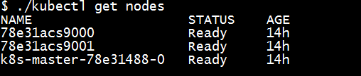
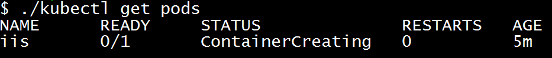
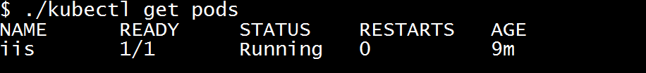
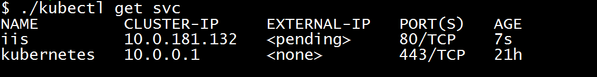
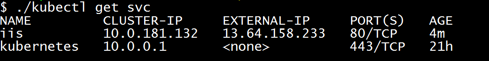

# Get started with Kubernetes and Windows containers in Container Service


This article shows you how to create a Kubernetes cluster in Azure Container Service that contains Windows nodes to run Windows containers. Get started with the `az acs` Azure CLI 2.0 commands to create the Kubernetes cluster in Azure Container Service. Then, use the Kubernetes `kubectl` command-line tool to start working with Windows containers built from Docker images. 

> [!NOTE]
> Support for Windows containers with Kubernetes in Azure Container Service is in preview. 
>


The following image shows the architecture of a Kubernetes cluster in Azure Container Service with one Linux master node and two Windows agent nodes. 


* The Linux master serves the Kubernetes REST API and is accessible by SSH on port 22 or `kubectl` on port 443. 
* The Windows agent nodes are grouped in an Azure availability set
and run your containers. The Windows nodes can be accessed through an RDP SSH tunnel via the master node. Azure load balancer rules are dynamically added to the cluster depending on exposed services.


All VMs are in the same private virtual network and are fully accessible to each other. All VMs run a kubelet, Docker, and a proxy.

For more background, see the [Azure Container Service introduction](container-service-intro.md) and the [Kubernetes documentation](https://kubernetes.io/docs/home/).

## Prerequisites
To create an Azure Container Service cluster using the Azure CLI 2.0, you must:
* have an Azure account ([get a free trial](https://azure.microsoft.com/pricing/free-trial/))
* have installed and logged in to the [Azure CLI 2.0](/cli/azure/install-az-cli2)

You also need the following for your Kubernetes cluster. You can prepare these in advance, or use `az acs create` command options to generate them automatically during cluster deployment. 

* **SSH RSA keys**: If you want to create Secure Shell (SSH) RSA keys in advance, see the [macOS and Linux](../virtual-machines/linux/mac-create-ssh-keys.md) or [Windows](../virtual-machines/linux/ssh-from-windows.md) guidance. If you have or create keys, make sure you run `ssh-add <path to private key>` to add the private key to `ssh-agent` (see [steps](../virtual-machines/linux/create-ssh-keys-detailed.md#using-ssh-agent-to-store-your-private-key-password)).  

* **Service principal client ID and secret**: For steps to create an Azure Active Directory service principal and additional information, see [About the service principal for a Kubernetes cluster](container-service-kubernetes-service-principal.md).

The command example in this article automatically generates the SSH keys and service principal.
  
## Create your Kubernetes cluster

Here are Azure CLI 2.0 commands to create your cluster. 

### Create a resource group
Create a resource group in a location where Azure Container Service is [available](https://azure.microsoft.com/regions/services/). The following command creates a resource group named *myKubernetesResourceGroup* in the *westus* location:

```azurecli
az group create --name=myKubernetesResourceGroup --location=westus
```

### Create a Kubernetes cluster with Windows agent nodes

Create a Kubernetes cluster in your resource group by using the `az acs create` command with `--orchestrator-type=kubernetes` and the `--windows` agent option. For command syntax, see the `az acs create` [help](/cli/azure/acs#create).

The following command creates a Container Service cluster named *myKubernetesClusterName*, with a DNS prefix *myPrefix* for the management node and the specified credentials to reach the Windows nodes. This version of the command automatically generates the SSH RSA keys and service principal for the Kubernetes cluster.


```azurecli
az acs create --orchestrator-type=kubernetes \
    --resource-group myKubernetesResourceGroup \
    --name=myKubernetesClusterName \
    --dns-prefix=myPrefix \
    --agent-count=2 \
    --generate-ssh-keys \
    --windows --admin-username myWindowsAdminName \
    --admin-password myWindowsAdminPassword
```

After several minutes, the command completes, and you should have a working Kubernetes cluster.

> [!IMPORTANT]
> If your account doesn't have permissions to create the Azure AD service principal, the command generates an error similar to `Insufficient privileges to complete the operation.` For more information, see [About the service principal for a Kubernetes cluster](container-service-kubernetes-service-principal.md). 
> 

## Connect to the cluster with kubectl

To connect to the Kubernetes cluster from your client computer, use [`kubectl`](https://kubernetes.io/docs/user-guide/kubectl/), the Kubernetes command-line client. 

If you don't have `kubectl` installed locally, you can install it with `az acs kubernetes install-cli`. (You can also download it from the [Kubernetes site](https://kubernetes.io/docs/tasks/kubectl/install/).)

**Linux or macOS**

```azurecli
sudo az acs kubernetes install-cli
```

**Windows**
```azurecli
az acs kubernetes install-cli
```

> [!TIP]
> By default, this command installs the `kubectl` binary to `/usr/local/bin/kubectl` on a Linux or macOS system, or `C:\Program Files (x86)\kubectl.exe` on Windows. To specify a different installation path, use the `--install-location` parameter.
>
> After `kubectl` is installed, ensure that its directory is in your system path, or add it to the path. 


Then, run the following command to download the master Kubernetes cluster configuration to the local `~/.kube/config` file:

```azurecli
az acs kubernetes get-credentials --resource-group=myKubernetesResourceGroup --name=myKubernetesClusterName
```

At this point, you are ready to access your cluster from your machine. Try running:

```bash
kubectl get nodes
```

Verify that you can see a list of the machines in your cluster.



## Create your first Kubernetes service

After creating the cluster and connecting with `kubectl`, try starting a Windows app from a Docker container and expose it to the internet. This basic example uses a JSON file to specify a Microsoft Internet Information Server (IIS) container, and then creates it using `kubctl apply`. 

1. Create a local file named `iis.json` and copy the following. This file tells Kubernetes to run IIS on Windows Server 2016 Server Core, using a public image from [Docker Hub](https://hub.docker.com/r/microsoft/iis/). The container uses port 80, but initially is only accessible within the cluster network.

  ```JSON
  {
    "apiVersion": "v1",
    "kind": "Pod",
    "metadata": {
      "name": "iis",
      "labels": {
        "name": "iis"
      }
    },
    "spec": {
      "containers": [
        {
          "name": "iis",
          "image": "microsoft/iis",
          "ports": [
            {
            "containerPort": 80
            }
          ]
        }
      ],
      "nodeSelector": {
        "beta.kubernetes.io/os": "windows"
      }
    }
  }
  ```
2. To start the application, type:  
  
  ```bash
  kubectl apply -f iis.json
  ```  
3. To track the deployment of the container, type:  
  ```bash
  kubectl get pods
  ```
  While the container is deploying, the status is `ContainerCreating`. 

     

  Because of the size of the IIS image, it can take several minutes for the container to enter the `Running` state.

  

4. To expose the container to the world, type the following command:

  ```bash
  kubectl expose pods iis --port=80 --type=LoadBalancer
  ```

  With this command, Kubernetes creates an Azure load balancer rule with a public IP address. The change takes a few minutes to propagate to the load balancer. For details, see [Load balance containers in a Kubernetes cluster in Azure Container Service](container-service-kubernetes-load-balancing.md).

5. Run the following command to see the status of the service.

  ```bash
  kubectl get svc
  ```

  Initially the IP address appears as `pending`:

  

  After a few minutes, the IP address is set:
  
  


6. After the external IP address is available, you can browse to it in your browser:

    

7. To delete the IIS pod, type:

  ```bash
  kubectl delete pods iis
  ```

## Next steps

* To use the Kubernetes UI, run the `kubectl proxy` command. Then, browse to http://localhost:8001/ui.

* For steps to build a custom IIS website and run it in a Windows container, see the guidance at [Docker Hub](https://hub.docker.com/r/microsoft/iis/).

* To access the Windows nodes through an RDP SSH tunnel to the master with PuTTy, see the [ACS-Engine documentation](https://github.com/Azure/acs-engine/blob/master/docs/ssh.md#create-port-80-tunnel-to-the-master). 
