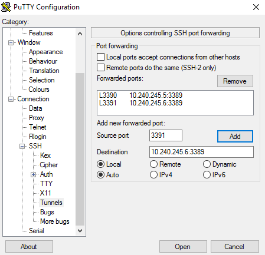

# Get started with Windows containers in a Kubernetes cluster


This article shows how to create a Kubernetes cluster in Azure Container Service that contains Windows nodes to run Windows containers. 

> [!NOTE]
> Support for Windows containers with Kubernetes in Azure Container Service is in preview. Use the Azure portal or a Resource Manager template to create a Kubernetes cluster with Windows nodes. This feature isn't currently supported with the Azure CLI 2.0 (Preview).


The following image shows the architecture of a Kubernetes cluster in Azure Container Service with one Linux master node and two Windows agent nodes. 

* The Linux master serves the Kubernetes REST API and is accessible by SSH on port 22 or `kubectl` on port 443. 
* The Windows agent nodes are grouped in an Azure availability set
and run your containers. The Windows nodes can be accessed through an RDP SSH tunnel via the master node. Azure load balancer rules are dynamically added to the cluster depending on exposed services.


All VMs are in the same private virtual network and are fully accessible to each other. All VMs run a kubelet, Docker, and a Proxy.
## Prerequisites


* **SSH RSA public key**: When deploying through the portal or one of the Azure quickstart templates, you need to provide the public key for authentication against Azure Container Service virtual machines. To create Secure Shell (SSH) RSA keys, see the [OS X and Linux](../virtual-machines/virtual-machines-linux-mac-create-ssh-keys.md) or [Windows](../virtual-machines/virtual-machines-linux-ssh-from-windows.md) guidance. 

* **Service principal client ID and secret**: For more information and guidance, see [About the service principal for a Kubernetes cluster](container-service-kubernetes-service-principal.md).


## Create the cluster

You can use the Azure portal to [create a Kubernetes cluster](container-service-deployment.md#create-a-cluster-by-using-the-azure-portal) with Windows agent nodes. Note the following steps:

*Steps to be added*

1. In **Orchestrator configuration**, select **Kubernetes - Windows**.
2. More steps....


## Connect to the cluster

Use the `kubectl` command-line tool to connect from your local computer to the master node of the Kubernetes cluster. For steps, see [Connect to an Azure Container Service cluster](container-service-connect#connect-to-a-kubernetes-cluster). You can use `kubectl` commands to access the Kubernetes web UI and to create and manage Windows container workloads.

## Create your first Kubernetes service

After creating the cluster and connecting with `kubectl`, you can try starting a basic Windows web app and expose it to the internet. In this example, you specify the container resources using a YAML file, and then create it using `kubctl apply`.

1. To see a list of your nodes, type `kubectl get nodes`.  If you want full details of the nodes, type:  

  ```
  kubectl get nodes -o yaml
  ```

2. Create a file named `simpleweb.yaml` and copy the contents below. This file sets up a web app using the Windows Server 2016 Server Core base OS image from [Docker Hub](https://hub.docker.com/r/microsoft/windowsservercore/).  

  ```yaml
  apiVersion: v1
  kind: Service
  metadata:
    name: win-webserver
    labels:
      app: win-webserver
  spec:
    ports:
      # the port that this service should serve on
    - port: 80
      targetPort: 80
    selector:
      app: win-webserver
    type: LoadBalancer
  ---
  apiVersion: extensions/v1beta1
  kind: Deployment
  metadata:
    labels:
      app: win-webserver
    name: win-webserver
  spec:
    replicas: 1
    template:
      metadata:
        labels:
          app: win-webserver
        name: win-webserver
      spec:
        containers:
        - name: windowswebserver
          image: microsoft/windowsservercore
          command:
          - powershell.exe
          - -command
          - "<#code used from https://gist.github.com/wagnerandrade/5424431#> ; $$ip = (Get-NetIPAddress | where {$$_.IPAddress -Like '*.*.*.*'})[0].IPAddress ; $$url = 'http://'+$$ip+':80/' ; $$listener = New-Object System.Net.HttpListener ; $$listener.Prefixes.Add($$url) ; $$listener.Start() ; $$callerCounts = @{} ; Write-Host('Listening at {0}...' -f $$url) ; while ($$listener.IsListening) { ;$$context = $$listener.GetContext() ;$$requestUrl = $$context.Request.Url ;$$clientIP = $$context.Request.RemoteEndPoint.Address ;$$response = $$context.Response ;Write-Host '' ;Write-Host('> {0}' -f $$requestUrl) ;  ;$$count = 1 ;$$k=$$callerCounts.Get_Item($$clientIP) ;if ($$k -ne $$null) { $$count += $$k } ;$$callerCounts.Set_Item($$clientIP, $$count) ;$$header='<html><body><H1>Windows Container Web Server</H1>' ;$$callerCountsString='' ;$$callerCounts.Keys | % { $$callerCountsString+='<p>IP {0} callerCount {1} ' -f $$_,$$callerCounts.Item($$_) } ;$$footer='</body></html>' ;$$content='{0}{1}{2}' -f $$header,$$callerCountsString,$$footer ;Write-Output $$content ;$$buffer = [System.Text.Encoding]::UTF8.GetBytes($$content) ;$$response.ContentLength64 = $$buffer.Length ;$$response.OutputStream.Write($$buffer, 0, $$buffer.Length) ;$$response.Close() ;$$responseStatus = $$response.StatusCode ;Write-Host('< {0}' -f $$responseStatus)  } ; "
        nodeSelector:
          beta.kubernetes.io/os: windows
  ```

3. To start the application, type:

  ```
  kubectl apply -f simpleweb.yaml
  ```
  
  > [!NOTE] 
  > The configuration includes `type: LoadBalancer`. This setting causes the service to be exposed to the internet through an Azure load balancer. For more information, see [Load balance containers in a Kubernetes cluster in Azure Container Service](container-service-kubernetes-load-balancing.md).
  
4. To verify the deployment of the service (which takes about 30 seconds), type:

  ```
  kubectl get pods
  ```

5. After the service is running, to see the internal and external IP addresses of the service, type:

  ```
  kubectl get svc
  ``` 

  

  The addition of the external IP address takes several minutes. Before the load balancer configures the external address, it appears as `<pending>`.


6. After the external IP address is available, you can reach the service in your web browser.

  


## Access the Windows nodes
Windows nodes can be accessed through an RDP SSH tunnel via the master node. 

There are multiple options for creating SSH tunnels on Windows. This section describes how to use PuTTY to create the tunnel.

1. [Download PuTTY](http://www.chiark.greenend.org.uk/~sgtatham/putty/download.html) to your Windows system.

2. Run the application.

3. Enter a host name that is comprised of the cluster admin user name and the public DNS name of the first master in the cluster. The **Host Name** looks similar to `adminuser@PublicDNSName`. Enter 2200 for the **Port**.

    

4. Select **SSH > Auth**. Add a path to your private key file (.ppk format) for authentication. You can use a tool such as [PuTTYgen](http://www.chiark.greenend.org.uk/~sgtatham/putty/download.html) to generate this file from the SSH key used to create the cluster.

    

5. Select **SSH > Tunnels** and configure the following forwarded ports:

    * **Source Port:** Use 80 for DC/OS or 2375 for Swarm.
    * **Destination:** Use localhost:80 for DC/OS or localhost:2375 for Swarm.

    The following example is configured for DC/OS, but will look similar for Docker Swarm.

    > [!NOTE]
    > Port 80 must not be in use when you create this tunnel.
    > 

    

6. When you're finished, click **Session > Save** to save the connection configuration.

7. To connect to the PuTTY session, click **Open**. When you connect, you can see the port configuration in the PuTTY event log.

    

To do this, follow these [instructions](ssh.md#create-port-80-tunnel-to-the-master), replacing port 80 with 3389. Since your windows machine is already using port 3389, it is recommended to use 3390 to Windows Node 0, 10.240.245.5, 3391 to Windows Node 1, 10.240.245.6, and so on as shown in the following image:




## Next steps

Here are recommended links to learn more about Kubernetes:

* [Kubernetes Bootcamp](https://kubernetesbootcamp.github.io/kubernetes-bootcamp/index.html) - shows you how to deploy, scale, update, and debug containerized applications.
* [Kubernetes Userguide](http://kubernetes.io/docs/user-guide/) - provides information on running programs in an existing Kubernetes cluster.
* [Kubernetes Examples](https://github.com/kubernetes/kubernetes/tree/master/examples) - provides a number of examples on how to run real applications with Kubernetes.