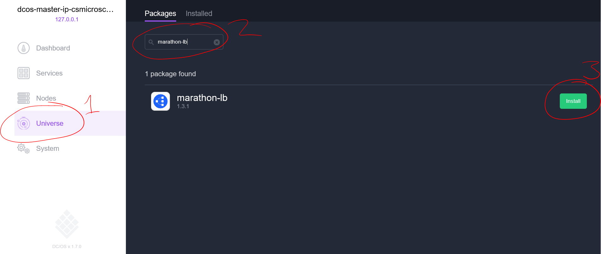

<properties
   pageTitle="Load balance containers in an Azure Container Service cluster | Microsoft Azure"
   description="Load balance across multiple containers in an Azure Container Service cluster."
   services="container-service"
   documentationCenter=""
   authors="rgardler"
   manager="timlt"
   editor=""
   tags="acs, azure-container-service"
   keywords="Containers, Micro-services, DC/OS, Azure"/>

<tags
   ms.service="container-service"
   ms.devlang="na"
   ms.topic="get-started-article"
   ms.tgt_pltfrm="na"
   ms.workload="na"
   ms.date="07/11/2016"
   ms.author="rogardle"/>

# Load balance containers in an Azure Container Service cluster

In this article, we'll explore how to create an internal load balancer in a a DC/OS managed Azure Container Service using Marathon-LB. This will enable you to scale your applications horizontally. It will also enable you to take
advantage of the public and private agent clusters by placing your load balancers on the public cluster and your application containers on the private cluster.

## Prerequisites

[Deploy an instance of Azure Container Service](container-service-deployment.md) with orchestrator type DC/OS and [ensure that your client can connect to your cluster](container-service-connect.md). 

## Load balancing

There are two load-balancing layers in the Container Service cluster we will build: 

  1. Azure Load Balancer provides public entry points (the ones that end users will hit). This is provided automatically by Azure Container Service and is, by default, configured to expose port 80, 443 and 8080.
  2. The Marathon Load Balancer (marathon-lb) routes inbound requests to container instances that service those requests. As we scale the containers providing our web service, marathon-lb dynamically adapts. This load balancer is not provided by default in your Container Service, but it is very easy to install.

## Marathon Load Balancer

Marathon Load Balancer dynamically reconfigures itself based on the containers that you've deployed. It's also resilient to the loss of a container or an agent - if this occurs, Apache Mesos will simply restart the container elsewhere and marathon-lb will adapt.

To install the Marathon Load Balancer you can use either the DC/OS web UI or the command line.

### Install Marathon-LB using DC/OS Web UI

  1. Click 'Universe'
  2. Search for 'Marathon-LB'
  3. Click 'Install'



### Install Marathon-LB using the DC/OS CLI

After installing the DC/OS CLI and ensuring you can connect to your cluster, run the following command from your client machine:

```bash
dcos package install marathon-lb
```

This commadn automatically installs the load balancer on the public agents cluster.

## Deploy A Load Balanced Web Application

Now that we have the marathon-lb package, we can deploy an application container that we wish to load balance. For this example we will deploy a simple web server by using the following configuration:

```json
{
  "id": "web",
  "container": {
    "type": "DOCKER",
    "docker": {
      "image": "yeasy/simple-web",
      "network": "BRIDGE",
      "portMappings": [
        { "hostPort": 0, "containerPort": 80, "servicePort": 10000 }
      ],
      "forcePullImage":true
    }
  },
  "instances": 3,
  "cpus": 0.1,
  "mem": 65,
  "healthChecks": [{
      "protocol": "HTTP",
      "path": "/",
      "portIndex": 0,
      "timeoutSeconds": 10,
      "gracePeriodSeconds": 10,
      "intervalSeconds": 2,
      "maxConsecutiveFailures": 10
  }],
  "labels":{
    "HAPROXY_GROUP":"external",
    "HAPROXY_0_VHOST":"YOUR FQDN",
    "HAPROXY_0_MODE":"http"
  }
}

```

  * Set the value of `HAProxy_0_VHOST` to the FQDN of the load balancer for your agents. This is in the form `<acsName>agents.<region>.cloudapp.azure.com`. For example, if you create a Container Service cluster with name `myacs` in region `West US`, the FQDN would be `myacsagents.westus.cloudapp.azure.com`. You can also find this by looking for the load balancer with "agent" in the name when you're looking through the resources in the resource group that you created for Container Service in the [Azure portal](https://portal.azure.com).
  * Set the servicePort to a port >= 10,000. This identifies the service that is being run in this container--marathon-lb uses this to identify services that it should balance across.
  * Set the `HAPROXY_GROUP` label to "external".
  * Set `hostPort` to 0. This means that Marathon will arbitrarily allocate an available port.
  * Set `instances` to the number of instances you want to create. You can always scale these up and down later.

It is worth noing that by default Marathon will deploy to the private cluster, this means that the above deployment will only be accessible via your load balancer, which is usually the behavior we desire.

### Deploy using the DC/OS Web UI

  1. Visit the Marathon page at http://localhost/marathon (after setting up your [SSH tunnel](container-service-connect.md) and click `Create Appliction`
  2. In the `New Application` dialog click `JSON Mode` in the upper right corner
  3. Paste the above JSON into the editor
  4. Click `Create Appliction`

### Deploy using the DC/OS CLI

To deploy this application with the DC/OS CLI simply copy the above JSON into a file called `hello-web.json`, and run:

```bash
dcos marathon app add hello-web.json
```

## Azure Load Balancer

By default, Azure Load Balancer exposes ports 80, 8080, and 443. If you're using one of these three ports (as we do in the above example), then there is nothing you need to do. You should be able to hit your agent load balancer's FQDN--and each time you refresh, you'll hit one of your three web servers in a round-robin fashion. However, if you use a different port, you need to add a round-robin rule and a probe on the load balancer for the port that you used. You can do this from the [Azure CLI](../xplat-cli-azure-resource-manager.md), with the commands `azure lb rule create` and `azure lb probe create`. You can also do this using the Azure Portal.


## Additional scenarios

You could have a scenario where you use different domains to expose different services. For example:

mydomain1.com -> Azure LB:80 -> marathon-lb:10001 -> mycontainer1:33292  
mydomain2.com -> Azure LB:80 -> marathon-lb:10002 -> mycontainer2:22321

To achieve this, check out [virtual hosts](https://mesosphere.com/blog/2015/12/04/dcos-marathon-lb/), which provide a way to associate domains to specific marathon-lb paths.

Alternatively, you could expose different ports and remap them to the correct service behind marathon-lb. For example:

Azure lb:80 -> marathon-lb:10001 -> mycontainer:233423  
Azure lb:8080 -> marathon-lb:1002 -> mycontainer2:33432


## Next steps

See the DC/OS documentation for more on [marathon-lb](https://dcos.io/docs/1.7/usage/service-discovery/marathon-lb/).
