<properties
   pageTitle="Azure Container Service container management through the web UI | Microsoft Azure"
   description="Deploy containers to an Azure Container Service cluster service by using the Marathon web UI."
   services="container-service"
   documentationCenter=""
   authors="neilpeterson"
   manager="timlt"
   editor=""
   tags="acs, azure-container-service"
   keywords="Docker, Containers, Micro-services, Mesos, Azure"/>

<tags
   ms.service="container-service"
   ms.devlang="na"
   ms.topic="get-started-article"
   ms.tgt_pltfrm="na"
   ms.workload="na"
   ms.date="02/16/2016"
   ms.author="nepeters"/>

# Container management through the web UI

DC/OS provides an environment for deploying and scaling clustered workloads, while abstracting the underlying hardware. On top of DC/OS, there is a framework that manages scheduling and executing compute workloads.

While frameworks are available for many popular workloads, this document will describe how you can create and scale container deployments with Marathon. Before working through these examples, you will need a DC/OS cluster that is configured in Azure Container Service. You also need to have remote connectivity to this cluster. For more information on these items, see the following articles:

- [Deploy an Azure Container Service cluster](container-service-deployment.md)
- [Connect to an Azure Container Service cluster](container-service-connect.md)

## Explore the DC/OS UI

With a Secure Shell (SSH) tunnel established, browse to http://localhost/. This loads the DC/OS web UI and shows information about the cluster, such as used resources, active agents, and running services.

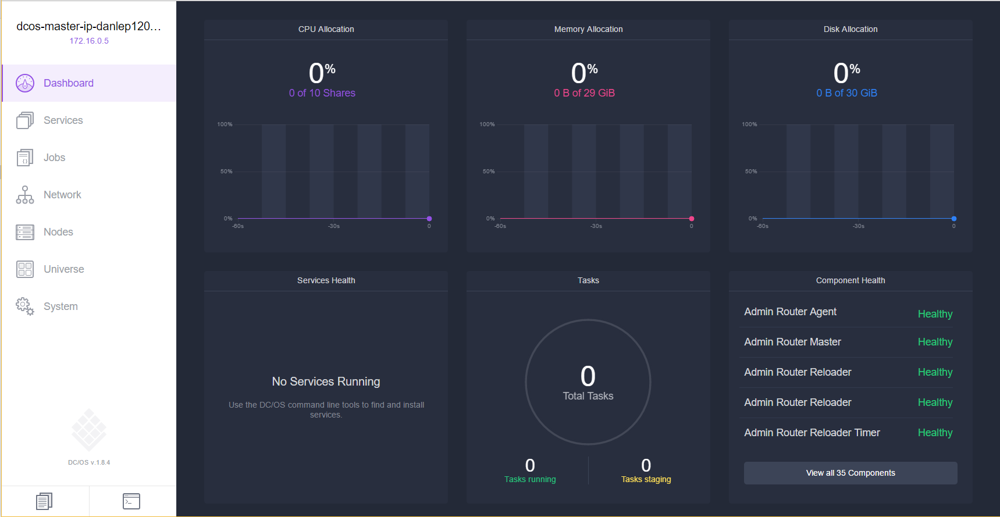

## Explore the Marathon UI

To see the Marathon UI, browse to http://localhost/Marathon. From this screen, you can start a new container or another application on the Azure Container Service DC/OS cluster. You can also see information about running containers and applications.  

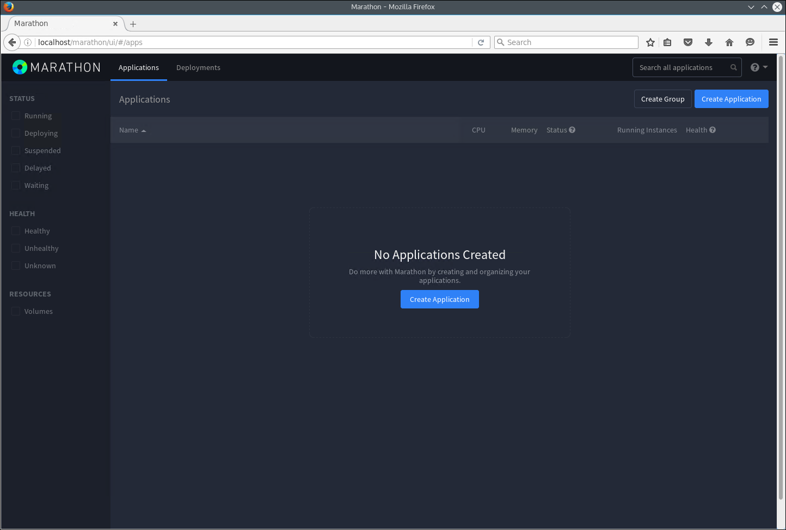

## Deploy a Docker-formatted container

To deploy a new container by using Marathon, click the **Create Application** button, and enter the following information into the form:

Field           | Value
----------------|-----------
ID              | nginx
Image           | nginx
Network         | Bridged
Host Port       | 80
Protocol        | TCP

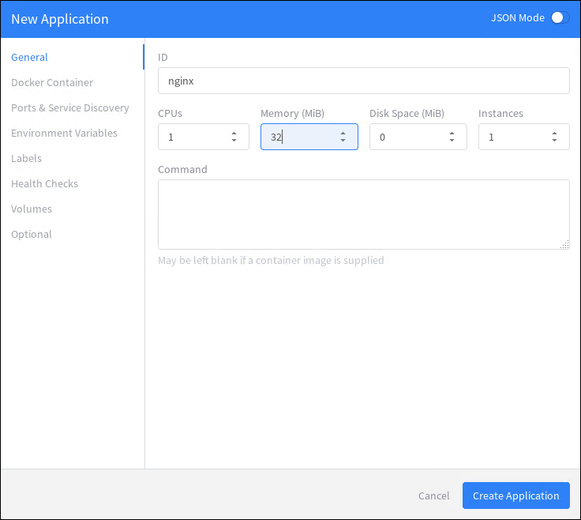

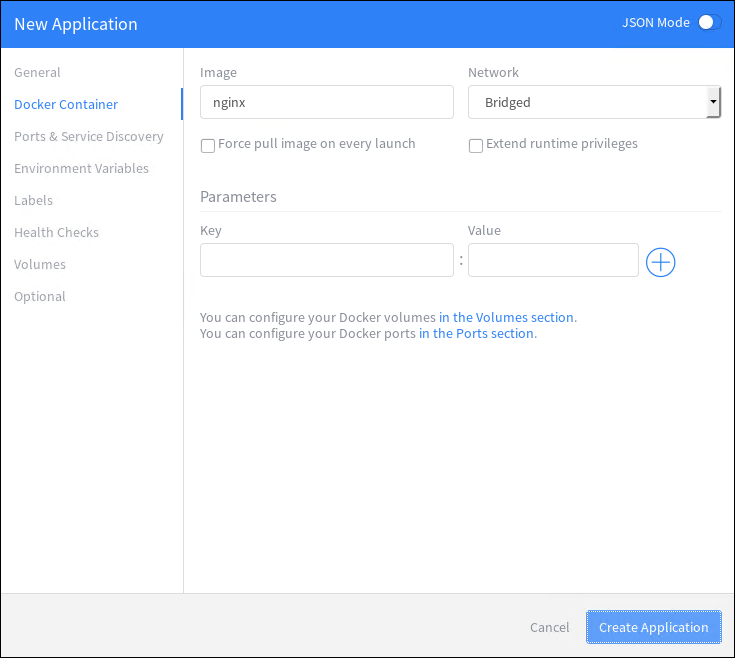

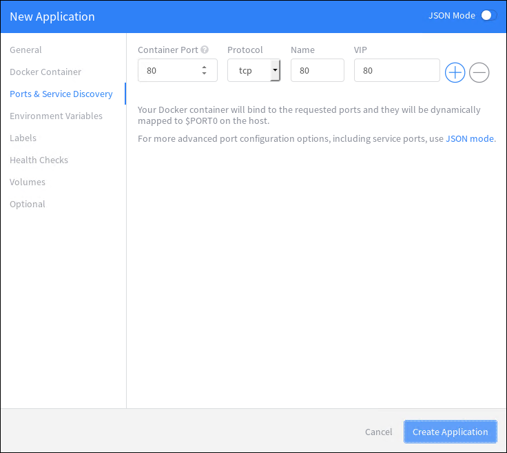

If you want to statically map the container port to a port on the agent, you need to use JSON Mode. To do so, switch the New Application wizard to **JSON Mode** by using the toggle. Then enter the following under the `portMappings` section of the application definition. This example binds port 80 of the container to port 80 of the DC/OS agent. You can switch this wizard out of JSON Mode after you make this change.

```none
“hostPort”: 80,
```

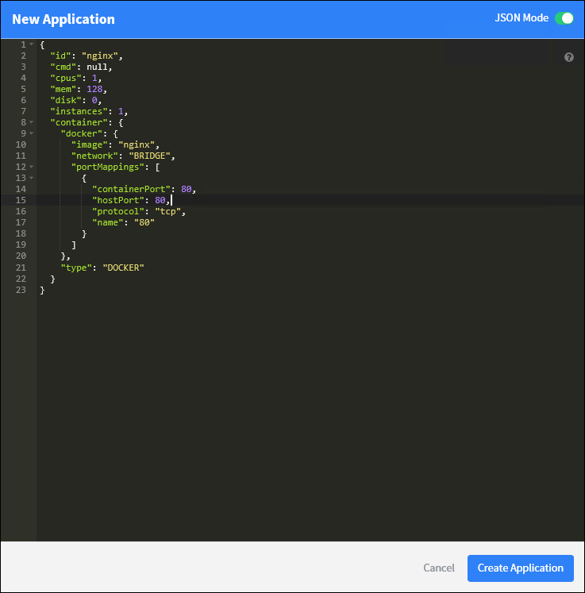

The DC/OS cluster is deployed with set of private and public agents. For the cluster to be able to access applications from the Internet, you need to deploy the applications to a public agent. To do so, select the **Optional** tab of the New Application wizard and enter **slave_public** for the **Accepted Resource Roles**.

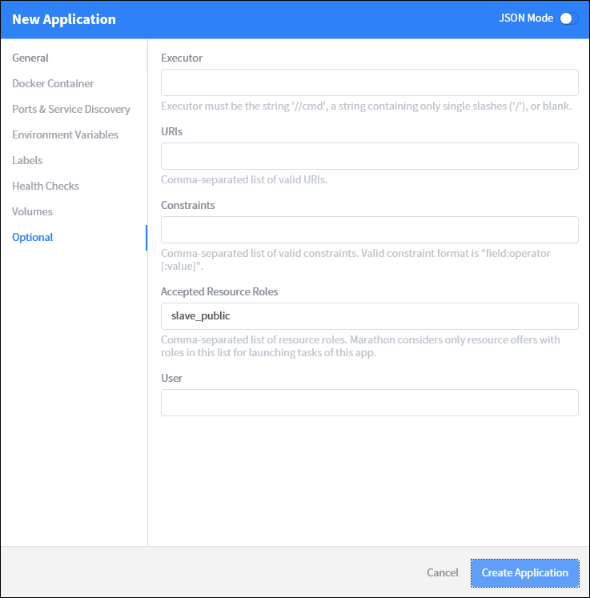

Back on the Marathon main page, you can see the deployment status for the container.


When you switch back to the DC/OS web UI (http://localhost/), you will see that a task (in this case, a Docker-formatted container) is running on the DC/OS cluster.

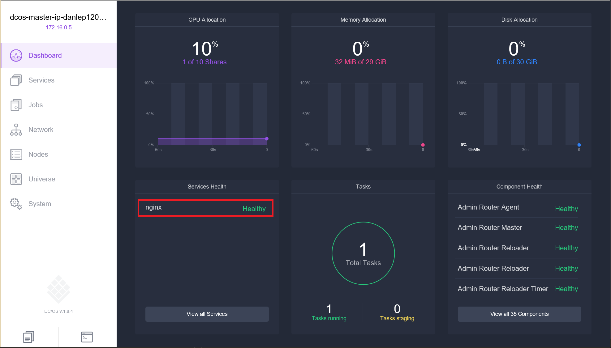

You can also see the cluster node that the task is running on.

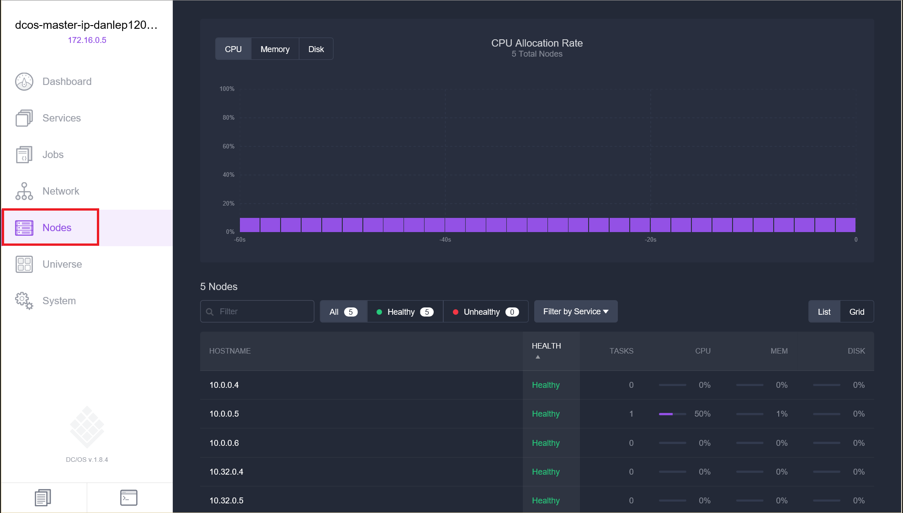

## Scale your containers

You can use the Marathon UI to scale the instance count of a container. To do so, navigate to the **Marathon** page, select the container that you want to scale, and click the **Scale** button. In the **Scale Application** dialog box, enter the number of container instances that you want, and select **Scale Application**.

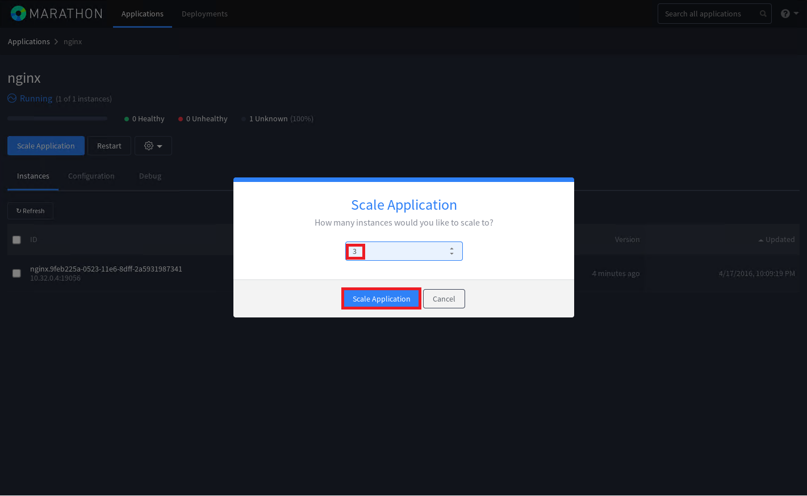

After the scale operation finishes, you will see multiple instances of the same task spread across DC/OS agents.

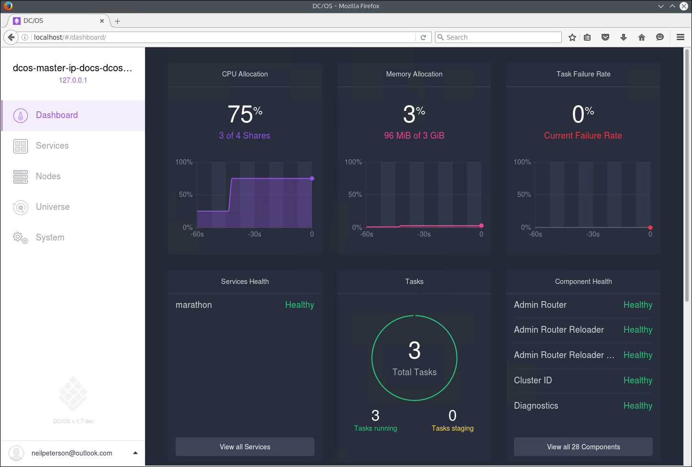

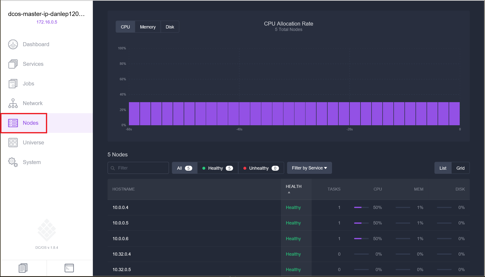

## Next steps

- [Work with DC/OS and the Marathon API](container-service-mesos-marathon-rest.md)

Deep dive on the Azure Container Service with Mesos

>[AZURE.VIDEO] azurecon-2015-deep-dive-on-the-azure-container-service-with-mesos]
