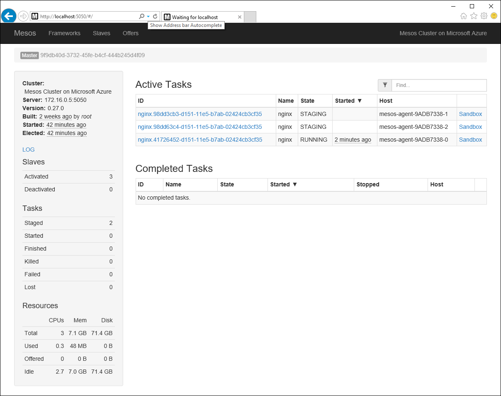

<properties
   pageTitle=""
   description=""
   services="container-service"
   documentationCenter=""
   authors="rgardler"
   manager="nepeters"
   editor=""
   tags="acs, azure-container-service"
   keywords="Docker, Containers, Micro-services, Mesos, Azure"/>
   
<tags
   ms.service="container-service"
   ms.devlang="na"
   ms.topic="home-page"
   ms.tgt_pltfrm="na"
   ms.workload="na"
   ms.date="12/02/2015"
   ms.author="rogardle"/>
   
# Container management through the web UI
   
Mesos provides an environment for deploying and scaling clustered workload while abstracting the underlying hardware. On top of Mesos, a framework manages scheduling and executing compute workload. While frameworks are available for many popular workloads, this document will detail creating and scaling container deployments with Marathon. Before working through these examples, you will need a Mesos cluster configured in ACS and have remote connectivity to this cluster. For more information in these items see the following articles.

- [Deploying an Azure Container Service Cluster](./container-service-deployment.md) 
- [Connecting to an ACS Cluster](./container-service-connect.md)

## Explore the Mesos UI

With an SSH Tunnel established, browse to http://localhost:5050. This will load the Mesos web UI. From the page you can gather information about the Mesos cluster such as activated agents, task status, and resource availability.

## Explore the Marathon UI

To see the Marathon UI, browse to http://localhost:8080. From this screen you can start new container or other application on the ACS Mesos cluster, as well see information about running containers and application.  

## Deploy a Docker Container

To use Marathon to start a new container on the Mesos cluster, click the `Create Application` button. The New Application form is used to define the application or container parameters. For this example, a simple Nginx container will be deployed. Enter the following information.

Field           | Value
----------------|-----------
ID              | nginx
Image           | nginx
Network         | Bridged
Container Port  | 80
Host Port       | 80
Protocol        | TCP

Click create application when completed. 

Back on the Marathon main page, status about the new Nginx deployment can be seen.

If you switch back to the Mesos app (http://localhost:5050), you will now see that a task (in this case a Docker container) is running on the Mesos cluster. You can also see the cluster node that the task is running on.

## Scale a Docker Container

