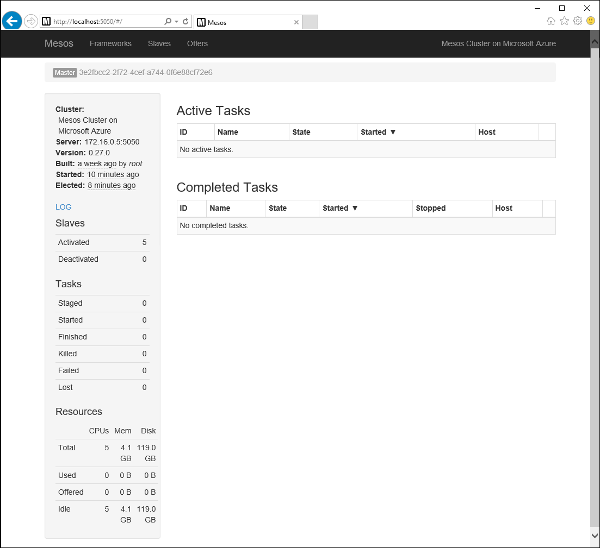
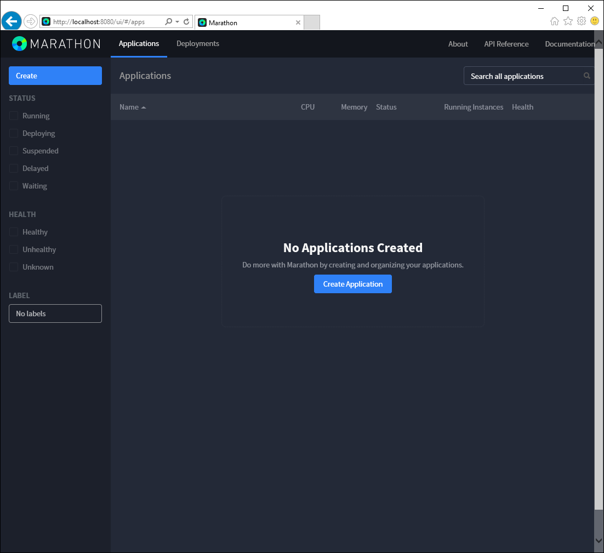
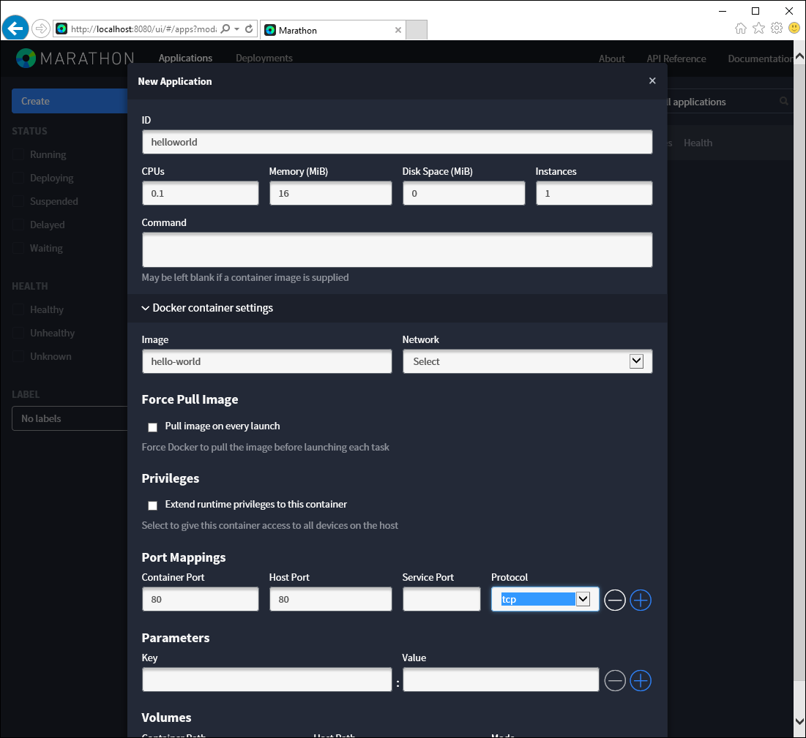
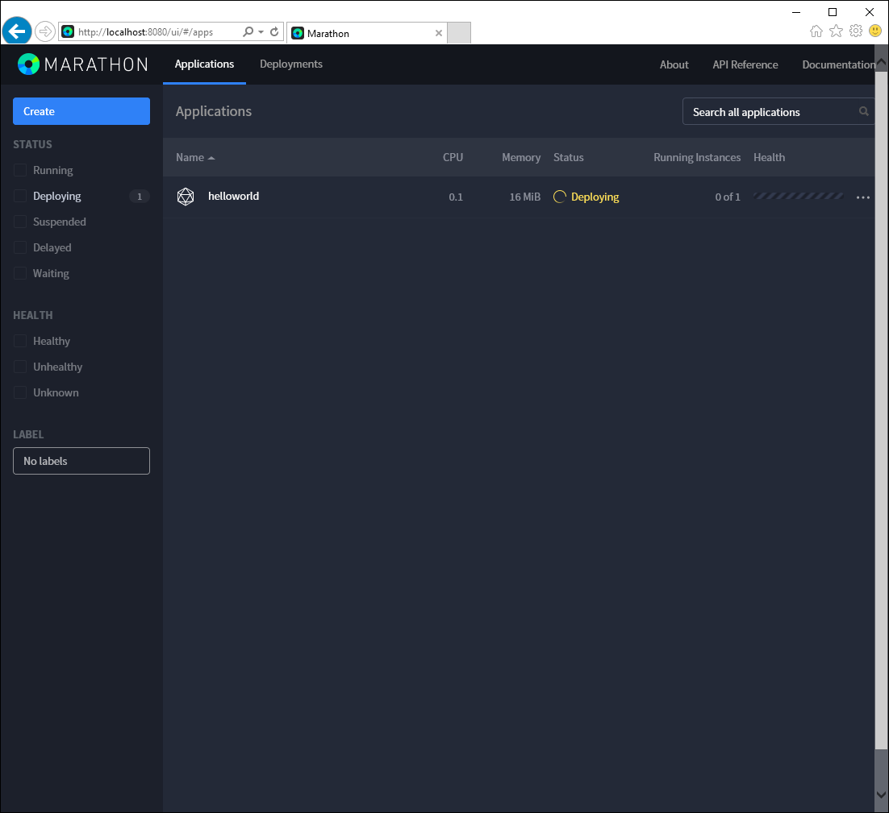
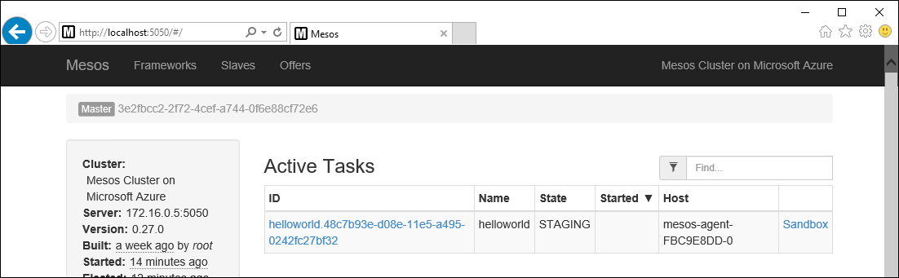
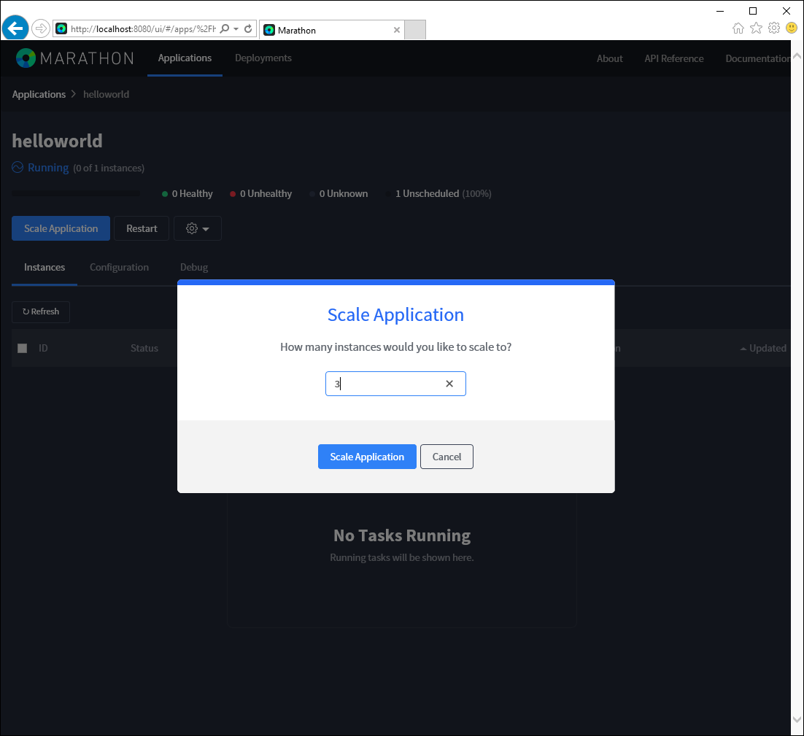
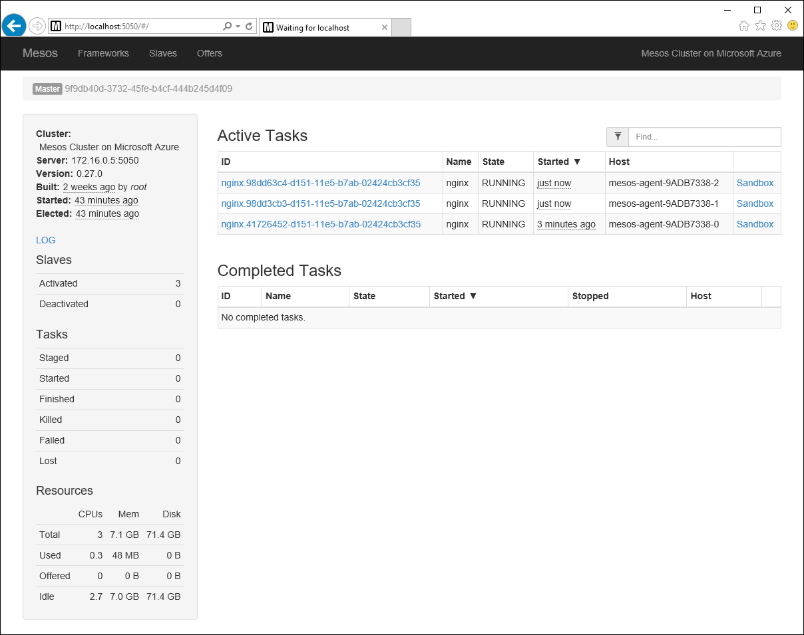

<properties
   pageTitle="Azure Container Service container management through the web UI | Microsoft Azure"
   description="Deploy containers to an Azure Container Service cluster service using the Marathon web UI."
   services="container-service"
   documentationCenter=""
   authors="neilpeterson"
   manager="timlt"
   editor=""
   tags="acs, azure-container-service"
   keywords="Docker, Containers, Micro-services, Mesos, Azure"/>

<tags
   ms.service="container-service"
   ms.devlang="na"
   ms.topic="get-started-article"
   ms.tgt_pltfrm="na"
   ms.workload="na"
   ms.date="02/16/2016"
   ms.author="nepeters"/>

# Container management through the web UI

Mesos provides an environment for deploying and scaling clustered workloads, while abstracting the underlying hardware. On top of Mesos, there is a framework that manages scheduling and executing compute workloads.

While frameworks are available for many popular workloads, this document will describe how you can create and scale container deployments with Marathon. Before working through these examples, you will need a Mesos cluster that is configured in Azure Container Service. You also need to have remote connectivity to this cluster. For more information on these items, see the following articles.

- [Deploying an Azure Container Service cluster](./container-service-deployment.md)
- [Connecting to an Azure Container Service cluster](./container-service-connect.md)

## Explore the Mesos UI

With a Secure Shell (SSH) tunnel established, browse to http://localhost/Mesos. This will load the Mesos web UI. From the page, you can gather information about the Mesos cluster--such as activated agents, task status, and resource availability.

## Explore the Marathon UI

To see the Marathon UI, browse to http://localhost/Marathon. From this screen, you can start a new container or other application on the Azure Container Service Mesos cluster. You can also see information about running containers and applications.  

## Deploy a Docker-formatted container

To use Marathon to start a new container on the Mesos cluster, click the **Create Application** button. You use the **New Application** form to define the application or container parameters. For this example, you will deploy a simple Nginx container. Enter the following information. Click **Create** when you are finished.

Field           | Value
----------------|-----------
ID              | nginx
Image           | nginx
Network         | Bridged
Container Port  | 80
Host Port       | 80
Protocol        | TCP

Back on the Marathon main page, you can see the deployment status for the container.

If you switch back to the Mesos app (http://localhost/Mesos), you will now see that a task, in this case a Docker-formatted container, is running on the Mesos cluster. You can also see the cluster node that the task is running on.

## Scale your containers

You can also use the Marathon web UI to scale the instance count of a container. To do so, navigate to the Marathon page, select the container that you would like to scale, and click the **Scale** button. In the **Scale Application** dialog box, enter the number of container instances that you would like, and select **Scale Application**.

After the scale operation is complete, you will see multiple instances of the same task spread across Mesos agents.

