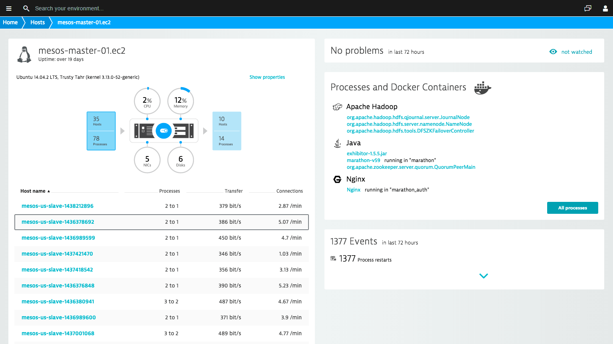
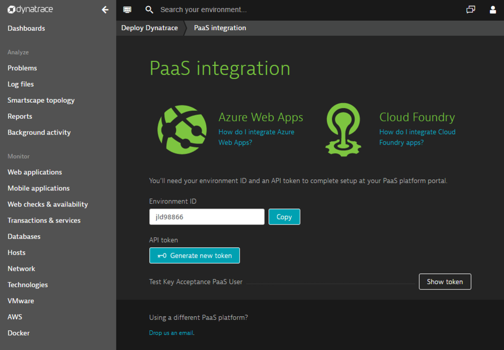
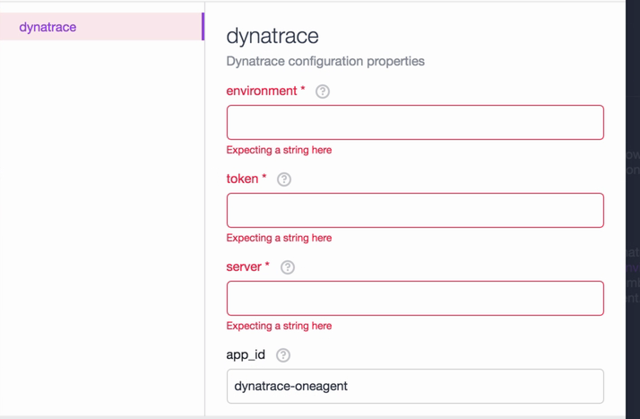

# Monitor an Azure Container Service cluster with Dynatrace SaaS/Managed
In this article, we will deploy the Dynatrace OneAgent to all the agent nodes in your Azure Container Service cluster. You need an account with Dynatrace SaaS/Managed for this configuration. 

## Dynatrace SaaS/Managed
Dynatrace is a cloud-native monitoring solution for highly dynamic container and cluster environments. It allows you to better optimize your container deployments and memory allocations by using real-time usage data. It is capable of automatically pinpointing application and infrastructure issues by providing automated baselining, problem correlation, and root-cause detection.

## Prerequisites 
[Deploy](container-service-deployment.md) and [connect](container-service-connect.md) to a cluster configured by Azure Container Service. Explore the [Marathon UI](container-service-mesos-marathon-ui.md). Go to [https://www.dynatrace.com/trial/](https://www.dynatrace.com/trial/) to set up a Dynatrace SaaS account.  

## Configure a Dynatrace deployment with Marathon
These steps will show you how to configure and deploy Dynatrace applications to your cluster with Marathon.

Access your DC/OS UI via [http://localhost:80/](http://localhost:80/) Once in the DC/OS UI navigate to the "Universe", which is on the bottom left and then search for "Dynatrace".

!

Now to complete the configuration you need a Dynatrace SaaS account or a free trial account. Once you're logged in to the Dynatrace dashboard, select "Deploy Dynatrace".

and on the page you should see "Set up PaaS integration". 

 

Next enter your API token into the Dynatrace OneAgent configuration within the DC/OS Universe.  

Now set the instances to the number of nodes you intend to run. Setting a higher number also works, but DC/OS will keep trying to find new instances until that number is actually reached. If you prefer, you can also set this to a value like 1000000, so whenever a new node is added to the cluster Dynatrace will automatically deploy an agent to that new node, at the price of DC/OS constantly trying to deploy further instances.

Once you've installed the package navigate back to the Dynatrace dashboard and you'll be able to explore the different usage metrics for the containers within your cluster. 