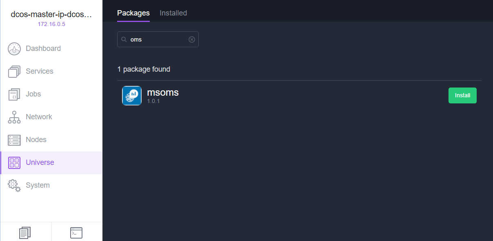

# Monitor an Azure Container Service DC/OS cluster with Operations Management Suite

Microsoft Operations Management Suite (OMS) is Microsoft's cloud-based IT
management solution that helps you manage and protect your on-premises
and cloud infrastructure. Container Solution is a solution in OMS Log
Analytics, which helps you view the container inventory, performance,
and logs in a single location. You can audit, troubleshoot containers by
viewing the logs in centralized location, and find noisy consuming
excess container on a host.


For more information about Container Solution, please refer to the
[Container Solution Log
Analytics](../log-analytics/log-analytics-containers.md).

## Setting up OMS from the DC/OS universe


This article assumes that you have set up an DC/OS and
have deployed simple web container applications on the cluster.

### Pre-requisite
- [Microsoft Azure Subscription](https://azure.microsoft.com/free/) - You can get this for free.  
- Microsoft OMS Workspace Setup - see "Step 3" below
- [DC/OS CLI](https://dcos.io/docs/1.8/usage/cli/install/) installed.

1. In the DC/OS dashboard, click on Universe and search
for ‘OMS’ as shown below.



2. Click **Install**. You will see a pop up with the OMS version
information and an **Install Package** or **Advanced Installation**
button. When you click **Advanced Installation**, which leads you to the **OMS specific configuration
properties** page.


3. Here, you will be asked to enter the `wsid` (the OMS workspace ID)
and `wskey` (the OMS primary key for the workspace id). To get both `wsid` and
`wskey` you need to create an OMS account at <https://mms.microsoft.com>.
Please follow the steps to create an account. Once you are done creating
the account, you need to obtain your `wsid` and `wskey` by clicking **Settings**, then **Connected Sources**, and then **Linux Servers**, as shown below.

 

4. Select the number you OMS instances that you want and click the ‘Review and Install’ button. Typically, you will want to have the number of OMS instances equal to the number of VM’s you have in your agent cluster. OMS Agent for Linux is installs as individual containers on each VM that it wants to collect information for monitoring and logging information.

## Setting up a simple OMS dashboard

Once you have installed the OMS Agent for Linux on the VMs, next step is
to set up the OMS dashboard. There are two ways to do this: OMS Portal
or Azure Portal.

### OMS Portal 

Log in to the OMS portal (<https://mms.microsoft.com>) and go to the **Solution
Gallery**.


Once you are in the **Solution Gallery**, select **Containers**.


Once you’ve selected the Container Solution, you will see the tile on
the OMS Overview Dashboard page. Once the ingested container data is
indexed, you will see the tile populated with information on the
solution view tiles.


### Azure Portal 

Login to Azure portal at <https://portal.microsoft.com/>. Go to
**Marketplace**, select **Monitoring + management** and click **See All**. Then Type `containers` in search. You will see "containers" in the search results. Select **Containers** and click **Create**.


Once you click **Create**, it will ask you for your workspace. Select your
workspace or if you do not have one, create a new workspace.


Once you’ve selected your workspace, click **Create**.


For more information about the OMS Container Solution, please refer to the
[Container Solution Log
Analytics](../log-analytics/log-analytics-containers.md).

### How to scale OMS Agent with ACS DC/OS 

In case you need to have installed OMS agent short of the actual node
count or you are scaling up VMSS by adding more VM, you can do so by
scaling the `msoms` service.

You can either go to Marathon or the DC/OS UI Services tab and scale up
your node count.


This will deploy to other nodes which have not yet deployed the OMS agent.

## Uninstall MS OMS

To uninstall MS OMS enter the following command:

```bash
$ dcos package uninstall msoms
```

## Let us know!!!
What works? What is missing? What else do you need for this to be useful for you? Let us know at <a href="mailto:OMSContainers@microsoft.com">OMSContainers</a>.

## Next steps

 Now that you have set up OMS to monitor your containers,[see your container dashboard](../log-analytics/log-analytics-containers.md).
