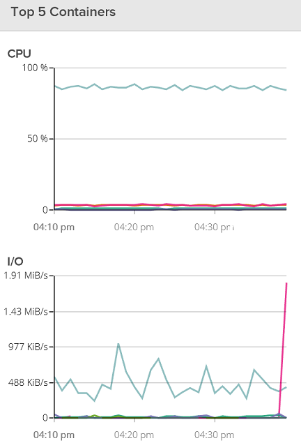
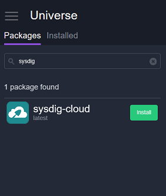
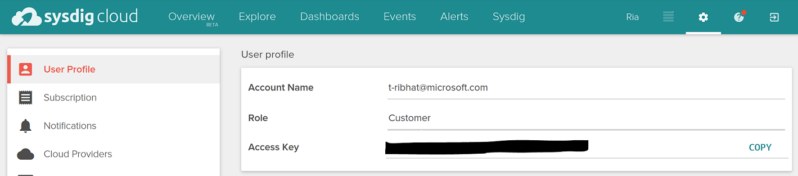
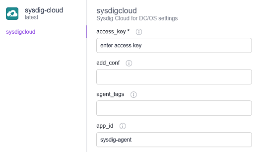
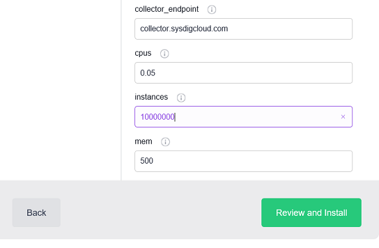

<properties
   pageTitle="Monitor an Azure Container Service cluster with Sysdig | Microsoft Azure"
   description="Monitor an Azure Container Service cluster with Sysdig."
   services="container-service"
   documentationCenter=""
   authors="rbitia"
   manager="timlt"
   editor=""
   tags="acs, azure-container-service"
   keywords="Containers, DC/OS, Azure"/>

<tags
   ms.service="container-service"
   ms.devlang="na"
   ms.topic="get-started-article"
   ms.tgt_pltfrm="na"
   ms.workload="na"
   ms.date="08/8/2016"
   ms.author="t-ribhat"/>

# Monitor an Azure Container Service cluster with Sysdig

In this article we will deploy Sysdig agents to all the agent nodes in your Azure Container Service cluster. You will need an account with Sysdig for this configuration. 

## Prerequisites 

[Deploy](container-service-deployment.md) and [connect](container-service-connect.md) a cluster configured by Azure Container Service. Explore the [Marathon UI](container-service-mesos-marathon-ui.md). Go to [http://app.sysdigcloud.com](http://app.sysdigcloud.com) to set up a Sysdig cloud account. 

## Sysdig

Sysdig is a monitoring service that allows you to monitor your containers within your cluster. Sysdig is known to help with troubleshooting but it also has your basic monitoring metrics for CPU, Networking, Memory and I/O. Sysdig makes it easy to see which containers are working the hardest or essentially using the most memory and CPU. This view is in the “Overview” section which is currently in beta. 

 

## Configure a Sysdig deployment with Marathon

These steps will show you how to configure and deploy Sysdig applications to your cluster with Marathon. 

Access your DC/OS UI via http://localhost:80/. Once in the DC/OS UI navigate to the "Universe" which is on the bottom left and then search for "Sysdig."

Now to complete the configuration you will need a Sysdig cloud account or a free trial account. Once your logged into the Sysdig cloud website and click on your user name and on the page you should see your "Access Key." 

 

Next enter your Access Key into the Sysdig configuration within the DC/OS Universe. 

Now set the instances to 10000000 so whenever a new node is added to the cluster Sysdig will automatically deploy an agent to that new node. This is unfortunetly a hack to make sure Sysdig will deploy to all new agents within the cluster. 

Once you've installed the package navigate back to the Sysdig UI and you'll be able to explore the different usage metrics for the containers within your cluster. 