# Continuous Integration and Deployment of Multi-Container Docker Applications to Azure Container Service 
In this tutorial, we cover how to fully automate building and deploying a multi-container Docker app to an Azure Container Service cluster running DC/OS. While the benefits of continuous integration and deployment (CI/CD) are known, there are new considerations when integrating containers into your workflow. Using the new Azure Container Registry and CLI commands, we set up an end-to-end flow, which you can customize.

## Get started
You can run this walkthrough on OS X, Windows, or Linux.
- You need an Azure subscription. If you don't have one, you can [sign up for an account](https://azure.microsoft.com/).
- Install the [Azure CLI 2.0](/cli/azure/install-az-cli2).

## What we'll create
Let's touch on some key aspects of the app and its deployment flow that we are setting up:
* **The application is composed of multiple services**. Docker assets, Dockerfile, and docker-compose.yml, to define the services in our app, each running in separate containers. These enable parts of the app to scale independently, and each service can be written in a different programming language and framework. The app's code can be hosted across one or more Git source repositories (the tools currently support GitHub or Visual Studio Team Services).

* The app runs in an **ACS cluster configured with DC/OS**. The container orchestrator can manage the health of our cluster and ensure our required number of container instances keep running. 

* The process of **building and deploying container images fully automate with zero-downtime**. We want developers on the team to 'git push' to a branch, which automatically triggers an integration process. That is, build and tag container images, run tests on each container, and push those images to a Docker private registry. From there, new images are automatically deployed to a shared pre-production environment on an ACS cluster for further testing.

* **Promote a release from one environment to the next**, for example from Dev -> Test -> Staging -> Production. Each time we promote to a downstream environment, we will not need to rebuild our container images to ensure we deploy the same images tested in a prior environment. This process is the concept of *immutable services*, and reduces the likelihood of undetected errors creeping into production.

* To most effectively utilize compute resources in our ACS cluster, we utilize the same cluster to run build tasks fully containerizing build and deploy steps. The cluster also hosts our multiple dev/test/production environments.


## Create an Azure Container Service cluster configured with DC/OS

>[!IMPORTANT]
> To create a secure cluster you pass your SSH public key file to pass when you call `az acs create` . Either you can have the Azure CLI 2.0 generate the keys for you and pass them at the same time using the `--generate-ssh-keys` option, or you can pass the path to your keys using the `--ssh-key-value` option (the default location on Linux is `~/.ssh/id_rsa.pub` and on Windows `%HOMEPATH%\.ssh\id_rsa.pub`, but this can be changed).
<!---Loc Comment: What do you mean by "you pass your SSH public key file to pass"? Thank you.--->
> To create SSH public and private key files on Linux, see [Create SSH keys on Linux and Mac](../virtual-machines/linux/mac-create-ssh-keys.md?toc=%2fazure%2fcontainer-services%2ftoc.json). 
> To create SSH public and private key files on Windows, see [Create SSH keys on Windows](../virtual-machines/linux/ssh-from-windows.md?toc=%2fazure%2fcontainer-services%2ftoc.json). 

1. First, type the [az login](/cli/azure/#login) command in a terminal window to log in to your Azure subscription with the Azure CLI: 

	`az login`

1. Create a resource group in which we place our cluster using [az group create](/cli/azure/group#create):
	
	`az group create --name myacs-rg --location westus`

	You may want to specify the [Azure datacenter region](https://azure.microsoft.com/regions) closest to you. 

1. Create an ACS cluster with default settings using [az acs create](/cli/azure/acs#create) and passing the path to you public SSH key file: 

	```azurecli
	az acs create \
	--resource-group myacs-rg 
	--name myacs \
	--dns-prefix myacs \
	--ssh-key-value ~/.ssh/id_rsa.pub
	```
	
This step takes several minutes, so feel free to read on.  The `acs create` command returns information about the newly created cluster (or you can list the ACS clusters in your subscription with `az acs list`). For more ACS configuration options, [read more about creating and configuring an ACS cluster](container-service-deployment.md).

## Set up sample code
While the cluster is being created, we can set up sample code that we deploy to ACS.

1. [Fork](https://help.github.com/articles/fork-a-repo/) the sample GitHub repository so that you have your own copy: [https://github.com/azure-samples/container-service-dotnet-continuous-integration-multi-container.git](https://github.com/azure-samples/container-service-dotnet-continuous-integration-multi-container.git). The app is essentially a multi-container version of "hello world."
1. Once you have created a fork in your own GitHub account, locally clone the repository on your computer:

	```bash
	git clone  https://github.com/your-github-account/container-service-dotnet-continuous-integration-multi-container.git
	cd container-service-dotnet-continuous-integration-multi-container
	```
	
Let's take a closer look at the code:
* `/service-a` is an Angular.js-based web app with a Node.js backend.
* `/service-b` is a .NET Core service, and is called by `service-a` via REST.
* Both `service-a` and `service-b` contain a `Dockerfile` in each of their directories that respectively describe Node.js- and .NET Core-based container images. 
* `docker-compose.yml` declares the set of services that are built and deployed.
* In addition to `service-a` and `service-b`, a third service named `cache` runs a Redis cache that `service-a` can use. `cache` differs from the first two services in that we don't have code for it in our source repository. Instead, we fetch a pre-made `redis:alpine` image from Docker Hub and deploy it to ACS.
* `/service-a/server.js` contains code where `service-a` calls both `service-b` and `cache`. Notice that `service-a` code references `service-b` and `cache` by how they are named in `docker-compose.yml`. If we run these services on our local machine via `docker-compose`, Docker ensures the services are all networked appropriately to find each other by name. Running the services in a cluster environment with load-balanced networking typically makes it much more complex than running locally. The good news is the Azure CLI commands set up a CI/CD flow that ensures this straight-forward service discovery code continues to run as-is in ACS. 

	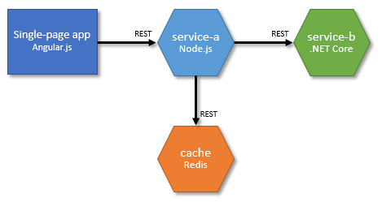

## Set up continuous integration and deployment
1. Ensure the ACS cluster is ready: run [az acs list](/cli/azure/acs#list) and confirm that our ACS cluster is listed. (Note: ACS must be running DC/OS 1.8 or greater.)

1. [Create a GitHub personal access token](https://help.github.com/articles/creating-an-access-token-for-command-line-use/), granting it at least the `repo` scope.  Don't forget to copy the token to your clipboard, as we'll use it in the next command (it will set up a [webhook](https://help.github.com/articles/about-webhooks/) on our GitHub repo). 

1. Set your current directory to the root of your cloned source repository, and create a build and release pipeline, using the _&lt;GitHubPersonalAccessToken&gt; that you just created:
	
	`cd container-service-dotnet-continuous-integration-multi-container`

	```azurecli
	az container release create \
	--target-name myacs \
	--target-resource-group myacs-rg \
	--remote-access-token <GitHubPersonalAccessToken>
	```

	Where `--target-name` is the name of your ACS cluster, and `--target-resource-group` is the ACS cluster's resource group name.

On first run, this command may take a minute or so to complete. Once completed, important information is returned regarding the build and release pipeline it created:
* `sourceRepo`: a [webhook](https://help.github.com/articles/about-webhooks/) is configured for the source repository so that the build and release pipeline is automatically triggered whenever source code is pushed to it.  
* `vstsProject`: [Visual Studio Team Services](https://www.visualstudio.com/team-services/) (VSTS) is configured to *drive* the workflow (the actual build and deployment tasks run within containers in ACS). If you would like to use a specific VSTS account and project, you can define using the `--vsts-account-name` and `--vsts-project-name` parameters.
* `buildDefinition`: defines the tasks that run for each build. Container images are produced for each service defined in the docker-compose.yml, and then pushed to a Docker container registry. 
* `containerRegistry`: The Azure Container Registry is a managed service that runs a Docker container registry. A new Azure Container Registry is created with a default name or you can alternatively specify an Azure Container Registry name via the `--registry-name` parameter.
* `releaseDefinition`: defines the tasks that are run for each deployment. Container images for the services defined in docker-compose.yml are pulled from the container registry, and deployed to the ACS cluster. By default, three environments are created: *Dev*, *Test*, and *Production*. The release definition is configured by default to automatically deploy to *Dev* each time a build completes successfully. A release can be promoted to *Test* or *Production* manually without requiring a rebuild. The default flow can be customized in VSTS. 
* `containerService`: the target ACS cluster (must be running DC/OS 1.8).


The following snippet is an example command you would type if you already have an existing Azure Container Registry named `myregistry`. Create and build release definitions with a VSTS account at `myvstsaccount.visualstudio.com`, and an existing VSTS project `myvstsproject`:
		
```azurecli
az container release create \
--target-name myacs \
--target-resource-group myacs-rg \
--registry-name myregistry \
--vsts-account-name myvstsaccount \
--vsts-project-name myvstsproject \
--remote-access-token <GitHubPersonalAccessToken>
```

## View deployment pipeline progress
Once the pipeline is created, a first-time build and deployment is kicked off automatically. Subsequent builds are triggered each time code is pushed to the source repository. You can check progress of a build and/or release by opening your browser to the build definition or release definition URLs.

You can always find the release definition URL associated with an ACS cluster by running this command:

```azurecli
az container release list \
--target-name myacs \
--target-resource-group myacs-rg
``` 

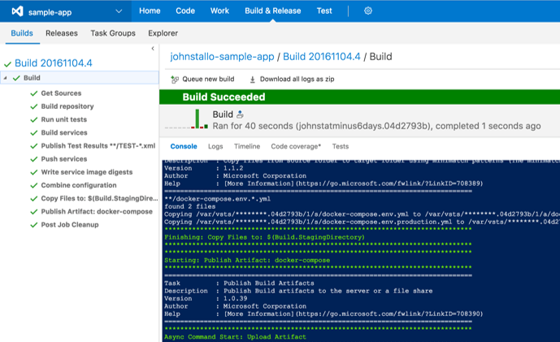

*VSTS screenshot showing CI results of our multi-container app*

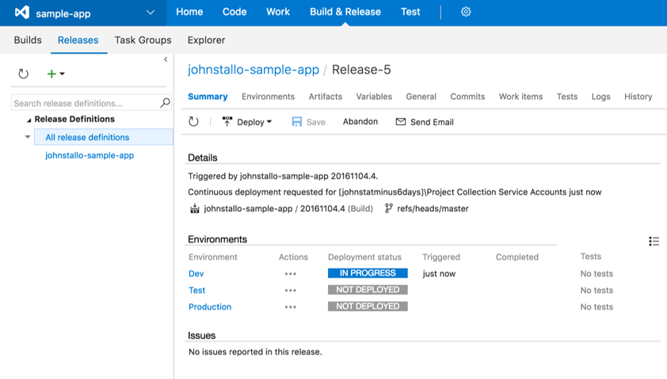

*VSTS docker-compose release with multiple environments*

## View the application
At this point, our application is deployed to our shared dev environment and is not publicly exposed. In the meantime, use the DC/OS dashboard to view and manage our services and [create an SSH tunnel to the DC/OS-related endpoints](https://azure.microsoft.com/documentation/articles/container-service-connect/) or run a convenience command provided by the Azure CLI.

> [!IMPORTANT]
> On a first-time deployment, confirm the VSTS release successfully deployed before proceeding.

> [!NOTE]
> Windows Only:  You need to set up [Pageant](http://www.chiark.greenend.org.uk/~sgtatham/putty/download.html) to complete this section.
> 
>* Launch *PuttyGen* and load the private SSH key used to create the ACS cluster (%homepath%\id_rsa).
>* Save the private SSH key as `id_rsa.ppk` in the same folder.
>* Launch *Pageant* - it will start running and display an icon in your bottom-right system tray.
>* Right-click the system tray icon and select *Add Key*.
>* Add the `id_rsa.ppk` file.
> 
> 

1. Open the ACS cluster's DC/OS dashboard using the Azure CLI convenience command:
	
	`az acs dcos browse -g myacs-rg -n myacs`

	* `-g` is the resource group name of the target ACS cluster
	* `-n` is the name of the target ACS cluster.
	* You may be prompted for your local account password, since this command requires administrator privilege. The command creates an SSH tunnel to a DC/OS endpoint, opens your default browser to that endpoint, and temporarily configures the browser's web proxy. 

	> [!TIP]
	> If you need to look up the name of your ACS cluster, you can list all ACS clusters in your subscription by running `az acs list`. 

1. In the DC/OS dashboard, click **Services** on the left navigation menu ([http://localhost/#/services](http://localhost/#/services)). Services deployed via our pipeline are grouped under a root folder named *dev* (named after the environment in the VSTS release definition). 

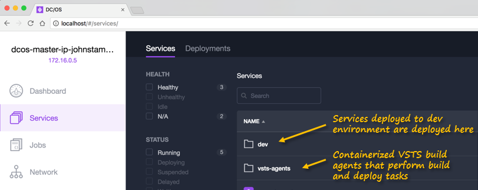

You can perform many useful things in the DC/OS dashboard

* tracking deployment status for each service
* viewing CPU and Memory requirements
* viewing logs
* scaling the number of instances for each service

**To view the web application for service-a**: start at the *dev* root folder, then drill down the folder hierarchy until you reach `service-a`. This view lists the running tasks (or container instances) for `service-a`.

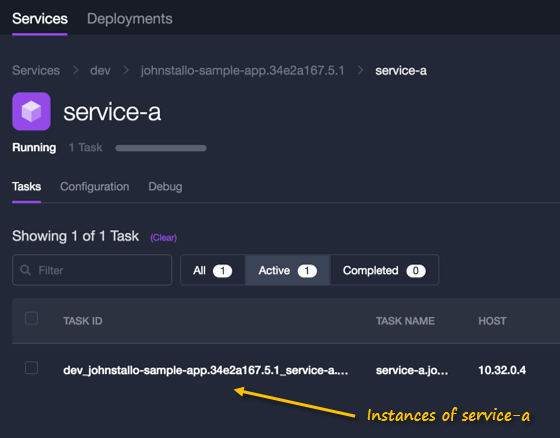

Click a task to open its view, then click one of its available endpoints.

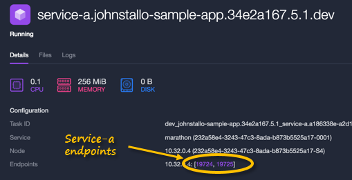

Our simple web app calls `service-a`, which calls `service-b`, and returns a hello world message. A counter is incremented on Redis each time a request is made.

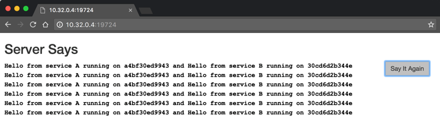

### (Optional) Reaching a service from the command line
If you want to reach a service via curl from the command line:

1. Run `az acs dcos browse --verbose -g myacs-rg -n myacs`, and take note of the line that reads "Proxy running on <ip-address>:<port>" after you enter your password.
1. In a new terminal window, type:

	`export http_proxy=http://<web-proxy-service-ip>:<portnumber>`

	For example: `export http_proxy=http://127.0.0.1:55405`

1. Now you can curl against your service endpoint, `curl http://service-url`, where `service-url` is the address you see when you navigate to your service endpoint from Marathon UI. To unset the http_proxy variable from your command line, type `unset http_proxy`.
 

## Scale services
While we're in the DC/OS dashboard, let's scale our services.
1. Navigate to the application in the *dev* subfolder.
1. Hover over `service-b`, click the gear icon, and select **Scale**.

	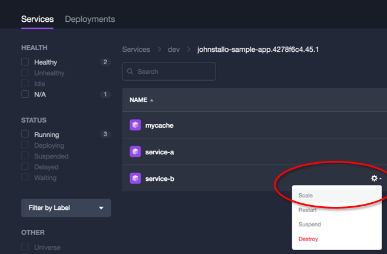

1. Increase the number to 3 and click **Scale Service**.

	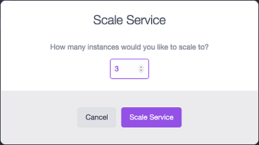

1. Navigate back to the running web app, and repeatedly click the *Say It Again* button. Notice that `service-b` invocations begin to round-robin across a collection of hostnames, while the single instance of `service-a` continues to report the same host.   

## Promote a release to downstream environments without rebuilding container images
Our VSTS release pipeline set up three environments by default: *Dev*, *Test*, and *Production*. So far we've deployed to *Dev*. Let's look at how we can promote a release to the next downstream environment, *Test*, without rebuilding our container images. This workflow ensures we're deploying the exact same images we tested in the prior environment and is the concept of *immutable services*, and reduces the likelihood of undetected errors creeping into production.

1. In the VSTS web UI, navigate to **Releases**

	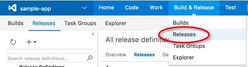

1. Open the most recent release.

1. In the release definition's menu bar, click **Deploy**, then select **Test** as the next environment we want to deploy to start a new deployment, reusing the same images that were previously deployed to *Dev*. Click **Logs** if you want to follow along the deployment in more detail.

	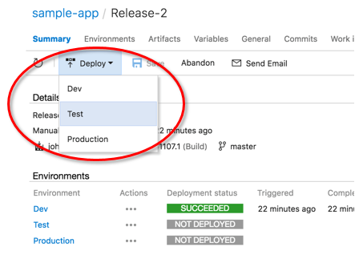

Once deployment to *Test* has succeeded, a new root folder in Marathon UI named *test* that contains the running services for that environment. 

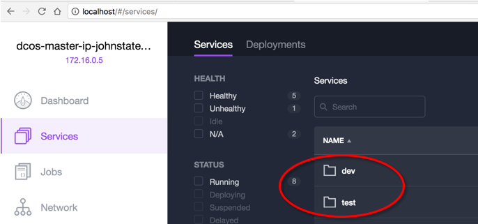

## Trigger a new build and deployment
Let's simulate what would happen if a developer on our team pushed a code change to the source repository.

1. Back in the code editor, open `service-a/public/index.html`. 
1. Modify this line of code:

	`<h2>Server Says</h2>`

	to something like:

	`<h2>Server Says Hello</h2>`

1. Save the file, then commit and push the code change to your source repository.

	```bash
	git commit -am 'updated title'
	git push
	```

The commit automatically kicks off a new build, and a new release to be deployed to *Dev*. Services in downstream environments (*Test* or *Production*) remains unchanged until we decide to promote a specific release to that environment.

If you open the build definition in VSTS, you'll see something like this: 

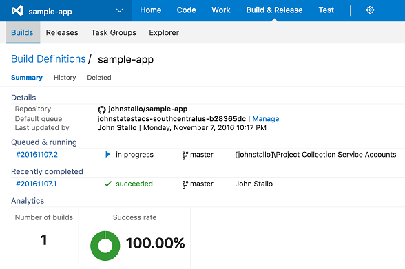


## Expose public endpoint for production

1. Add the following yaml code to a new file named `docker-compose.env.production.yml` at the root folder of your source repository. This adds a label that causes a public endpoint to be exposed for `service-a`. 
	
	```yaml
	version: "2"
	services:
	  service-a:
	    labels:
	      com.microsoft.acs.dcos.marathon.vhost: "<FQDN, or custom domain>"
	```

	* For the label value, you can either specify the URL of your ACS agent's fully qualified domain name (FQDN), or a custom domain (for example, app.contoso.com). To find your ACS agent's FQDN, run the command `az acs list`, and check the property for `agentPoolProfiles.fqdn`. For example, `myacsagents.westus.cloudapp.azure.com`.
	* The sample app by default is listening on port 80, for those who have their docker applications listening on other ports, for instance `port 8080` or `443`, attach the port number to the FQDN. For example, `myacsagents.westus.cloudapp.azure.com:8080`. However when you try to access the application from outside, you will need to query it at port 80.
	* By following the filename convention docker-compose.env.*environment-name*.yml, these settings only affect the named environment (in this case, the environment named *Production*). Inspect the release definition in VSTS, each environment's deployment task is set up to read from a docker-compose file named after this convention.

1. Commit and push the file to your master source repository to start another build.

	```bash
	git add .
	git commit -am "expose public port for service-a"
	git push
	```

1. Wait until the update has been built and deployed to *Dev*, then promote it to *Test*, and then promote it to *Production*. (For the purposes of this tutorial, you can deploy directly to *Production* but it is good to get in the practice of only deploying to the next downstream environment.)

1. (Optional) **If you specified a custom domain** for vhost (for example, app.contoso.com), add a DNS record in your domain provider's settings. Log in to your domain provider's administrative UI and add a DNS record as follows:

	* Type: CNAME
	* Host: Your custom domain, for example, app.contoso.com
	* Answer: ACS agent FQDN, for example, myacsagents.westus.cloudapp.azure.com
	* TTL (Optional): Sometimes, your domain provider gives you the ability to edit the TTL. A lower value results in a DNS record update to be propagated more quickly.   

1. Once the release has been deployed to *Production*, that version is accessible to anyone. Open your browser to the URL you specified for the `com.microsoft.acs.dcos.marathon.vhost` label. (Note: releases to pre-production environments continue to be private).

## Summary
Congratulations! You learned how to create an ACS cluster with DC/OS, and set up a fully automated and containerized build and deployment pipeline for a multi-container app.

Some next steps to explore:
* **Scale VSTS Agents.** If you need more throughput for running build and release tasks, you can increase the number of VSTS agent instances. Navigate to **Services** in the DC/OS Dashboard, open the vsts-agents folder, and experiment with scaling the number of VSTS agent instances.
* **Integrate unit tests.** This GitHub repository shows how to make unit tests and integration tests run in containers and include them in the build tasks: [https://github.com/mindaro/sample-app](https://github.com/mindaro/sample-app). 
	* Hint: look at these files in the repository: `service-a/unit-tests.js`, `service-a/service-tests.js`, `docker-compose.ci.unit-tests.yml`, and `docker-compose.ci.service-tests.yml`.

## Clean up
To limit your compute charges related to this tutorial, run the following command and take note of the deployment pipeline resources that are related to an ACS cluster:

```azurecli	
az container release list --resource-name myacs --resource-group myacs-rg
```

Delete the ACS cluster:
1. Sign into the [Azure portal](https://portal.azure.com)
1. Look up the resource group that contains your ACS cluster.
1. Open the resource group's blade UI, and click **Delete** in the blade's command bar.

Delete the Azure Container Registry:
In the Azure portal, search for the Azure Container Registry, and delete it. 

The [Visual Studio Team Services account offers free Basic Access Level for the first five users](https://azure.microsoft.com/en-us/pricing/details/visual-studio-team-services/), but you can delete the build and release definitions.

Delete the VSTS Build Definition:
		
1. Open the Build Definition URL in your browser, then click on the **Build Definitions** link (next to the name of the build definition you are currently viewing).
2. Click the action menu beside the build definition you want to delete, and select **Delete Definition**

`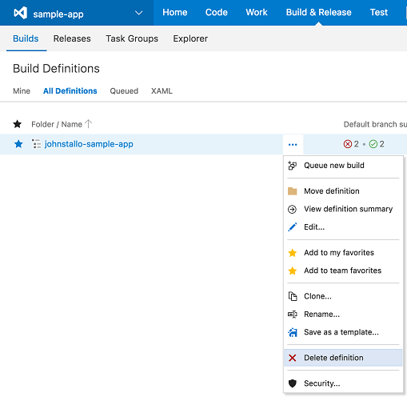 

Delete the VSTS Release Definition:

1. Open the Release Definition URL in your browser.
2. In the Release Definitions list on the left-hand side, click the drop-down beside the release definition you want to delete, and select **Delete**.

`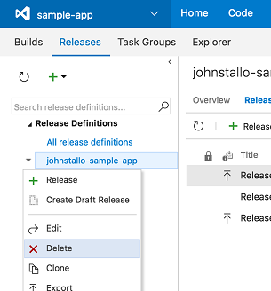
