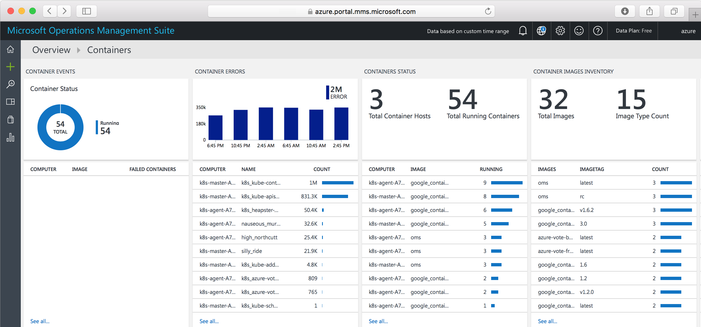

# Monitor a Kubernetes cluster with Operations Management Suite

Monitoring your Kubernetes cluster and containers is critical, especially when you manage a production cluster at scale with multiple apps. 

You can take advantage of several Kubernetes monitoring solutions, either from Microsoft or other providers. In this tutorial, you monitor your Kubernetes cluster by using the Containers solution in [Operations Management Suite](../operations-management-suite/operations-management-suite-overview.md), Microsoft's cloud-based IT management solution. (The OMS Containers solution is in preview.)

This tutorial covers the following tasks:

> [!div class="checklist"]
> * Get OMS Workspace settings
> * Set up OMS agents on the Kubernetes nodes
> * Access monitoring information in the OMS portal or Azure portal

## Prerequisites

This tutorial is one of a multi-part series. You do not need to complete the full series to work through this tutorial, however the following items are required.

**Azure Container Service Kubernetes cluster** – see, [Create a Kubernetes cluster]( container-service-tutorial-kubernetes-deploy-cluster.md) for information on creating the cluster.

**OMS account** - If you don't already have an account, you can sign up for a [free trial](https://www.microsoft.com/cloud-platform/operations-management-suite-trial) of Operations Management Suite. When you can access the [OMS portal](https://mms.microsoft.com), go to **Settings** > **Connected Sources** > **Linux Servers**. There, you can find the *Workspace ID* and a primary or secondary *Workspace Key*. Take note of these values, which you need to set up OMS agents on the cluster.

## Get Workspace settings

When you can access the [OMS portal](https://mms.microsoft.com), go to **Settings** > **Connected Sources** > **Linux Servers**. There, you can find the *Workspace ID* and a primary or secondary *Workspace Key*. Take note of these values, which you need to set up OMS agents on the cluster.

## Set up OMS agents

Here is a YAML file to set up OMS agents on the cluster nodes. It creates a Kubernetes [DaemonSet](https://kubernetes.io/docs/concepts/workloads/controllers/daemonset/), which runs a single identical pod on each cluster node. The DaemonSet resource is ideal for deploying a monitoring agent. 

Save the following text to a file named `oms-daemonset.yaml`, and replace the placeholder values for *myWorkspaceID* and *myWorkspaceKey* with your OMS Workspace ID and Key. (In production, you can encode these values as secrets.)

```YAML
apiVersion: extensions/v1beta1
kind: DaemonSet
metadata:
 name: omsagent
spec:
 template:
  metadata:
   labels:
    app: omsagent
    agentVersion: v1.3.4-127
    dockerProviderVersion: 10.0.0-25
  spec:
   containers:
     - name: omsagent 
       image: "microsoft/oms"
       imagePullPolicy: Always
       env:
       - name: WSID
         value: myWorkspaceID
       - name: KEY 
         value: myWorkspaceKey
       - name: DOMAIN
         value: opinsights.azure.com
       securityContext:
         privileged: true
       ports:
       - containerPort: 25225
         protocol: TCP 
       - containerPort: 25224
         protocol: UDP
       volumeMounts:
        - mountPath: /var/run/docker.sock
          name: docker-sock
        - mountPath: /var/log 
          name: host-log
       livenessProbe:
        exec:
         command:
         - /bin/bash
         - -c
         - ps -ef | grep omsagent | grep -v "grep"
        initialDelaySeconds: 60
        periodSeconds: 60
   volumes:
    - name: docker-sock 
      hostPath:
       path: /var/run/docker.sock
    - name: host-log
      hostPath:
       path: /var/log
```

Create the DaemonSet with the following command:

```bash
kubectl create -f oms-daemonset.yaml
```

To see that the DaemonSet is created, run:

```bash
kubectl get daemonset
```

Output is similar to the following:

```bash
NAME       DESIRED   CURRENT   READY     UP-TO-DATE   AVAILABLE   NODE-SELECTOR   AGE
omsagent   3         3         3         0            3           <none>          5m
```

After the agents are running, it takes several minutes for OMS to ingest and process the data.

## Access monitoring data

View and analyze the OMS container monitoring data with the [Container solution](../log-analytics/log-analytics-containers.md) in either the OMS portal or the Azure portal. 

To install the Container solution using the [OMS portal](https://mms.microsoft.com), go to **Solutions Gallery**. Then add **Container Solution**. Alternatively, add the Containers solution from the [Azure Marketplace](https://azuremarketplace.microsoft.com/marketplace/apps/microsoft.containersoms?tab=Overview).

In the OMS portal, look for a **Containers** summary tile on the OMS dashboard. Click the tile for details including: container events, errors, status, image inventory, and CPU and memory usage. For more granular information, click a row on any tile, or perform a [log search](../log-analytics/log-analytics-log-searches.md).



Similarly, in the Azure portal, go to **Log Analytics** and select your workspace name. To see the **Containers** summary tile, click **Solutions** > **Containers**. To see details, click the tile.

See the [Azure Log Analytics documentation](../log-analytics/index.md) for detailed guidance on querying and analyzing monitoring data.


## Next steps

In this tutorial, you monitored your Kubernetes cluster with OMS. Tasks covered included:

> [!div class="checklist"]
> * Get OMS Workspace settings
> * Set up OMS agents on the Kubernetes nodes
> * Access monitoring information in the OMS portal or Azure portal


Follow this link to see pre-built script samples for Container Service.

> [!div class="nextstepaction"]
> [Azure Container Service script samples](./cli-samples.md)
