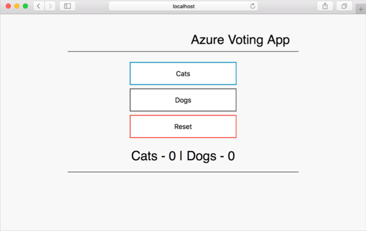

# Create container images to be used with Azure Container Service

In this tutorial, an application is prepared for Kubernetes. Steps completed include:  

> [!div class="checklist"]
> * Cloning application source from GitHub  
> * Creating container images from application source
> * Testing the images in a local Docker environment

In subsequent tutorials, these container images are uploaded to an Azure Container Registry, and then run in an Azure hosted Kubernetes cluster.

## Before you begin

This tutorial assumes a basic understanding of core Docker concepts such as containers, container images, and basic docker commands. If needed, see [Get started with Docker]( https://docs.docker.com/get-started/) for a primer on container basics. 

To complete this tutorial, you need a Docker development environment. Docker provides packages that easily configure Docker on any [Mac](https://docs.docker.com/docker-for-mac/), [Windows](https://docs.docker.com/docker-for-windows/), or [Linux](https://docs.docker.com/engine/installation/#supported-platforms) system.

## Get application code

The sample application used in this tutorial is a basic voting app. The application consists of a front-end web component and a back-end database. 

Use git to download a copy of the application to your development environment.

```bash
git clone https://github.com/Azure-Samples/azure-voting-app.git
```

Inside the application directory, pre-created Dockerfiles and Kubernetes manifest files can be found. These files are used to create assets throughout the tutorial set. 

## Create container images

To create a container image for the application front-end, use the [docker build](https://docs.docker.com/engine/reference/commandline/build/) command.

```bash
docker build ./azure-voting-app/azure-vote -t azure-vote-front
```

Repeat the command, this time for the back-end container image.

```bash
docker build ./azure-voting-app/azure-vote-mysql -t azure-vote-back
```

When completed, use the `docker images` command to see the created images. 

```bash
docker images
```

Output:

```bash
REPOSITORY                   TAG                 IMAGE ID            CREATED              SIZE
azure-vote-front             latest              c13c4f50ede1        39 seconds ago       716 MB
azure-vote-back              latest              33fe5afc1885        About a minute ago   407 MB
mysql                        latest              e799c7f9ae9c        4 weeks ago          407 MB
tiangolo/uwsgi-nginx-flask   flask               788ca94b2313        8 months ago         694 MB
```

## Test application

Now that two container images have been created, test these images in your local development environment. 

First, create a Docker network. This network is used for communication between the containers.  

```bash
docker network create azure-vote
```

Run an instance of the back-end container image using the `docker run` command.

In this example, the mysql database file is stored inside the container. Once this application is moved to the Kubernete clusters, an external data volume is used to store the database file. Also, environment variables are being used to set MySQL credentials.

```bash
docker run -p 3306:3306 --name azure-vote-back -d --network azure-vote -e MYSQL_ROOT_PASSWORD=Password12 -e MYSQL_USER=dbuser -e MYSQL_PASSWORD=Password12 -e MYSQL_DATABASE=azurevote azure-vote-back 
```

Run an instance of the front-end container image.

Environment variables are being used to configure the database connection information.

```bash
docker run -d -p 8080:80 --name azure-vote-front --network=azure-vote -e MYSQL_USER=dbuser -e MYSQL_PASSWORD=Password12 -e MYSQL_DATABASE=azurevote -e MYSQL_HOST=azure-vote-back azure-vote-front
```

When complete, run `docker ps` to see the running containers.  

```bash
docker ps
```

Output:

```bash
CONTAINER ID        IMAGE               COMMAND                  CREATED             STATUS              PORTS                           NAMES
3aa02e8ae965        azure-vote-front     "/usr/bin/supervisord"   59 seconds ago      Up 57 seconds       443/tcp, 0.0.0.0:8080->80/tcp   flaskmysqlvote_azure-vote-front_1
5ae60b3ba181        azure-vote-backend   "docker-entrypoint..."   59 seconds ago      Up 58 seconds       0.0.0.0:3306->3306/tcp          azure-vote-back
```

Browse to `http://localhost:8080` to see the running application. The application takes a few seconds to initialize. If an error is encountered, try again.



## Clean up resources

Now that application functionality has been validated, the running containers can be stopped and removed. Do not delete the container images. These images are uploaded to an Azure Container Registry instance in the next tutorial.

Stop and delete the front-end container with the [docker rm](https://docs.docker.com/engine/reference/commandline/rm/) command. 

```bash
docker rm -f azure-vote-front
```

Stop and delete the back-end container with the [docker rm](https://docs.docker.com/engine/reference/commandline/rm/) command. 

```bash
docker rm -f azure-vote-back
```

Delete the network with the [docker network rm](https://docs.docker.com/engine/reference/commandline/network_rm/) command.

```bash
docker network rm azure-vote
```

At completion, you have two container images that make up the Azure Vote application.

## Next steps

In this tutorial, an application was tested and container images created for the application. The following steps were completed:

> [!div class="checklist"]
> * Cloning the application source from GitHub  
> * Creating container images from application source
> * Testing the images in a local Docker environment

Advance to the next tutorial to learn about storing container images in an Azure Container Registry.

> [!div class="nextstepaction"]
> [Push images to Azure Container Registry](./container-service-tutorial-kubernetes-prepare-acr.md)