# (DEPRECATED) Canary release microservices with Vamp on an Azure Container Service DC/OS cluster

[!INCLUDE [ACS deprecation](../../../includes/container-service-deprecation.md)]

In this walkthrough, we set up Vamp on Azure Container Service with a DC/OS cluster. We canary release the Vamp demo service "sava", and then resolve an incompatibility of the service with Firefox by applying smart traffic filtering. 

> [!TIP] 
> In this walkthrough Vamp runs on a DC/OS cluster, but you can also use Vamp with Kubernetes as the orchestrator.
>

## About canary releases and Vamp


[Canary releasing](https://martinfowler.com/bliki/CanaryRelease.html) is a smart deployment strategy adopted by innovative organizations like Netflix, Facebook, and Spotify. It’s an approach that makes sense, because it reduces issues, introduces safety-nets, and increases innovation. So why aren’t all companies using it? Extending a CI/CD pipeline to include canary strategies adds complexity, and requires extensive devops knowledge and experience. That’s enough to block smaller companies and enterprises alike before they even get started. 

[Vamp](https://vamp.io/) is an open-source system designed to ease this transition and bring canary releasing features to your preferred container scheduler. Vamp’s canary functionality goes beyond percentage-based rollouts. Traffic can be filtered and split on a wide range of conditions, for example to target specific users, IP-ranges, or devices. Vamp tracks and analyzes performance metrics, allowing for automation based on real-world data. You can set up automatic rollback on errors, or scale individual service variants based on load or latency.

## Set up Azure Container Service with DC/OS


1. [Deploy a DC/OS cluster](container-service-deployment.md) with one master and two agents of default size. 

2. [Create an SSH tunnel](../container-service-connect.md) to connect to the DC/OS cluster. This article assumes that you tunnel to the cluster on local port 80.


## Set up Vamp

Now that you have a running DC/OS cluster, you can install Vamp from the DC/OS UI (http:\//localhost:80). 


Installation is done in two stages:

1. **Deploy Elasticsearch**.

2. Then **deploy Vamp** by installing the Vamp DC/OS universe package.

### Deploy Elasticsearch

Vamp requires Elasticsearch for metrics collection and aggregation. You can use the [magneticio Docker images](https://hub.docker.com/r/magneticio/elastic/) to deploy a compatible Vamp Elasticsearch stack.

1. In the DC/OS UI, go to **Services** and click **Deploy Service**.

2. Select **JSON mode** from the **Deploy New Service** pop-up.

   

3. Paste in the following JSON. This configuration runs the container with 1 GB of RAM and a basic health check on the Elasticsearch port.
  
   ```JSON
   {
    "id": "elasticsearch",
    "instances": 1,
    "cpus": 0.2,
    "mem": 1024.0,
    "container": {
      "docker": {
        "image": "magneticio/elastic:2.2",
        "network": "HOST",
        "forcePullImage": true
      }
    },
    "healthChecks": [
      {
        "protocol": "TCP",
        "gracePeriodSeconds": 30,
        "intervalSeconds": 10,
        "timeoutSeconds": 5,
        "port": 9200,
        "maxConsecutiveFailures": 0
      }
    ]
   }
   ```
  

3. Click **Deploy**.

   DC/OS deploys the Elasticsearch container. You can track progress on the **Services** page.  

   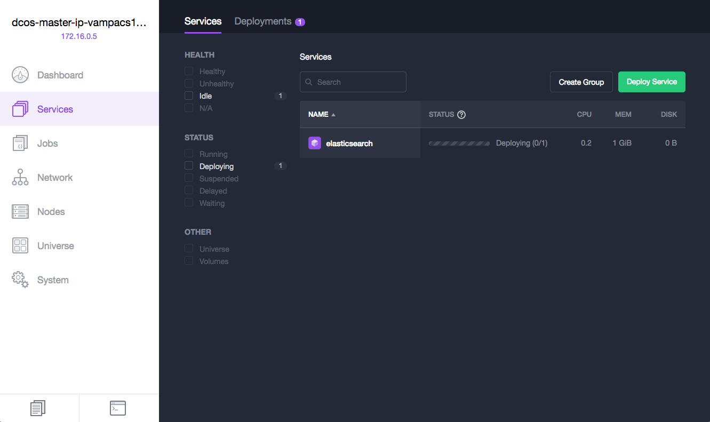

### Deploy Vamp

Once Elasticsearch reports as **Running**, you can add the Vamp DC/OS Universe package. 

1. Go to **Universe** and search for **vamp**. 
   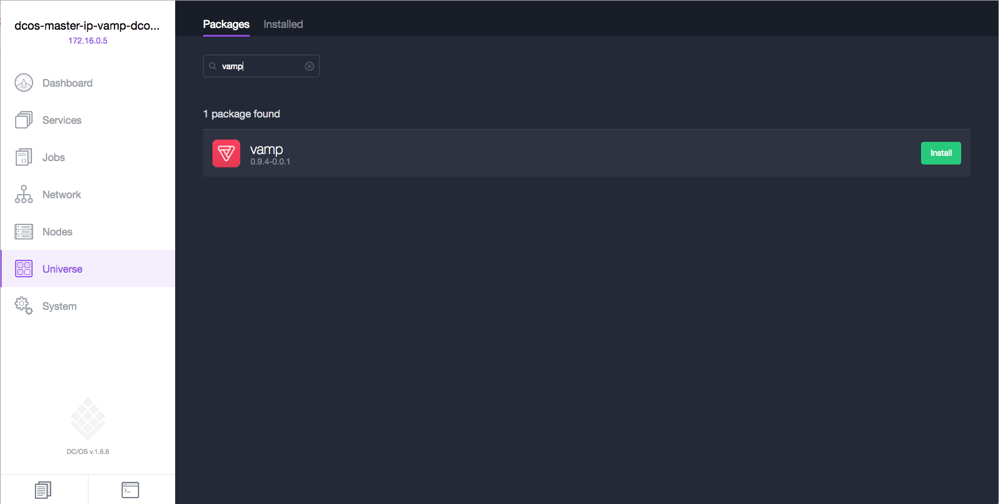

2. Click **install** next to the vamp package, and choose **Advanced Installation**.

3. Scroll down and enter the following elasticsearch-url: `http://elasticsearch.marathon.mesos:9200`. 

   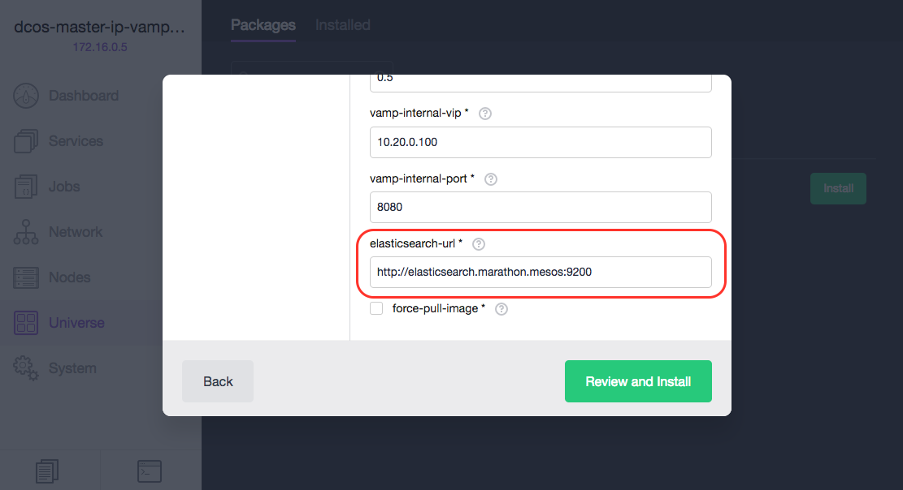

4. Click **Review and Install**, then click **Install** to start the deployment.  

   DC/OS deploys all required Vamp components. You can track progress on the **Services** page.
  
   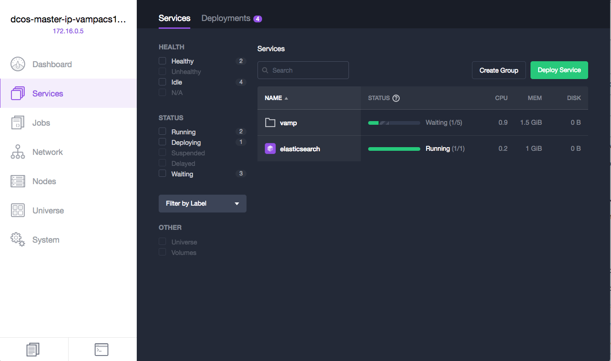
  
5. Once deployment has completed, you can access the Vamp UI:

   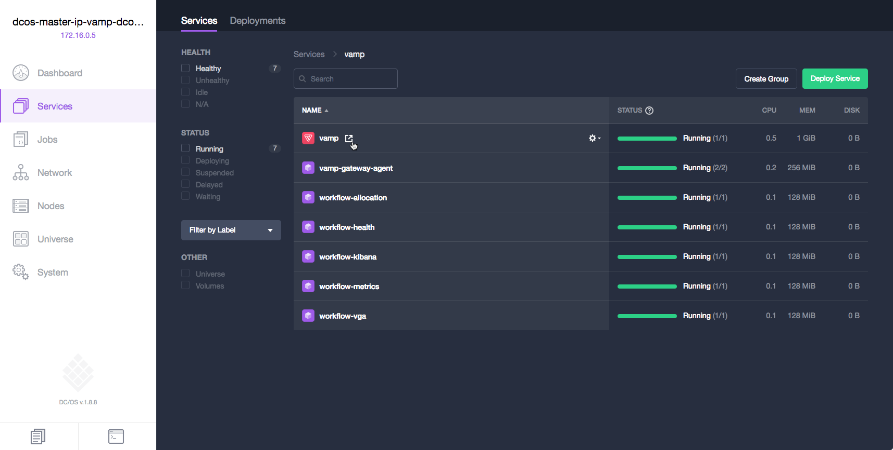
  
   


## Deploy your first service

Now that Vamp is up and running, deploy a service from a blueprint. 

In its simplest form, a [Vamp blueprint](https://docs.vamp.io/how-vamp-works/vamp-and-kubernetes#vamp-deployments) describes the endpoints (gateways), clusters, and services to deploy. Vamp uses clusters to group different variants of the same service into logical groups for canary releasing or A/B testing.  

This scenario uses a sample monolithic application called [**sava**](https://github.com/magneticio/sava-product), which is at version 1.0. The monolith is packaged in a Docker container, which is in Docker Hub under magneticio/sava:1.0.0. The app normally runs on port 8080, but you want to expose it under port 9050 in this case. Deploy the app through Vamp using a simple blueprint.

1. Go to **Deployments**.

2. Click **Add**.

3. Paste in the following blueprint YAML. This blueprint contains one cluster with only one service variant, which we change in a later step:

   ```YAML
   name: sava                        # deployment name
   gateways:
    9050: sava_cluster/webport  	# stable endpoint
   clusters:
    sava_cluster:               # cluster to create
        -
          breed:
            name: sava:1.0.0    	# service variant name
            deployable: magneticio/sava:1.0.0
            ports:
              webport: 8080/http # cluster endpoint, used for canary releasing
   ```

4. Click **Save**. Vamp initiates the deployment.

The deployment is listed on the **Deployments** page. Click the deployment to monitor its status.


Two gateways are created, which are listed on the **Gateways** page:

* a stable endpoint to access the running service (port 9050) 
* a Vamp-managed internal gateway (more on this gateway later). 


The sava service has now deployed, but you can’t access it externally because the Azure Load Balancer doesn’t know to forward traffic to it yet. To access the service, update the Azure networking configuration.


## Update the Azure network configuration

Vamp deployed the sava service on the DC/OS agent nodes, exposing a stable endpoint at port 9050. To access the service from outside the DC/OS cluster, make the following changes to the Azure network configuration in your cluster deployment: 

1. **Configure the Azure Load Balancer** for the agents (the resource named **dcos-agent-lb-xxxx**) with a health probe and a rule to forward traffic on port 9050 to the sava instances. 

2. **Update the network security group** for the public agents (the resource named **XXXX-agent-public-nsg-XXXX**) to allow traffic on port 9050.

For detailed steps to complete these tasks using the Azure portal, see [Enable public access to an Azure Container Service application](container-service-enable-public-access.md). Specify port 9050 for all port settings.


Once everything has been created, go to the **Overview** blade of the DC/OS agent load balancer (the resource named **dcos-agent-lb-xxxx**). Find the **Public IP address**, and use the address to access sava at port 9050.

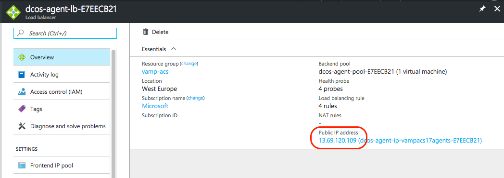


## Run a canary release

Suppose you have a new version of this application that you want to canary release into production. You have it containerized as magneticio/sava:1.1.0 and are ready to go. Vamp lets you easily add new services to the running deployment. These "merged" services are deployed alongside the existing services in the cluster, and assigned a weight of 0%. No traffic is routed to a newly merged service until you adjust the traffic distribution. The weight slider in the Vamp UI gives you complete control over the distribution, allowing for incremental adjustments (canary release) or an instant rollback.

### Merge a new service variant

To merge the new sava 1.1 service with the running deployment:

1. In the Vamp UI, click **Blueprints**.

2. Click **Add** and paste in the following blueprint YAML: This blueprint describes a new service variant (sava:1.1.0) to deploy within the existing cluster (sava_cluster).

   ```YAML
   name: sava:1.1.0      # blueprint name
   clusters:
    sava_cluster:       # cluster to update
        -
          breed:
            name: sava:1.1.0    # service variant name
            deployable: magneticio/sava:1.1.0    
            ports:
              webport: 8080/http # cluster endpoint to update
   ```
  
3. Click **Save**. The blueprint is stored and listed on the **Blueprints** page.

4. Open the action menu on the sava:1.1 blueprint and click **Merge to**.

   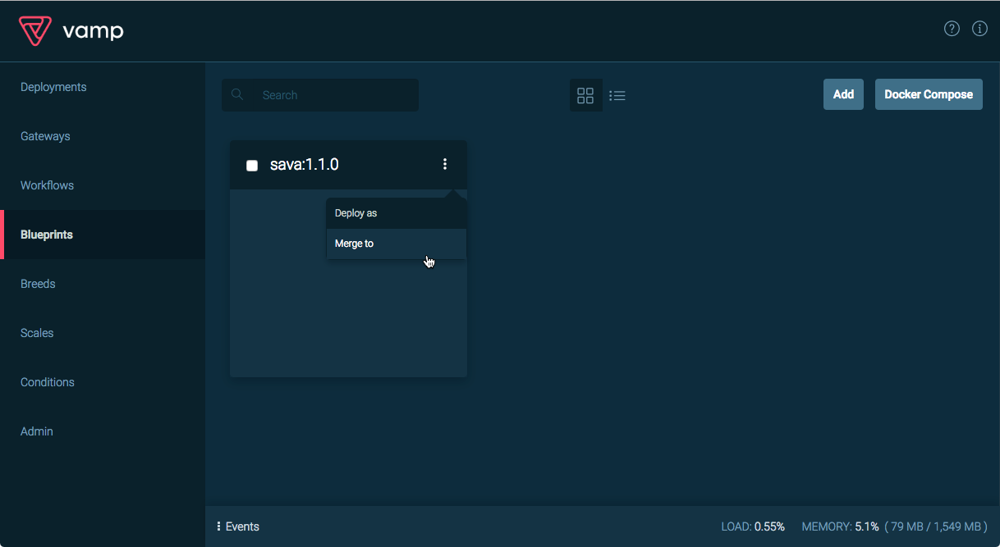

5. Select the **sava** deployment and click **Merge**.

   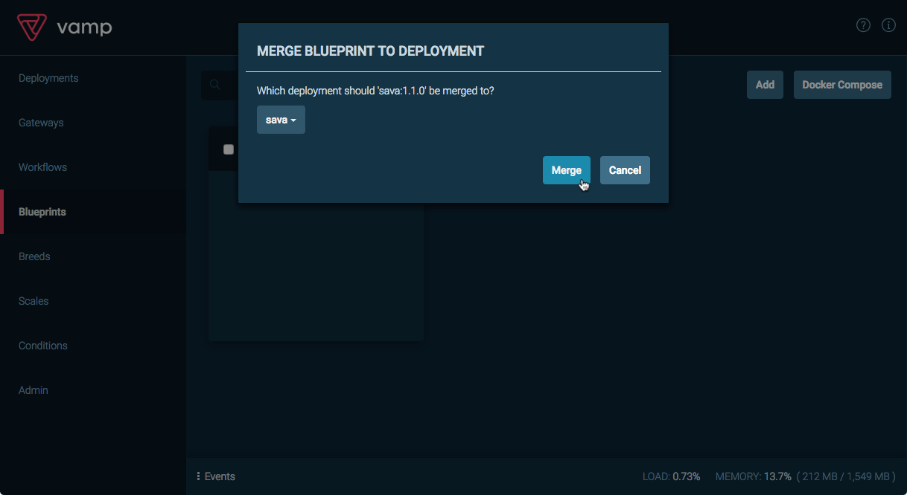

Vamp deploys the new sava:1.1.0 service variant described in the blueprint alongside sava:1.0.0 in the **sava_cluster** of the running deployment. 

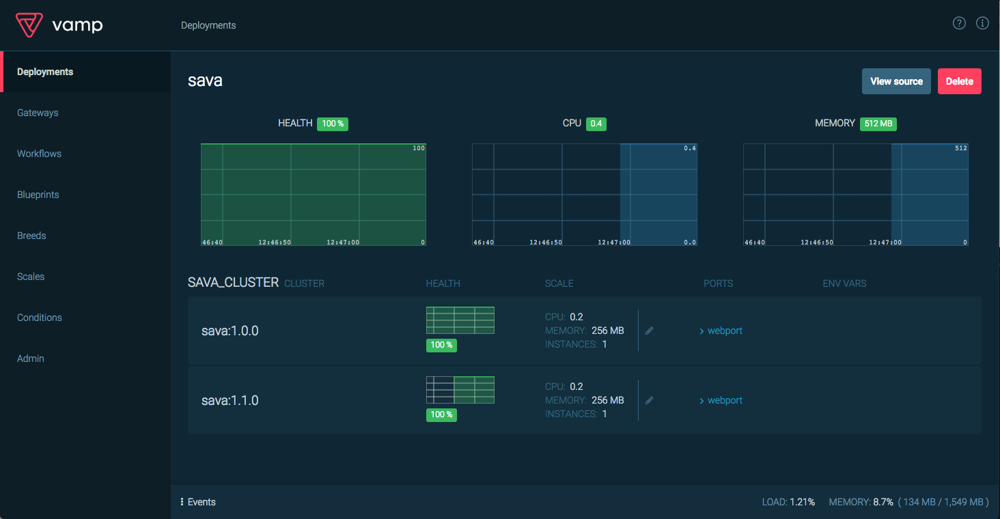

The **sava/sava_cluster/webport** gateway (the cluster endpoint) is also updated, adding a route to the newly deployed sava:1.1.0. At this point, no traffic is routed here (the **WEIGHT** is set to 0%).

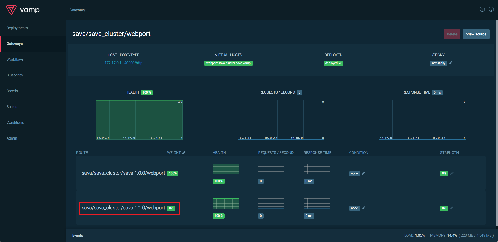

### Canary release

With both versions of sava deployed in the same cluster, adjust the distribution of traffic between them by moving the **WEIGHT** slider.

1. Click  next to **WEIGHT**.

2. Set the weight distribution to 50%/50% and click **Save**.

   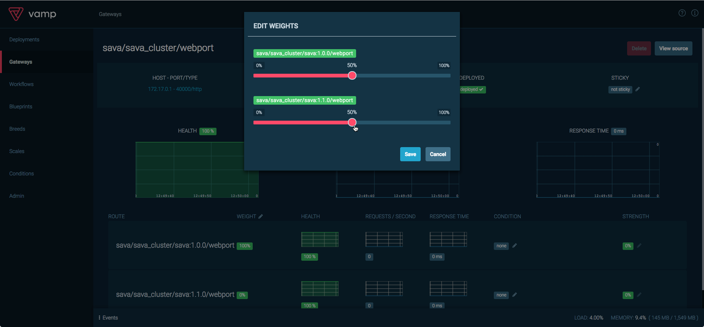

3. Go back to your browser and refresh the sava page a few more times. The sava application now switches between a sava:1.0 page and a sava:1.1 page.

   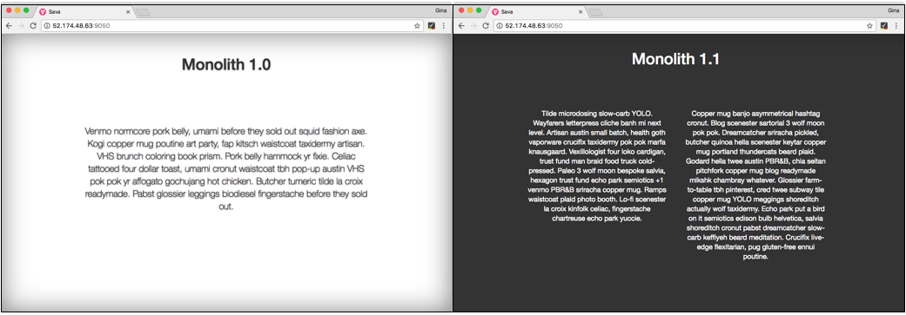


  > [!NOTE]
  > This alternation of the page works best with the "Incognito" or “Anonymous” mode of your browser because of the caching of static assets.
  >

### Filter traffic

Suppose after deployment that you discovered an incompatibility in sava:1.1.0 that causes display problems in Firefox browsers. You can set Vamp to filter incoming traffic and direct all Firefox users back to the known stable sava:1.0.0. This filter instantly resolves the disruption for Firefox users, while everybody else continues to enjoy the benefits of the improved sava:1.1.0.

Vamp uses **conditions** to filter traffic between routes in a gateway. Traffic is first filtered and directed according to the conditions applied to each route. All remaining traffic is distributed according to the gateway weight setting.

You can create a condition to filter all Firefox users and direct them to the old sava:1.0.0:

1. On the sava/sava_cluster/webport **Gateways** page, click  to add a **CONDITION** to the route sava/sava_cluster/sava:1.0.0/webport. 

2. Enter the condition **user-agent == Firefox** and click .

   Vamp adds the condition with a default strength of 0%. To start filtering traffic, you need to adjust the condition strength.

3. Click  to change the **STRENGTH** applied to the condition.
 
4. Set the **STRENGTH** to 100% and click  to save.

   Vamp now sends all traffic matching the condition (all Firefox users) to sava:1.0.0.

   

5. Finally, adjust the gateway weight to send all remaining traffic (all non-Firefox users) to the new sava:1.1.0. Click  next to **WEIGHT** and set the weight distribution so 100% is directed to the route sava/sava_cluster/sava:1.1.0/webport.

   All traffic not filtered by the condition is now directed to the new sava:1.1.0.

6. To see the filter in action, open two different browsers (one Firefox and one other browser) and access the sava service from both. All Firefox requests are sent to sava:1.0.0, while all other browsers are directed to sava:1.1.0.

   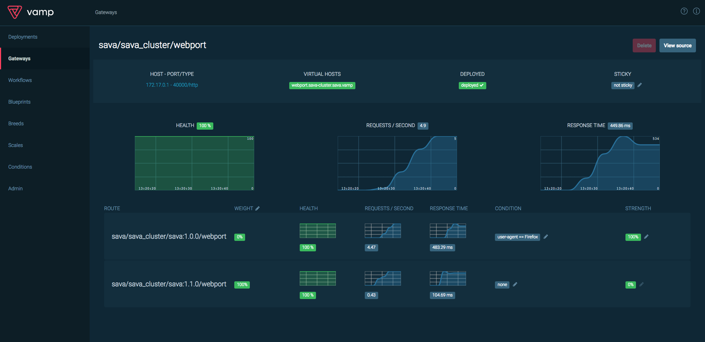

## Summing up

This article was a quick introduction to Vamp on a DC/OS cluster. For starters, you got Vamp up and running on your Azure Container Service DC/OS cluster, deployed a service with a Vamp blueprint, and accessed it at the exposed endpoint (gateway).

We also touched on some powerful features of Vamp:  merging a new service variant to the running deployment and introducing it incrementally, then filtering traffic to resolve a known incompatibility.


## Next steps

* Learn about managing Vamp actions through the [Vamp REST API](https://docs.vamp.io/how-vamp-works/events-and-metrics#events).

* Build Vamp automation scripts in Node.js and run them as [Vamp workflows](https://docs.vamp.io/how-vamp-works/concepts-and-components#workflows).

* See additional [VAMP tutorials](https://docs.vamp.io/tutorials/).

