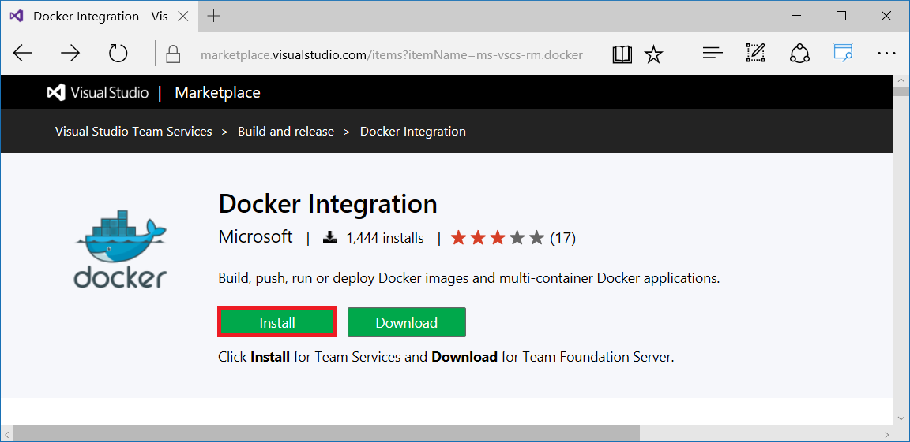
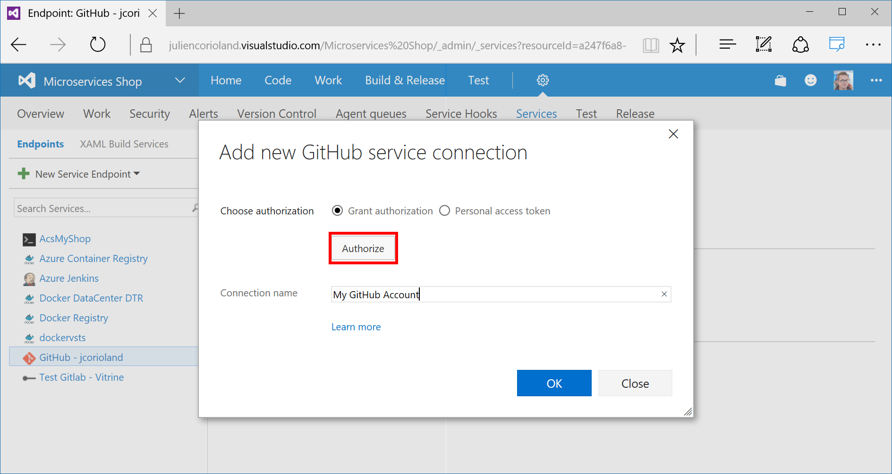
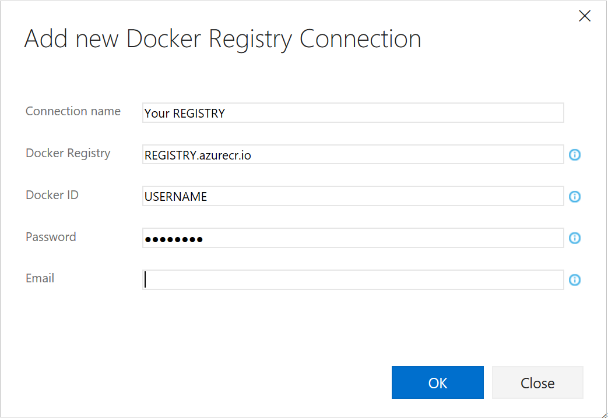
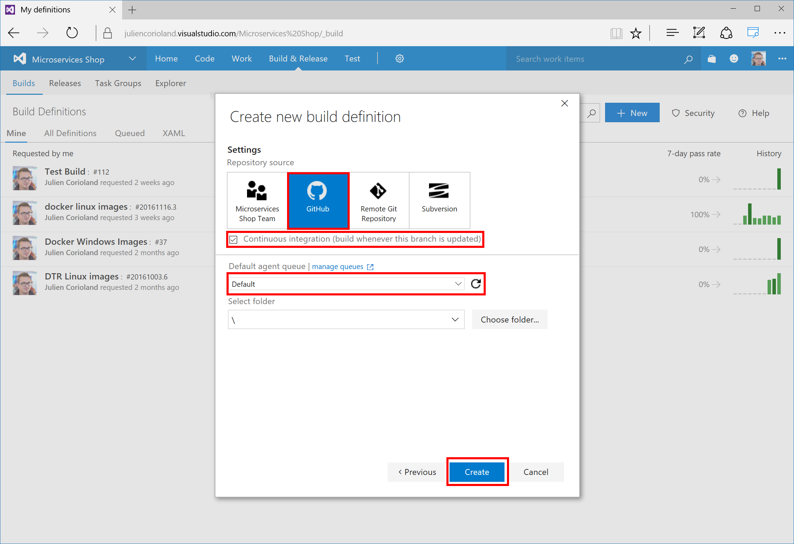
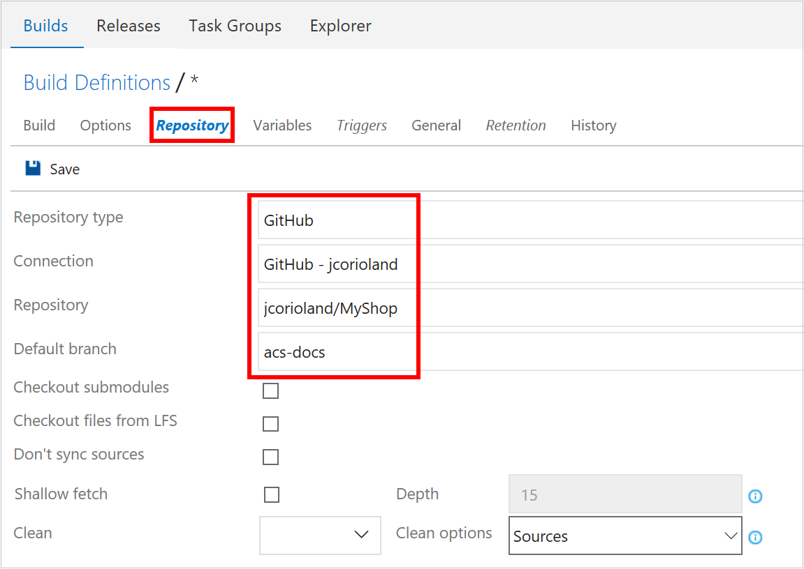
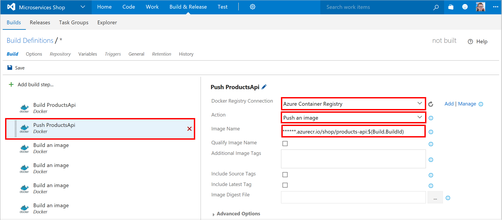
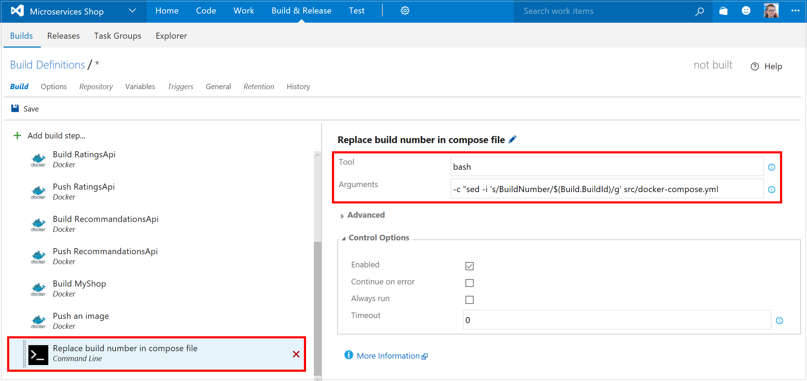
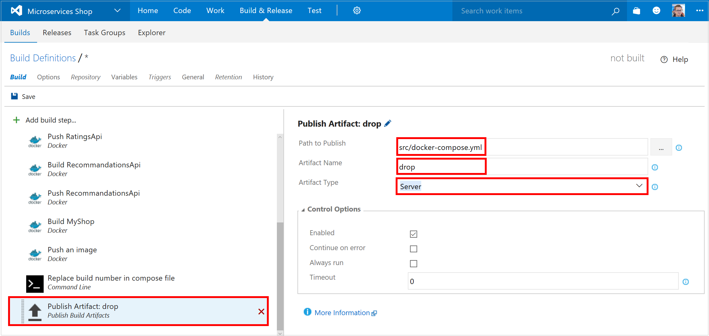
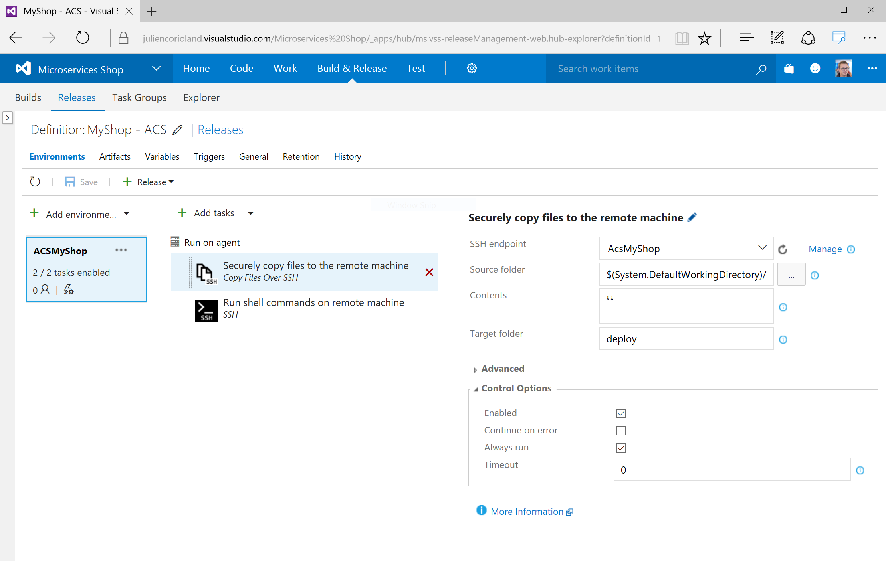
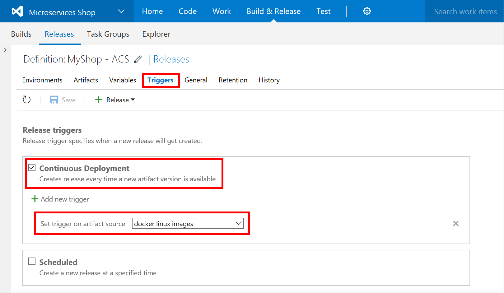

# (DEPRECATED) Full CI/CD pipeline to deploy a multi-container application on Azure Container Service with Docker Swarm using Azure DevOps Services

[!INCLUDE [ACS deprecation](../../../includes/container-service-deprecation.md)]

One of the biggest challenges when developing modern applications for the cloud is being able to deliver these applications continuously. In this article, you learn how to implement a full continuous integration and deployment (CI/CD) pipeline using Azure Container Service with Docker Swarm, Azure Container Registry, and Azure Pipelines management.

The objective is to deliver this application continuously in a Docker Swarm cluster, using Azure DevOps Services. The following figure details this continuous delivery pipeline:

Here is a brief explanation of the steps:

1. Code changes are committed to the source code repository (here, GitHub) 
1. GitHub triggers a build in Azure DevOps Services 
1. Azure DevOps Services gets the latest version of the sources and builds all the images that compose the application 
1. Azure DevOps Services pushes each image to a Docker registry created using the Azure Container Registry service 
1. Azure DevOps Services triggers a new release 
1. The release runs some commands using SSH on the Azure container service cluster master node 
1. Docker Swarm on the cluster pulls the latest version of the images 
1. The new version of the application is deployed using Docker Compose 

## Prerequisites

Before starting this tutorial, you need to complete the following tasks:

- [Create a Swarm cluster in Azure Container Service](container-service-deployment.md)
- [Connect with the Swarm cluster in Azure Container Service](../container-service-connect.md)
- [Create an Azure container registry](../../container-registry/container-registry-get-started-portal.md)
- [Have an Azure DevOps Services organization and project created](https://docs.microsoft.com/azure/devops/organizations/accounts/create-organization-msa-or-work-student)
- [Fork the GitHub repository to your GitHub account](https://github.com/jcorioland/MyShop/)

[!INCLUDE [container-service-swarm-mode-note](../../../includes/container-service-swarm-mode-note.md)]

You also need an Ubuntu (14.04 or 16.04) machine with Docker installed. This machine is used by Azure DevOps Services during the Azure Pipelines processes. 
One way to create this machine is to use the image available in the [Azure Marketplace](https://azure.microsoft.com/marketplace/partners/canonicalandmsopentech/dockeronubuntuserver1404lts/). 

## Step 1: Configure your Azure DevOps Services organization 

In this section, you configure your Azure DevOps Services organization.

### Configure an Azure DevOps Services Linux build agent

To create Docker images and push these images into an Azure container registry from an Azure DevOps Services build, you need to register a Linux agent. You have these installation options:

* [Deploy an agent on Linux](https://www.visualstudio.com/docs/build/admin/agents/v2-linux)

* [Use Docker to run the Azure DevOps Services agent](https://hub.docker.com/r/microsoft/vsts-agent)

### Install the Docker Integration Azure DevOps Services extension

Microsoft provides an Azure DevOps Services extension to work with Docker in Azure Pipelines processes. This extension is available in the [Azure DevOps Services Marketplace](https://marketplace.visualstudio.com/items?itemName=ms-vscs-rm.docker). Click **Install** to add this extension to your Azure DevOps Services organization:

You are asked to connect to your Azure DevOps Services organization using your credentials. 

### Connect Azure DevOps Services and GitHub

Set up a connection between your Azure DevOps Services project and your GitHub account.

1. In your Azure DevOps Services project, click the **Settings** icon in the toolbar, and select **Services**.

    

1. On the left, click **New Service Endpoint** > **GitHub**.

    

1. To authorize Azure DevOps Services to work with your GitHub account, click **Authorize** and follow the procedure in the window that opens.

    

### Connect Azure DevOps Services to your Azure container registry and Azure Container Service cluster

The last steps before getting into the CI/CD pipeline are to configure external connections to your container registry and your Docker Swarm cluster in Azure. 

1. In the **Services** settings of your Azure DevOps Services project, add a service endpoint of type **Docker Registry**. 

1. In the popup that opens, enter the URL and the credentials of your Azure container registry.

    

1. For the Docker Swarm cluster, add an endpoint of type **SSH**. Then enter the SSH connection information of your Swarm cluster.

    

All the configuration is done now. In the next steps, you create the CI/CD pipeline that builds and deploys the application to the Docker Swarm cluster. 

## Step 2: Create the build pipeline

In this step, you set up a build pipeline for your Azure DevOps Services project and define the build workflow for your container images

### Initial pipeline setup

1. To create a build pipeline, connect to your Azure DevOps Services project and click **Build & Release**. 

1. In the **Build definitions** section, click **+ New**. Select the **Empty** template.

    

1. Configure the new build with a GitHub repository source, check **Continuous integration**, and select the agent queue where you registered your Linux agent. Click **Create** to create the build pipeline.

    

1. On the **Build Definitions** page, first open the **Repository** tab and configure the build to use the fork of the MyShop project that you created in the prerequisites. Make sure that you select *acs-docs* as the **Default branch**.

    

1. On the **Triggers** tab, configure the build to be triggered after each commit. Select **Continuous integration** and **Batch changes**.

    

### Define the build workflow
The next steps define the build workflow. There are five container images to build for the *MyShop* application. Each image is built using the Dockerfile located in the project folders:

* ProductsApi
* Proxy
* RatingsApi
* RecommendationsApi
* ShopFront

You need to add two Docker steps for each image, one to build the image, and one to push the image in the Azure container registry. 

1. To add a step in the build workflow, click **+ Add build step** and select **Docker**.

    

1. For each image, configure one step that uses the `docker build` command.

    

    For the build operation, select your Azure container registry, the **Build an image** action, and the Dockerfile that defines each image. Set the **Build context** as the Dockerfile root directory, and define the **Image Name**. 
    
    As shown on the preceding screen, start the image name with the URI of your Azure container registry. (You can also use a build variable to parameterize the tag of the image, such as the build identifier in this example.)

1. For each image, configure a second step that uses the `docker push` command.

    

    For the push operation, select your Azure container registry, the **Push an image** action, and enter the **Image Name** that is built in the previous step.

1. After you configure the build and push steps for each of the five images, add two more steps in the build workflow.

    a. A command-line task that uses a bash script to replace the *BuildNumber* occurrence in the docker-compose.yml file with the current build Id. See the following screen for details.

    

    b. A task that drops the updated Compose file as a build artifact so it can be used in the release. See the following screen for details.

     

1. Click **Save** and name your build pipeline.

## Step 3: Create the release pipeline

Azure DevOps Services allows you to [manage releases across environments](https://www.visualstudio.com/team-services/release-management/). You can enable continuous deployment to make sure that your application is deployed on your different environments (such as dev, test, pre-production, and production) in a smooth way. You can create a new environment that represents your Azure Container Service Docker Swarm cluster.

 

### Initial release setup

1. To create a release pipeline, click **Releases** > **+ Release**

1. To configure the artifact source, Click **Artifacts** > **Link an artifact source**. Here, link this new release pipeline to the build that you defined in the previous step. By doing this, the docker-compose.yml file is available in the release process.

     

1. To configure the release trigger, click **Triggers** and select **Continuous Deployment**. Set the trigger on the same artifact source. This setting ensures that a new release starts as soon as the build completes successfully.

     

### Define the release workflow

The release workflow is composed of two tasks that you add.

1. Configure a task to securely copy the compose file to a *deploy* folder on the Docker Swarm master node, using the SSH connection you configured previously. See the following screen for details.

    

1. Configure a second task to execute a bash command to run `docker` and `docker-compose` commands on the master node. See the following screen for details.

    

    The command executed on the master use the Docker CLI and the Docker-Compose CLI to do the following tasks:

   - Login to the Azure container registry (it uses three build variab`les that are defined in the **Variables** tab)
   - Define the **DOCKER_HOST** variable to work with the Swarm endpoint (:2375)
   - Navigate to the *deploy* folder that was created by the preceding secure copy task and that contains the docker-compose.yml file 
   - Execute `docker-compose` commands that pull the new images, stop the services, remove the services, and create the containers.

     >[!IMPORTANT]
     > As shown on the preceding screen, leave the **Fail on STDERR** checkbox unchecked. This is an important setting, because `docker-compose` prints several diagnostic messages, such as containers are stopping or being deleted, on the standard error output. If you check the checkbox, Azure DevOps Services reports that errors occurred during the release, even if all goes well.
     >
1. Save this new release pipeline.

>[!NOTE]
>This deployment includes some downtime because we are stopping the old services and running the new one. It is possible to avoid this by doing a blue-green deployment.
>

## Step 4. Test the CI/CD pipeline

Now that you are done with the configuration, it's time to test this new CI/CD pipeline. The easiest way to test it is to update the source code and commit the changes into your GitHub repository. A few seconds after you push the code, you will see a new build running in Azure DevOps Services. Once completed successfully, a new release will be triggered and will deploy the new version of the application on the Azure Container Service cluster.

## Next Steps

* For more information about CI/CD with Azure DevOps Services, see the [Azure Pipelines Documentation](/azure/devops/pipelines/?view=azure-devops) article.
