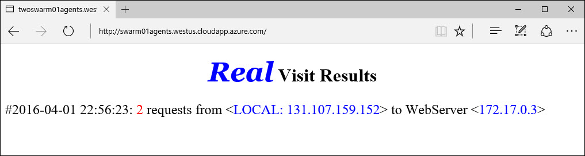

# (DEPRECATED) Container management with Docker Swarm

[!INCLUDE [ACS deprecation](../../../includes/container-service-deprecation.md)]

Docker Swarm provides an environment for deploying containerized workloads across a pooled set of Docker hosts. Docker Swarm uses the native Docker API. The workflow for managing containers on a Docker Swarm is almost identical to what it would be on a single container host. This document provides simple examples of deploying containerized workloads in an Azure Container Service instance of Docker Swarm. For more in-depth documentation on Docker Swarm, see [Docker Swarm on Docker.com](https://docs.docker.com/swarm/).

[!INCLUDE [container-service-swarm-mode-note](../../../includes/container-service-swarm-mode-note.md)]

Prerequisites to the exercises in this document:

[Create a Swarm cluster in Azure Container Service](container-service-deployment.md)

[Connect with the Swarm cluster in Azure Container Service](../container-service-connect.md)

## Deploy a new container
To create a new container in the Docker Swarm, use the `docker run` command (ensuring that you have opened an SSH tunnel to the masters as per the prerequisites above). This example creates a container from the `yeasy/simple-web` image:

```bash
user@ubuntu:~$ docker run -d -p 80:80 yeasy/simple-web

4298d397b9ab6f37e2d1978ef3c8c1537c938e98a8bf096ff00def2eab04bf72
```

After the container has been created, use `docker ps` to return information about the container. Notice here that the Swarm agent that is hosting the container is listed:

```bash
user@ubuntu:~$ docker ps

CONTAINER ID        IMAGE               COMMAND                  CREATED             STATUS              PORTS                 NAMES
4298d397b9ab        yeasy/simple-web    "/bin/sh -c 'python i"   31 seconds ago      Up 9 seconds        10.0.0.5:80->80/tcp   swarm-agent-34A73819-1/happy_allen
```  

You can now access the application that is running in this container through the public DNS name of the Swarm agent load balancer. You can find this information in the Azure portal:  

  

By default the Load Balancer has ports 80, 8080 and 443 open. If you want to connect on another port you will need to open that port on the Azure Load Balancer for the Agent Pool.

## Deploy multiple containers
As multiple containers are started, by executing 'docker run' multiple times, you can use the `docker ps` command to see which hosts the containers are running on. In the example below, three containers are spread evenly across the three Swarm agents:  

```bash
user@ubuntu:~$ docker ps

CONTAINER ID        IMAGE               COMMAND                  CREATED             STATUS              PORTS                 NAMES
11be062ff602        yeasy/simple-web    "/bin/sh -c 'python i"   11 seconds ago      Up 10 seconds       10.0.0.6:83->80/tcp   swarm-agent-34A73819-2/clever_banach
1ff421554c50        yeasy/simple-web    "/bin/sh -c 'python i"   49 seconds ago      Up 48 seconds       10.0.0.4:82->80/tcp   swarm-agent-34A73819-0/stupefied_ride
4298d397b9ab        yeasy/simple-web    "/bin/sh -c 'python i"   2 minutes ago       Up 2 minutes        10.0.0.5:80->80/tcp   swarm-agent-34A73819-1/happy_allen
```  

## Deploy containers by using Docker Compose
You can use Docker Compose to automate the deployment and configuration of multiple containers. To do so, ensure that a Secure Shell (SSH) tunnel has been created and that the DOCKER_HOST variable has been set (see the pre-requisites above).

Create a docker-compose.yml file on your local system. To do this, use this [sample](https://raw.githubusercontent.com/rgardler/AzureDevTestDeploy/master/docker-compose.yml).

```bash
web:
  image: adtd/web:0.1
  ports:
    - "80:80"
  links:
    - rest:rest-demo-azure.marathon.mesos
rest:
  image: adtd/rest:0.1
  ports:
    - "8080:8080"

```

Run `docker-compose up -d` to start the container deployments:

```bash
user@ubuntu:~/compose$ docker-compose up -d
Pulling rest (adtd/rest:0.1)...
swarm-agent-3B7093B8-0: Pulling adtd/rest:0.1... : downloaded
swarm-agent-3B7093B8-2: Pulling adtd/rest:0.1... : downloaded
swarm-agent-3B7093B8-3: Pulling adtd/rest:0.1... : downloaded
Creating compose_rest_1
Pulling web (adtd/web:0.1)...
swarm-agent-3B7093B8-3: Pulling adtd/web:0.1... : downloaded
swarm-agent-3B7093B8-0: Pulling adtd/web:0.1... : downloaded
swarm-agent-3B7093B8-2: Pulling adtd/web:0.1... : downloaded
Creating compose_web_1
```

Finally, the list of running containers will be returned. This list reflects the containers that were deployed by using Docker Compose:

```bash
user@ubuntu:~/compose$ docker ps
CONTAINER ID        IMAGE               COMMAND                CREATED             STATUS              PORTS                     NAMES
caf185d221b7        adtd/web:0.1        "apache2-foreground"   2 minutes ago       Up About a minute   10.0.0.4:80->80/tcp       swarm-agent-3B7093B8-0/compose_web_1
040efc0ea937        adtd/rest:0.1       "catalina.sh run"      3 minutes ago       Up 2 minutes        10.0.0.4:8080->8080/tcp   swarm-agent-3B7093B8-0/compose_rest_1
```

Naturally, you can use `docker-compose ps` to examine only the containers defined in your `compose.yml` file.

## Next steps
[Learn more about Docker Swarm](https://docs.docker.com/swarm/)

