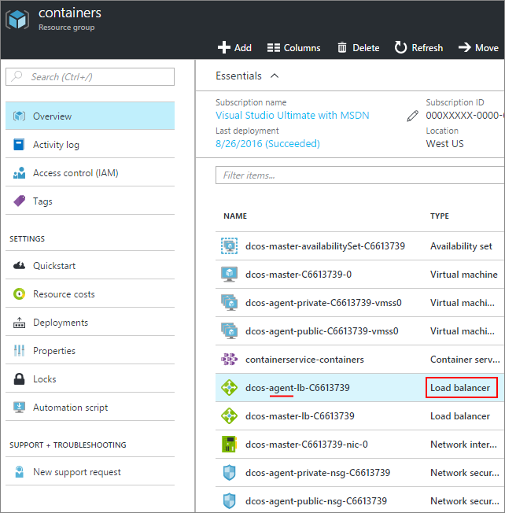
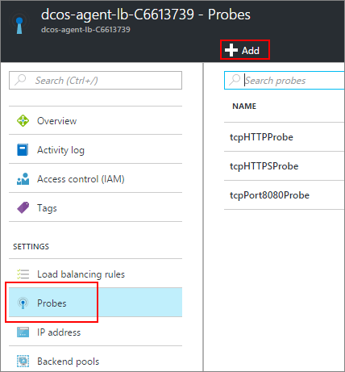
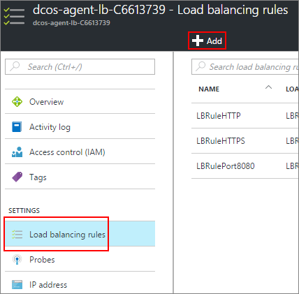
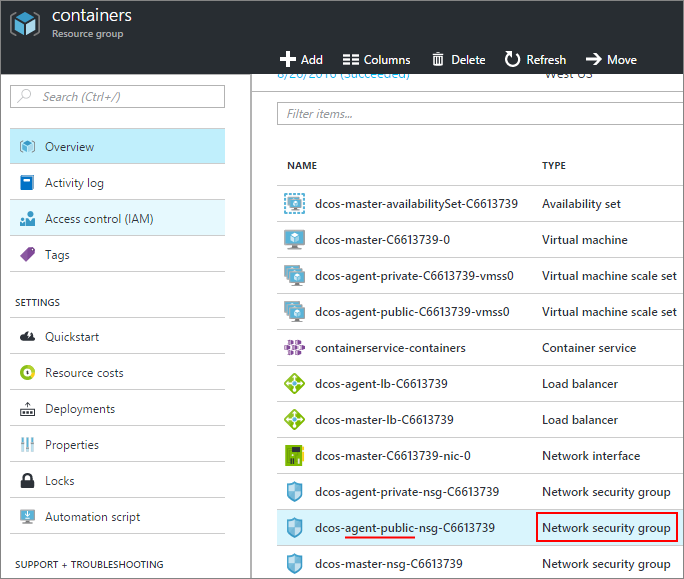
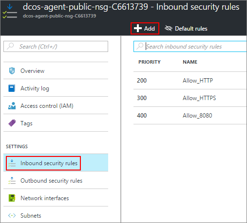

# (DEPRECATED) Enable public access to an Azure Container Service application

[!INCLUDE [ACS deprecation](../../../includes/container-service-deprecation.md)]

Any DC/OS container in the ACS [public agent pool](container-service-mesos-marathon-ui.md#deploy-a-docker-formatted-container) is automatically exposed to the internet. By default, ports **80**, **443**, **8080** are opened, and any (public) container listening on those ports are accessible. This article shows you how to open more ports for your applications in Azure Container Service.

## Open a port (portal)
First, we need to open the port we want.

1. Log in to the portal.
2. Find the resource group that you deployed the Azure Container Service to.
3. Select the agent load balancer (which is named similar to **XXXX-agent-lb-XXXX**).
   
    
4. Click **Probes** and then **Add**.
   
    
5. Fill out the probe form and click **OK**.
   
   | Field | Description |
   | --- | --- |
   | Name |A descriptive name of the probe. |
   | Port |The port of the container to test. |
   | Path |(When in HTTP mode) The relative website path to probe. HTTPS not supported. |
   | Interval |The amount of time between probe attempts, in seconds. |
   | Unhealthy threshold |Number of consecutive probe attempts before considering the container unhealthy. |
6. Back at the properties of the agent load balancer, click **Load balancing rules** and then **Add**.
   
    
7. Fill out the load balancer form and click **OK**.
   
   | Field | Description |
   | --- | --- |
   | Name |A descriptive name of the load balancer. |
   | Port |The public incoming port. |
   | Backend port |The internal-public port of the container to route traffic to. |
   | Backend pool |The containers in this pool will be the target for this load balancer. |
   | Probe |The probe used to determine if a target in the **Backend pool** is healthy. |
   | Session persistence |Determines how traffic from a client should be handled for the duration of the session.  **None**: Successive requests from the same client can be handled by any container. **Client IP**: Successive requests from the same client IP are handled by the same container. **Client IP and protocol**: Successive requests from the same client IP and protocol combination are handled by the same container. |
   | Idle timeout |(TCP only) In minutes, the time to keep a TCP/HTTP client open without relying on *keep-alive* messages. |

## Add a security rule (portal)
Next, we need to add a security rule that routes traffic from our opened port through the firewall.

1. Log in to the portal.
2. Find the resource group that you deployed the Azure Container Service to.
3. Select the **public** agent network security group (which is named similar to **XXXX-agent-public-nsg-XXXX**).
   
    
4. Select **Inbound security rules** and then **Add**.
   
    
5. Fill out the firewall rule to allow your public port and click **OK**.
   
   | Field | Description |
   | --- | --- |
   | Name |A descriptive name of the firewall rule. |
   | Priority |Priority rank for the rule. The lower the number the higher the priority. |
   | Source |Restrict the incoming IP address range to be allowed or denied by this rule. Use **Any** to not specify a restriction. |
   | Service |Select a set of predefined services this security rule is for. Otherwise use **Custom** to create your own. |
   | Protocol |Restrict traffic based on **TCP** or **UDP**. Use **Any** to not specify a restriction. |
   | Port range |When **Service** is **Custom**, specifies the range of ports that this rule affects. You can use a single port, such as **80**, or a range like **1024-1500**. |
   | Action |Allow or deny traffic that meets the criteria. |

## Next steps
Learn about the difference between [public and private DC/OS agents](container-service-dcos-agents.md).

Read more information about [managing your DC/OS containers](container-service-mesos-marathon-ui.md).

