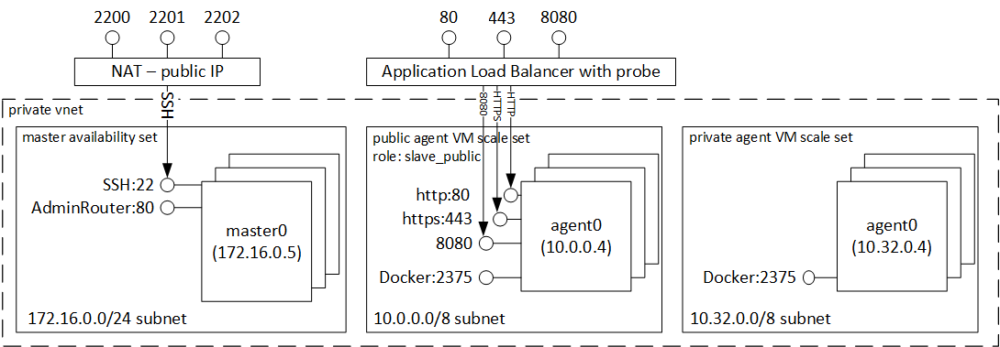
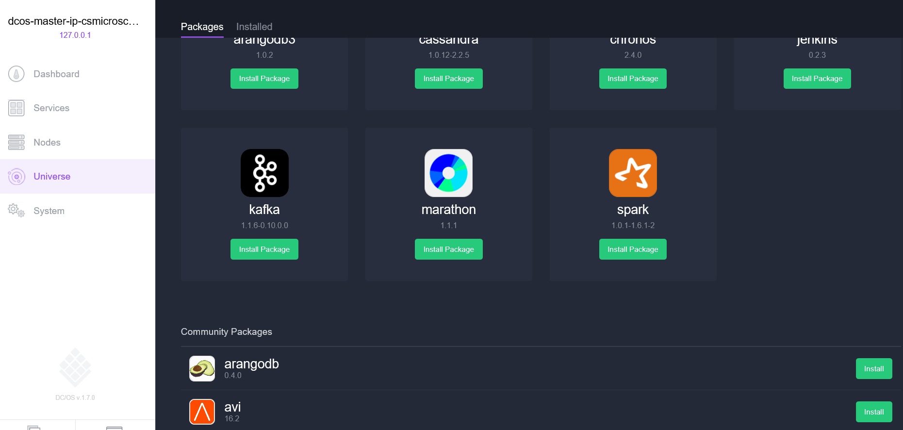
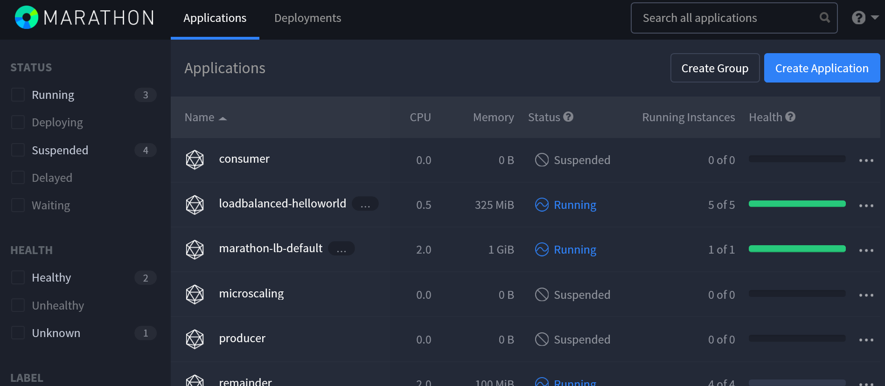

# Introduction to Docker container hosting solutions with Azure Container Service 

Azure Container Service makes it simpler for you to create, configure, and manage a cluster of virtual machines that are preconfigured to run containerized applications. It uses an optimized configuration of popular open-source scheduling and orchestration tools. This enables you to use your existing skills, or draw upon a large and growing body of community expertise, to deploy and manage container-based applications on Microsoft Azure.

Azure Container Service leverages the Docker container format to ensure that your application containers are fully portable. It also supports your choice of Marathon and DC/OS, Docker Swarm, or Kubernetes so that you can scale these applications to thousands of containers, or even tens of thousands.

By using Azure Container Service, you can take advantage of the
enterprise-grade features of Azure, while still maintaining application portability--including portability at the orchestration layers.

## Using Azure Container Service
Our goal with Azure Container Service is to provide a container
hosting environment by using open-source tools and technologies that are popular among our customers today. To this end, we expose the standard API endpoints for your chosen orchestrator (DC/OS, Docker Swarm, or Kubernetes). By using these endpoints, you can leverage any software that is capable of talking to those endpoints. For example, in the case of the Docker Swarm endpoint, you might choose to use the Docker command-line interface (CLI). For DC/OS, you might choose the DCOS CLI. For Kubernetes, you might choose `kubectl`.

## Creating a Docker cluster by using Azure Container Service
To begin using Azure Container Service, you deploy an Azure Container Service cluster via the portal (search the Marketplace for **Azure Container Service**), by using an Azure Resource Manager template ([Docker Swarm](https://github.com/Azure/azure-quickstart-templates/tree/master/101-acs-swarm), [DC/OS](https://github.com/Azure/azure-quickstart-templates/tree/master/101-acs-dcos), or [Kubernetes](https://github.com/Azure/azure-quickstart-templates/tree/master/101-acs-kubernetes)), or with the [Azure CLI](container-service-create-acs-cluster-cli.md). The provided quickstart templates can be modified to include additional or advanced Azure configuration. For more information, see [Deploy an Azure Container Service cluster](container-service-deployment.md).

## Deploying an application
Azure Container Service provides a choice of Docker Swarm, DC/OS, or Kubernetes for orchestration. How you deploy your application depends on your choice of orchestrator.

### Using DC/OS
DC/OS is a distributed operating system based on the Apache Mesos distributed systems kernel. Apache Mesos is housed at the Apache Software
Foundation and lists some of the [biggest names in
IT](http://mesos.apache.org/documentation/latest/powered-by-mesos/) as
users and contributors.

DC/OS and Apache Mesos include an impressive feature set:

* Proven scalability
* Fault-tolerant replicated master and slaves using Apache ZooKeeper
* Support for Docker-formatted containers
* Native isolation between tasks with Linux containers
* Multiresource scheduling (memory, CPU, disk, and ports)
* Java, Python, and C++ APIs for developing new parallel applications
* A web UI for viewing cluster state

By default, DC/OS running on Azure Container Service includes the Marathon orchestration platform for scheduling workloads. However, included with the DC/OS deployment of ACS is the Mesosphere Universe of services that can be added to your service. Services in the Universe include Spark, Hadoop, Cassandra, and much more.

#### Using Marathon
Marathon is a cluster-wide init and control system for services in
cgroups--or, in the case of Azure Container Service, Docker-formatted containers. Marathon provides a web UI from which you can deploy your applications. You can access this at a URL that looks something like
`http://DNS_PREFIX.REGION.cloudapp.azure.com`
where DNS\_PREFIX and REGION are both defined at deployment time. Of course, you can also provide your own DNS name. For more information on running a container using the Marathon web UI, see [DC/OS container management through the Marathon web UI](container-service-mesos-marathon-ui.md).

You can also use the REST APIs for communicating with Marathon. There are a number of client libraries that are available for each tool. They cover a variety of languages--and, of course, you can use the HTTP protocol in any language. In addition, many popular DevOps tools provide support for Marathon. This provides maximum flexibility for your operations team when you are working with an Azure Container Service cluster. For more information on running a container by using the Marathon REST API, see [DC/OS container management through the Marathon REST API](container-service-mesos-marathon-rest.md).

### Using Docker Swarm
Docker Swarm provides native clustering for Docker. Because Docker Swarm
serves the standard Docker API, any tool that already communicates with
a Docker daemon can use Swarm to transparently scale to multiple hosts
on Azure Container Service.

[!INCLUDE [container-service-swarm-mode-note](../../../includes/container-service-swarm-mode-note.md)]

Supported tools for managing containers on a Swarm cluster include, but are not limited
to, the following:

* Dokku
* Docker CLI and Docker Compose
* Krane
* Jenkins

### Using Kubernetes
Kubernetes is a popular open-source, production-grade container orchestrator tool. Kubernetes automates deployment, scaling, and management of containerized applications. Because it is an open-source solution and is driven by the open-source community, it runs seamlessly on Azure Container Service and can be used to deploy containers at scale on Azure Container Service.

It has a rich set of features including:
* Horizontal scaling
* Service discovery and load balancing
* Secrets and configuration management
* API-based automated rollouts and rollbacks
* Self-healing

## Videos
Getting started with Azure Container Service (101):  

> [!VIDEO https://channel9.msdn.com/Shows/Azure-Friday/Azure-Container-Service-101/player]
>
>

Building Applications Using the Azure Container Service (Build 2016)

> [!VIDEO https://channel9.msdn.com/Events/Build/2016/B822/player]
>
>

## Next steps

Deploy a container service cluster using the [portal](container-service-deployment.md) or [Azure CLI](container-service-create-acs-cluster-cli.md).
