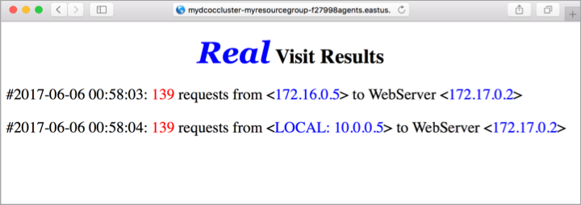

# (DEPRECATED) Load balance containers in an Azure Container Service DC/OS cluster

[!INCLUDE [ACS deprecation](../../../includes/container-service-deprecation.md)]

In this article, we explore how to create an internal load balancer in a DC/OS managed Azure Container Service using Marathon-LB. This configuration enables you to scale your applications horizontally. It also allows you to take
advantage of the public and private agent clusters by placing your load balancers on the public cluster and your application containers on the private cluster. In this tutorial, you:

> [!div class="checklist"]
> * Configure a Marathon Load Balancer
> * Deploy an application using the load balancer
> * Configure and Azure load balancer

You need an ACS DC/OS cluster to complete the steps in this tutorial. If needed, [this script sample](./../kubernetes/scripts/container-service-cli-deploy-dcos.md) can create one for you.

This tutorial requires the Azure CLI version 2.0.4 or later. Run `az --version` to find the version. If you need to upgrade, see [Install the Azure CLI]( /cli/azure/install-azure-cli). 

[!INCLUDE [cloud-shell-try-it.md](../../../includes/cloud-shell-try-it.md)]

## Load balancing overview

There are two load-balancing layers in an Azure Container Service DC/OS cluster: 

**Azure Load Balancer** provides public entry points (the ones that end users access). An Azure LB is provided automatically by Azure Container Service and is, by default, configured to expose port 80, 443 and 8080.

**The Marathon Load Balancer (marathon-lb)** routes inbound requests to container instances that service these requests. As we scale the containers providing our web service, the marathon-lb dynamically adapts. This load balancer is not provided by default in your Container Service, but it is easy to install.

## Configure Marathon Load Balancer

Marathon Load Balancer dynamically reconfigures itself based on the containers that you've deployed. It's also resilient to the loss of a container or an agent - if this occurs, Apache Mesos restarts the container elsewhere and marathon-lb adapts.

Run the following command to install the marathon load balancer on the public agent's cluster.

```azurecli-interactive
dcos package install marathon-lb
```

## Deploy load balanced application

Now that we have the marathon-lb package, we can deploy an application container that we wish to load balance. 

First, get the FQDN of the publicly exposed agents.

```azurecli-interactive
az acs list --resource-group myResourceGroup --query "[0].agentPoolProfiles[0].fqdn" --output tsv
```

Next, create a file named *hello-web.json* and copy in the following contents. The `HAPROXY_0_VHOST` label needs to be updated with the FQDN of the DC/OS agents. 

```json
{
  "id": "web",
  "container": {
    "type": "DOCKER",
    "docker": {
      "image": "yeasy/simple-web",
      "network": "BRIDGE",
      "portMappings": [
        { "hostPort": 0, "containerPort": 80, "servicePort": 10000 }
      ],
      "forcePullImage":true
    }
  },
  "instances": 3,
  "cpus": 0.1,
  "mem": 65,
  "healthChecks": [{
      "protocol": "HTTP",
      "path": "/",
      "portIndex": 0,
      "timeoutSeconds": 10,
      "gracePeriodSeconds": 10,
      "intervalSeconds": 2,
      "maxConsecutiveFailures": 10
  }],
  "labels":{
    "HAPROXY_GROUP":"external",
    "HAPROXY_0_VHOST":"YOUR FQDN",
    "HAPROXY_0_MODE":"http"
  }
}
```

Use the DC/OS CLI to run the application. By default Marathon deploys the application to the private cluster. This means that the above deployment is only accessible via your load balancer, which is usually the desired behavior.

```azurecli-interactive
dcos marathon app add hello-web.json
```

Once the application has been deployed, browse to the FQDN of the agent cluster to view load balanced application.



## Configure Azure Load Balancer

By default, Azure Load Balancer exposes ports 80, 8080, and 443. If you're using one of these three ports (as we do in the above example), then there is nothing you need to do. You should be able to hit your agent load balancer's FQDN, and each time you refresh, you'll hit one of your three web servers in a round-robin fashion. 

If you use a different port, you need to add a round-robin rule and a probe on the load balancer for the port that you used. You can do this from the [Azure CLI](../../azure-resource-manager/xplat-cli-azure-resource-manager.md), with the commands `azure network lb rule create` and `azure network lb probe create`.

## Next steps

In this tutorial, you learned about load balancing in ACS with both the Marathon and Azure load balancers including the following actions:

> [!div class="checklist"]
> * Configure a Marathon Load Balancer
> * Deploy an application using the load balancer
> * Configure and Azure load balancer

Advance to the next tutorial to learn about integrating Azure storage with DC/OS in Azure.

> [!div class="nextstepaction"]
> [Mount Azure File Share in DC/OS cluster](container-service-dcos-fileshare.md)
