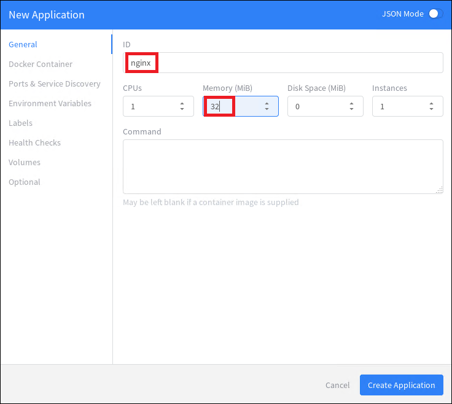
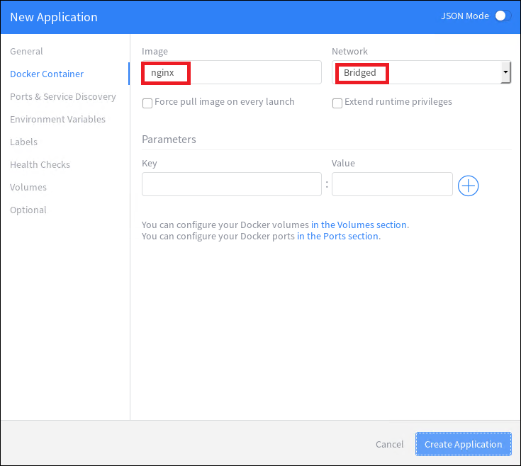
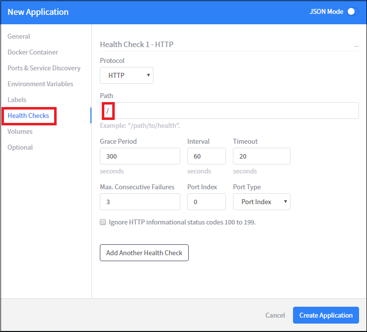
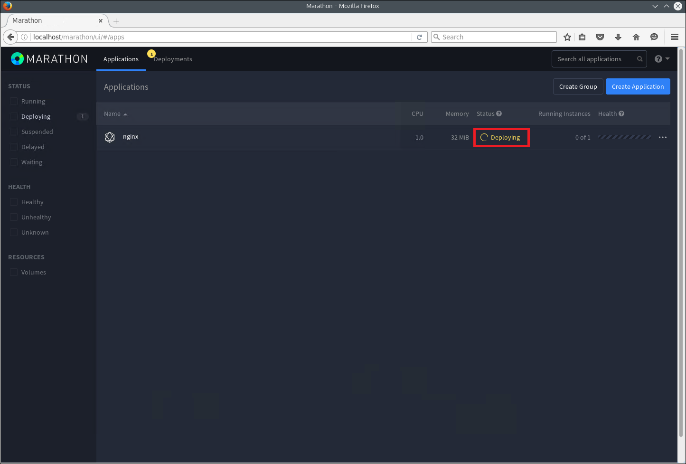
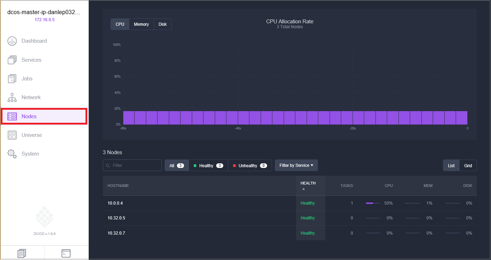

# (DEPRECATED) Manage an Azure Container Service DC/OS cluster through the Marathon web UI

[!INCLUDE [ACS deprecation](../../../includes/container-service-deprecation.md)]

DC/OS provides an environment for deploying and scaling clustered workloads, while abstracting the underlying hardware. On top of DC/OS, there is a framework that manages scheduling and executing compute workloads.

While frameworks are available for many popular workloads, this document describes how to get started deploying containers with Marathon. 


## Prerequisites
Before working through these examples, you need a DC/OS cluster that is configured in Azure Container Service. You also need to have remote connectivity to this cluster. For more information on these items, see the following articles:

* [Deploy an Azure Container Service cluster](container-service-deployment.md)
* [Connect to an Azure Container Service cluster](../container-service-connect.md)

> [!NOTE]
> This article assumes you are tunneling to the DC/OS cluster through your local port 80.
>

## Explore the DC/OS UI
With a Secure Shell (SSH) tunnel [established](../container-service-connect.md), browse to http:\//localhost/. This loads the DC/OS web UI and shows information about the cluster, such as used resources, active agents, and running services.


## Explore the Marathon UI
To see the Marathon UI, browse to http:\//localhost/marathon. From this screen, you can start a new container or another application on the Azure Container Service DC/OS cluster. You can also see information about running containers and applications.  


## Deploy a Docker-formatted container
To deploy a new container by using Marathon, click **Create Application**, and enter the following information into the form tabs:

| Field | Value |
| --- | --- |
| ID |nginx |
| Memory | 32 |
| Image |nginx |
| Network |Bridged |
| Host Port |80 |
| Protocol |TCP |






If you want to statically map the container port to a port on the agent, you need to use JSON Mode. To do so, switch the New Application wizard to **JSON Mode** by using the toggle. Then enter the following setting under the `portMappings` section of the application definition. This example binds port 80 of the container to port 80 of the DC/OS agent. You can switch this wizard out of JSON Mode after you make this change.

```none
"hostPort": 80,
```


If you want to enable health checks, set a path on the **Health Checks** tab.



The DC/OS cluster is deployed with set of private and public agents. For the cluster to be able to access applications from the Internet, you need to deploy the applications to a public agent. To do so, select the **Optional** tab of the New Application wizard and enter **slave_public** for the **Accepted Resource Roles**.

Then click **Create Application**.


Back on the Marathon main page, you can see the deployment status for the container. Initially you see a status of **Deploying**. After a successful deployment, the status changes to **Running**.



When you switch back to the DC/OS web UI (http:\//localhost/), you see that a task (in this case, a Docker-formatted container) is running on the DC/OS cluster.


To see the cluster node that the task is running on, click the **Nodes** tab.



## Reach the container

In this example, the application is running on a public agent node. You reach the application from the internet by browsing to the agent FQDN of the cluster: `http://[DNSPREFIX]agents.[REGION].cloudapp.azure.com`, where:

* **DNSPREFIX** is the DNS prefix that you provided when you deployed the cluster.
* **REGION** is the region in which your resource group is located.

    


## Next steps
* [Work with DC/OS and the Marathon API](container-service-mesos-marathon-rest.md)

* Deep dive on the Azure Container Service with Mesos

    > [!VIDEO https://channel9.msdn.com/Events/Microsoft-Azure/AzureCon-2015/ACON203/player]
    > 
