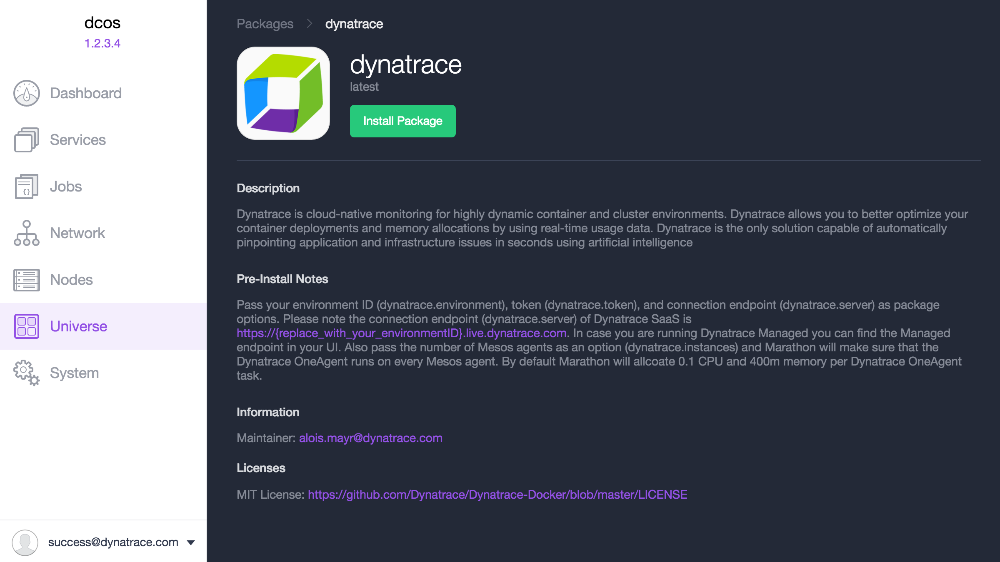
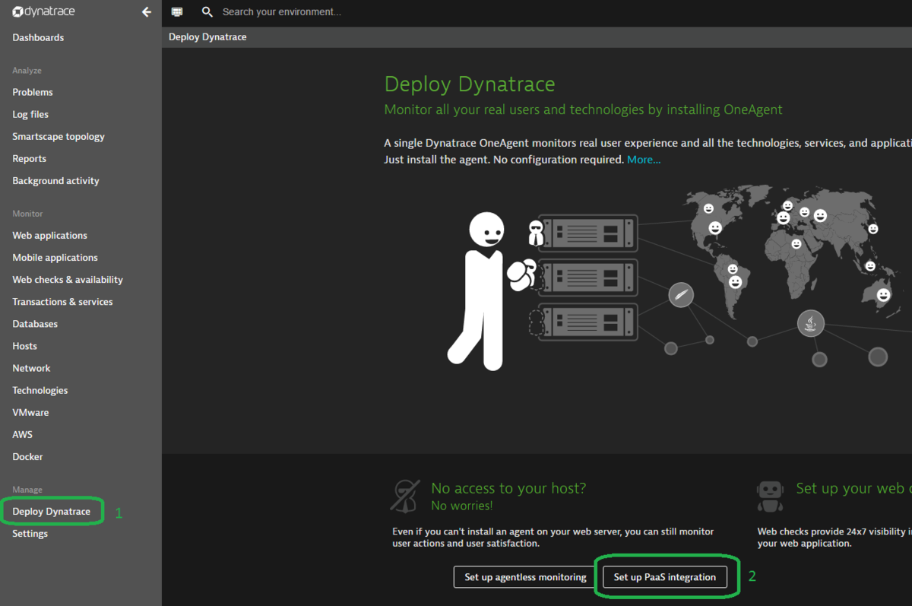

# (DEPRECATED) Monitor an Azure Container Service DC/OS cluster with Dynatrace SaaS/Managed

[!INCLUDE [ACS deprecation](../../../includes/container-service-deprecation.md)]

In this article, we show you how to deploy the [Dynatrace](https://www.dynatrace.com/) OneAgent to monitor all the agent nodes in your Azure Container Service cluster. You need an account with Dynatrace SaaS/Managed for this configuration. 

## Dynatrace SaaS/Managed
Dynatrace is a cloud-native monitoring solution for highly dynamic container and cluster environments. It allows you to better optimize your container deployments and memory allocations by using real-time usage data. It is capable of automatically pinpointing application and infrastructure issues by providing automated baselining, problem correlation, and root-cause detection.

The following figure shows the Dynatrace UI:

## Prerequisites 
[Deploy](container-service-deployment.md) and [connect](./../container-service-connect.md) to a cluster configured by Azure Container Service. Explore the [Marathon UI](container-service-mesos-marathon-ui.md). Go to [https://www.dynatrace.com/trial/](https://www.dynatrace.com/trial/) to set up a Dynatrace SaaS account.  

## Configure a Dynatrace deployment with Marathon
These steps show you how to configure and deploy Dynatrace applications to your cluster with Marathon.

1. Access your DC/OS UI via `http://localhost:80/`. Once in the DC/OS UI, navigate to the **Universe** tab and then search for **Dynatrace**.

    

2. To complete the configuration, you need a Dynatrace SaaS account or a free trial account. Once you log into the Dynatrace dashboard, select **Deploy Dynatrace**.

    

3. On the page, select **Set up PaaS integration**. 

     

4. Enter your API token into the Dynatrace OneAgent configuration within the DC/OS Universe. 

    

5. Set the instances to the number of nodes you intend to run. Setting a higher number also works, but DC/OS will keep trying to find new instances until that number is actually reached. If you prefer, you can also set this to a value like 1000000. In this case, whenever a new node is added to the cluster, Dynatrace automatically deploys an agent to that new node, at the price of DC/OS constantly trying to deploy further instances.

    

## Next steps

Once you've installed the package, navigate back to the Dynatrace dashboard. You can explore the different usage metrics for the containers within your cluster. 
