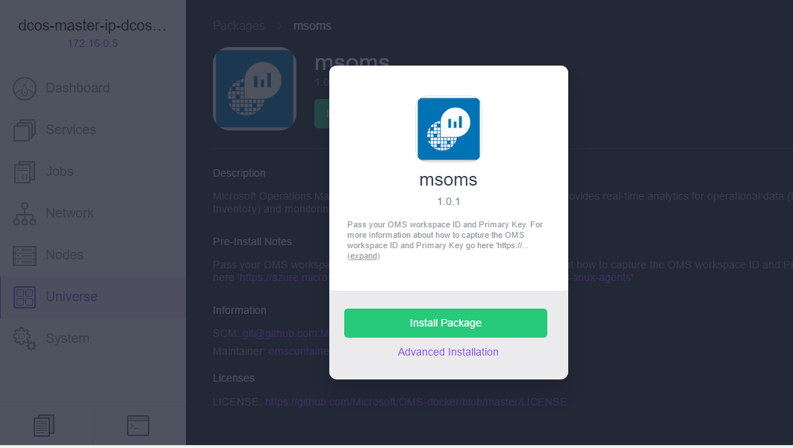
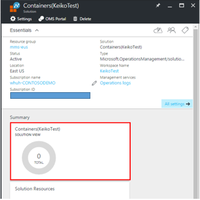
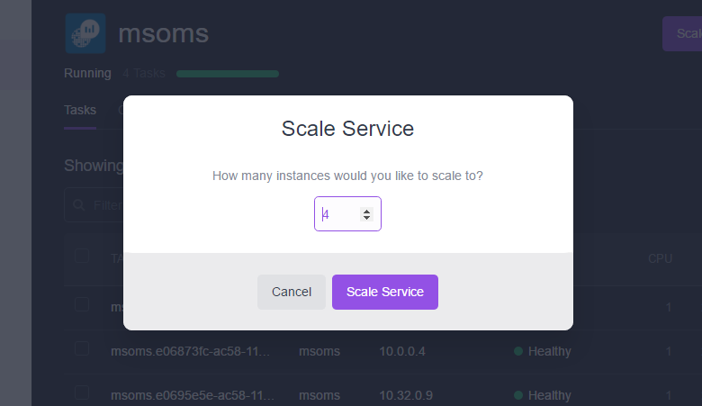

# (DEPRECATED) Monitor an Azure Container Service DC/OS cluster with Log Analytics

[!INCLUDE [ACS deprecation](../../../includes/container-service-deprecation.md)]

Log Analytics is Microsoft's cloud-based IT
management solution that helps you manage and protect your on-premises
and cloud infrastructure. Container Solution is a solution in Log
Analytics, which helps you view the container inventory, performance,
and logs in a single location. You can audit, troubleshoot containers by
viewing the logs in centralized location, and find noisy consuming
excess container on a host.


For more information about Container Solution, see the
[Container Solution Log
Analytics](../../azure-monitor/insights/containers.md).

## Setting up Log Analytics from the DC/OS universe


This article assumes that you have set up an DC/OS and
have deployed simple web container applications on the cluster.

### Pre-requisite
- [Microsoft Azure Subscription](https://azure.microsoft.com/free/) - You can get a subscription for free.  
- Log Analytics Workspace Setup - see "Step 3" below
- [DC/OS CLI](https://docs.mesosphere.com/1.12/cli) installed.

1. In the DC/OS dashboard, click on Universe and search
   for ‘OMS’ as shown below.

   >[!NOTE]
   >OMS is now referred to as Log Analytics.

   

2. Click **Install**. You will see a pop-up with the version
   information and an **Install Package** or **Advanced Installation**
   button. When you click **Advanced Installation**, which leads you to the **OMS specific configuration
   properties** page.

   

   

3. Here, you will be asked to enter the `wsid` (the Log Analytics workspace ID)
   and `wskey` (the primary key for the workspace ID). To get both `wsid` and
   `wskey` you need to create an account at <https://mms.microsoft.com>.
   Follow the steps to create an account. Once you are done creating
   the account, you need to obtain your `wsid` and `wskey` by clicking **Settings**, then **Connected Sources**, and then **Linux Servers**, as shown below.

   

4. Select the number of instances that you want and click the ‘Review and Install’ button. Typically, you will want to have the number of instances equal to the number of VM’s you have in your agent cluster. Log Analytics agent for Linux installs as individual containers on each VM that it wants to collect information for monitoring and logging information.

   [!INCLUDE [log-analytics-agent-note](../../../includes/log-analytics-agent-note.md)] 

## Setting up a simple Log Analytics dashboard

Once you have installed the Log Analytics agent for Linux on the VMs, next step is
to set up the Log Analytics dashboard. You can set up the dashboard through Azure portal.

### Azure portal 

Sign in to Azure portal at <https://portal.microsoft.com/>. Go to
**Marketplace**, select **Monitoring + management** and click **See All**. Then Type `containers` in search. You will see "containers" in the search results. Select **Containers** and click **Create**.


Once you click **Create**, it will ask you for your workspace. Select your
workspace or if you do not have one, create a new workspace.


Once you’ve selected your workspace, click **Create**.



For more information about the Log Analytics Container Solution, please refer to the
[Container Solution Log
Analytics](../../azure-monitor/insights/containers.md).

### How to scale Log Analytics agent with ACS DC/OS 

In case you need to have installed Log Analytics agent short of the actual node
count or you are scaling up virtual machine scale set by adding more VM, you can do so by
scaling the `msoms` service.

You can either go to Marathon or the DC/OS UI Services tab and scale up
your node count.



This will deploy to other nodes which have not yet deployed the Log Analytics agent.

## Uninstall MS OMS

To uninstall MS OMS enter the following command:

```bash
$ dcos package uninstall msoms
```

## Let us know!!!
What works? What is missing? What else do you need for this to be useful for you? Let us know at <a href="mailto:OMSContainers@microsoft.com">OMSContainers</a>.

## Next steps

 Now that you have set up Log Analytics to monitor your containers,[see your container dashboard](../../azure-monitor/insights/containers.md).
