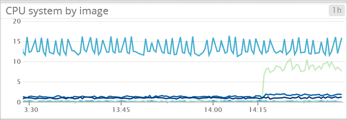
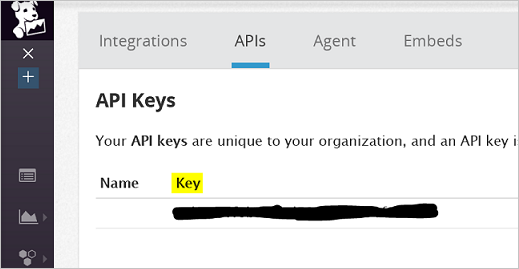
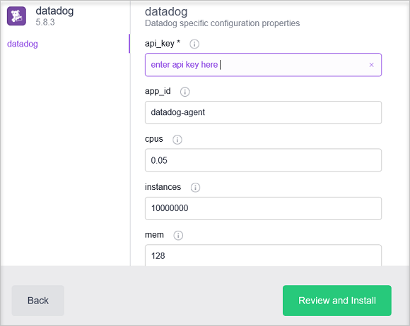

# (DEPRECATED) Monitor an Azure Container Service DC/OS cluster with Datadog

[!INCLUDE [ACS deprecation](../../../includes/container-service-deprecation.md)]

In this article we will deploy Datadog agents to all the agent nodes in your Azure Container Service cluster. You will need an account with Datadog for this configuration. 

## Prerequisites
[Deploy](container-service-deployment.md) and [connect](../container-service-connect.md) a cluster configured by Azure Container Service. Explore the [Marathon UI](container-service-mesos-marathon-ui.md). Go to [https://datadoghq.com](https://datadoghq.com) to set up a Datadog account. 

## Datadog
Datadog is a monitoring service that gathers monitoring data from your containers within your Azure Container Service cluster. Datadog has a Docker Integration Dashboard where you can see specific metrics within your containers. Metrics gathered from your containers are organized by CPU, Memory, Network and I/O. Datadog splits metrics into containers and images. An example of what the UI looks like for CPU usage is below.

## Configure a Datadog deployment with Marathon
These steps will show you how to configure and deploy Datadog applications to your cluster with Marathon. 

Access your DC/OS UI via [http://localhost:80/](http://localhost:80/). Once in the DC/OS UI navigate to the "Universe" which is on the bottom left and then search for "Datadog" and click "Install."

Now to complete the configuration you will need a Datadog account or a free trial account. Once you're logged in to the Datadog website look to the left and go to Integrations -> then [APIs](https://app.datadoghq.com/account/settings#api). 

Next enter your API key into the Datadog configuration within the DC/OS Universe. 

 

In the above configuration instances are set to 10000000 so whenever a new node is added to the cluster Datadog will automatically deploy an agent to that node. This is an interim solution. Once you've installed the package you should navigate back to the Datadog website and find "[Dashboards](https://app.datadoghq.com/dash/list)." From there you will see Custom and Integration Dashboards. The [Docker dashboard](https://app.datadoghq.com/screen/integration/docker) will have all the container metrics you need for monitoring your cluster. 

