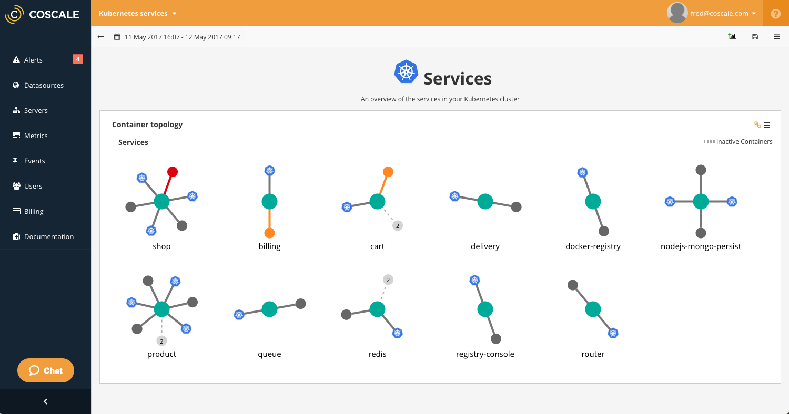
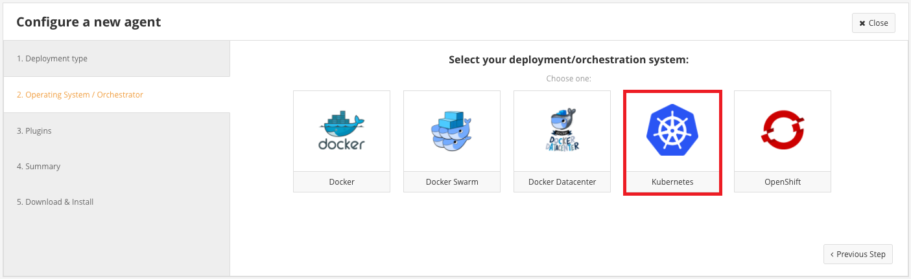
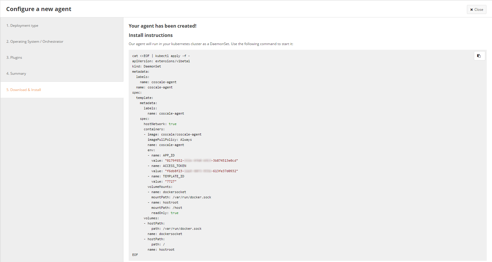

# (DEPRECATED) Monitor an Azure Container Service Kubernetes cluster with CoScale

[!INCLUDE [ACS deprecation](../../../includes/container-service-kubernetes-deprecation.md)]

In this article, we show you how to deploy the [CoScale](https://web.archive.org/web/20180317071550/https://www.coscale.com/) agent to monitor all nodes and containers in your Kubernetes cluster in Azure Container Service. You need an account with CoScale for this configuration. 


## About CoScale 

CoScale is a monitoring platform that gathers metrics and events from all containers in several orchestration platforms. CoScale offers full-stack monitoring for Kubernetes environments. It provides visualizations and analytics for all layers in the stack: the OS, Kubernetes, Docker, and applications running inside your containers. CoScale offers several built-in monitoring dashboards, and it has built-in anomaly detection to allow operators and developers to find infrastructure and application issues fast.



As shown in this article, you can install agents on a Kubernetes cluster to run CoScale as a SaaS solution. If you want to keep your data on-site, CoScale is also available for on-premises installation.


## Prerequisites

You first need to [create a CoScale account](https://web.archive.org/web/20170507123133/https://www.coscale.com/free-trial).

This walkthrough assumes that you have [created a Kubernetes cluster using Azure Container Service](container-service-kubernetes-walkthrough.md).

It also assumes that you have the `az` Azure CLI and `kubectl` tools installed.

You can test if you have the `az` tool installed by running:

```azurecli
az --version
```

If you don't have the `az` tool installed, there are instructions [here](/cli/azure/install-azure-cli).

You can test if you have the `kubectl` tool installed by running:

```bash
kubectl version
```

If you don't have `kubectl` installed, you can run:

```azurecli
az acs kubernetes install-cli
```

## Installing the CoScale agent with a DaemonSet
[DaemonSets](https://kubernetes.io/docs/concepts/workloads/controllers/daemonset/) are used by Kubernetes to run a single instance of a container on each host in the cluster.
They're perfect for running monitoring agents such as the CoScale agent.

After you log in to CoScale, go to the [agent page](https://app.coscale.com/)
to install CoScale agents on your cluster using a DaemonSet. The CoScale UI provides guided configuration steps to create an agent and start monitoring your complete Kubernetes cluster.



To start the agent on the cluster, run the supplied command:



That's it! Once the agents are up and running, you should see data in the console in a few minutes. Visit
the [agent page](https://app.coscale.com/) to see a summary of your cluster, perform additional configuration steps, and see dashboards such as the **Kubernetes cluster overview**.


The CoScale agent is automatically deployed on new machines in the cluster. The agent updates automatically when a new version is released.


## Next steps

See the [CoScale documentation](https://web.archive.org/web/20180415164304/http://docs.coscale.com:80/) and [blog](https://web.archive.org/web/20170501021344/http://www.coscale.com:80/blog) for more information about CoScale monitoring solutions. 

