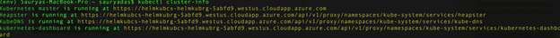
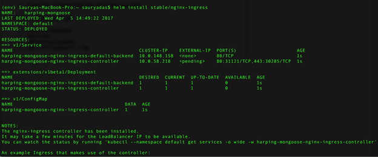

# (DEPRECATED) Use Helm to deploy containers on a Kubernetes cluster

> [!TIP]
> For the updated version this article that uses Azure Kubernetes Service, see [Install applications with Helm in Azure Kubernetes Service (AKS)](../../aks/kubernetes-helm.md).

[!INCLUDE [ACS deprecation](../../../includes/container-service-kubernetes-deprecation.md)]

[Helm](https://github.com/kubernetes/helm/) is an open-source packaging tool that helps you install and manage the lifecycle of Kubernetes applications. Similar to Linux package managers such as Apt-get and Yum, Helm is used to manage Kubernetes charts, which are packages of preconfigured Kubernetes resources. This article shows you how to work with Helm on a Kubernetes cluster deployed in Azure Container Service.

Helm has two components: 
* The **Helm CLI** is a client that runs on your machine locally or in the cloud  

* **Tiller** is a server that runs on the Kubernetes cluster and manages the lifecycle of your Kubernetes applications 
 
## Prerequisites

* [Create a Kubernetes cluster](container-service-kubernetes-walkthrough.md) in Azure Container Service

* [Install and configure `kubectl`](../container-service-connect.md) on a local computer

* [Install Helm](https://github.com/kubernetes/helm/blob/master/docs/install.md) on a local computer

## Helm basics 

To view information about the Kubernetes cluster that you are installing Tiller and deploying your applications to, type the following command:

```bash
kubectl cluster-info 
```

 
After you have installed Helm, install Tiller on your Kubernetes cluster by typing the following command:

```bash
helm init --upgrade
```
When it completes successfully, you see output like the following:


 
 
 
 
To view all the Helm charts available in the repository, type the following command:

```bash 
helm search 
```

You see output like the following:


 
To update the charts to get the latest versions, type:

```bash 
helm repo update 
```
## Deploy an Nginx ingress controller chart 
 
To deploy an Nginx ingress controller chart, type a single command:

```bash
helm install stable/nginx-ingress 
```


If you type `kubectl get svc` to view all services that are running on the cluster, you see that an IP address is assigned to the ingress controller. (While the assignment is in progress, you see `<pending>`. It takes a couple of minutes to complete.) 

After the IP address is assigned, navigate to the value of the external IP address to see the Nginx backend running. 
 


To see a list of charts installed on your cluster, type:

```bash
helm list 
```

You can abbreviate the command to `helm ls`.
 
 
 
 
## Deploy a MariaDB chart and client

Now deploy a MariaDB chart and a MariaDB client to connect to the database.

To deploy the MariaDB chart, type the following command:

```bash
helm install --name v1 stable/mariadb
```

where `--name` is a tag used for releases.

> [!TIP]
> If the deployment fails, run `helm repo update` and try again.
>
 
 
To view all the charts deployed on your cluster, type:

```bash 
helm list
```
 
To view all deployments running on your cluster, type:

```bash
kubectl get deployments 
``` 
 
 
Finally, to run a pod to access the client, type:

```bash
kubectl run v1-mariadb-client --rm --tty -i --image bitnami/mariadb --command -- bash  
``` 
 
 
To connect to the client, type the following command, replacing `v1-mariadb` with the name of your deployment:

```bash
sudo mysql –h v1-mariadb
```
 
 
You can now use standard SQL commands to create databases, tables, etc. For example, `Create DATABASE testdb1;` creates an empty database. 
 
 
 
## Next steps

* For more information about managing Kubernetes charts, see the [Helm documentation](https://github.com/kubernetes/helm/blob/master/docs/index.md). 

