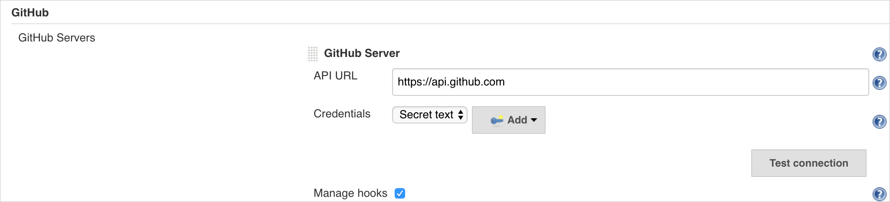
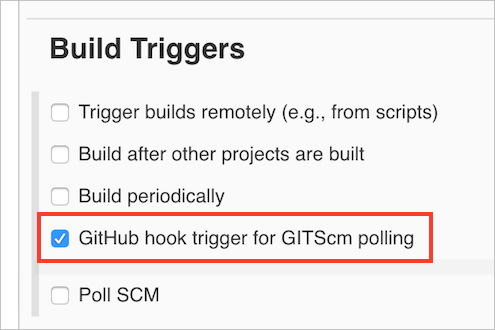

# Jenkins integration with Azure Container Service and Kubernetes 
In this tutorial, we walk through the process to set up continuous integration of a multi-container application into Azure Container Service Kubernetes using the Jenkins platform. The workflow updates the container image in Docker Hub and upgrades the Kubernetes pods using a deployment rollout. 

## High level process
The basic steps detailed in this article are: 
- Install a Kubernetes cluster in Container Service
- Set up Jenkins and configure access to Container Service
- Create a Jenkins workflow
- Test the CI/CD process end to end

## Install a Kubernetes cluster
    
Deploy the Kubernetes cluster in Azure Container Service using the following steps. Full documentation is located [here](container-service-kubernetes-walkthrough.md).

### Step 1: Create a resource group
```azurecli
RESOURCE_GROUP=my-resource-group
LOCATION=westus

az group create --name=$RESOURCE_GROUP --location=$LOCATION
```

### Step 2: Deploy the cluster
> [!NOTE]
> The following steps require a local SSH public key stored in the ~/.ssh folder.
>

```azurecli
RESOURCE_GROUP=my-resource-group
DNS_PREFIX=some-unique-value
CLUSTER_NAME=any-acs-cluster-name

az acs create \
--orchestrator-type=kubernetes \
--resource-group $RESOURCE_GROUP \
--name=$CLUSTER_NAME \
--dns-prefix=$DNS_PREFIX \
--ssh-key-value ~/.ssh/id_rsa.pub \
--admin-username=azureuser \
--master-count=1 \
--agent-count=5 \
--agent-vm-size=Standard_D1_v2
```

## Set up Jenkins and configure access to Container Service

### Step 1: Install Jenkins
1. Create an Azure VM with Ubuntu 16.04 LTS.  Since later in the steps you will need to connect to this VM using bash on your local machine, set the 'Authentication type' to 'SSH public key' and paste the SSH public key that is stored locally in your ~/.ssh folder.  Also, take note of the 'User name' that you specify since this user name will be needed to view the Jenkins dashboard and for connecting to the Jenkins VM in later steps.
2. Install Jenkins via these [instructions](https://wiki.jenkins-ci.org/display/JENKINS/Installing+Jenkins+on+Ubuntu). A more detailed tutorial is at [howtoforge.com](https://www.howtoforge.com/tutorial/how-to-install-jenkins-with-apache-on-ubuntu-16-04).
3. To view the Jenkins dashboard on your local machine, update the Azure network security group to allow port 8080 by adding an inbound rule that allows access to port 8080.  Alternatively, you may setup port forwarding by running this command: `ssh -i ~/.ssh/id_rsa -L 8080:localhost:8080 <your_jenkins_user>@<your_jenkins_public_ip`
4. Connect to your Jenkins server using the browser by navigating to the public IP (http://<your_jenkins_public_ip>:8080) and unlock the Jenkins dashboard for the first time with the initial admin password.  The admin password is stored at /var/lib/jenkins/secrets/initialAdminPassword on the Jenkins VM.  An easy way to get this password is to SSH into the Jenkins VM: `ssh <your_jenkins_user>@<your_jenkins_public_ip>`.  Next, run: `sudo cat /var/lib/jenkins/secrets/initialAdminPassword`.
5. Install Docker on the Jenkins machine via these [instructions](https://docs.docker.com/cs-engine/1.13/#install-on-ubuntu-1404-lts-or-1604-lts). This allows for Docker commands to be run in Jenkins jobs.
6. Configure Docker permissions to allow Jenkins to access the Docker endpoint.

    ```bash
    sudo chmod 777 /run/docker.sock
    ```
8. Install `kubectl` CLI on Jenkins. More details are at [Installing and Setting up kubectl](https://kubernetes.io/docs/tasks/kubectl/install/).  Jenkins jobs will use 'kubectl' to manage and deploy to the Kubernetes cluster.

    ```bash
    curl -LO https://storage.googleapis.com/kubernetes-release/release/$(curl -s https://storage.googleapis.com/kubernetes-release/release/stable.txt)/bin/linux/amd64/kubectl

    chmod +x ./kubectl

    sudo mv ./kubectl /usr/local/bin/kubectl
    ```

### Step 2: Set up access to the Kubernetes cluster

> [!NOTE]
> There are multiple approaches to accomplishing the following steps. Use the approach that is easiest for you.
>

1. Copy the `kubectl` config file to the Jenkins machine so that Jenkins jobs have access to the Kubernetes cluster. These instructions assume that you are using bash from a different machine than the Jenkins VM and that a local SSH public key is stored in the machine's ~/.ssh folder.

```bash
export KUBE_MASTER=<your_cluster_master_fqdn>
export JENKINS_USER=<your_jenkins_user>
export JENKINS_SERVER=<your_jenkins_public_ip>
sudo ssh $JENKINS_USER@$JENKINS_SERVER sudo mkdir -m 777 /home/$JENKINS_USER/.kube/ \
&& sudo ssh $JENKINS_USER@$JENKINS_SERVER sudo mkdir /var/lib/jenkins/.kube/ \
&& sudo scp -3 -i ~/.ssh/id_rsa azureuser@$KUBE_MASTER:.kube/config $JENKINS_USER@$JENKINS_SERVER:~/.kube/config \
&& sudo ssh -i ~/.ssh/id_rsa $JENKINS_USER@$JENKINS_SERVER sudo cp /home/$JENKINS_USER/.kube/config /var/lib/jenkins/.kube/config \
```
        
2. Validate from Jenkins that the Kubernetes cluster is accessible.  To do this, SSH into the Jenkins VM: `ssh <your_jenkins_user>@<your_jenkins_public_ip>`.  Next, verify Jenkins can successfully connect to your cluster: `kubectl cluster-info`.
    

## Create a Jenkins workflow

### Prerequisites

- GitHub account for code repo.
- Docker Hub account to store and update images.
- Containerized application that can be rebuilt and updated. You can use this sample container app written in Golang: https://github.com/chzbrgr71/go-web 

> [!NOTE]
> The following steps must be performed in your own GitHub account. Feel free to clone the above repo, but you must use your own account to configure the webhooks and Jenkins access.
>

### Step 1: Deploy initial v1 of application
1. Build the app from the developer machine with the following commands. Replace `myrepo` with your own.
    
    ```bash
    git clone https://github.com/chzbrgr71/go-web.git
    cd go-web
    docker build -t myrepo/go-web .
    ```

2. Push image to Docker Hub.

    ```bash
    docker login
    docker push myrepo/go-web
    ```

3. Deploy to the Kubernetes cluster.
    
    > [!NOTE] 
    > Edit the `go-web.yaml` file to update your container image and repo.
    >
        
    ```bash
    kubectl create -f ./go-web.yaml --record
    ```
### Step 2: Configure Jenkins system
1. Click **Manage Jenkins** > **Configure System**.
2. Under **GitHub**, select **Add GitHub Server**.
3. Leave **API URL** as default.
4. Under **Credentials**, add a Jenkins credential using **Secret text**. We recommend using GitHub personal access tokens, which are configured in your GitHub user account settings. More details on this [here.](https://help.github.com/articles/creating-a-personal-access-token-for-the-command-line/)
5. Click **Test connection** to ensure this is configured correctly.
6. Under **Global Properties**, add an environment variable `DOCKER_HUB` and provide your Docker Hub password. (This is useful in this demo, but a production scenario would require a more secure approach.)
7. Save.



### Step 3: Create the Jenkins workflow
1. Create a Jenkins item.
2. Provide a name (for example, "go-web") and select **Freestyle Project**. 
3. Check **GitHub project** and provide the URL to your GitHub repo.
4. In **Source Code Management**, provide the GitHub repo URL and credentials. 
5. Add a **Build Step** of type **Execute shell** and use the following text:

    ```bash
    WEB_IMAGE_NAME="myrepo/go-web:kube${BUILD_NUMBER}"
    docker build -t $WEB_IMAGE_NAME .
    docker login -u <your-dockerhub-username> -p ${DOCKER_HUB}
    docker push $WEB_IMAGE_NAME
    ```

6. Add another **Build Step** of type **Execute shell** and use the following text:

    ```bash
    WEB_IMAGE_NAME="myrepo/go-web:kube${BUILD_NUMBER}"
    kubectl set image deployment/go-web go-web=$WEB_IMAGE_NAME --kubeconfig /var/lib/jenkins/config
    ```


    
7. Save the Jenkins item and test with **Build Now**.

### Step 4: Connect GitHub webhook
1. In the Jenkins item you created, click **Configure**.
2. Under **Build Triggers**, select **GitHub hook trigger for GITScm polling** and **Save**. This automatically configures the GitHub webhook.
3. In your GitHub repo for go-web, click **Settings > Webhooks**.
4. Verify that the Jenkins webhook URL was added successfully. The URL should end in "github-webhook".



## Test the CI/CD process end to end

1. Update code for the repo and push/synch with the GitHub repository.
2. From the Jenkins console, check the **Build History** and validate that the job has run. View console output to see details.
3. From Kubernetes, view details of the upgraded deployment:

    ```bash
    kubectl rollout history deployment/go-web
    ```

## Next steps

- Deploy Azure Container Registry and store images in a secure repository. See [Azure Container Registry docs](https://docs.microsoft.com/azure/container-registry).
- Build a more complex workflow that includes side-by-side deployment and automated tests in Jenkins.
- For more information about CI/CD with Jenkins and Kubernetes, see the [Jenkins blog](https://jenkins.io/blog/2015/07/24/integrating-kubernetes-and-jenkins/).
