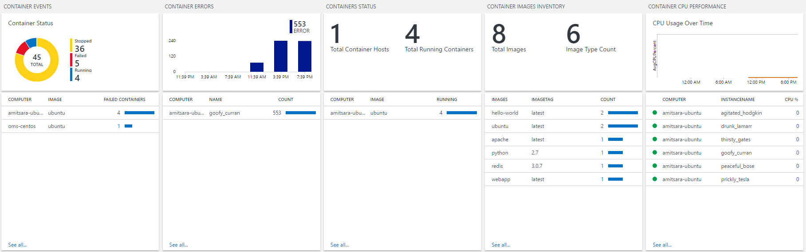
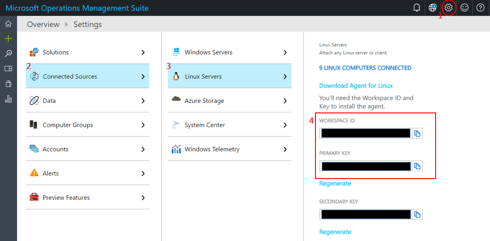

# (DEPRECATED) Monitor an Azure Container Service cluster with Log Analytics

> [!TIP]
> For the updated version this article that uses Azure Kubernetes Service, see [Azure Monitor for containers](../../azure-monitor/insights/container-insights-overview.md).

[!INCLUDE [ACS deprecation](../../../includes/container-service-kubernetes-deprecation.md)]

## Prerequisites
This walkthrough assumes that you have [created a Kubernetes cluster using Azure Container Service](container-service-kubernetes-walkthrough.md).

It also assumes that you have the `az` Azure cli and `kubectl` tools installed.

You can test if you have the `az` tool installed by running:

```console
$ az --version
```

If you don't have the `az` tool installed, there are instructions [here](https://github.com/azure/azure-cli#installation).
Alternatively, you can use [Azure Cloud Shell](https://docs.microsoft.com/azure/cloud-shell/overview), which has the `az` Azure cli and `kubectl` tools already installed for you.

You can test if you have the `kubectl` tool installed by running:

```console
$ kubectl version
```

If you don't have `kubectl` installed, you can run:
```console
$ az acs kubernetes install-cli
```

To test if you have kubernetes keys installed in your kubectl tool you can run:
```console
$ kubectl get nodes
```

If the above command errors out, you need to install kubernetes cluster keys into your kubectl tool. You can do that with the following command:
```console
RESOURCE_GROUP=my-resource-group
CLUSTER_NAME=my-acs-name
az acs kubernetes get-credentials --resource-group=$RESOURCE_GROUP --name=$CLUSTER_NAME
```

## Monitoring Containers with Log Analytics

Log Analytics is Microsoft's cloud-based IT
management solution that helps you manage and protect your on-premises
and cloud infrastructure. Container Solution is a solution in Log
Analytics, which helps you view the container inventory, performance,
and logs in a single location. You can audit, troubleshoot containers by
viewing the logs in centralized location, and find noisy consuming
excess container on a host.



For more information about Container Solution, please refer to the
[Container Solution Log
Analytics](../../azure-monitor/insights/containers.md).

## Installing Log Analytics on Kubernetes

### Obtain your workspace ID and key
For the Log Analytics agent to talk to the service it needs to be configured with a workspace ID and
a workspace key. To get the workspace ID and key you need to create an account at <https://mms.microsoft.com>.
Please follow the steps to create an account. Once you are done creating
the account, you can obtain your ID and key by clicking on the **Log Analytics** blade, then the name of your workspace. Then, under **Advanced Settings**, **Connected Sources**, and then **Linux Servers**, you will find the information you need, as shown below.

 

### Install the Log Analytics agent using a DaemonSet
DaemonSets are used by Kubernetes to run a single instance of a container on each host in the cluster.
They're perfect for running monitoring agents.

Here is the [DaemonSet YAML file](https://github.com/Microsoft/OMS-docker/tree/master/Kubernetes). Save it to a file named `oms-daemonset.yaml` and
replace the place-holder values for `WSID` and `KEY` with your workspace ID and key in the file.

Once you have added your workspace ID and key to the DaemonSet configuration, you can install the Log Analytics agent
on your cluster with the `kubectl` command-line tool:

```console
$ kubectl create -f oms-daemonset.yaml
```

### Installing the Log Analytics agent using a Kubernetes Secret
To protect your Log Analytics workspace ID and key you can use Kubernetes Secret as a part of DaemonSet YAML file.

- Copy the script, secret template file, and the DaemonSet YAML file (from [repository](https://github.com/Microsoft/OMS-docker/tree/master/Kubernetes)) and make sure they are on the same directory.
  - secret generating script - secret-gen.sh
  - secret template - secret-template.yaml
    - DaemonSet YAML file - omsagent-ds-secrets.yaml
- Run the script. The script will ask for the Log Analytics Workspace ID and Primary Key. Insert that and the script will create a secret yaml file so you can run it.
  ```
  #> sudo bash ./secret-gen.sh
  ```

  - Create the secrets pod by running the following:
  ```kubectl create -f omsagentsecret.yaml```

  - To check, run the following:

  ```
  root@ubuntu16-13db:~# kubectl get secrets
  NAME                  TYPE                                  DATA      AGE
  default-token-gvl91   kubernetes.io/service-account-token   3         50d
  omsagent-secret       Opaque                                2         1d
  root@ubuntu16-13db:~# kubectl describe secrets omsagent-secret
  Name:           omsagent-secret
  Namespace:      default
  Labels:         <none>
  Annotations:    <none>

  Type:   Opaque

  Data
  ====
  WSID:   36 bytes
  KEY:    88 bytes
  ```

  - Create your omsagent daemon-set by running ```kubectl create -f omsagent-ds-secrets.yaml```

### Conclusion
That's it! After a few minutes, you should be able to see data flowing to your Log Analytics dashboard.
