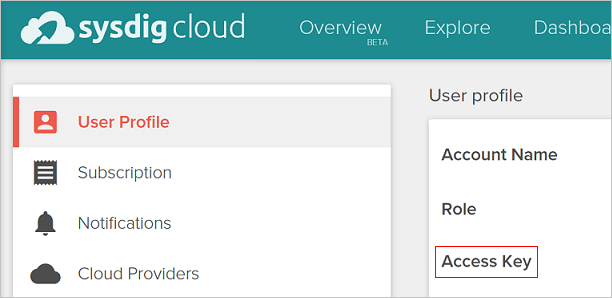

# (DEPRECATED) Monitor an Azure Container Service Kubernetes cluster using Sysdig

[!INCLUDE [ACS deprecation](../../../includes/container-service-kubernetes-deprecation.md)]

## Prerequisites
This walkthrough assumes that you have [created a Kubernetes cluster using Azure Container Service](container-service-kubernetes-walkthrough.md).

It also assumes that you have the azure cli and kubectl tools installed.

You can test if you have the `az` tool installed by running:

```console
$ az --version
```

If you don't have the `az` tool installed, there are instructions [here](https://github.com/azure/azure-cli#installation).

You can test if you have the `kubectl` tool installed by running:

```console
$ kubectl version
```

If you don't have `kubectl` installed, you can run:

```console
$ az acs kubernetes install-cli
```

## Sysdig
Sysdig is an external monitoring as a service company which can monitor containers in your Kubernetes
cluster running in Azure. Using Sysdig requires an active Sysdig account.
You can sign up for an account on their [site](https://app.sysdigcloud.com).

Once you're logged in to the Sysdig cloud website, click on your user name, and on the page you should 
see your "Access Key." 



## Installing the Sysdig agents to Kubernetes
To monitor your containers, Sysdig runs a process on each machine using a Kubernetes `DaemonSet`.
DaemonSets are Kubernetes API objects that run a single instance of a container per machine.
They're perfect for installing tools like the Sysdig's monitoring agent.

To install the Sysdig daemonset, you should first download [the template](https://github.com/draios/sysdig-cloud-scripts/tree/master/agent_deploy/kubernetes) 
from sysdig. Save that file as `sysdig-daemonset.yaml`.

On Linux and OS X you can run:

```console
$ curl -O https://raw.githubusercontent.com/draios/sysdig-cloud-scripts/master/agent_deploy/kubernetes/sysdig-daemonset.yaml
```

In PowerShell:

```console
$ Invoke-WebRequest -Uri https://raw.githubusercontent.com/draios/sysdig-cloud-scripts/master/agent_deploy/kubernetes/sysdig-daemonset.yaml | Select-Object -ExpandProperty Content > sysdig-daemonset.yaml
```

Next edit that file to insert your Access Key, that you obtained from your Sysdig account.

Finally, create the DaemonSet:

```console
$ kubectl create -f sysdig-daemonset.yaml
```

## View your monitoring
Once installed and running, the agents should pump data back to Sysdig.  Go back to the
[sysdig dashboard](https://app.sysdigcloud.com) and you should see information about your
containers.

You can also install Kubernetes-specific dashboards via the
[new dashboard wizard](https://app.sysdigcloud.com/#/dashboards/new).
