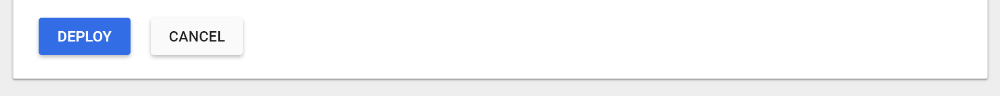
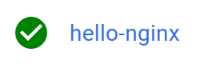
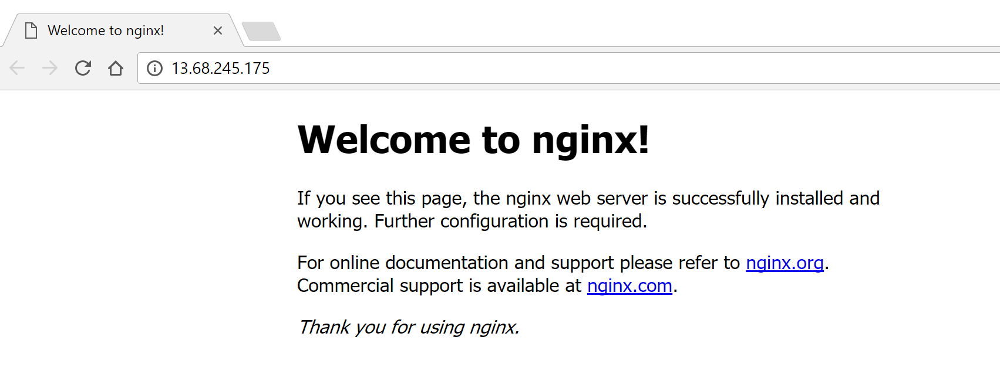
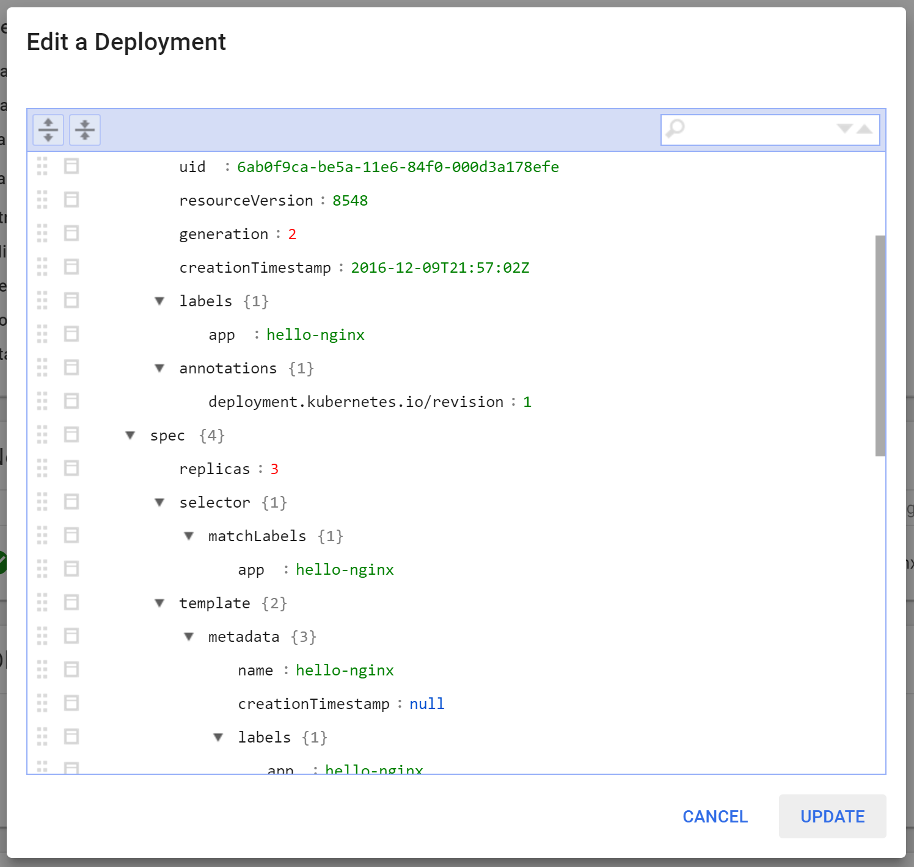

# (DEPRECATED) Using the Kubernetes web UI with Azure Container Service

> [!TIP]
> For the updated version this article that uses Azure Kubernetes Service, see [Access the Kubernetes web dashboard in Azure Kubernetes Service (AKS)](../../aks/kubernetes-dashboard.md).

[!INCLUDE [ACS deprecation](../../../includes/container-service-kubernetes-deprecation.md)]

## Prerequisites
This walkthrough assumes that you have [created a Kubernetes cluster using Azure Container Service](container-service-kubernetes-walkthrough.md).


It also assumes that you have the Azure CLI and `kubectl` tools installed.

You can test if you have the `az` tool installed by running:

```azurecli
az --version
```

If you don't have the `az` tool installed, there are instructions [here](https://github.com/azure/azure-cli#installation).

You can test if you have the `kubectl` tool installed by running:

```console
kubectl version
```

If you don't have `kubectl` installed, you can run:

```azurecli
az acs kubernetes install-cli
```

## Overview

### Connect to the web UI
You can launch the Kubernetes web UI by running:

```azurecli
az acs kubernetes browse -g [Resource Group] -n [Container service instance name]
```

This should open a web browser configured to talk to a secure proxy connecting your
local machine to the Kubernetes web UI.

### Create and expose a service
1. In the Kubernetes web UI, click **Create** button in the upper right window.

    

    A dialog box opens where you can start creating your application.

2. Give it the name `hello-nginx`. Use the [`nginx` container from Docker](https://hub.docker.com/_/nginx/)
and deploy three replicas of this web service.

    

3. Under **Service**, select **External** and enter port 80.

    This setting load-balances traffic to the three
replicas.

    

4. Click **Deploy** to deploy these containers and services.

    

### View your containers
After you click **Deploy**, the UI shows a view of your service as it deploys:


You can see the status of each Kubernetes object in the circle on the left-hand side of the
UI, under **Pods**. If it is a partially full circle, then the object is still deploying. When an object is fully deployed,
it displays a green check mark:



Once everything is running, click one of your pods to see details about the running web service.


In the **Pods** view, you can see information about the containers in the pod as well as the CPU
and memory resources used by those containers:


If you don't see the resources, you may need to wait a few minutes for the monitoring data to propagate.

To see the logs for your container, click **View logs**.


### Viewing your service
In addition to running your containers, the Kubernetes UI has created an external `Service` which
provisions a load balancer to bring traffic to the containers in your cluster.

In the left navigation pane, click **Services** to view all services (there should be only one).


In that view, you should see an external endpoint (IP address) that has been allocated to your service.
If you click that IP address, you should see your Nginx container running behind the
load balancer.



### Resizing your service
In addition to viewing your objects in the UI, you can edit and update the Kubernetes API objects.

First, click **Deployments** in the left
navigation pane to see the deployment for your service.

Once you are in that view, click on the replica set, and then click **Edit** in the upper
navigation bar:



Edit the `spec.replicas` field to be `2`, and click **Update**.

This causes the number of replicas to drop to two by deleting one of your pods.

 

