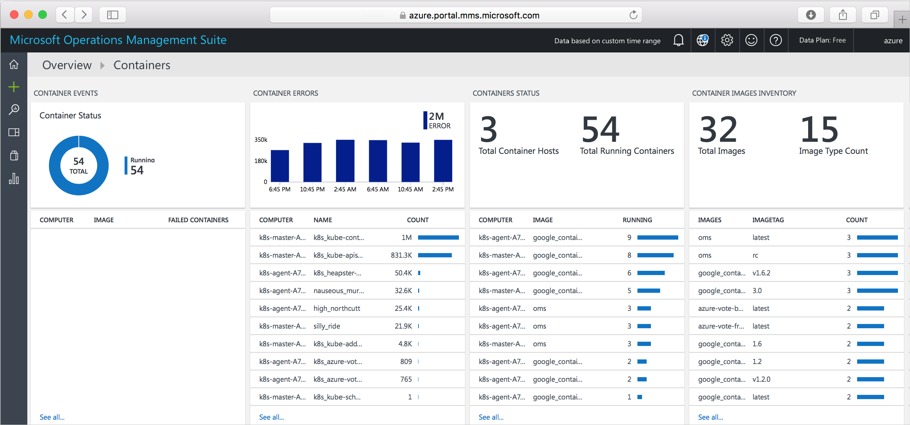

# (DEPRECATED) Monitor a Kubernetes cluster with Log Analytics

> [!TIP]
> For the updated version this tutorial that uses Azure Kubernetes Service, see [Azure Monitor for containers (Preview) overview](../../azure-monitor/insights/container-insights-overview.md).

[!INCLUDE [ACS deprecation](../../../includes/container-service-kubernetes-deprecation.md)]

Monitoring your Kubernetes cluster and containers is critical, especially when you manage a production cluster at scale with multiple apps.

You can take advantage of several Kubernetes monitoring solutions, either from Microsoft or other providers. In this tutorial, you monitor your Kubernetes cluster by using the Containers solution in [Log Analytics](../../operations-management-suite/operations-management-suite-overview.md), Microsoft's cloud-based IT management solution. (The Containers solution is in preview.)

This tutorial, part seven of seven, covers the following tasks:

> [!div class="checklist"]
> * Get Log Analytics Workspace settings
> * Set up Log Analytics agents on the Kubernetes nodes
> * Access monitoring information in the Log Analytics portal or Azure portal

## Before you begin

In previous tutorials, an application was packaged into container images, these images uploaded to Azure Container Registry, and a Kubernetes cluster created.

If you have not done these steps, and would like to follow along, return to [Tutorial 1 – Create container images](./container-service-tutorial-kubernetes-prepare-app.md).

## Get Workspace settings

When you can access the [Log Analytics portal](https://mms.microsoft.com), go to **Settings** > **Connected Sources** > **Linux Servers**. There, you can find the *Workspace ID* and a primary or secondary *Workspace Key*. Take note of these values, which you need to set up Log Analytics agents on the cluster.

## Create Kubernetes secret

Store the Log Analytics workspace settings in a Kubernetes secret named `omsagent-secret` using the [kubectl create secret][kubectl-create-secret] command. Update `WORKSPACE_ID` with your Log Analytics workspace ID and `WORKSPACE_KEY` with the workspace key.

```console
kubectl create secret generic omsagent-secret --from-literal=WSID=WORKSPACE_ID --from-literal=KEY=WORKSPACE_KEY
```

## Set up Log Analytics agents

The following Kubernetes manifest file can be used to configure the container monitoring agents on a Kubernetes cluster. It creates a Kubernetes [DaemonSet](https://kubernetes.io/docs/concepts/workloads/controllers/daemonset/), which runs a single identical pod on each cluster node.

Save the following text to a file named `oms-daemonset.yaml`.

```YAML
apiVersion: extensions/v1beta1
kind: DaemonSet
metadata:
 name: omsagent
spec:
 template:
  metadata:
   labels:
    app: omsagent
    agentVersion: 1.4.3-174
    dockerProviderVersion: 1.0.0-30
  spec:
   containers:
     - name: omsagent
       image: "microsoft/oms"
       imagePullPolicy: Always
       securityContext:
         privileged: true
       ports:
       - containerPort: 25225
         protocol: TCP
       - containerPort: 25224
         protocol: UDP
       volumeMounts:
        - mountPath: /var/run/docker.sock
          name: docker-sock
        - mountPath: /var/log
          name: host-log
        - mountPath: /etc/omsagent-secret
          name: omsagent-secret
          readOnly: true
        - mountPath: /var/lib/docker/containers
          name: containerlog-path
       livenessProbe:
        exec:
         command:
         - /bin/bash
         - -c
         - ps -ef | grep omsagent | grep -v "grep"
        initialDelaySeconds: 60
        periodSeconds: 60
   nodeSelector:
    beta.kubernetes.io/os: linux
   # Tolerate a NoSchedule taint on master that ACS Engine sets.
   tolerations:
    - key: "node-role.kubernetes.io/master"
      operator: "Equal"
      value: "true"
      effect: "NoSchedule"
   volumes:
    - name: docker-sock
      hostPath:
       path: /var/run/docker.sock
    - name: host-log
      hostPath:
       path: /var/log
    - name: omsagent-secret
      secret:
       secretName: omsagent-secret
    - name: containerlog-path
      hostPath:
       path: /var/lib/docker/containers
```

Create the DaemonSet with the following command:

```azurecli-interactive
kubectl create -f oms-daemonset.yaml
```

To see that the DaemonSet is created, run:

```azurecli-interactive
kubectl get daemonset
```

Output is similar to the following:

```azurecli-interactive
NAME       DESIRED   CURRENT   READY     UP-TO-DATE   AVAILABLE   NODE-SELECTOR   AGE
omsagent   3         3         3         0            3           <none>          5m
```

After the agents are running, it takes several minutes for Log Analytics to ingest and process the data.

## Access monitoring data

View and analyze the container monitoring data with the [Container solution](../../azure-monitor/insights/containers.md) in either the Log Analytics portal or the Azure portal.

To install the Container solution using the [Log Analytics portal](https://mms.microsoft.com), go to **Solutions Gallery**. Then add **Container Solution**. Alternatively, add the Containers solution from the [Azure Marketplace](https://azuremarketplace.microsoft.com/marketplace/apps/microsoft.containersoms?tab=Overview).

In the Log Analytics portal, look for a **Containers** summary tile on the dashboard. Click the tile for details including: container events, errors, status, image inventory, and CPU and memory usage. For more granular information, click a row on any tile, or perform a [log search](../../log-analytics/log-analytics-log-searches.md).



Similarly, in the Azure portal, go to **Log Analytics** and select your workspace name. To see the **Containers** summary tile, click **Solutions** > **Containers**. To see details, click the tile.

See the [Azure Log Analytics documentation](../../azure-monitor/log-query/log-query-overview.md) for detailed guidance on querying and analyzing monitoring data.

## Next steps

In this tutorial, you monitored your Kubernetes cluster with Log Analytics. Tasks covered included:

> [!div class="checklist"]
> * Get Log Analytics Workspace settings
> * Set up Log Analytics agents on the Kubernetes nodes
> * Access monitoring information in the Log Analytics portal or Azure portal


Follow this link to see pre-built script samples for Container Service.

> [!div class="nextstepaction"]
> [Azure Container Service script samples](cli-samples.md)
